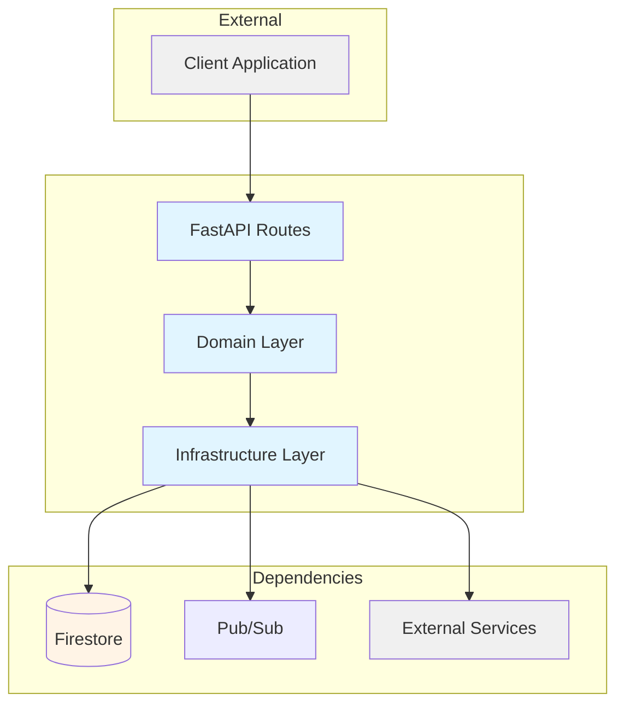

# Document Service

Generate professional documentation for a service, then update project-level docs.

**Usage:**

```
/document-service <service-name>
/document-service                   # Lists available services
```

---

## Overview

This skill produces four documentation files per service, plus updates aggregated site content:

| File                | Purpose                                     | Audience              |
| ------------------- | ------------------------------------------- | --------------------- |
| `features.md`       | Value propositions, capabilities, use cases | Users, marketing      |
| `technical.md`      | Architecture, APIs, patterns, gotchas       | Developers, AI agents |
| `tutorial.md`       | Getting-started tutorial with exercises     | New developers        |
| `technical-debt.md` | Known issues, debt items, future plans      | Maintainers           |
| `services/index.md` | Service catalog (aggregated)                | All audiences         |
| `site-marketing.md` | Marketing pages source                      | Website users         |
| `site-developer.md` | Developer docs source                       | API consumers         |

After service documentation, project-level docs are updated with an integrated narrative and website source files are incrementally built.

---

## Output Structure

```
docs/
├── services/
│   ├── <service-name>/
│   │   ├── features.md          # Marketing-ready
│   │   ├── technical.md         # Developer-ready
│   │   ├── tutorial.md          # Getting-started tutorial (NEW)
│   │   └── technical-debt.md    # Debt tracking
│   └── index.md                # Service catalog (aggregated)
├── overview.md                 # Project narrative (auto-updated)
├── documentation-runs.md       # Run history log
├── site-marketing.md           # Marketing pages (incremental)
├── site-developer.md           # Developer docs (incremental)
└── site-index.json             # Structured data for site build
```

---

## Phase 0: Service Discovery (No Parameter)

When `/document-service` is run without a service name, list available services.

### Step 0.1: Scan Services

```bash
# List all services in apps/
ls -1 apps/ | grep -v "^web$" | sort
```

### Step 0.2: Check Documentation Status

For each service, check if docs exist:

```bash
# Check if service has docs
test -d "docs/services/<service-name>" && echo "HAS_DOCS" || echo "NO_DOCS"

# Get last update date if docs exist
grep -h "^## .* — <service-name>" docs/documentation-runs.md | tail -1 | sed 's/^## //'
```

### Step 0.3: Display Service List

Output format:

```
Available services to document:

Services WITH existing docs:
  ✓ user-service          (last: 2025-01-10)
  ✓ whatsapp-service      (last: 2025-01-08)
  ✓ todos-service         (last: 2025-01-05)

Services WITHOUT docs:
    actions-agent
    bookmarks-service
    calendar-service
    data-insights-service
    llm-orchestrator
    notifications-service
    places-service
    research-agent
    scraper-service
    share-service
    subscriptions-service
    triggers-service
    webhooks-service

Website status:
  Marketing pages:  3/14 services documented
  Developer docs:   3/14 services documented

Run: /document-service <service-name>
```

---

## Phase 1: Service Analysis

### Step 1.1: Explore Service Structure

Launch Explore agent to analyze the service:

```
Analyze the structure of apps/<service-name>/. Find:

1. **Routes** — All endpoints (public and internal)
   - HTTP method, path, purpose
   - Request/response schemas

2. **Domain Models** — Core entities and their relationships
   - Status enums and their meanings
   - Key fields and validation rules

3. **Use Cases** — Business operations
   - What each use case does
   - Input/output types
   - Dependencies

4. **External Integrations** — What external services it calls
   - APIs consumed
   - Pub/Sub topics published/subscribed

5. **Configuration** — Required environment variables
   - What each var controls
   - Terraform references

Search in: apps/<service-name>/src/
```

### Step 1.2: Check Existing Documentation

```bash
# Check for existing docs
ls -la docs/services/<service-name>/ 2>/dev/null || echo "No existing docs"

# Check for service-level context
cat apps/<service-name>/README.md 2>/dev/null || echo "No README"
```

### Step 1.3: Check Previous Runs

```bash
# Check documentation-runs.md for previous entries
grep -A 10 "## .* — <service-name>" docs/documentation-runs.md 2>/dev/null || echo "No previous runs"
```

### Step 1.4: Documentation Coverage Validation (NEW)

Scan the service for documentation coverage gaps:

```
Analyze apps/<service-name>/src/ for:

1. **Route Documentation Coverage**
   - Each route should have docstring or JSDoc
   - Check for @summary, @description annotations
   - Verify request/response schemas are documented

2. **Domain Model Documentation**
   - Each model should have description
   - Each field should have @description or comment
   - Enums should have value explanations

3. **Use Case Documentation**
   - Each use case should have docstring explaining purpose
   - Input/output types should be documented
   - Dependencies should be listed

4. **Configuration Documentation**
   - Each env var should have JSDoc comment
   - Required vs optional should be marked
   - Default values should be documented

5. **README Quality**
   - Service has README.md
   - README contains: purpose, setup, usage, development
```

**Coverage Calculation:**

```javascript
// Coverage formula
const endpointCoverage = (documentedEndpoints / totalEndpoints) * 100;
const modelCoverage = (documentedModels / totalModels) * 100;
const useCaseCoverage = (documentedUseCases / totalUseCases) * 100;
const configCoverage = (documentedEnvVars / totalEnvVars) * 100;

const overallCoverage =
  endpointCoverage * 0.4 + modelCoverage * 0.3 + useCaseCoverage * 0.2 + configCoverage * 0.1;
```

**Output format (store in working memory):**

```
Documentation Coverage: 73%

Breakdown:
  Endpoints:  80% (12/15 documented)
  Models:     67% (4/6 documented)
  Use Cases: 80% (4/5 documented)
  Config:     60% (3/5 documented)

Missing:
  - routes/webhookHandler.ts (no docstring)
  - models/TaskItem.ts (field 'metadata' undocumented)
  - usecases/processTask.ts (no description)
```

---

## Phase 2: Interview (Inference + 3 Open Questions)

**STRICT RULES:**

- **MAX 3 open questions** per service run
- **ALL other insights**: Infer from code analysis OR ask via wizard (multiple choice)
- **NEVER guess**: If inference confidence < 100%, ask wizard question

### Interview Flow

```
1. Run code analysis → Gather inference data
2. For each question:
   a. Check if inferable with 100% confidence
   b. If yes → Store inference
   c. If no → Ask wizard question OR mark as "ask user open"
3. Ask 3 open questions (Q1, Q5, Q8)
4. Proceed to document generation
```

---

### Question Set

| #   | Question                         | Type     | Inference Source                                   |
| --- | -------------------------------- | -------- | -------------------------------------------------- |
| 1   | **Why does this service exist?** | **OPEN** | Ask user (not inferable)                           |
| 2   | **Primary user type?**           | Wizard   | Route analysis (internal-only → Internal Services) |
| 3   | **Interaction style?**           | Wizard   | Routes, Pub/Sub subscriptions, scheduled jobs      |
| 4   | **Data processing mode?**        | Wizard   | HTTP methods, domain use cases                     |
| 5   | **What's the killer feature?**   | **OPEN** | Ask user (value judgment)                          |
| 6   | **State management?**            | Wizard   | Firestore collections, external deps               |
| 7   | **Known limitations?**           | Wizard   | Rate limits, quotas, validation rules              |
| 8   | **Planned future developments?** | **OPEN** | Ask user (not inferable)                           |

---

### Open Questions (Ask User)

#### Q1: Why does this service exist?

> "What problem does `<service-name>` solve? What was the pain point before it existed?"

**Capture:** User's exact words for features.md "The Problem" section

#### Q5: What's the killer feature?

> "If you had to highlight ONE capability, what would it be?"

**Capture:** User's exact words for features.md lead capability

#### Q8: What are the planned future developments for `<service-name>`?

> "What's planned for future development? Any upcoming features, refactors, or changes?"

**Capture:** User's exact words for technical-debt.md "Future Plans" section

---

### Wizard Questions (Ask If Not 100% Inferable)

#### Q2: Primary user type?

**Infer if:** All routes are `/internal/*` → "Internal Services"

**Ask if:** Mix of public/internal routes OR uncertain

```
Wizard: Who is the primary user of <service-name>?

Options:
  [End Users]         General users via web/mobile interfaces
  [Developers]        API consumers, external integrations
  [Admins]            Internal operations, management
  [Internal Services] Other microservices only (no direct users)
  [Mixed]             Multiple user types
```

#### Q3: Interaction style?

**Infer if:**

- Only Pub/Sub subscriptions → "Async Events"
- Only HTTP routes + cron jobs → "REST API + Scheduled"
- Only webhook routes → "Webhook"

**Ask if:** Mixed patterns OR uncertain

```
Wizard: How do clients interact with <service-name>? (Select all that apply)

Options:
  [REST API]       Synchronous HTTP requests
  [Async Events]   Pub/Sub, message queues, event-driven
  [Scheduled]      Cron jobs, periodic tasks, scheduled execution
  [Webhook]        Receives external callbacks/events
```

#### Q4: Data processing mode?

**Infer if:**

- Only GET routes + read-only use cases → "Read-only"
- Only POST/PUT + no GET → "Write-only"
- Full CRUD operations → "Read-Write"
- Transforms + forwards → "Pipeline"

**Ask if:** Mixed patterns OR uncertain

```
Wizard: How does <service-name> handle data?

Options:
  [Read-only]   Queries, lookups, no mutations
  [Read-Write]  Full CRUD operations
  [Write-only]  Ingestion, logging, event publishing
  [Pipeline]    Transforms and forwards data
```

#### Q6: State management?

**Infer if:**

- Firestore collections in migrations/registry → "Firestore"
- No collections, no state → "Stateless"
- Calls other services for state → "External Service"
- In-memory caches only → "In-Memory"

**Ask if:** Mixed OR uncertain

```
Wizard: How does <service-name> manage state?

Options:
  [Stateless]     No persistent state
  [Firestore]     Uses Firestore database
  [In-Memory]     Ephemeral, resets on restart
  [External]      Delegates to another service
```

#### Q7: Known limitations?

**Infer if:**

- Rate limiting in code → "Rate Limits"
- Payload size limits → "Data Size"
- Scoped feature set → "Feature Scope"
- No limits found → "None Known"

**Ask if:** Multiple types OR uncertain

```
Wizard: What are the known limitations of <service-name>? (Select all that apply)

Options:
  [Rate Limits]    API rate limits, quotas, throttling
  [Data Size]      Payload size limits, record count limits
  [Feature Scope]  Intentionally limited features
  [None Known]     No documented limitations
```

---

### Capture Format

Store in working memory:

```
Service: <service-name>
Date: YYYY-MM-DD

OPEN QUESTIONS:
Q1 (Why): [user answer]
Q5 (Killer): [user answer]
Q8 (Future): [user answer]

INFERRED or WIZARD:
Q2 (User Type): [inferred | wizard selection]
Q3 (Interaction): [inferred | wizard selection(s)]
Q4 (Data Mode): [inferred | wizard selection]
Q6 (State): [inferred | wizard selection]
Q7 (Limitations): [inferred | wizard selection(s)]
```

---

## Phase 3: Generate features.md

Write to `docs/services/<service-name>/features.md`:

```markdown
# <Service Display Name>

<One-sentence value proposition — what problem it solves>

## The Problem

<2-3 sentences describing the pain point this service addresses>

## How It Helps

### <Capability 1 — action-oriented title>

<What it does + why it matters>

**Example:** <Real-world scenario showing value>

### <Capability 2>

...

### <Capability 3>

...

## Use Case

<Concrete walkthrough: User does X → Service does Y → User gets Z>

## Key Benefits

- <Benefit 1 — outcome-focused>
- <Benefit 2>
- <Benefit 3>

## Limitations

<Honest about what it doesn't do — builds trust>

---

_Part of [IntexuraOS](../overview.md) — <tagline>_
```

### Writing Guidelines

- **Lead with value**, not features
- **Use active voice**: "Sends notifications" not "Notifications are sent"
- **Be specific**: "Responds in <2 seconds" not "Fast response times"
- **Real examples**: Concrete scenarios, not abstract descriptions
- **No jargon**: Write for intelligent non-technical readers

---

## Phase 4: Generate technical.md

Write to `docs/services/<service-name>/technical.md`:

````markdown
# <Service Name> — Technical Reference

## Overview

<2-3 sentences: what it does, where it runs, key dependencies>

## Architecture


````

### Data Flow

```mermaid
sequenceDiagram
    autonumber
    participant Client
    participant <Service Name>
    participant Firestore
    participant PubSub

    Client->>+<Service Name>: HTTP Request
    <Service Name>->>Firestore: Query/Update
    Firestore--><Service Name>: Result
    <Service Name>->>PubSub: Publish Event
    <Service Name>-->>Client: Response
```

### Component Details

| Component | Purpose                | Technology         |
| --------- | ---------------------- | ------------------ |
| Routes    | HTTP endpoint handling | FastAPI            |
| Domain    | Business logic         | TypeScript         |
| Infra     | External adapters      | Firestore, Pub/Sub |

## API Endpoints

### Public Endpoints

| Method | Path        | Purpose         |
| ------ | ----------- | --------------- |
| GET    | `/resource` | List resources  |
| POST   | `/resource` | Create resource |

### Internal Endpoints

| Method | Path                 | Purpose            | Caller        |
| ------ | -------------------- | ------------------ | ------------- |
| POST   | `/internal/resource` | Internal operation | other-service |

## Domain Model

### <Entity Name>

| Field    | Type     | Description       |
| -------- | -------- | ----------------- |
| `id`     | `string` | Unique identifier |
| `status` | `Status` | Current state     |

**Status Values:**

| Status      | Meaning                |
| ----------- | ---------------------- |
| `pending`   | Awaiting processing    |
| `completed` | Successfully processed |

## Pub/Sub

### Published Events

| Topic        | Event Type   | Payload           | Trigger        |
| ------------ | ------------ | ----------------- | -------------- |
| `TOPIC_NAME` | `event.type` | `{ field: type }` | When X happens |

### Subscribed Events

| Topic        | Handler                    | Action |
| ------------ | -------------------------- | ------ |
| `TOPIC_NAME` | `/internal/pubsub/handler` | Does X |

## Dependencies

### External Services

| Service      | Purpose       | Failure Mode    |
| ------------ | ------------- | --------------- |
| WhatsApp API | Send messages | Queue for retry |

### Internal Services

| Service      | Endpoint             | Purpose       |
| ------------ | -------------------- | ------------- |
| user-service | `/internal/user/...` | Get user data |

## Configuration

| Variable       | Purpose     | Required |
| -------------- | ----------- | -------- |
| `INTEXURAOS_X` | Description | Yes      |

## Gotchas

- <Non-obvious behavior 1>
- <Non-obvious behavior 2>

## File Structure

```
apps/<service-name>/src/
├── domain/
│   ├── models/
│   └── usecases/
├── infra/
├── routes/
└── services.ts
```

````

---

## Phase 4.5: Generate tutorial.md (NEW)

Write to `docs/services/<service-name>/tutorial.md`:

```markdown
# <Service Name> — Tutorial

> **Time:** 15-30 minutes
> **Prerequisites:** Node.js 20+, GCP project access
> **You'll learn:** How to integrate with <service-name> and handle common scenarios

---

## What You'll Build

A working integration that:
<Concrete outcomes from completing this tutorial>

---

## Prerequisites

Before starting, ensure you have:
- [ ] Access to the IntexuraOS project
- [ ] Service account with appropriate permissions
- [ ] Basic understanding of TypeScript/Node.js

---

## Part 1: Hello World (5 minutes)

Let's start with the simplest possible interaction.

### Step 1.1: Make Your First Request

```bash
curl -X GET https://api.intexuraos.com/<endpoint> \
  -H "Authorization: Bearer $TOKEN"
```

**Expected response:**
```json
{
  "status": "healthy",
  "version": "1.0.0"
}
```

### What Just Happened?

<Explain the response and what the service did>

---

## Part 2: Create Your First Resource (10 minutes)

Now let's create something meaningful.

### Step 2.1: Prepare Your Data

```typescript
const resource = {
  name: "My First Item",
  // ... fields
};
```

### Step 2.2: Send the Request

```bash
curl -X POST https://api.intexuraos.com/<endpoint> \
  -H "Authorization: Bearer $TOKEN" \
  -H "Content-Type: application/json" \
  -d '{
    "name": "My First Item"
  }'
```

### Step 2.3: Verify Creation

```bash
curl https://api.intexuraos.com/<endpoint>/$ID \
  -H "Authorization: Bearer $TOKEN"
```

**Checkpoint:** You should see your created resource with all fields populated.

---

## Part 3: Handle Errors (5 minutes)

### Common Error: <Specific Error>

**Error message:**
```json
{
  "code": "VALIDATION_ERROR",
  "message": "Invalid request"
}
```

**Solution:** <How to fix>

---

## Part 4: Real-World Scenario (10 minutes)

Let's put it all together in a practical workflow.

### Scenario: <Use case from features.md>

<Step-by-step walkthrough with actual code>

---

## Troubleshooting

| Problem | Solution |
|---------|----------|
| "401 Unauthorized" | Check your token is valid and not expired |
| "404 Not Found" | Verify the endpoint path is correct |
| "429 Rate Limited" | Wait a few seconds and retry |

---

## Next Steps

Now that you understand the basics:
1. Explore <advanced feature>
2. Read the [Technical Reference](technical.md) for full API details
3. Check out <related service> for more capabilities

---

## Exercises

Test your understanding:

1. **Easy**: Create a resource with custom metadata
2. **Medium**: Update a resource and handle conflicts
3. **Hard**: <More complex scenario>

<details>
<summary>Solutions</summary>

1. Custom metadata example...
2. Update with versioning...
3. Complex scenario walkthrough...

</details>
```

### Tutorial Writing Guidelines

- **Progressive complexity**: Start simple, add layers gradually
- **Working examples**: Every code block should be runnable
- **Error anticipation**: Address common mistakes before they happen
- **Checkpoints**: Clear validation points after each section
- **Real scenarios**: Use cases from actual usage, not contrived examples

---

## Phase 5: Update Project Overview

Update `docs/overview.md` with integrated narrative:

```markdown
# IntexuraOS

<One paragraph: what is it, who is it for, what problem does it solve>

## How It Works

### <Problem Category 1>

<Narrative explaining how services work together to solve this>

**Services involved:** <service-a>, <service-b>

### <Problem Category 2>

...

## Services

| Service | Purpose | Docs |
|---------|---------|------|
| <service-name> | <one-line purpose> | [Features](services/<service>/features.md) · [Technical](services/<service>/technical.md) · [Debt](services/<service>/technical-debt.md) |

## Getting Started

<Brief onboarding path>

## Architecture

<High-level diagram or description>
````

**Note:** Update the narrative section if the new service adds capabilities. Maintain the problem-focused structure.

---

## Phase 6: Generate technical-debt.md

### Step 6.1: Analyze Technical Debt

Scan the service for technical debt indicators:

```
Analyze apps/<service-name>/ for:

1. **TODO/FIXME Comments** — grep for TODO, FIXME, HACK, XXX
2. **Console Logging** — console.log, console.error, console.warn (not infra)
3. **Test Coverage** — Below 95% threshold
4. **ESLint Violations** — Any active violations
5. **TypeScript Issues** — `any` types, @ts-ignore, @ts-expect-error
6. **Complex Functions** — High cyclomatic complexity (>10)
7. **Deprecated APIs** — Usage of deprecated dependencies or methods
8. **Code Smells** — Patterns from CLAUDE.md Code Smells table:
   - Silent catch blocks
   - Inline error handling (should use getErrorMessage)
   - Throw in try blocks
   - Re-exports from services.ts
   - Module-level state
   - Test fallback in prod
   - Domain logic in infra
   - Infra re-exports domain
   - Manual header redaction
   - Redundant variables
   - Redundant checks
9. **SRP Violations** — Files doing too many things (>300 lines without good reason)
10. **Code Duplicates** — Similar patterns across files (copy-paste detection)
11. **Previous Runs** — Check docs/documentation-runs.md for past issues
```

### Step 6.2: Generate technical-debt.md

Write to `docs/services/<service-name>/technical-debt.md`:

```markdown
# <Service Name> — Technical Debt

**Last Updated:** YYYY-MM-DD
**Analysis Run:** [link to documentation-runs.md entry]

---

## Summary

| Category    | Count | Severity        |
| ----------- | ----- | --------------- |
| Code Smells | N     | High/Medium/Low |
| Test Gaps   | N     | High/Medium/Low |
| Type Issues | N     | High/Medium/Low |
| TODOs       | N     | High/Medium/Low |
| **Total**   | **N** | —               |

---

## Future Plans

<From Q8: User-provided future development plans>

---

## Code Smells

### High Priority

| File                    | Issue              | Impact           |
| ----------------------- | ------------------ | ---------------- |
| `src/routes/example.ts` | Silent catch block | Errors swallowed |
| `src/usecases/foo.ts`   | Module-level state | Not testable     |

### Medium Priority

| File               | Issue           | Impact            |
| ------------------ | --------------- | ----------------- |
| `src/infra/bar.ts` | Console logging | Should use logger |

### Low Priority

| File | Issue | Impact |
| ---- | ----- | ------ |
| ...  | ...   | ...    |

---

## Test Coverage Gaps

| File/Module                          | Coverage | Missing                  |
| ------------------------------------ | -------- | ------------------------ |
| `src/domain/usecases/specialCase.ts` | 0%       | Entire use case untested |
| `src/routes/internalRoutes.ts`       | 85%      | Error path untested      |

---

## TypeScript Issues

| File                  | Issue      | Count |
| --------------------- | ---------- | ----- |
| `src/models/types.ts` | `any` type | 3     |
| `src/infra/api.ts`    | @ts-ignore | 1     |

---

## TODOs / FIXMEs

| File              | Comment                 | Priority |
| ----------------- | ----------------------- | -------- |
| `src/services.ts` | TODO: Add caching       | Medium   |
| `src/routes.ts`   | FIXME: Handle edge case | High     |

---

## SRP Violations

| File                                | Lines | Issue                                         | Suggestion          |
| ----------------------------------- | ----- | --------------------------------------------- | ------------------- |
| `src/routes/compositeFeedRoutes.ts` | 450   | Handles routing + validation + business logic | Extract to use case |

---

## Code Duplicates

| Pattern                      | Locations                           | Suggestion                     |
| ---------------------------- | ----------------------------------- | ------------------------------ |
| Error handling middleware    | `routes/*.ts` (5 files)             | Extract to common-http package |
| Firestore pagination pattern | `infra/repositories/*.ts` (3 files) | Create base repository class   |

---

## Deprecations

| Item                 | Location           | Replacement   | Deadline |
| -------------------- | ------------------ | ------------- | -------- |
| `deprecatedMethod()` | `src/infra/old.ts` | `newMethod()` | Q2 2026  |

---

## Resolved Issues

<Track items that were identified and later fixed>

| Date       | Issue                     | Resolution          |
| ---------- | ------------------------- | ------------------- |
| 2025-12-01 | Silent catch in routes.ts | Added error logging |
| ...        | ...                       | ...                 |

---

## Related

- [Features](features.md) — User-facing documentation
- [Technical](technical.md) — Developer reference
- [Documentation Run Log](../../documentation-runs.md)
```

### Step 6.3: Idempotency for Debt Tracking

When updating existing `technical-debt.md`:

1. **Preserve resolved issues** — Never delete from "Resolved Issues" section
2. **Archive resolved items** — Move from active sections to "Resolved Issues"
3. **Update timestamps** — Always update "Last Updated"
4. **Track progression** — If severity changes, note it in documentation-runs.md

---

## Phase 7: Generate Website Content

After service docs are generated, incrementally update website source files.

### Step 7.1: Update Services Index

Update or create `docs/services/index.md`:

```markdown
# Services

Complete catalog of all IntexuraOS services.

---

## Documented Services

### User Service

Authentication, user management, OAuth integration.

**Links:** [Features](user-service/features.md) · [Technical](user-service/technical.md) · [Debt](user-service/technical-debt.md)

---

### WhatsApp Service

Mobile capture interface via WhatsApp messaging.

**Links:** [Features](whatsapp-service/features.md) · [Technical](whatsapp-service/technical.md) · [Debt](whatsapp-service/technical-debt.md)

---

## Pending Documentation

The following services are pending documentation:

- [ ] Actions Agent
- [ ] Bookmarks Service
- [ ] Calendar Service
- [ ] Data Insights Service
- [ ] LLM Orchestrator
- [ ] Notifications Service
- [ ] Places Service
- [ ] Research Agent
- [ ] Scraper Service
- [ ] Share Service
- [ ] Subscriptions Service
- [ ] Triggers Service
- [ ] Webhooks Service
```

**Incremental update rule:** Add new service to "Documented Services" section, remove from "Pending Documentation".

---

### Step 7.2: Update Marketing Pages

Update or create `docs/site-marketing.md`:

```markdown
# IntexuraOS — Marketing Content

> Last updated: YYYY-MM-DD
> Services documented: N/M

---

## Home Page

### Hero Section

> **Capture your thoughts, anywhere they strike.**
>
> IntexuraOS is a personal operating system that turns WhatsApp messages, voice notes, and scattered inputs into organized, actionable tasks.

### Value Propositions

<!-- From each service's features.md "The Problem" + "How It Helps" -->

**Mobile-First Capture**
Send a WhatsApp message, get an organized todo. No app switching, no friction.

**AI-Powered Organization**
Actions Agent automatically categorizes, prioritizes, and suggests next steps.

**Universal Integration**
Webhooks, APIs, and pub/sub make anything connectable.

---

## Capabilities

### Capture

**WhatsApp Service** — Turn messages into todos

- Send a text: creates a todo
- Send a voice note: transcribes and creates a todo
- Send a URL: creates a bookmark

### Organize

**Todos Service** — Task management

- Natural language priority parsing
- Tag-based organization
- Search and filter

**Bookmarks Service** — Link collection

- Automatic metadata extraction
- Tag-based organization
- Full-text search

### Automate

**Actions Agent** — AI-powered task completion

- Auto-categorization
- Priority suggestions
- Dependency detection

**Triggers Service** — Event-based automation

- Pub/Sub event listening
- Conditional actions
- Chained workflows

### Integrate

**Webhooks Service** — External connections

- HTTP webhook endpoints
- Event filtering
- Retry handling

---

## Use Cases

<!-- From each service's features.md "Use Case" section -->

### The Driving Thought Capture

> "I'm driving when I remember I need to call the dentist. I send a quick voice note to WhatsApp. By the time I get home, there's a todo waiting: 'Call dentist to schedule cleaning' — with the transcription, suggested priority, and even a proposed time based on my calendar."

**Services involved:** WhatsApp Service, Actions Agent, Todos Service

### The Research Project

> "I'm researching a topic across multiple sources. I use the web clipper to save articles, WhatsApp to voice-note thoughts, and the Actions Agent automatically groups everything into a project with connections I didn't even see myself."

**Services involved:** Scraper Service, WhatsApp Service, Bookmarks Service, Actions Agent

---

## Feature Comparison

| Feature             | Free     | Pro       | Enterprise |
| ------------------- | -------- | --------- | ---------- |
| WhatsApp capture    | ✓        | ✓         | ✓          |
| Voice transcription | 10/month | Unlimited | Unlimited  |
| AI suggestions      | —        | ✓         | ✓          |
| API access          | —        | —         | ✓          |
| Webhooks            | —        | ✓         | ✓          |

---

## Roadmap

<!-- From Q8: Future Plans across all services -->

### Q2 2026

- Telegram and SMS support (WhatsApp Service)
- Advanced AI prioritization (Actions Agent)
- Custom webhooks (Webhooks Service)

### Q3 2026

- Calendar integration (Calendar Service)
- Collaboration features (Share Service)
- Advanced analytics (Data Insights Service)
```

**Incremental update rule:**

1. Add service's capabilities to appropriate section
2. Add service's use case to "Use Cases"
3. Add future plans to "Roadmap"
4. Update "Services documented" count

---

### Step 7.3: Update Developer Docs

Update or create `docs/site-developer.md`:

````markdown
# IntexuraOS — Developer Documentation

> Last updated: YYYY-MM-DD
> Services documented: N/M

---

## Quick Start

### Prerequisites

- Node.js 20+
- Google Cloud project
- Firebase project

### Installation

```bash
git clone https://github.com/your-org/intexuraos.git
cd intexuraos
ppnpm install
pnpm run setup
```
````

---

## API Reference

<!-- Aggregated from all services' technical.md -->

### Authentication

#### User Service

**Endpoints:**

| Method | Path                     | Purpose              |
| ------ | ------------------------ | -------------------- |
| POST   | `/auth/oauth/google`     | Initiate OAuth flow  |
| POST   | `/auth/oauth/callback`   | OAuth callback       |
| POST   | `/internal/auth/refresh` | Refresh access token |

**Docs:** [User Service Technical](services/user-service/technical.md)

---

### Resources

#### Todos Service

**Public Endpoints:**

| Method | Path         | Purpose     |
| ------ | ------------ | ----------- |
| GET    | `/todos`     | List todos  |
| POST   | `/todos`     | Create todo |
| PATCH  | `/todos/:id` | Update todo |
| DELETE | `/todos/:id` | Delete todo |

**Internal Endpoints:**

| Method | Path                   | Purpose                   |
| ------ | ---------------------- | ------------------------- |
| POST   | `/internal/todos/sync` | Sync from external source |

**Docs:** [Todos Service Technical](services/todos-service/technical.md)

#### Bookmarks Service

**Public Endpoints:**

| Method | Path             | Purpose         |
| ------ | ---------------- | --------------- |
| GET    | `/bookmarks`     | List bookmarks  |
| POST   | `/bookmarks`     | Create bookmark |
| PATCH  | `/bookmarks/:id` | Update bookmark |
| DELETE | `/bookmarks/:id` | Delete bookmark |

**Docs:** [Bookmarks Service Technical](services/bookmarks-service/technical.md)

---

## Events Reference

<!-- Aggregated Pub/Sub events from all services -->

### Published Events

| Topic              | Event Type        | Payload                        | Publisher         |
| ------------------ | ----------------- | ------------------------------ | ----------------- |
| `todo-created`     | `TodoCreated`     | `{ todoId, userId, text }`     | todos-service     |
| `todo-completed`   | `TodoCompleted`   | `{ todoId, userId }`           | todos-service     |
| `bookmark-created` | `BookmarkCreated` | `{ bookmarkId, userId, url }`  | bookmarks-service |
| `message-received` | `MessageReceived` | `{ messageId, from, content }` | whatsapp-service  |

### Subscribed Events

| Topic              | Subscriber       | Handler                             | Action                  |
| ------------------ | ---------------- | ----------------------------------- | ----------------------- |
| `todo-created`     | actions-agent    | `/internal/pubsub/todo-created`     | Suggest related actions |
| `message-received` | whatsapp-service | `/internal/pubsub/message-received` | Process inbound message |

---

## Data Models

<!-- Aggregated domain models from all services -->

### Todo

| Field       | Type         | Description        |
| ----------- | ------------ | ------------------ |
| `id`        | `string`     | Unique identifier  |
| `userId`    | `string`     | Owner's user ID    |
| `text`      | `string`     | Todo content       |
| `status`    | `TodoStatus` | Current state      |
| `priority`  | `Priority`   | Importance level   |
| `dueDate`   | `datetime?`  | Optional due date  |
| `createdAt` | `datetime`   | Creation timestamp |

**Status values:** `pending`, `in_progress`, `completed`, `cancelled`

**Priority values:** `low`, `medium`, `high`, `urgent`

**Docs:** [Todos Service Technical](services/todos-service/technical.md)

### Bookmark

| Field       | Type       | Description        |
| ----------- | ---------- | ------------------ |
| `id`        | `string`   | Unique identifier  |
| `userId`    | `string`   | Owner's user ID    |
| `url`       | `string`   | Target URL         |
| `title`     | `string`   | Page title         |
| `tags`      | `string[]` | User-assigned tags |
| `createdAt` | `datetime` | Creation timestamp |

**Docs:** [Bookmarks Service Technical](services/bookmarks-service/technical.md)

---

## Configuration

### Required Environment Variables

| Variable                                   | Purpose                       | Service          |
| ------------------------------------------ | ----------------------------- | ---------------- |
| `INTEXURAOS_FIRESTORE_PROJECT`             | GCP project ID                | All              |
| `INTEXURAOS_OAUTH_GOOGLE_CLIENT_ID`        | Google OAuth client ID        | user-service     |
| `INTEXURAOS_WHATSAPP_WEBHOOK_VERIFY_TOKEN` | WhatsApp webhook verification | whatsapp-service |

---

## Guides

### Creating a Webhook Integration

1. **Create a webhook endpoint**

```bash
curl -X POST https://api.intexuraos.com/webhooks \
  -H "Authorization: Bearer $TOKEN" \
  -d '{
    "url": "https://your-app.com/webhook",
    "filter": {"event": "todo-created"}
  }'
```

2. **Handle incoming webhooks**

```typescript
app.post('/webhook', (req, res) => {
  const { event, data } = req.body;
  // Process event
});
```

**Docs:** [Webhooks Service Technical](services/webhooks-service/technical.md)

### Subscribing to Events

```typescript
import { PubSubPublisher } from '@intexuraos/infra-pubsub';

const publisher = new PubSubPublisher('todo-created');
await publisher.publish({ todoId: '123', userId: 'abc', text: 'Buy milk' });
```

**Docs:** [PubSub Standards](../architecture/pubsub-standards.md)

````

**Incremental update rule:**
1. Add service's endpoints to appropriate API section
2. Add service's events to "Published Events" or "Subscribed Events"
3. Add service's domain models to "Data Models"
4. Add service's config to "Environment Variables"
5. Update "Services documented" count

---

### Step 7.4: Update Site Index JSON

Update or create `docs/site-index.json`:

```json
{
  "lastUpdated": "YYYY-MM-DD",
  "services": [
    {
      "id": "user-service",
      "name": "User Service",
      "tagline": "Authentication and user management",
      "features": "OAuth, session management, profile",
      "status": "documented",
      "lastUpdated": "YYYY-MM-DD",
      "docs": {
        "features": "services/user-service/features.md",
        "technical": "services/user-service/technical.md",
        "debt": "services/user-service/technical-debt.md"
      }
    },
    {
      "id": "whatsapp-service",
      "name": "WhatsApp Service",
      "tagline": "Mobile capture via WhatsApp",
      "features": "Message ingestion, voice transcription, webhook handling",
      "status": "documented",
      "lastUpdated": "YYYY-MM-DD",
      "docs": {
        "features": "services/whatsapp-service/features.md",
        "technical": "services/whatsapp-service/technical.md",
        "debt": "services/whatsapp-service/technical-debt.md"
      }
    }
  ],
  "capabilities": [
    {
      "id": "capture",
      "name": "Capture",
      "services": ["whatsapp-service", "webhooks-service"],
      "description": "Turn inputs into organized data"
    },
    {
      "id": "organize",
      "name": "Organize",
      "services": ["todos-service", "bookmarks-service"],
      "description": "Structure and categorize your data"
    },
    {
      "id": "automate",
      "name": "Automate",
      "services": ["actions-agent", "triggers-service"],
      "description": "AI-powered automation and workflows"
    }
  ],
  "stats": {
    "totalServices": 14,
    "documentedServices": 3,
    "completion": "21%"
  }
}
````

**Incremental update rule:**

1. Append service object to `services` array
2. Update `stats.documentedServices` and `stats.completion`

---

## Phase 8: Log the Run

Append to `docs/documentation-runs.md`:

```markdown
## YYYY-MM-DD — <service-name>

**Action:** [Created | Updated]
**Files:**

- `docs/services/<service-name>/features.md`
- `docs/services/<service-name>/technical.md`
- `docs/services/<service-name>/tutorial.md`
- `docs/services/<service-name>/technical-debt.md`
- `docs/services/index.md` (updated)
- `docs/site-marketing.md` (updated)
- `docs/site-developer.md` (updated)
- `docs/site-index.json` (updated)
- `docs/overview.md` (updated)

**Insights Captured:**

- Why: <summary>
- Killer feature: <summary>
- Future plans: <summary>
- Limitations: <summary>

**Documentation Coverage:** <percentage>%

- Endpoints: <X>% (N/M documented)
- Models: <X>% (N/M documented)
- Use Cases: <X>% (N/M documented)
- Config: <X>% (N/M documented)

**Technical Debt Found:**

- Code smells: N
- Test gaps: N
- Type issues: N
- TODOs: N

**Website Content Updated:**

- Added to services index
- Marketing pages: capabilities, use cases
- Developer docs: APIs, events, data models
- Site index JSON: service metadata

**Changes from previous:**

- <What changed, if update>

---
```

---

## Idempotency Rules

Running this skill multiple times should:

1. **Preserve structure** — Same headings, same format
2. **Update content** — Reflect current code state
3. **Retain insights** — Don't lose user-provided context (re-ask if missing)
4. **Track changes** — Log what changed in documentation-runs.md
5. **Archive resolved debt** — Move fixed items to "Resolved Issues"

### Before Overwriting

If docs exist, compare:

```bash
git diff docs/services/<service-name>/
```

Ask user: "Existing docs found. Update with new analysis, or start fresh?"

---

## Verification

After generating:

### Service Docs

1. **Review features.md** — Read aloud. Does it sound like marketing copy?
2. **Review technical.md** — Can a new developer understand the service?
3. **Review technical-debt.md** — Are debt items actionable?

### Website Content

4. **Check services/index.md** — Is service in the catalog?
5. **Check site-marketing.md** — Are capabilities and use cases included?
6. **Check site-developer.md** — Are APIs and events documented?
7. **Check site-index.json** — Is service metadata present?

### Final

8. **Check overview.md** — Does the narrative include the new service?
9. **Verify log** — Is the run recorded in documentation-runs.md?

---

## Quick Start Checklist

### Service Documentation

- [ ] Service analyzed (routes, models, use cases)
- [ ] Previous runs checked (documentation-runs.md)
- [ ] Documentation coverage calculated (Step 1.4)
- [ ] Interview completed (3 open questions + wizard inference)
- [ ] features.md generated
- [ ] technical.md generated (with Mermaid diagrams)
- [ ] tutorial.md generated (NEW)
- [ ] technical-debt.md generated

### Website Content

- [ ] services/index.md updated (service catalog)
- [ ] site-marketing.md updated (capabilities, use cases)
- [ ] site-developer.md updated (APIs, events, data models)
- [ ] site-index.json updated (metadata)

### Finalization

- [ ] overview.md updated
- [ ] Run logged in documentation-runs.md
- [ ] User reviewed output

---

## Example Interview Flow

```
Claude: Let's document whatsapp-service.

[Analysis runs...]

Q1: Why does this service exist?
User: "Before this, we had no way to interact with the system on mobile.
       WhatsApp is always open, so it's the natural interface."

[Inference: All routes are /internal/* → Q2 inferred as "Internal Services"]
[Inference: Has webhook routes + Pub/Sub → Q3 inferred as "Webhook + Async Events"]
[Inference: POST routes only → Q4 inferred as "Write-only"]

Q5: What's the killer feature?
User: "Voice notes → automatic transcription → actionable todos."

[Inference: No Firestore collections → Q6 inferred as "Stateless"]
[Inference: Rate limiting found in code → Q7 inferred as "Rate Limits"]

Q8: What are the planned future developments?
User: "Adding support for Telegram and SMS in Q2."

Claude: Got it. Generating documentation including technical debt analysis...
```
