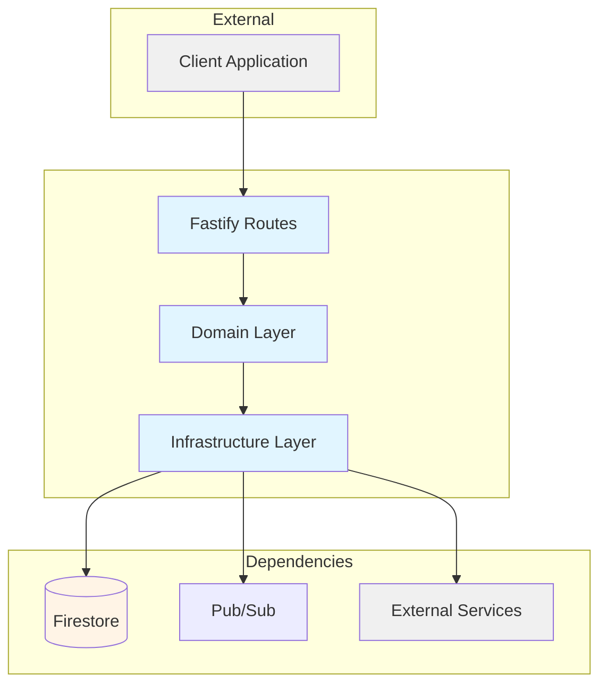
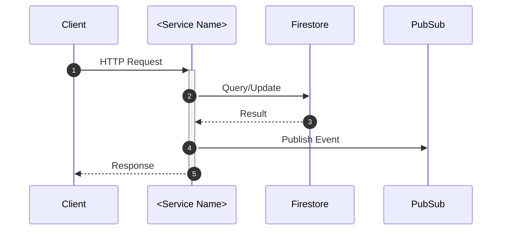

# Technical Template

Template for `docs/services/<service-name>/technical.md`.

## Purpose

Developer reference documentation that enables onboarding and integration.

---

## Template

````markdown
# <Service Name> — Technical Reference

## Overview

<2-3 sentences: what it does, where it runs, key dependencies>

## Architecture



## Data Flow



## Recent Changes

<From git history — summarize last 10-15 commits>

| Commit   | Description               | Date       |
| -------- | ------------------------- | ---------- |
| `abc123` | Added voice transcription | 2025-01-10 |
| `def456` | Fixed rate limiting bug   | 2025-01-08 |

## API Endpoints

### Public Endpoints

| Method | Path        | Purpose         | Auth   |
| ------ | ----------- | --------------- | ------ |
| GET    | `/resource` | List resources  | Bearer |
| POST   | `/resource` | Create resource | Bearer |

### Internal Endpoints

| Method | Path                 | Purpose            | Caller        |
| ------ | -------------------- | ------------------ | ------------- |
| POST   | `/internal/resource` | Internal operation | other-service |

## Domain Model

### <Entity Name>

| Field    | Type     | Description       |
| -------- | -------- | ----------------- |
| `id`     | `string` | Unique identifier |
| `status` | `Status` | Current state     |

**Status Values:**

| Status      | Meaning                |
| ----------- | ---------------------- |
| `pending`   | Awaiting processing    |
| `completed` | Successfully processed |

## Pub/Sub

### Published Events

| Topic        | Event Type   | Payload           | Trigger        |
| ------------ | ------------ | ----------------- | -------------- |
| `TOPIC_NAME` | `event.type` | `{ field: type }` | When X happens |

### Subscribed Events

| Topic        | Handler                    | Action |
| ------------ | -------------------------- | ------ |
| `TOPIC_NAME` | `/internal/pubsub/handler` | Does X |

## Dependencies

### External Services

| Service      | Purpose       | Failure Mode    |
| ------------ | ------------- | --------------- |
| External API | Send messages | Queue for retry |

### Internal Services

| Service      | Endpoint             | Purpose       |
| ------------ | -------------------- | ------------- |
| user-service | `/internal/user/...` | Get user data |

## Configuration

| Variable       | Purpose     | Required |
| -------------- | ----------- | -------- |
| `INTEXURAOS_X` | Description | Yes      |

## Gotchas

<Non-obvious behaviors that cause confusion>

- <Gotcha 1>
- <Gotcha 2>

## File Structure

```
apps/<service-name>/src/
├── domain/
│   ├── models/
│   └── usecases/
├── infra/
├── routes/
└── services.ts
```
````

---

## Section Guidelines

### Overview

- What the service does (one sentence)
- Where it runs (Cloud Run, etc.)
- Key dependencies (Firestore, external APIs)

### Architecture Diagram

- Show main components
- Show data flow direction
- Use consistent styling

### Recent Changes

- Extract from git history
- Show relevant commits (skip version bumps, typos)
- Help developers understand recent focus areas

### API Endpoints

- Split public vs internal
- Include auth requirements
- Note rate limits if any

### Domain Model

- All entities with fields
- Status enums with meanings
- Validation rules if relevant

### Pub/Sub

- Events published (with trigger conditions)
- Events subscribed (with handler actions)

### Gotchas

- Non-obvious behaviors
- Common mistakes
- Edge cases

---

## Example (Partial)

```markdown
# WhatsApp Service — Technical Reference

## Overview

WhatsApp Service receives messages via Meta's Cloud API webhooks, processes them through domain use cases, and publishes events for downstream services. Runs on Cloud Run with auto-scaling.

## API Endpoints

### Public Endpoints

| Method | Path       | Purpose           | Auth      |
| ------ | ---------- | ----------------- | --------- |
| GET    | `/webhook` | Meta verification | Query sig |
| POST   | `/webhook` | Receive messages  | Meta sig  |

### Internal Endpoints

| Method | Path                       | Purpose      | Caller        |
| ------ | -------------------------- | ------------ | ------------- |
| POST   | `/internal/messages/send`  | Send message | actions-agent |
| POST   | `/internal/pubsub/message` | Pub/Sub push | Cloud Pub/Sub |

## Gotchas

- Meta requires SSL certificate verification — local development needs ngrok
- Webhook verification uses GET, actual messages use POST
- Rate limited to 1000 messages/day on development tier
```
