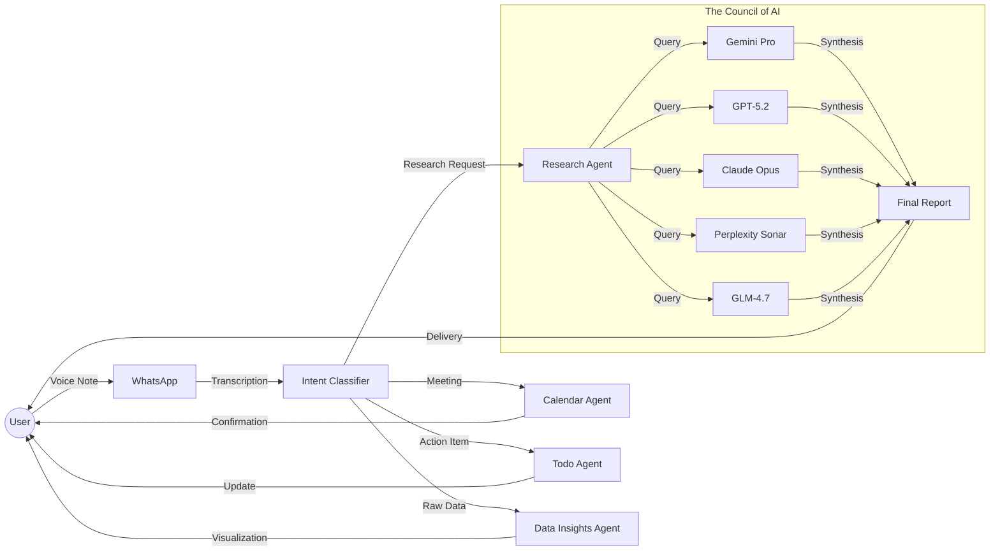
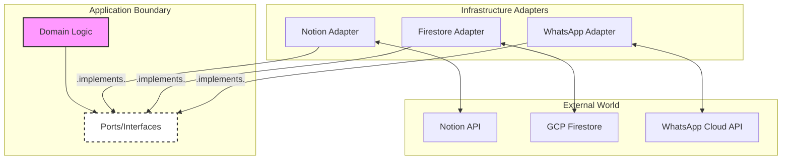

<div align="center">
  

  <h2><a href="https://intexuraos.cloud/" target="_blank">intexuraos.cloud</a></h2>

  <p>
    <em>Derived from the Latin <strong>intexere</strong> (to weave together) and <strong>textura</strong> (structure).</em><br>
    The integration fabric interlacing external signals into a central model of truth.
  </p>

  <p>
    <a href="https://github.com/pbuchman/intexuraos/actions"></a>
    
    
    
    
  </p>
</div>

---

## 🧠 The Second Brain That Actually Thinks

**Your brain is for thinking, not for remembering, scheduling, or aggregating web searches.**

Most "productivity" tools just give you more forms to fill out. They fragment your attention between a todo app, a calendar, a notes app, and a browser full of research tabs.

**IntexuraOS** is an autonomous cognitive layer that sits between your chaotic inputs and your structured life. It doesn't just store data; it understands intent, consults experts, and executes work.

### The Core Loop: Capture → Synthesize → Execute

You act as the **Commander**; IntexuraOS acts as your Staff. You speak your intent, and a fleet of specialized AI agents executes it.



### 🎯 Key Capabilities

#### 1. The "Council of AI" Research (Killer Feature)

Why rely on one hallucinating model? When you ask for deep research:

1.  **Orchestration**: The system spins up parallel queries to multiple LLMs: Gemini, GPT, Claude, Sonar, GLE.
2.  **Deep Web Search**: Each model performs independent verification.
3.  **Synthesis**: A final arbiter aggregates the findings, calculating **confidence scores** and attributing every claim to a source.
4.  **Delivery**: You receive a comprehensive, citation-backed briefing document—not a chat bubble.

#### 2. Voice-First Command Center

Forget typing. Just hold the record button on WhatsApp:

- _"Schedule a sync with engineering for Tuesday at 2 PM."_ → **Calendar Agent** checks availability and sends invites.
- _"Remind me to buy milk and email the invoice."_ → **Todo Agent** extracts distinct tasks and deadlines.
- _"Here's my thought on the architecture..."_ → **Notes Agent** structures your ramble into a coherent memo.

#### 3. Real-Time Data Intelligence

Stop manually updating spreadsheets.

- **Upload** your datasets once.
- **Configure** real-time streams.
- **Watch** as the **Data Insights Agent** autonomously updates visualizations and highlights trends over time.

---

## 🏗 The Architect's Manifesto

**IntexuraOS is not just a personal operating system; it is a statement on software craftsmanship.**

While functionally it serves as the execution layer for my life—bridging WhatsApp voice notes, mobile notifications, and AI agents with a structured database—architecturally, it is a **production-grade blueprint** for how modern, AI-native software should be built.

It rejects "move fast and break things" in favor of **"move deliberately and fix the root cause."** It demonstrates that with the right abstractions, strict boundaries, and autonomous agents, a single Staff Engineer can maintain an enterprise-scale monorepo with higher quality standards than most full teams.

### Core Philosophy

1.  **AI as a Team Member, Not a Tool**: I don't just "use" Claude or Copilot. I define autonomous agents (`service-scribe`, `sentry-triage`) with explicit personalities, mandates, and failure conditions. They are synthesized colleagues.
2.  **No Dummy Success**: A function either succeeds with a verified result or fails explicitly. IntexuraOS never returns `null` to silence an error.
3.  **The Continuity Ledger**: Complex reasoning is persisted. I treat the _process_ of solving a problem as valuable data, logged in immutable markdown ledgers to ensure AI context survives session boundaries.
4.  **Sleep-at-Night Reliability**: 95%+ coverage is not a target; it's a gate. If the code isn't proven to work, it doesn't merge.

---

## 🤖 The Synthesized Team

This repository is maintained by a hybrid team of human intent and autonomous execution. The `.claude/agents` directory defines the personas that work alongside me.

### `service-scribe` (The Documentation Specialist)

An autonomous agent that rejects the "docs are outdated" trope. It analyzes git history, code structure, and architectural patterns to generate marketing-ready `features.md` and developer-focused `technical.md` files without human intervention.

- **Capability**: Infers "Why this service exists" from commit history.
- **Standard**: documentation is treated as code, with its own CI lifecycle.

### `sentry-triage` (The Reliability Engineer)

Enforces a strict "Investigate First" policy. It refuses to apply band-aid fixes.

- **Protocol**: Links Sentry Issue ↔ Linear Ticket ↔ GitHub PR.
- **Mandate**: Must prove the root cause via Firestore state analysis before writing a single line of fix code.

### `coverage-orchestrator` (The QA Lead)

Operates on a binary philosophy: a branch is either **Covered**, **Exempt** (with a documented reason), or **Ticketed**.

- **Rule**: "94.9% is failure."
- **Output**: Automatically generates Linear tickets for every single uncovered branch.

---

## 🏛 Architecture & Patterns

The system follows a strict **Hexagonal Architecture** with app-colocated infrastructure. This ensures that domain logic remains pure and testable, while infrastructure concerns (Firestore, Auth0, Notion) are pushed to the edges.



### The Continuity Ledger Pattern

For complex, multi-step engineering tasks, IntexuraOS uses a **Continuity Ledger**. Instead of relying on ephemeral chat context, the AI maintains a persistent `CONTINUITY.md` file that acts as a state machine for the task.

- **Benefit**: Deterministic resumption of work after interruptions.
- **Audit**: A permanent record of _why_ architectural decisions were made.

---

## 🛡 Engineering Standards

### "No Dummy Success"

IntexuraOS strictly avoids the pattern of catching errors and returning `null` or `undefined` just to keep the app running. Every operation returns a `Result<T, E>` type. Errors are modeled as part of the domain, not exceptions to it. This forces the consumer to handle failure cases explicitly, eliminating an entire class of runtime "undefined is not a function" crashes.

### The "Sleep at Night" Standard

- **TDD First**: New features start with a failing test.
- **Verification**: The `.claude/claude.md` file instructs all AI agents to run `pnpm run ci:tracked` before claiming a task is done.
- **Infrastructure as Code**: Everything from Cloud Run services to Pub/Sub topics is defined in Terraform. There are no "clickOps" changes.

---

## 🚀 Infrastructure & DevOps

A production-grade GCP environment managed entirely via Terraform.

- **Compute**: Cloud Run (Serverless, scalable containers)
- **State**: Firestore (NoSQL), GCS (Blob storage)
- **Security**:
  - **Workload Identity Federation**: GitHub Actions deploy without long-lived keys.
  - **Secret Manager**: All sensitive config is versioned and injected at runtime.
  - **Auth0**: Standardized OAuth2 flow for all CLI and Web clients.
- **CI/CD**:
  - **GitHub Actions**: Lint, Test, Typecheck.
  - **Cloud Build**: Docker build & deploy.
  - **Smart Dispatch**: Monorepo tools ensure only affected services are redeployed.

---

## 📚 Documentation

Comprehensive documentation lives in the [`docs/`](docs/) directory.

### Getting Started

| Document                                                              | Description                             |
| --------------------------------------------------------------------- | --------------------------------------- |
| [Overview](docs/overview.md)                                          | Platform capabilities and service map   |
| [Setup Guide](docs/setup/01-gcp-project.md)                           | Step-by-step GCP project setup          |
| [Terraform Bootstrap](docs/setup/02-terraform-bootstrap.md)           | Infrastructure provisioning             |
| [Local Development](docs/setup/05-local-dev-with-gcp-deps.md)         | Running services locally with emulators |
| [Auth0 Configuration](docs/setup/06-auth0.md)                         | Authentication setup                    |
| [WhatsApp Business API](docs/setup/07-whatsapp-business-cloud-api.md) | WhatsApp integration                    |

### Architecture

| Document                                                                                  | Description                     |
| ----------------------------------------------------------------------------------------- | ------------------------------- |
| [Package Contracts](docs/architecture/package-contracts.md)                               | Monorepo boundary enforcement   |
| [Service-to-Service Communication](docs/architecture/service-to-service-communication.md) | Internal HTTP patterns          |
| [Firestore Ownership](docs/architecture/firestore-ownership.md)                           | Collection ownership model      |
| [Pub/Sub Standards](docs/architecture/pubsub-standards.md)                                | Event-driven messaging patterns |
| [API Contracts](docs/architecture/api-contracts.md)                                       | HTTP API design guidelines      |

### Services

Each service has feature, technical, and tutorial documentation in [`docs/services/`](docs/services/).

| Service                                                        | Purpose                       |
| -------------------------------------------------------------- | ----------------------------- |
| [research-agent](docs/services/research-agent/features.md)     | Multi-LLM research synthesis  |
| [whatsapp-service](docs/services/whatsapp-service/features.md) | WhatsApp Business integration |
| [calendar-agent](docs/services/calendar-agent/features.md)     | Google Calendar operations    |
| [todos-agent](docs/services/todos-agent/features.md)           | Task management               |
| [bookmarks-agent](docs/services/bookmarks-agent/features.md)   | Link saving with AI summaries |
| [notes-agent](docs/services/notes-agent/features.md)           | Note-taking                   |

### Standards

| Document                                              | Description                             |
| ----------------------------------------------------- | --------------------------------------- |
| [Documentation Standards](docs/STANDARDS.md)          | Zero-hallucination documentation policy |
| [Use Case Logging](docs/patterns/use-case-logging.md) | Logging patterns for use cases          |
| [Auditing](docs/patterns/auditing.md)                 | Code consistency auditing               |

---

## ⚡️ Quick Start

```bash
# Install dependencies
pnpm install

# Setup environment
cp .env.example .env.local

# Run the test suite (uses in-memory fakes)
pnpm run ci

# Start local services with emulators
pnpm run dev
```

For full setup instructions, see the [Setup Guide](docs/setup/01-gcp-project.md).

---

## 👨‍💻 About the Architect

I built IntexuraOS to demonstrate that **software engineering is a discipline, not just a job.**

This project is my personal laboratory for applying "Staff Engineer" thinking to everyday problems. It proves that with rigorous standards, automation, and AI integration, a single developer can build and maintain a complex, distributed system that is reliable, scalable, and a joy to work on.

I don't just write code; I design systems that write code.

---

## 📬 Contact

I am open to discussing architecture, AI-native development workflows, or leadership roles where technical excellence is a core value.

- [LinkedIn](https://www.linkedin.com/in/piotrbuchman/)
- [Email](mailto:kontakt@pbuchman.com)
