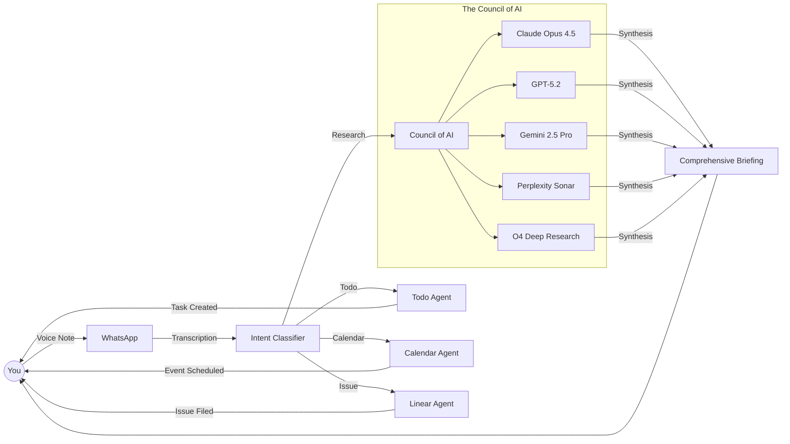

<div align="center">
  

  <h2><a href="https://intexuraos.cloud/" target="_blank">intexuraos.cloud</a></h2>

  <p>
    <em>Derived from the Latin <strong>intexere</strong> (to weave together) and <strong>textura</strong> (structure).</em><br>
    An AI-native autonomous agent platform that transforms chaotic inputs into structured, actionable intelligence.
  </p>

  <p>
    <a href="https://github.com/pbuchman/intexuraos/actions"></a>
    
    
    
    
    
  </p>
</div>

---

## The Problem

Your brain is for thinking, not for task management.

Modern productivity is fragmented: a thought arrives via WhatsApp, a link needs saving, a meeting needs scheduling, a research question needs deep analysis. Each task requires context-switching between apps, manual data entry, and cognitive overhead.

**The result**: Ideas get lost. Tasks fall through cracks. Your brain becomes a stressed task manager instead of a creative engine.

## The Solution: An AI Council That Works For You

IntexuraOS is an autonomous cognitive layer powered by a **Council of AI** - 15 models across 5 providers working in parallel to understand, process, and execute your intent.



---

## AI Capabilities

### Multi-Model Intelligence

| Capability             | Models                                                    | What Happens                                     |
| ---------------------- | --------------------------------------------------------- | ------------------------------------------------ |
| **Deep Research**      | Claude Opus, GPT-5.2, Gemini Pro, Sonar, O4 Deep Research | Parallel queries, independent verification, synthesis |
| **Intent Classification** | Gemini 2.5 Flash, GLM-4.7                              | Understand what you want from natural language   |
| **Task Extraction**    | Gemini 2.5 Flash                                          | Parse "buy milk and call mom" into separate tasks |
| **Event Parsing**      | Gemini 2.5 Flash                                          | "Meeting Tuesday 2pm" becomes calendar event     |
| **Issue Creation**     | Gemini 2.5 Flash, GLM-4.7                                 | Voice to Linear issue with title, priority, description |
| **Image Generation**   | DALL-E 3, Gemini Imagen                                   | Cover images for research reports                |
| **Data Analysis**      | Gemini Analysis Suite                                     | Upload data, get AI-generated insights           |

### Why Multiple Models?

Single-model assistants hallucinate. IntexuraOS queries multiple AI experts simultaneously:

1. **Parallel Processing**: Send the same question to 5 models at once
2. **Independent Verification**: Each model reasons and searches independently
3. **Confidence Aggregation**: Synthesize with confidence scores per claim
4. **Source Attribution**: Every statement links to which model/source said it

---

## Architecture

### 18 Specialized Microservices

| Category       | Services                                                                    |
| -------------- | --------------------------------------------------------------------------- |
| **AI Agents**  | research-agent, commands-agent, data-insights-agent, todos-agent, calendar-agent, linear-agent, image-service |
| **Content**    | bookmarks-agent, notes-agent, promptvault-service                           |
| **Integration**| whatsapp-service, notion-service, user-service                              |
| **Infrastructure** | actions-agent, web-agent, mobile-notifications-service, api-docs-hub, app-settings-service |

### Technology Stack

| Layer          | Technologies                                                           |
| -------------- | ---------------------------------------------------------------------- |
| **Runtime**    | Node.js 22, TypeScript 5.7, pnpm workspaces                            |
| **Framework**  | Fastify (HTTP), Hexagonal Architecture                                 |
| **AI**         | Anthropic, OpenAI, Google AI, Perplexity, Zai (GLM)                    |
| **Data**       | Firestore, Google Cloud Storage                                        |
| **Messaging**  | Google Cloud Pub/Sub                                                   |
| **Auth**       | Auth0, Google OAuth                                                    |
| **Infrastructure** | Terraform, Cloud Run, Cloud Build                                  |
| **Integrations** | WhatsApp Business API, Linear, Google Calendar, Notion, Speechmatics |

---

## Engineering Standards

### No Dummy Success

IntexuraOS never returns `null` to silence errors. Every operation returns `Result<T, E>`:

```typescript
const result = await researchAgent.execute(query);
if (!result.ok) {
  // Explicit error handling required
  return handleError(result.error);
}
// TypeScript knows result.value is the success type
```

### Test-First Development

- **95% coverage threshold** - enforced, never adjusted
- **TDD workflow** - failing test first, then implementation
- **In-memory fakes** - no external dependencies in tests

### Autonomous AI Agents

The repository is maintained by a hybrid team of human intent and AI execution:

| Agent              | Role                                                        |
| ------------------ | ----------------------------------------------------------- |
| `service-scribe`   | Generates documentation from code analysis, never outdated  |
| `sentry-triage`    | Investigates errors, proves root cause before fixing        |
| `coverage-orchestrator` | Creates Linear tickets for every uncovered branch      |

---

## Quick Start

```bash
# Install dependencies
pnpm install

# Setup environment
cp .env.example .env.local

# Run test suite (in-memory fakes, no external deps)
pnpm run ci

# Start local development
pnpm run dev
```

For full setup: [Setup Guide](docs/setup/01-gcp-project.md)

---

## Documentation

### Getting Started

| Document                                                              | Description                              |
| --------------------------------------------------------------------- | ---------------------------------------- |
| [Platform Overview](docs/overview.md)                                 | What IntexuraOS does and how             |
| [AI Architecture](docs/architecture/ai-architecture.md)               | Deep dive into 15 LLM models             |
| [Services Catalog](docs/services/index.md)                            | All 18 services documented               |
| [Setup Guide](docs/setup/01-gcp-project.md)                           | Step-by-step GCP setup                   |

### Architecture

| Document                                                                                  | Description                     |
| ----------------------------------------------------------------------------------------- | ------------------------------- |
| [AI Architecture](docs/architecture/ai-architecture.md)                                   | Multi-model orchestration       |
| [Service-to-Service Communication](docs/architecture/service-to-service-communication.md) | Internal HTTP patterns          |
| [Firestore Ownership](docs/architecture/firestore-ownership.md)                           | Collection ownership model      |
| [Pub/Sub Standards](docs/architecture/pubsub-standards.md)                                | Event-driven messaging          |

### Key Services

| Service                                                        | Purpose                       | AI Models                       |
| -------------------------------------------------------------- | ----------------------------- | ------------------------------- |
| [research-agent](docs/services/research-agent/features.md)     | Multi-LLM research synthesis  | 10 research models              |
| [commands-agent](docs/services/commands-agent/features.md)     | Intent classification         | Gemini Flash, GLM               |
| [todos-agent](docs/services/todos-agent/features.md)           | Task extraction               | Gemini Flash                    |
| [calendar-agent](docs/services/calendar-agent/features.md)     | Event parsing                 | Gemini Flash                    |
| [linear-agent](docs/services/linear-agent/features.md)         | Issue creation                | Gemini Flash, GLM               |
| [image-service](docs/services/image-service/features.md)       | Image generation              | DALL-E 3, Imagen                |

---

## About

IntexuraOS demonstrates that **software engineering is a discipline, not just a job.**

This project applies Staff Engineer thinking to personal productivity: rigorous standards, comprehensive automation, and AI integration enable a single developer to build and maintain a complex, distributed system with enterprise-grade reliability.

Built by [Piotr Buchman](https://www.linkedin.com/in/piotrbuchman/) - open to discussing architecture, AI-native development, or leadership roles where technical excellence is a core value.

---

<div align="center">
  <sub>Built with TypeScript, powered by AI, maintained with discipline.</sub>
</div>
