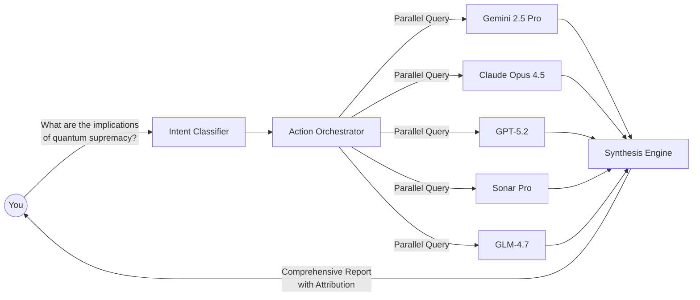
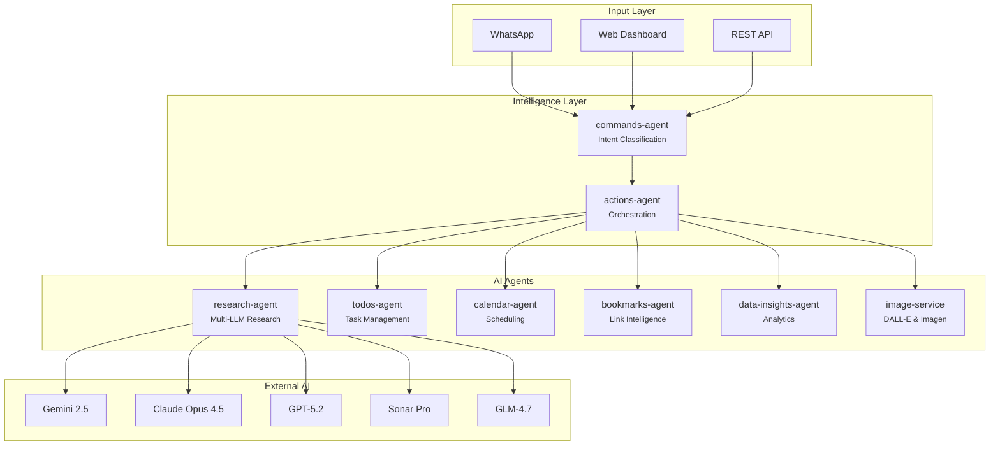

<div align="center">
  

  <h2><a href="https://intexuraos.cloud/" target="_blank">intexuraos.cloud</a></h2>

  <p>
    <em>From Latin <strong>intexere</strong> (to weave together) + <strong>textura</strong> (structure)</em><br>
    <strong>The AI-native operating system that weaves intelligence into your daily workflow.</strong>
  </p>

  <p>
    <a href="https://github.com/pbuchman/intexuraos/actions"></a>
    
    
    
    
    
  </p>
</div>

---

## The AI-First Personal Operating System

**Your brain is for thinking. IntexuraOS handles the rest.**

Most productivity tools add cognitive overhead. They require you to context-switch between apps, manually categorize information, and remember to check multiple dashboards. IntexuraOS inverts this model: you speak your intent, and an autonomous fleet of AI agents executes it.

### The Core Innovation: Council of AI

Instead of relying on a single AI model (with its inherent biases and knowledge gaps), IntexuraOS queries **multiple LLMs in parallel** and synthesizes their responses:



**Result**: A comprehensive, citation-backed research report that combines the unique perspectives of 5 different AI systems.

---

## Key Capabilities

### 1. Multi-Model Research Engine

The flagship feature. When you need deep research:

- **5 AI providers**: Google (Gemini), OpenAI (GPT-5.2), Anthropic (Claude), Perplexity (Sonar), Zai (GLM)
- **Parallel execution**: All models queried simultaneously
- **Smart synthesis**: Final report attributes each claim to its source
- **Confidence scoring**: Know how certain each model is
- **Public sharing**: Generate shareable URLs with AI-created cover images

### 2. Voice-First Command Interface

Speak to WhatsApp. IntexuraOS understands.

| You Say                                           | IntexuraOS Does                                  |
| ------------------------------------------------- | ------------------------------------------------ |
| "Schedule a sync with engineering Tuesday at 2"   | Creates calendar event, sends invites            |
| "Remind me to review the Q4 report by Friday"     | Extracts task, sets priority and deadline        |
| "Save this link about TypeScript 5.0"             | Extracts metadata, generates AI summary          |
| "Research the latest in battery technology"       | Launches multi-model research, notifies when done |
| "Note: Ideas for the product roadmap meeting"     | Structures your thoughts into a coherent note    |

### 3. Intelligent Classification

The **commands-agent** uses Gemini 2.5 Flash to understand intent:

```
Input: "Don't forget the dentist appointment next Thursday at 3pm"

Analysis:
  - Type: calendar (confidence: 0.92)
  - Extracted: { event: "dentist appointment", date: "2026-01-23", time: "15:00" }
  - Action: Create calendar event
```

### 4. Data Intelligence

Upload datasets. Receive AI-generated insights.

- **Schema inference**: Automatically understands your data structure
- **Trend detection**: Highlights patterns and anomalies
- **Chart generation**: Recommends visualizations
- **Composite feeds**: Aggregate multiple data sources

### 5. Cost Transparency

Every LLM call is tracked:

- Per-model token usage
- Real-time cost calculation
- Monthly analytics dashboard
- Pre-execution cost estimates

---

## Architecture at a Glance



---

## The 17 Microservices

| Service | AI Capability | Purpose |
| ------- | ------------- | ------- |
| **research-agent** | Multi-model orchestration | Parallel LLM research with synthesis |
| **commands-agent** | Gemini intent classification | Natural language to action routing |
| **data-insights-agent** | LLM data analysis | AI-powered visualization |
| **image-service** | DALL-E 3 & Imagen 3 | Cover image generation |
| **bookmarks-agent** | AI summarization | Link intelligence |
| **todos-agent** | Task extraction | Natural language to-do |
| **calendar-agent** | Date parsing | Google Calendar integration |
| **linear-agent** | Issue mapping | Linear project management |
| **notes-agent** | Content structuring | Note-taking |
| **web-agent** | Content extraction | Web scraping with AI |
| **actions-agent** | - | Central orchestration |
| **whatsapp-service** | Speechmatics transcription | WhatsApp Business integration |
| **user-service** | - | Auth & API key encryption |
| **mobile-notifications-service** | - | Push notifications |
| **notion-service** | - | Notion integration |
| **promptvault-service** | - | Prompt template management |
| **app-settings-service** | - | LLM pricing & analytics |
| **api-docs-hub** | - | OpenAPI documentation |

---

## AI Provider Integration

IntexuraOS treats LLMs as a **council of experts**:

| Provider | Models | Specialty |
| -------- | ------ | --------- |
| **Google** | Gemini 2.5 Pro, Flash, Flash-Image | Fast classification, image generation |
| **OpenAI** | GPT-5.2, o4-mini-deep-research, DALL-E 3 | Deep research, creative content |
| **Anthropic** | Claude Opus 4.5, Sonnet 4.5, Haiku 3.5 | Nuanced analysis, safety |
| **Perplexity** | Sonar, Sonar Pro, Sonar Deep Research | Real-time web search |
| **Zai** | GLM-4.7 | Multilingual, alternative perspective |

**Total**: 15 models across 5 providers

---

## Engineering Philosophy

### 1. AI as Team Members

I don't just "use" AI tools. I define autonomous agents with explicit mandates:

- **service-scribe**: Documentation specialist that infers "why" from git history
- **sentry-triage**: Reliability engineer that refuses band-aid fixes
- **coverage-orchestrator**: QA lead where "94.9% is failure"

### 2. No Dummy Success

Every operation returns `Result<T, E>`. Errors are domain concepts, not exceptions. No silent failures.

```typescript
const result = await researchAgent.query(prompt);
if (!result.ok) {
  // Handle specific error type
  return err({ code: 'RESEARCH_FAILED', message: result.error.message });
}
// Type-safe access to result.value
```

### 3. The Continuity Ledger

Complex reasoning is persisted. AI context survives session boundaries via immutable markdown ledgers.

### 4. Sleep-at-Night Reliability

- **95%+ test coverage**: Not a target, a gate
- **Strict TypeScript**: `noUncheckedIndexedAccess`, `exactOptionalPropertyTypes`
- **Hexagonal architecture**: Domain logic is pure and testable
- **Infrastructure as Code**: Everything in Terraform

---

## Technology Stack

| Layer | Technology |
| ----- | ---------- |
| **Runtime** | Node.js 20 on Cloud Run |
| **Framework** | Fastify with OpenAPI |
| **Database** | Firestore (NoSQL) |
| **Storage** | Google Cloud Storage |
| **Messaging** | Cloud Pub/Sub |
| **AI** | Google, OpenAI, Anthropic, Perplexity, Zai |
| **Transcription** | Speechmatics |
| **Auth** | Auth0, Google OAuth |
| **Infrastructure** | Terraform |
| **Monorepo** | pnpm workspaces |
| **Language** | TypeScript (strict mode) |

---

## Quick Start

```bash
# Clone and install
git clone https://github.com/pbuchman/intexuraos.git
cd intexuraos
pnpm install

# Configure environment
cp .env.example .env.local

# Run the test suite (uses in-memory fakes)
pnpm run ci

# Start local development with emulators
pnpm run dev
```

For full setup, see the [Setup Guide](docs/setup/01-gcp-project.md).

---

## Documentation

| Document | Description |
| -------- | ----------- |
| [Platform Overview](docs/overview.md) | AI capabilities and architecture |
| [Services Catalog](docs/services/index.md) | All 17 services documented |
| [Setup Guide](docs/setup/01-gcp-project.md) | GCP project configuration |
| [Architecture Patterns](docs/architecture/) | Design decisions |
| [API Contracts](docs/architecture/api-contracts.md) | HTTP API standards |

### Service Documentation

Each service has complete documentation:

- **features.md**: Value proposition and use cases
- **technical.md**: API endpoints and architecture
- **tutorial.md**: Getting started guide
- **technical-debt.md**: Debt tracking

[Browse all services](docs/services/index.md)

---

## The Architect

I built IntexuraOS to prove that **software engineering is a discipline, not just a job**.

This repository demonstrates that with rigorous standards, automation, and AI integration, a single Staff Engineer can build and maintain a complex, distributed system that rivals team-built products in quality and reliability.

I don't just write code. I design systems that write code.

---

## Contact

Open to discussing architecture, AI-native workflows, or leadership roles where technical excellence is a core value.

- [LinkedIn](https://www.linkedin.com/in/piotrbuchman/)
- [Email](mailto:kontakt@pbuchman.com)

---

<div align="center">
  <sub>Built with TypeScript, powered by the Council of AI</sub>
</div>
