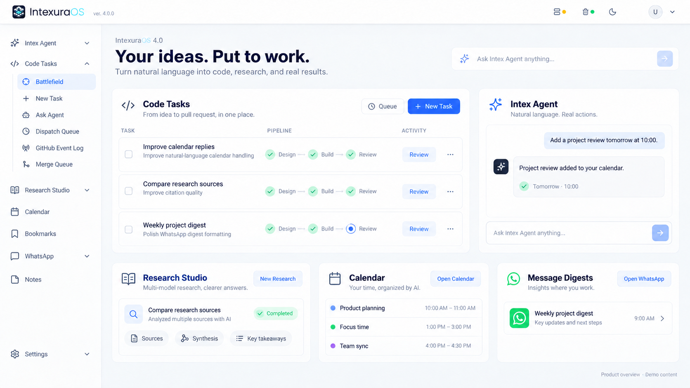
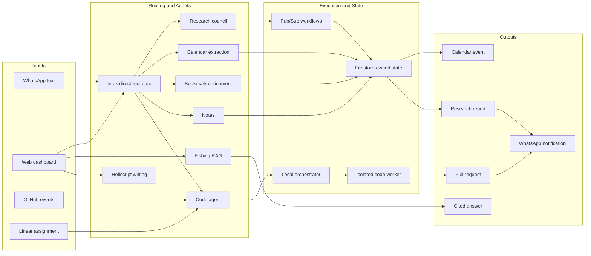
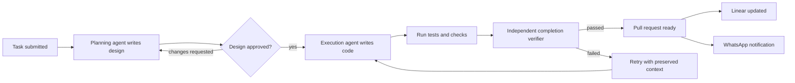
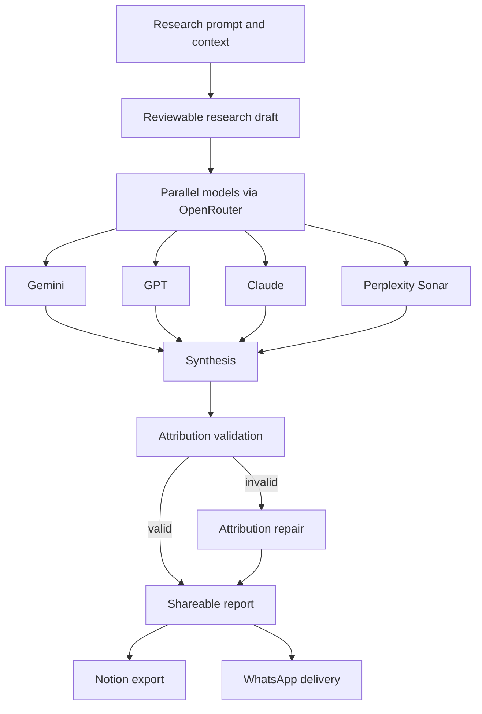
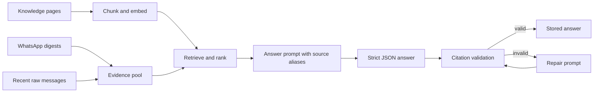

<div align="center">
  <a href="https://intexuraos.cloud/" target="_blank">
    
  </a>

  <p>
    <a href="https://github.com/pbuchman/intexuraos/actions"></a>
    
    
    
    
  </p>
</div>

> **IntexuraOS is a personal agentic operating system for turning thoughts into executed work.**
>
> Send a WhatsApp message, dashboard task, GitHub comment, link, or research question. IntexuraOS routes it to a specialist agent, performs the work through typed service boundaries, verifies the result, and notifies you when there is something to review.
>
> A thought becomes a note. A date becomes a calendar event. A link becomes an enriched bookmark. A question becomes a multi-model research report. A bug report becomes a planned, tested code change running on your own machine.

**[Why It Is Different](#why-it-is-different)** · **[Agentic Patterns](#agentic-patterns-in-production)** · **[System Flow](#system-flow)** · **[Self-Building Code](#flagship-subsystem-self-building-code)** · **[Research Council](#multi-model-research-council)** · **[Engineering Proof](#engineering-proof)** · **[Getting Started](#getting-started)** · **[Documentation](#documentation)**

---

## What's New in v4.0.0

| Feature                             | Description                                                                                                                                              |
| ----------------------------------- | -------------------------------------------------------------------------------------------------------------------------------------------------------- |
| **Custom WhatsApp Message Digests** | Schedule summaries of a private group or direct chat with your own instructions, preview the result, and review past digests delivered through WhatsApp. |
| **WhatsApp Conversation Assistant** | Ask questions about private chats using a chosen date range, inspect the captured context, and follow streamed responses.                                |

See [CHANGELOG.md](CHANGELOG.md) for all release changes.

---

## Why It Is Different

IntexuraOS is not one general assistant with a long tool list. It is a set of narrow agents, each with one domain, wrapped in deterministic software that controls what the model is allowed to do.

| What it is not                 | What IntexuraOS does instead                                                                                                                                   |
| ------------------------------ | -------------------------------------------------------------------------------------------------------------------------------------------------------------- |
| **Not one generic chatbot**    | Specialist agents own notes, calendar, research, bookmarks, writing, RAG, notifications, Linear, GitHub, and code execution.                                   |
| **Not just tool calling**      | Tool access is typed, gated, audited, and service-owned; unsupported requests fail clearly instead of being forced through a fallback workflow.                |
| **Not just RAG**               | Retrieval is domain-specific, citation-validated, and connected to user knowledge plus recent WhatsApp/mobile context.                                         |
| **Not just autonomous coding** | Code runs locally on your worker machine, inside isolated containers, with design review, independent verification, retry, and PR delivery.                    |
| **Not prompt glue**            | Prompts are semver-versioned, LLM usage is attributed by prompt type, malformed model outputs are repaired or stored for review, and service state is durable. |

The result is closer to a personal operating system than a productivity app: a single front door into many safe, inspectable workflows.

## Agentic Patterns In Production

| Pattern                     | IntexuraOS implementation                                                                                              | What it proves                                                                                           |
| --------------------------- | ---------------------------------------------------------------------------------------------------------------------- | -------------------------------------------------------------------------------------------------------- |
| Direct-tool action agent    | [`intex-agent`](docs/services/intex-agent/features.md)                                                                 | WhatsApp text passes intent gates, with explicit confirmation before supported mutations.                |
| Multi-model council         | [`research-agent`](docs/services/research-agent/features.md)                                                           | Selected models answer independently, then synthesis preserves attribution and disagreements.            |
| Citation-grounded RAG       | [`fishing-assistant-service`](docs/services/fishing-assistant-service/features.md)                                     | Knowledge, digest, and raw-message evidence are retrieved, ranked, cited, validated, and repaired.       |
| Writing-state agent         | [`hellscript-agent`](docs/services/hellscript-agent/features.md)                                                       | User utterances become durable buffer events before drafts are generated from personal writing samples.  |
| Extraction-to-action agents | [`calendar-agent`](docs/services/calendar-agent/features.md), [`linear-agent`](docs/services/linear-agent/features.md) | Natural language is parsed into structured data, validated, and either executed or stored for recovery.  |
| Summarization memory        | [`message-digest-service`](docs/services/message-digest-service/features.md)                                           | Scheduled WhatsApp group and direct-chat summaries retain bounded continuity between runs.               |
| Autonomous code agent       | [`code-agent`](docs/services/code-agent/features.md) + [`orchestrator`](docs/services/orchestrator/features.md)        | Design, execution, verification, PR creation, GitHub feedback, and retry form a full code delivery loop. |
| Execution memory            | [`code-agent`](docs/services/code-agent/features.md)                                                                   | Prior code-task lessons are retrieved and injected into future execution tasks with post-run evaluation. |

## System Flow


```mermaid
flowchart LR
    subgraph Inputs
        WA[WhatsApp text]
        WEB[Web dashboard]
        GH[GitHub events]
        LIN[Linear assignment]
    end

    subgraph "Routing and Agents"
        INTEX[Intex direct-tool gate]
        RES[Research council]
        RAG[Fishing RAG]
        CAL[Calendar extraction]
        BOOK[Bookmark enrichment]
        NOTE[Notes]
        CODE[Code agent]
        WRITE[Hellscript writing]
    end

    subgraph "Execution and State"
        PUBSUB[Pub/Sub workflows]
        FS[Firestore-owned state]
        ORCH[Local orchestrator]
        WORKER[Isolated code worker]
    end

    subgraph Outputs
        EVENT[Calendar event]
        REPORT[Research report]
        ANSWER[Cited answer]
        PR[Pull request]
        DIGEST[WhatsApp notification]
    end

    WA --> INTEX
    WEB --> INTEX
    GH --> CODE
    LIN --> CODE
    INTEX --> RES
    INTEX --> CAL
    INTEX --> BOOK
    INTEX --> NOTE
    INTEX --> CODE
    WEB --> RAG
    WEB --> WRITE
    RES --> PUBSUB
    CAL --> FS
    BOOK --> FS
    NOTE --> FS
    CODE --> ORCH --> WORKER
    PUBSUB --> FS
    FS --> EVENT
    FS --> REPORT
    RAG --> ANSWER
    WORKER --> PR
    PR --> DIGEST
    REPORT --> DIGEST
```

## Direct-Tool Intelligence

You submit tasks while walking, commuting, or thinking of something else. WhatsApp is the mobile interface because it is already on your phone and already open. IntexuraOS turns that text into structured work.

| You say                                            | What happens                                                                          |
| -------------------------------------------------- | ------------------------------------------------------------------------------------- |
| _"Fix the Safari login redirect"_                  | After confirmation, a code task starts in planning mode for design review.            |
| _"Research quantum computing with Claude and GPT"_ | After confirmation, a research draft is created for review.                           |
| _"Schedule a sync with engineering Tuesday at 2"_  | Event details are clarified and shown for confirmation before creation.               |
| _"Save a note about the Q4 report"_                | After confirmation, a note is saved with a generated title and searchable metadata.   |
| _"Save this link about TypeScript 5.0"_            | After confirmation, the bookmark is saved, enriched, and summarized through WhatsApp. |

Direct tools cover notes, calendar queries and updates, research drafts, bookmarks, code tasks, configured external saving, and personal preferences. Read-only calendar and preference queries can return immediately; changes require confirmation. Unsupported requests get a clear response.

## Flagship Subsystem: Self-Building Code

Most AI coding tools assume you are sitting at a keyboard. IntexuraOS does not.

You describe the change through WhatsApp, the dashboard, Linear, or GitHub. The code agent designs the approach, pauses for review when needed, dispatches execution to a local worker, runs tests, creates a pull request, updates Linear, and reports progress back through the dashboard and WhatsApp.

Your source code stays on infrastructure you control. The orchestrator runs on your worker machine and creates a separate isolated container for each task. Each task gets its own checkout, credentials, logs, and lifecycle state.


```mermaid
flowchart LR
    START[Task submitted] --> PLAN[Planning agent writes design]
    PLAN --> REVIEW{Design approved?}
    REVIEW -->|yes| EXEC[Execution agent writes code]
    REVIEW -->|changes requested| PLAN
    EXEC --> TEST[Run tests and checks]
    TEST --> VERIFY[Independent completion verifier]
    VERIFY -->|passed| PR[Pull request ready]
    VERIFY -->|failed| RETRY[Retry with preserved context]
    RETRY --> EXEC
    PR --> LINEAR[Linear updated]
    PR --> WA[WhatsApp notification]
```

### Code Execution Guarantees

- **Local worker execution**: the coding agent runs on your machine under your AI subscription.
- **Container isolation**: each task has its own checkout, credentials, and restricted runtime.
- **Design review**: code tasks default to planning before implementation.
- **Independent verification**: the worker does not approve its own work.
- **Retry and remediation**: failed completion checks preserve context and resume rather than dropping work.
- **GitHub feedback loop**: PR comments can create follow-up tasks with full branch context.

## Multi-Model Research Council

Research-agent does not ask one model and trust the answer. It sends the same structured research plan to selected models through OpenRouter, stores each result independently, then synthesizes the reports with attribution.


```mermaid
flowchart TB
    Q[Research prompt and context] --> DRAFT[Reviewable research draft]
    DRAFT --> FANOUT[Parallel models via OpenRouter]
    FANOUT --> GEM[Gemini]
    FANOUT --> GPT[GPT]
    FANOUT --> CLAUDE[Claude]
    FANOUT --> SONAR[Perplexity Sonar]
    GEM --> SYN[Synthesis]
    GPT --> SYN
    CLAUDE --> SYN
    SONAR --> SYN
    SYN --> ATTR[Attribution validation]
    ATTR -->|valid| SHARE[Shareable report]
    ATTR -->|invalid| REPAIR[Attribution repair]
    REPAIR --> SHARE
    SHARE --> NOTION[Notion export]
    SHARE --> WA2[WhatsApp delivery]
```

The output is not a blended paragraph. It is a report that keeps source reports available, names which models supported which claims, and surfaces disagreements rather than hiding them.

## Grounded RAG And Memory

The fishing assistant and digest pipelines show the same philosophy in smaller domains: retrieve evidence, structure it, validate output, and keep state inspectable.


```mermaid
flowchart LR
    KB[Knowledge pages] --> CHUNK[Chunk and embed]
    DIGEST[WhatsApp digests] --> EVIDENCE[Evidence pool]
    RAW[Recent raw messages] --> EVIDENCE
    CHUNK --> RETRIEVE[Retrieve and rank]
    EVIDENCE --> RETRIEVE
    RETRIEVE --> PROMPT[Answer prompt with source aliases]
    PROMPT --> JSON[Strict JSON answer]
    JSON --> CITE[Citation validation]
    CITE -->|valid| ANSWER[Stored answer]
    CITE -->|invalid| REPAIR2[Repair prompt]
    REPAIR2 --> CITE
```

## Engineering Proof

The system can only delegate work safely because the engineering discipline is strict.

| Discipline                 | How it is enforced                                                                                                 |
| -------------------------- | ------------------------------------------------------------------------------------------------------------------ |
| **95% coverage gate**      | CI enforces at least 95% line, branch, function, and statement coverage.                                           |
| **Strict TypeScript**      | `noUncheckedIndexedAccess`, exact optional properties, explicit booleans, and typed results.                       |
| **Prompt versioning**      | LLM prompts are `PromptBuilder` objects with semver versions and CI-enforced bump checks.                          |
| **Cross-LLM verification** | The writer and verifier are different providers for high-stakes code workflows.                                    |
| **Service ownership**      | Apps own their Firestore collections and communicate through typed internal HTTP clients.                          |
| **Infrastructure as code** | Terraform owns persistent infrastructure; no manual cloud console changes.                                         |
| **Usage visibility**       | LLM usage is tracked by model, provider, prompt type, call source, and correlation metadata.                       |
| **CI gates**               | Verification scripts cover package exports, boundaries, env wiring, prompt versions, logging, contracts, and more. |

### Architecture At A Glance

| Layer              | Technologies                                                                 |
| ------------------ | ---------------------------------------------------------------------------- |
| **Runtime**        | Node.js, TypeScript strict mode                                              |
| **Web**            | React, Vite, TailwindCSS                                                     |
| **Services**       | Fastify apps on Cloud Run / Hetzner PM2                                      |
| **Workers**        | Cloud Functions and VM-hosted orchestrator                                   |
| **Data**           | Firestore, Google Cloud Storage                                              |
| **Messaging**      | Cloud Pub/Sub                                                                |
| **Application AI** | Models accessed through OpenRouter                                           |
| **Integrations**   | WhatsApp Business API, Linear, GitHub, Google Calendar, Notion, Speechmatics |
| **Infrastructure** | Terraform, Docker, PM2, nginx, GitHub Actions                                |

---

<details>
<summary><h2>Version History: v3.x</h2></summary>

### v3.8.0

> See [CHANGELOG.md](CHANGELOG.md) for the complete history.

| Improvement                     | Impact                                                                                                                                                            |
| ------------------------------- | ----------------------------------------------------------------------------------------------------------------------------------------------------------------- |
| **Intex Agent Unified Actions** | Use one Intex Agent workflow to create code tasks, research drafts, bookmarks, notes, and calendar actions, with legacy action agents folded into one clear path. |
| **Private WhatsApp Workspace**  | Mirror and inspect private WhatsApp conversations with preserved group context, sender/day views, Matrix sync, read-only logs, and reliable continuity.           |

Earlier releases added WhatsApp group digests, centralized LLM pricing, Hellscript writing, Codex runtime support, execution memory, remediation workflows, GitHub PR triage, merge queue automation, and agent-based code task routing.

</details>

---

## Getting Started

### For Users

You need three things: a WhatsApp account, a Google account, and a web browser.

1. **Sign up** through the [web app](https://intexuraos.cloud/) and connect your WhatsApp number with a one-time verification code.
2. **Link your Google account** for calendar access.
3. **Send your first text message** and the system routes it immediately.

The platform provides fallback OpenRouter access, so you can run research and generate bookmarks before configuring your own OpenRouter key. For coding tasks, connect a worker machine. For project tracking, connect Linear. For research exports, connect Notion. Each integration is optional and independent.

### For Developers

> **Note:** Full setup requires Google Cloud credentials and external service accounts such as Auth0, WhatsApp Business, Linear, and provider API keys.

```bash
# Prerequisites: Node.js 22+, pnpm 9+, Docker
pnpm install
cp .envrc.local.example .envrc.local
direnv allow
pnpm run dev
```

| Service               | URL                        |
| --------------------- | -------------------------- |
| Web App               | http://localhost:3000      |
| API Docs              | http://localhost:8115/docs |
| Firestore Emulator UI | http://localhost:8100      |

Full setup: **[Development Setup Guide](docs/setup/05-local-dev-with-gcp-deps.md)**

---

## Documentation

| Document                                                    | Description                                                           |
| ----------------------------------------------------------- | --------------------------------------------------------------------- |
| **[Platform Overview](docs/overview.md)**                   | What IntexuraOS does across agents, services, and workflows.          |
| **[Services Catalog](docs/services/index.md)**              | App services, workers, and packages with technical details.           |
| **[AI Architecture](docs/architecture/ai-architecture.md)** | Provider routing, model roles, prompt validation, and usage tracking. |
| **[Setup Guide](docs/setup/01-gcp-project.md)**             | Step-by-step cloud and environment setup.                             |

<details>
<summary><strong>Core Services</strong></summary>

| Service                                                                                    | What it does                                                                                                |
| ------------------------------------------------------------------------------------------ | ----------------------------------------------------------------------------------------------------------- |
| **[intex-agent](docs/services/intex-agent/features.md)**                                   | WhatsApp text runtime with direct tools for notes, calendar, research, bookmarks, and code tasks.           |
| **[code-agent](docs/services/code-agent/features.md)**                                     | Autonomous code planning, execution dispatch, GitHub feedback loops, cost controls, and task lifecycle.     |
| **[orchestrator](docs/services/orchestrator/features.md)**                                 | Local isolated coding sessions, worker supervision, completion verification, and status callbacks.          |
| **[research-agent](docs/services/research-agent/features.md)**                             | Multi-model research with draft review, parallel OpenRouter model calls, synthesis, and share/export flows. |
| **[fishing-assistant-service](docs/services/fishing-assistant-service/features.md)**       | User-scoped RAG with citations over fishing knowledge, digests, and recent message evidence.                |
| **[hellscript-agent](docs/services/hellscript-agent/features.md)**                         | Writing assistant with stateful buffers, personal samples, style config, and versioned drafts.              |
| **[calendar-agent](docs/services/calendar-agent/features.md)**                             | Calendar event queries, confirmed creation and updates through Intex, and failed-event recovery.            |
| **[linear-agent](docs/services/linear-agent/features.md)**                                 | Linear sync, issue extraction, assignment-triggered code tasks, and AI-assisted pruning.                    |
| **[bookmarks-agent](docs/services/bookmarks-agent/features.md)**                           | Bookmark CRUD, OpenGraph enrichment, AI summaries, duplicate handling, and WhatsApp delivery.               |
| **[notes-agent](docs/services/notes-agent/features.md)**                                   | User-scoped notes with tags, source tracking, and direct-tool creation.                                     |
| **[web-agent](docs/services/web-agent/features.md)**                                       | Link preview and page-summary extraction for research and bookmark workflows.                               |
| **[message-digest-service](docs/services/message-digest-service/features.md)**             | Configurable WhatsApp group and direct-chat summaries with scheduled delivery and run history.              |
| **[mobile-notifications-service](docs/services/mobile-notifications-service/features.md)** | Android notification capture, search, and structured notification history.                                  |
| **[llm-usage-service](docs/services/llm-usage-service/features.md)**                       | Usage events, provider pricing, prompt-type attribution, and cost visibility.                               |
| **[image-service](docs/services/image-service/features.md)**                               | Research cover image prompt generation, image creation, storage, and thumbnails.                            |
| **[notion-service](docs/services/notion-service/features.md)**                             | Notion connection and research export support.                                                              |
| **[whatsapp-service](docs/services/whatsapp-service/features.md)**                         | WhatsApp messaging, private conversations, captured-context analysis, and delivery events.                  |
| **[web](docs/services/web/features.md)**                                                   | Dashboard, PWA shell, live code logs, integrations, research, tasks, and settings.                          |

</details>

---

<details>
<summary><h2>Deliberate Scope Decisions</h2></summary>

IntexuraOS is designed for individual power users who want depth in one workflow over breadth across many.

- **WhatsApp-only mobile**: no SMS, email, or native push channel.
- **Google Calendar only**: Outlook and Apple Calendar are not connected.
- **Linear for project tracking**: Jira, Asana, and other trackers are not connected.
- **Android for notification capture**: iOS notification forwarding is not supported.
- **English and Polish natively**: other languages may work, but are not explicitly tested.
- **Designed for individual use**: no shared workspaces or team collaboration features.
- **No recurring calendar creation**: calendar event creation handles single instances; Message Digests and calendar lookahead have their own schedules.
- **Two worker machines**: one primary and one fallback coding worker.
- **Optional OpenRouter key**: your own key is validated before storage; platform access supplies a fallback.
- **Design review before code execution**: a deliberate quality gate, not an optimization to remove.

</details>

---

## About

IntexuraOS is both a working product and an engineering artifact: a distributed system, a personal automation layer, and a production showcase of how to place LLM agents inside typed, testable, inspectable software.

Built by [Piotr Buchman](https://www.linkedin.com/in/piotrbuchman/).

<div align="center">
  <sub>Personal agentic OS. Specialist agents. Local code execution. Multi-model research. One developer.</sub>
</div>
