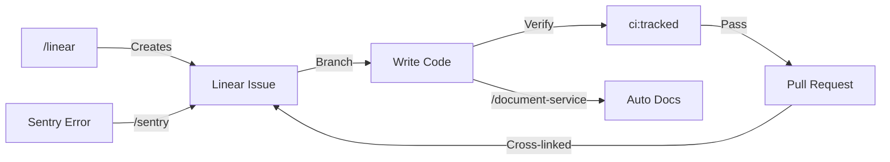

<div align="center">
  

  <h2><a href="https://intexuraos.cloud/" target="_blank">intexuraos.cloud</a></h2>

  <p>
    <em>From Latin <strong>intexere</strong> (to weave together) + <strong>textura</strong> (structure)</em><br>
    <strong>The AI-native operating system that weaves intelligence into your daily workflow.</strong>
  </p>

  <p>
    <a href="https://github.com/pbuchman/intexuraos/actions"></a>
    
    
    
    
    
  </p>
</div>

---

## The Problem

Your brain is for thinking, not for task management.

Modern productivity is fragmented: a thought arrives via WhatsApp, a link needs saving, a meeting needs scheduling, a research question needs deep analysis. Each task requires context-switching between apps, manual data entry, and cognitive overhead.

**The result**: Ideas get lost. Tasks fall through cracks. Your brain becomes a stressed task manager instead of a creative engine.

## The Solution: Council of AI

IntexuraOS inverts the productivity model: you speak your intent, and an autonomous fleet of AI agents executes it. Instead of relying on a single AI model (with its inherent biases and knowledge gaps), IntexuraOS queries **multiple LLMs in parallel** and synthesizes their responses.


**Result**: A comprehensive, citation-backed research report that combines the unique perspectives of 5 different AI systems.

---

## Key Capabilities

### Voice-First Command Interface

Speak to WhatsApp. IntexuraOS understands.

| You Say                                         | IntexuraOS Does                                   |
| ----------------------------------------------- | ------------------------------------------------- |
| "Schedule a sync with engineering Tuesday at 2" | Creates calendar event, sends invites             |
| "Remind me to review the Q4 report by Friday"   | Extracts task, sets priority and deadline         |
| "Save this link about TypeScript 5.0"           | Extracts metadata, generates AI summary           |
| "Research the latest in battery technology"     | Launches multi-model research, notifies when done |
| "Note: Ideas for the product roadmap meeting"   | Structures your thoughts into a coherent note     |

### Intelligent Classification

The **commands-agent** uses Gemini 2.5 Flash to understand intent:

```
Input: "Don't forget the dentist appointment next Thursday at 3pm"

Analysis:
  - Type: calendar (confidence: 0.92)
  - Extracted: { event: "dentist appointment", date: "2026-01-23", time: "15:00" }
  - Action: Create calendar event
```

### Multi-Model Intelligence

| Capability                | Models                                                    | What Happens                                            |
| ------------------------- | --------------------------------------------------------- | ------------------------------------------------------- |
| **Deep Research**         | Claude Opus, GPT-5.2, Gemini Pro, Sonar, O4 Deep Research | Parallel queries, independent verification, synthesis   |
| **Intent Classification** | Gemini 2.5 Flash, GLM-4.7                                 | Understand what you want from natural language          |
| **Task Extraction**       | Gemini 2.5 Flash                                          | Parse "buy milk and call mom" into separate tasks       |
| **Event Parsing**         | Gemini 2.5 Flash                                          | "Meeting Tuesday 2pm" becomes calendar event            |
| **Issue Creation**        | Gemini 2.5 Flash, GLM-4.7                                 | Voice to Linear issue with title, priority, description |
| **Image Generation**      | DALL-E 3, Gemini Imagen                                   | Cover images for research reports                       |
| **Data Analysis**         | Gemini Analysis Suite                                     | Upload data, get AI-generated insights                  |

### Why Multiple Models?

Single-model assistants hallucinate. IntexuraOS queries multiple AI experts simultaneously:

1. **Parallel Processing**: Send the same question to 5 models at once
2. **Independent Verification**: Each model reasons and searches independently
3. **Confidence Aggregation**: Synthesize with confidence scores per claim
4. **Source Attribution**: Every statement links to which model/source said it

---

## Architecture

### 18 Specialized Microservices

| Category           | Services                                                                                                      |
| ------------------ | ------------------------------------------------------------------------------------------------------------- |
| **AI Agents**      | research-agent, commands-agent, data-insights-agent, todos-agent, calendar-agent, linear-agent, image-service |
| **Content**        | bookmarks-agent, notes-agent, promptvault-service                                                             |
| **Integration**    | whatsapp-service, notion-service, user-service                                                                |
| **Infrastructure** | actions-agent, web-agent, mobile-notifications-service, api-docs-hub, app-settings-service                    |

### AI Provider Integration

IntexuraOS treats LLMs as a **council of experts**:

| Provider       | Models                                   | Specialty                             |
| -------------- | ---------------------------------------- | ------------------------------------- |
| **Google**     | Gemini 2.5 Pro, Flash, Flash-Image       | Fast classification, image generation |
| **OpenAI**     | GPT-5.2, o4-mini-deep-research, DALL-E 3 | Deep research, creative content       |
| **Anthropic**  | Claude Opus 4.5, Sonnet 4.5, Haiku 3.5   | Nuanced analysis, safety              |
| **Perplexity** | Sonar, Sonar Pro, Sonar Deep Research    | Real-time web search                  |
| **Zai**        | GLM-4.7, GLM-4.7-Flash                   | Multilingual, alternative perspective |

**Total**: 16 models across 5 providers

### Technology Stack

| Layer              | Technologies                                                         |
| ------------------ | -------------------------------------------------------------------- |
| **Runtime**        | Node.js 22, TypeScript 5.7, pnpm workspaces                          |
| **Framework**      | Fastify (HTTP), Hexagonal Architecture                               |
| **AI**             | Anthropic, OpenAI, Google AI, Perplexity, Zai (GLM)                  |
| **Data**           | Firestore, Google Cloud Storage                                      |
| **Messaging**      | Google Cloud Pub/Sub                                                 |
| **Auth**           | Auth0, Google OAuth                                                  |
| **Infrastructure** | Terraform, Cloud Run, Cloud Build                                    |
| **Integrations**   | WhatsApp Business API, Linear, Google Calendar, Notion, Speechmatics |

---

## Engineering Philosophy

### AI-Native Development

This isn't a codebase that "uses" AI — it's **built with AI as first-class team members**. Every workflow has AI assistance baked in.



#### AI Extensions (`.claude/`)

| Type                | Examples                                          | Capabilities                                           |
| ------------------- | ------------------------------------------------- | ------------------------------------------------------ |
| **Skills**          | `/linear`, `/sentry`, `/document-service`         | Issue auto-splitting, AI triage (Seer), doc generation |
| **Agents**          | `coverage-orchestrator`, `service-scribe`         | 100% coverage enforcement, autonomous documentation    |
| **Commands**        | `/create-service`, `/refactoring`                 | Service scaffolding, code smell detection              |

**Cross-linking**: Linear ↔ GitHub (`INT-XXX` in PR title/body) ↔ Sentry (`[sentry]` prefix) — all artifacts connect automatically.

### Extreme Ownership

Inspired by Jocko Willink: **no bad code, only unowned problems**.

From task acceptance until `pnpm run ci:tracked` passes, YOU own everything. "Pre-existing issue" and "not my fault" are forbidden phrases — discovery creates ownership.

### Quality Gates

```bash
pnpm run ci:tracked  # TypeCheck → Lint → Tests (95% coverage) → Build
```

**Coverage is a gate, not a target.** 94.9% is failure. Every operation returns `Result<T, E>` — no silent failures.

### Sleep-at-Night Reliability

- **95%+ test coverage**: Enforced by CI, no exceptions
- **Strict TypeScript**: `noUncheckedIndexedAccess`, `exactOptionalPropertyTypes`
- **Hexagonal architecture**: Domain logic is pure and testable
- **Infrastructure as Code**: Everything in Terraform

See `.claude/CLAUDE.md` for the complete AI development playbook.

---

## Quick Start

```bash
# Install dependencies
pnpm install

# Setup environment
cp .env.example .env.local

# Run test suite (in-memory fakes, no external deps)
pnpm run ci

# Start local development
pnpm run dev
```

For full setup: [Setup Guide](docs/setup/01-gcp-project.md)

---

## Documentation

### Getting Started

| Document                                                | Description                  |
| ------------------------------------------------------- | ---------------------------- |
| [Platform Overview](docs/overview.md)                   | What IntexuraOS does and how |
| [AI Architecture](docs/architecture/ai-architecture.md) | Deep dive into 16 LLM models |
| [Services Catalog](docs/services/index.md)              | All 18 services documented   |
| [Setup Guide](docs/setup/01-gcp-project.md)             | Step-by-step GCP setup       |

### Architecture

| Document                                                                                  | Description                |
| ----------------------------------------------------------------------------------------- | -------------------------- |
| [AI Architecture](docs/architecture/ai-architecture.md)                                   | Multi-model orchestration  |
| [Service-to-Service Communication](docs/architecture/service-to-service-communication.md) | Internal HTTP patterns     |
| [Firestore Ownership](docs/architecture/firestore-ownership.md)                           | Collection ownership model |
| [Pub/Sub Standards](docs/architecture/pubsub-standards.md)                                | Event-driven messaging     |

### Key Services

| Service                                                    | Purpose                      | AI Models          |
| ---------------------------------------------------------- | ---------------------------- | ------------------ |
| [research-agent](docs/services/research-agent/features.md) | Multi-LLM research synthesis | 10 research models |
| [commands-agent](docs/services/commands-agent/features.md) | Intent classification        | Gemini Flash, GLM  |
| [todos-agent](docs/services/todos-agent/features.md)       | Task extraction              | Gemini Flash       |
| [calendar-agent](docs/services/calendar-agent/features.md) | Event parsing                | Gemini Flash       |
| [linear-agent](docs/services/linear-agent/features.md)     | Issue creation               | Gemini Flash, GLM  |
| [image-service](docs/services/image-service/features.md)   | Image generation             | DALL-E 3, Imagen   |

---

## About

IntexuraOS demonstrates that **software engineering is a discipline, not just a job.**

This project applies Staff Engineer thinking to personal productivity: rigorous standards, comprehensive automation, and AI integration enable a single developer to build and maintain a complex, distributed system with enterprise-grade reliability.

Built by [Piotr Buchman](https://www.linkedin.com/in/piotrbuchman/) — open to discussing architecture, AI-native development, or leadership roles where technical excellence is a core value.

---

<div align="center">
  <sub>Built with TypeScript, powered by the Council of AI</sub>
</div>
