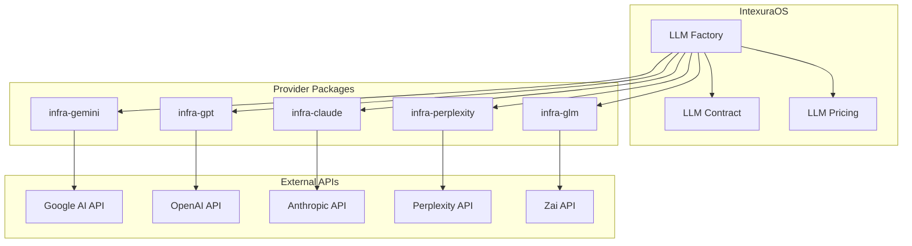
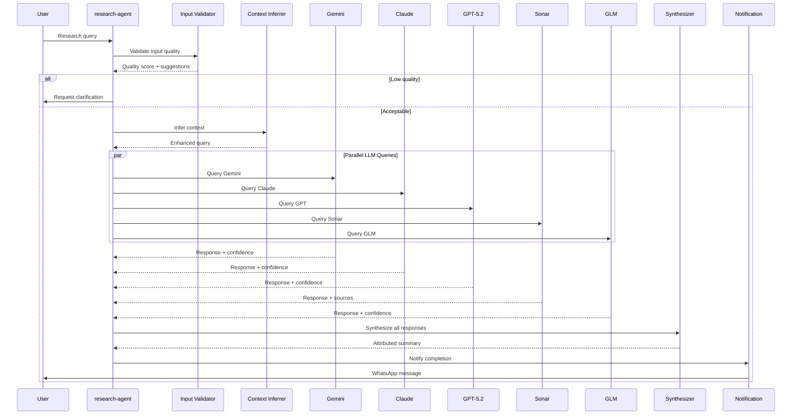
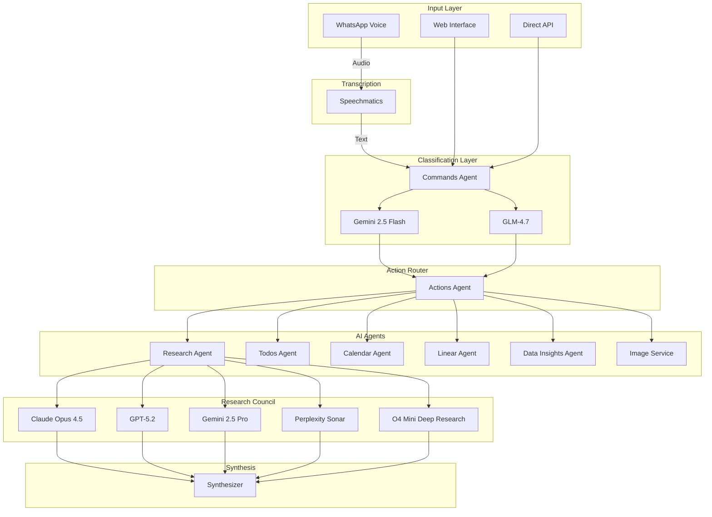
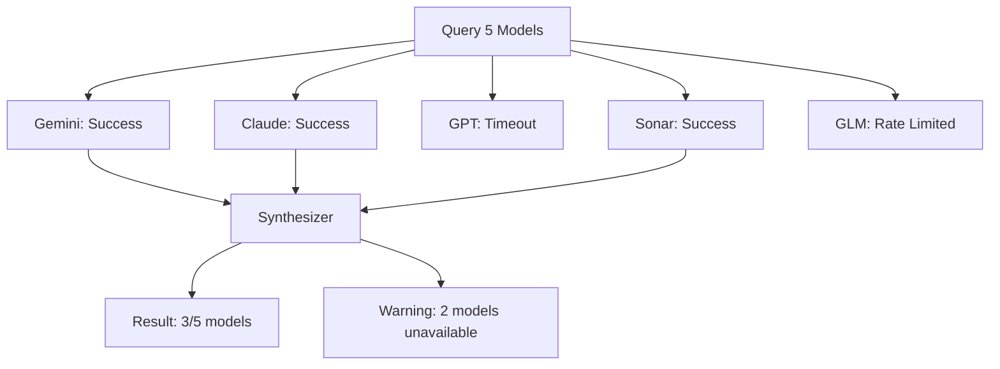

# AI Architecture

> How IntexuraOS orchestrates multiple AI providers as a council of experts.

---

## Overview

IntexuraOS treats AI models not as tools to be called, but as **team members with specialized expertise**. The architecture reflects this philosophy:

1. **No single point of AI failure**: Multiple providers ensure availability
2. **Consensus through synthesis**: Parallel queries with attributed aggregation
3. **Cost-aware routing**: Model selection based on task requirements and pricing
4. **Provider abstraction**: Unified interface across all LLM providers

---

## The Council of AI

Rather than relying on a single AI model (with its inherent biases and knowledge gaps), IntexuraOS queries **multiple LLMs in parallel** and synthesizes their responses:

1. **Parallel Querying**: Send the same research question to multiple models simultaneously
2. **Independent Verification**: Each model performs its own reasoning and web search
3. **Confidence Aggregation**: Synthesize responses with confidence scores
4. **Source Attribution**: Every claim is attributed to a specific model/source

This approach reduces hallucination risk and provides more comprehensive answers than any single model.

### Provider Integration



---

## Supported Models

### Model Selection Strategy

| Task Type            | Primary Model         | Fallback Model      | Rationale                       |
| -------------------- | --------------------- | ------------------- | ------------------------------- |
| Research Synthesis   | Claude Opus 4.5       | GPT-5.2             | Nuanced reasoning, long context |
| Quick Classification | Gemini 2.5 Flash      | GLM-4.7             | Fast, cost-effective            |
| Deep Research        | O4 Mini Deep Research | Sonar Deep Research | Agentic web search              |
| Fact Verification    | Perplexity Sonar      | Sonar Pro           | Real-time web grounding         |
| Image Generation     | DALL-E 3              | Gemini Imagen       | High quality, diverse styles    |

### Research Models (11)

Models capable of complex reasoning, web search, and multi-step analysis.

| Model                 | Provider   | Strengths                                 |
| --------------------- | ---------- | ----------------------------------------- |
| Gemini 2.5 Pro        | Google     | Long context (1M tokens), grounded search |
| Gemini 2.5 Flash      | Google     | Fast, cost-effective, good reasoning      |
| GPT-5.2               | OpenAI     | Latest OpenAI flagship, strong reasoning  |
| O4 Mini Deep Research | OpenAI     | Agentic research with tool use            |
| Claude Opus 4.5       | Anthropic  | Best reasoning, nuanced analysis          |
| Claude Sonnet 4.5     | Anthropic  | Balanced performance/cost                 |
| Sonar                 | Perplexity | Real-time web search                      |
| Sonar Pro             | Perplexity | Enhanced web search with more sources     |
| Sonar Deep Research   | Perplexity | Multi-step agentic research               |
| GLM-4.7               | Zai        | Alternative provider, good multilingual   |
| GLM-4.7-Flash         | Zai        | Fast, free model for cost-sensitive tasks |

### Fast Models (4)

Optimized for quick, low-cost operations like classification and extraction.

| Model            | Provider | Use Cases                                 |
| ---------------- | -------- | ----------------------------------------- |
| Gemini 2.5 Flash | Google   | Intent classification, title generation   |
| Gemini 2.0 Flash | Google   | API key validation, quick inference       |
| GLM-4.7-Flash    | Zai      | Free classification, cost-effective tasks |

### Image Models (2)

Text-to-image generation for cover images and visualizations.

| Model                  | Provider | Capabilities                            |
| ---------------------- | -------- | --------------------------------------- |
| GPT Image 1 (DALL-E 3) | OpenAI   | Photorealistic, artistic styles         |
| Gemini 2.5 Flash Image | Google   | Fast image generation, consistent style |

### Validation Models (6)

Cheap, fast models for API key validation and simple tasks.

| Model            | Provider   | Token Cost     |
| ---------------- | ---------- | -------------- |
| Claude Haiku 3.5 | Anthropic  | $0.80/M input  |
| Gemini 2.0 Flash | Google     | $0.075/M input |
| GPT-4o Mini      | OpenAI     | $0.15/M input  |
| Sonar            | Perplexity | $1.00/M input  |
| GLM-4.7          | Zai        | $0.60/M input  |
| GLM-4.7-Flash    | Zai        | Free           |

---

## Research Synthesis Protocol

The flagship AI capability: querying multiple models in parallel and synthesizing results.

### Execution Flow



### Research Adapters

Each LLM provider has a dedicated adapter implementing `LlmResearchProvider`:

```typescript
interface LlmResearchProvider {
  research(params: {
    query: string;
    context?: InputContext[];
    logger: Logger;
  }): Promise<Result<ResearchResult, LLMError>>;
}
```

**Adapters**:

- `GeminiAdapter` - Google AI integration
- `GptAdapter` - OpenAI integration
- `ClaudeAdapter` - Anthropic integration
- `PerplexityAdapter` - Perplexity integration (web search enabled)
- `GlmAdapter` - Zai integration

### Synthesis Algorithm

1. **Collect responses**: Wait for all models (with timeout)
2. **Parse attributions**: Extract claims with source model
3. **Aggregate themes**: Group similar claims across models
4. **Calculate confidence**: Weight by model agreement
5. **Generate summary**: Create attributed final report

---

## AI Pipeline Architecture



---

## Agent AI Capabilities

### Commands Agent

**Purpose**: Classify user intent from natural language

**AI Models**: Gemini 2.5 Flash, GLM-4.7

**Process**:

1. Receive transcribed text or typed input
2. Use structured output (JSON mode) for classification
3. Detect action type: research, todo, note, link, calendar, linear
4. Detect model preferences from explicit mentions ("use Claude", "ask GPT")

### Research Agent

**Purpose**: Deep research with multi-model synthesis

**AI Models**: All 10 research models

**Process**:

1. **Validation**: Check if query is a valid research question
2. **Context Inference**: Detect implicit context and constraints
3. **Parallel Research**: Query 3-5 models simultaneously
4. **Synthesis**: Aggregate findings with confidence scores
5. **Title Generation**: Create descriptive title
6. **Cover Image**: Generate visual representation

### Todos Agent

**Purpose**: Extract task items from natural language

**AI Models**: Gemini 2.5 Flash, GLM-4.7

**Extraction Capabilities**:

- Task title from description
- Due dates from relative expressions ("by Friday", "next week")
- Priority from context ("urgent", "when you have time")
- Sub-items from compound tasks

### Calendar Agent

**Purpose**: Parse calendar events from voice descriptions

**AI Models**: Gemini 2.5 Flash

**Extraction Capabilities**:

- Event title
- Start/end times from natural expressions
- Location
- Attendees
- Recurrence patterns

### Linear Agent

**Purpose**: Create Linear issues from natural language

**AI Models**: Gemini 2.5 Flash, GLM-4.7

**Extraction Capabilities**:

- Issue title
- Priority (0-4 scale)
- Functional requirements section
- Technical details section

### Data Insights Agent

**Purpose**: AI-powered data analysis

**AI Models**: Gemini (multiple services)

**Capabilities**:

- **Title Generation**: Descriptive names for datasets
- **Data Analysis**: Trend detection, anomaly identification
- **Chart Definition**: Suggest appropriate visualizations
- **Data Transform**: Clean and reshape data

### Image Service

**Purpose**: Generate images from text prompts

**AI Models**: DALL-E 3, Gemini Imagen

**Capabilities**:

- Cover images for research reports
- Custom thumbnails
- Artistic style variations
- Photorealistic rendering

---

## LLM Infrastructure

### Unified Client Factory

All LLM interactions go through `@intexuraos/llm-factory`:

```typescript
import { createLlmClient } from '@intexuraos/llm-factory';

const client = createLlmClient({
  provider: 'anthropic',
  model: 'claude-opus-4-5-20251101',
  apiKey: userApiKey,
});

const result = await client.generate({
  prompt: 'Analyze the following...',
  maxTokens: 4000,
});
```

### Provider Packages

| Package                        | Provider   | Capabilities                      |
| ------------------------------ | ---------- | --------------------------------- |
| `@intexuraos/infra-claude`     | Anthropic  | Chat, streaming, tool use         |
| `@intexuraos/infra-gemini`     | Google     | Chat, grounding, image generation |
| `@intexuraos/infra-gpt`        | OpenAI     | Chat, DALL-E, embeddings          |
| `@intexuraos/infra-perplexity` | Perplexity | Web search, deep research         |
| `@intexuraos/infra-glm`        | Zai        | Chat, structured output           |

### Usage Tracking

All LLM calls are tracked through the `llm-audit` package:

- Token usage (input/output)
- Cost calculation
- Model selection
- Response latency
- Error rates

Published to Pub/Sub for aggregation in `app-settings-service`.

---

## Prompt Engineering

### Structured Output

All extraction tasks use JSON mode or structured schemas:

```typescript
const extractionSchema = {
  type: 'object',
  properties: {
    title: { type: 'string', maxLength: 100 },
    priority: { type: 'integer', minimum: 0, maximum: 4 },
    valid: { type: 'boolean' },
    reasoning: { type: 'string' },
  },
  required: ['title', 'priority', 'valid', 'reasoning'],
};
```

### Few-Shot Examples

Classification prompts include examples for each action type:

```
User: "What's the best approach to microservice architecture?"
Classification: { type: "research", confidence: 0.95 }

User: "Remind me to call mom tomorrow"
Classification: { type: "todo", confidence: 0.98 }
```

### Chain-of-Thought

Research synthesis uses explicit reasoning steps:

1. Summarize each model's response
2. Identify areas of agreement
3. Note contradictions with sources
4. Calculate confidence per claim
5. Generate final synthesized answer

---

## Cost Management

### Pricing Context

Every LLM call is tracked through `@intexuraos/llm-pricing`:

```typescript
interface ModelPricing {
  inputPricePerMillion: number;
  outputPricePerMillion: number;
  imagePricePerGeneration?: number;
}

const cost = pricingContext.calculateCost({
  model: 'gemini-2.5-pro',
  inputTokens: 1500,
  outputTokens: 800,
});
```

### Model Tiering

| Tier     | Use Case                   | Cost/1M Tokens | Example Models            |
| -------- | -------------------------- | -------------- | ------------------------- |
| Premium  | Deep research, synthesis   | $15-75         | Claude Opus, GPT-5.2      |
| Standard | General queries            | $3-10          | Claude Sonnet, Gemini Pro |
| Economy  | Classification, extraction | $0.08-1        | Gemini Flash, Haiku       |

### Usage Logging

All LLM calls publish to `llm-call` Pub/Sub topic:

```typescript
interface LlmCallEvent {
  userId: string;
  model: LLMModel;
  inputTokens: number;
  outputTokens: number;
  cost: number;
  timestamp: string;
  serviceId: string;
}
```

### Caching Strategy

- **Prompt Caching**: Reuse system prompts across requests
- **Result Caching**: Cache deterministic outputs (title generation)
- **Context Caching**: Preserve conversation context for follow-ups

---

## Error Handling

### Graceful Degradation

Research synthesis handles partial failures:



### Error Categories

| Error Type         | Handling                          |
| ------------------ | --------------------------------- |
| `NO_API_KEY`       | Prompt user to configure API key  |
| `RATE_LIMITED`     | Retry with exponential backoff    |
| `TIMEOUT`          | Continue with available responses |
| `INVALID_RESPONSE` | Attempt repair prompt             |
| `PARSE_ERROR`      | Retry with repair prompt          |

---

## Security

### API Key Management

User API keys are encrypted at rest:

```
User Input → AES-256-GCM Encryption → Firestore Storage
                    ↓
            Runtime Decryption → LLM API Call
                    ↓
            Immediate Memory Clear
```

### Key Validation

Before storing, keys are validated against their provider:

```typescript
const validationResult = await llmValidator.validateKey({
  provider: 'google',
  apiKey: userProvidedKey,
});
```

### Rate Limiting

- Per-user rate limits for LLM calls
- Provider-level quotas respected
- Graceful degradation when limits hit

### Content Filtering

- Input validation before LLM calls
- Output sanitization for user display
- PII detection in research outputs

---

## Packages

| Package                        | Purpose                      |
| ------------------------------ | ---------------------------- |
| `@intexuraos/llm-contract`     | Shared types and interfaces  |
| `@intexuraos/llm-factory`      | Client creation factory      |
| `@intexuraos/llm-pricing`      | Cost calculation             |
| `@intexuraos/llm-common`       | Shared prompts and utilities |
| `@intexuraos/llm-audit`        | Usage tracking               |
| `@intexuraos/infra-gemini`     | Google AI adapter            |
| `@intexuraos/infra-gpt`        | OpenAI adapter               |
| `@intexuraos/infra-claude`     | Anthropic adapter            |
| `@intexuraos/infra-perplexity` | Perplexity adapter           |
| `@intexuraos/infra-glm`        | Zai adapter                  |

---

## Future Directions

1. **Streaming responses**: Real-time synthesis as models respond
2. **Model ranking**: Learn which models perform best for specific topics
3. **Custom fine-tuning**: User-specific model preferences
4. **Local models**: Support for self-hosted LLMs
5. **Multimodal input**: Image and document analysis

---

**Last updated:** 2026-01-19
