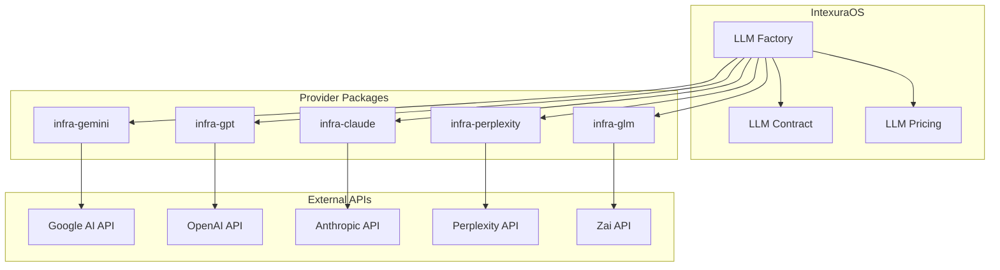
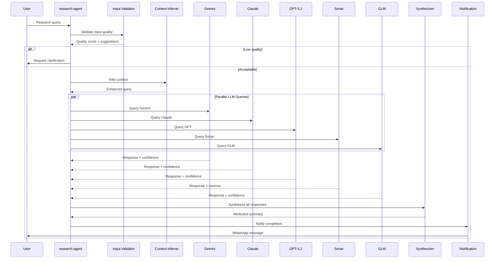
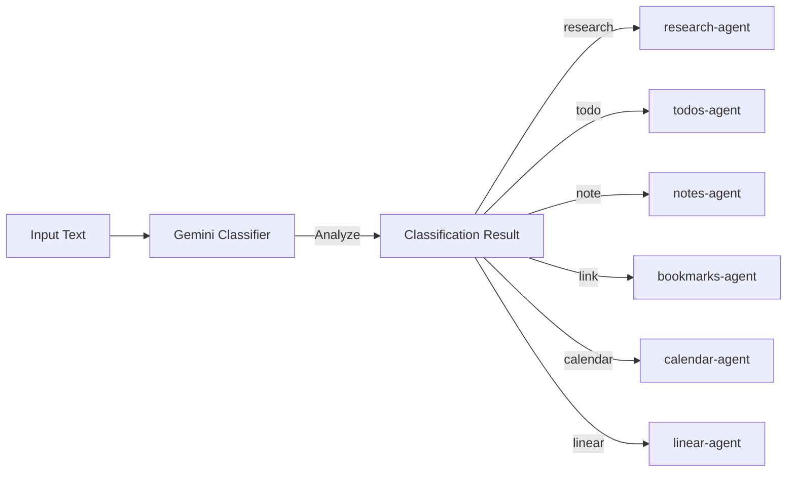
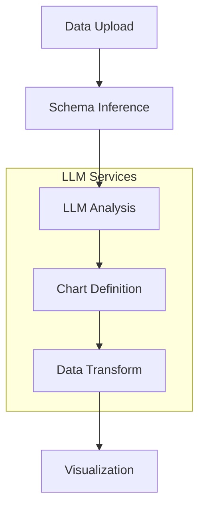
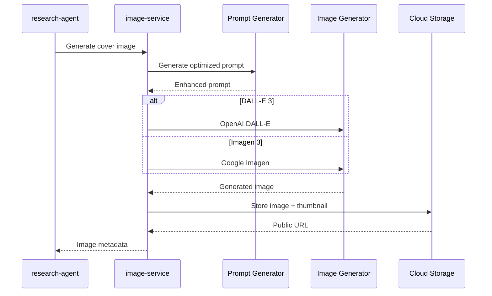
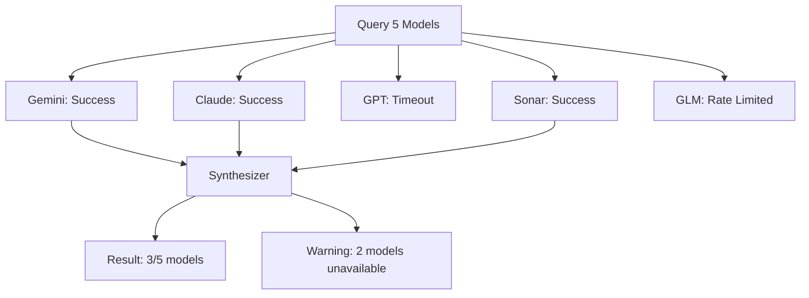

# AI Architecture

> How IntexuraOS orchestrates multiple AI providers as a council of experts.

---

## Overview

IntexuraOS treats AI models not as tools to be called, but as **team members with specialized expertise**. The architecture reflects this philosophy:

1. **No single point of AI failure**: Multiple providers ensure availability
2. **Consensus through synthesis**: Parallel queries with attributed aggregation
3. **Cost-aware routing**: Model selection based on task requirements and pricing
4. **Provider abstraction**: Unified interface across all LLM providers

---

## The Council of AI

### Provider Integration



### Model Categories

| Category | Models | Use Case |
| -------- | ------ | -------- |
| **Research** | Gemini 2.5 Pro/Flash, GPT-5.2, o4-mini, Claude Opus/Sonnet, Sonar variants, GLM-4.7 | Deep analysis, synthesis |
| **Classification** | Gemini 2.5 Flash, GLM-4.7 | Intent detection, routing |
| **Image** | DALL-E 3, Imagen 3 | Cover generation |
| **Validation** | Haiku 3.5, Gemini 2.0 Flash, GPT-4o Mini, Sonar, GLM-4.7 | API key testing |

---

## Research Synthesis Protocol

The flagship AI capability: querying multiple models in parallel and synthesizing results.

### Execution Flow



### Research Adapters

Each LLM provider has a dedicated adapter implementing `LlmResearchProvider`:

```typescript
interface LlmResearchProvider {
  research(params: {
    query: string;
    context?: InputContext[];
    logger: Logger;
  }): Promise<Result<ResearchResult, LLMError>>;
}
```

**Adapters**:
- `GeminiAdapter` - Google AI integration
- `GptAdapter` - OpenAI integration
- `ClaudeAdapter` - Anthropic integration
- `PerplexityAdapter` - Perplexity integration (web search enabled)
- `GlmAdapter` - Zai integration

### Synthesis Algorithm

1. **Collect responses**: Wait for all models (with timeout)
2. **Parse attributions**: Extract claims with source model
3. **Aggregate themes**: Group similar claims across models
4. **Calculate confidence**: Weight by model agreement
5. **Generate summary**: Create attributed final report

---

## Intent Classification

The commands-agent uses AI to route natural language to action types.

### Classification Flow



### Classifier Prompt Engineering

The classifier uses a structured prompt from `@intexuraos/llm-common`:

```typescript
const prompt = buildCommandClassifierPrompt({
  input: userMessage,
  history: recentCommands,
  userPreferences: modelPreferences,
});
```

**Output Schema**:
```json
{
  "actionType": "research | todo | note | link | calendar | linear",
  "confidence": 0.0-1.0,
  "extractedData": {
    "title": "...",
    "dueDate": "...",
    "priority": "..."
  },
  "modelPreference": "gemini-2.5-pro"
}
```

---

## Data Intelligence

The data-insights-agent uses LLMs for data analysis.

### Analysis Pipeline



### AI Services

1. **Data Analysis Service**: Analyzes data structure and suggests insights
2. **Chart Definition Service**: Recommends visualization types
3. **Data Transform Service**: Generates data transformations for charts
4. **Title Generation Service**: Creates descriptive names
5. **Feed Name Generation Service**: Names composite data feeds

---

## Image Generation

The image-service generates cover images for research.

### Generation Flow



### Prompt Enhancement

Before generating images, prompts are enhanced:

```typescript
const enhancedPrompt = await promptGenerator.enhance({
  topic: research.title,
  style: 'professional',
  aspectRatio: '16:9',
});
```

---

## Cost Management

### Pricing Context

Every LLM call is tracked through `@intexuraos/llm-pricing`:

```typescript
interface ModelPricing {
  inputPricePerMillion: number;
  outputPricePerMillion: number;
  imagePricePerGeneration?: number;
}

const cost = pricingContext.calculateCost({
  model: 'gemini-2.5-pro',
  inputTokens: 1500,
  outputTokens: 800,
});
```

### Usage Logging

All LLM calls publish to `llm-call` Pub/Sub topic:

```typescript
interface LlmCallEvent {
  userId: string;
  model: LLMModel;
  inputTokens: number;
  outputTokens: number;
  cost: number;
  timestamp: string;
  serviceId: string;
}
```

---

## Provider Abstraction

### LLM Factory

The `@intexuraos/llm-factory` package provides a unified interface:

```typescript
const client = createLlmClient({
  provider: 'google',
  model: 'gemini-2.5-flash',
  apiKey: decryptedKey,
});

const result = await client.generate(prompt);
```

### LLM Contract

All providers implement the same contract:

```typescript
interface LlmGenerateClient {
  generate(prompt: string): Promise<Result<GenerateResult, LLMError>>;
}

interface GenerateResult {
  content: string;
  usage: TokenUsage;
  model: string;
}
```

---

## Error Handling

### Graceful Degradation

Research synthesis handles partial failures:



### Error Categories

| Error Type | Handling |
| ---------- | -------- |
| `NO_API_KEY` | Prompt user to configure API key |
| `RATE_LIMITED` | Retry with exponential backoff |
| `TIMEOUT` | Continue with available responses |
| `INVALID_RESPONSE` | Attempt repair prompt |
| `PARSE_ERROR` | Retry with repair prompt |

---

## Security

### API Key Management

User API keys are encrypted at rest:

```
User Input → AES-256-GCM Encryption → Firestore Storage
                    ↓
            Runtime Decryption → LLM API Call
                    ↓
            Immediate Memory Clear
```

### Key Validation

Before storing, keys are validated against their provider:

```typescript
const validationResult = await llmValidator.validateKey({
  provider: 'google',
  apiKey: userProvidedKey,
});
```

---

## Packages

| Package | Purpose |
| ------- | ------- |
| `@intexuraos/llm-contract` | Shared types and interfaces |
| `@intexuraos/llm-factory` | Client creation factory |
| `@intexuraos/llm-pricing` | Cost calculation |
| `@intexuraos/llm-common` | Shared prompts and utilities |
| `@intexuraos/llm-audit` | Usage tracking |
| `@intexuraos/infra-gemini` | Google AI adapter |
| `@intexuraos/infra-gpt` | OpenAI adapter |
| `@intexuraos/infra-claude` | Anthropic adapter |
| `@intexuraos/infra-perplexity` | Perplexity adapter |
| `@intexuraos/infra-glm` | Zai adapter |

---

## Future Directions

1. **Streaming responses**: Real-time synthesis as models respond
2. **Model ranking**: Learn which models perform best for specific topics
3. **Custom fine-tuning**: User-specific model preferences
4. **Local models**: Support for self-hosted LLMs
5. **Multimodal input**: Image and document analysis

---

**Last updated:** 2026-01-19
