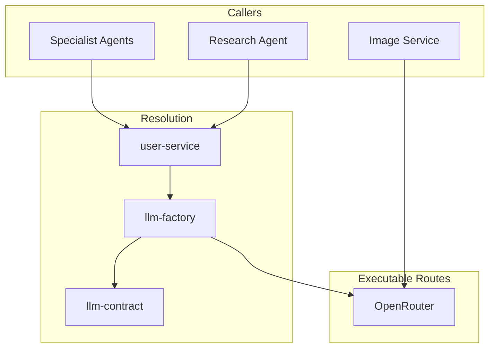
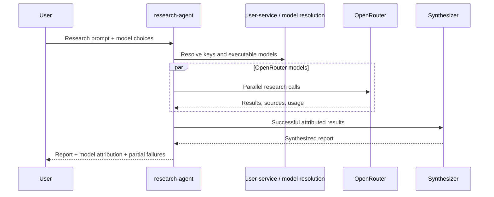

# AI Architecture

> How IntexuraOS routes model traffic, runs multi-model research, and attributes usage.

**Version 3.1.0** — August 18, 2026

## Routing Invariants

1. **Platform traffic uses OpenRouter.** Defaults, fallbacks, classification, routing, and other platform-owned calls use `INTEXURAOS_OPENROUTER_APP_API_KEY`.
2. **Google-family models are OpenRouter models.** Every executable Google model ID has the form `or:google/...`; IntexuraOS does not execute direct Google/Gemini LLM requests.
3. **OpenRouter is the only configurable LLM key.** A user key takes precedence; `INTEXURAOS_OPENROUTER_APP_API_KEY` is the platform fallback.
4. **Images and embeddings use OpenRouter.** Public/persisted aliases (`gpt-image-1`, `text-embedding-3-small`) stay unchanged, while usage records carry `or:openai/...` evidence IDs.
5. **Historical data stays readable.** Stored research records can contain retired model identifiers, but retry and new-execution schemas accept only current executable models.
6. **Google OAuth is separate.** Google OAuth tokens authorize Calendar operations and are not LLM credentials.

## Execution Architecture


```mermaid
graph TB
    subgraph "Callers"
        Agents[Specialist Agents]
        Research[Research Agent]
        Images[Image Service]
    end

    subgraph "Resolution"
        UserService[user-service]
        Factory[llm-factory]
        Contract[llm-contract]
    end

    subgraph "Executable Routes"
        OpenRouter[OpenRouter]
    end

    Agents --> UserService
    Research --> UserService
    UserService --> Factory
    Factory --> Contract
    Factory --> OpenRouter
    Images --> OpenRouter
```

`@intexuraos/llm-factory` is the executable boundary. It routes `or:` identifiers to OpenRouter and rejects direct-provider model identifiers.

## Model Selection

### Platform Defaults

The canonical platform fallback is `DEFAULT_PLATFORM_LLM_MODEL`, currently MiniMax M3 through OpenRouter. Feature-specific selectors may expose other curated OpenRouter models, including Google-family models such as `or:google/gemini-3.6-flash`.

### Default and Fallback Preferences

User-service stores a default model and an optional fallback. Resolution follows this order:

1. Normalize a retired direct-Google preference to the platform OpenRouter default.
2. Use the user's OpenRouter key when available.
3. Otherwise use the platform OpenRouter key.
4. Return a typed error if neither the selected route nor the platform fallback can be resolved.

OpenRouter-backed defaults do not require every user to maintain a separate key. Users can still add their own OpenRouter key.

### Research Models

New Research execution accepts at most six unique curated `or:<vendor>/<model>` entries from the OpenRouter allowlist.

Executable schemas exclude raw Google models. Read schemas remain intentionally broader so historical reports can be displayed and guarded without silently dropping old identifiers.

### Image Models

| Stage             | Provider   | Public model alias |
| ----------------- | ---------- | ------------------ |
| Prompt generation | OpenRouter | `gpt-4.1`          |
| Image generation  | OpenRouter | `gpt-image-1`      |

The aliases remain stable for API and stored-data compatibility; upstream requests use `openai/gpt-4.1` and `openai/gpt-image-1` through OpenRouter.

## Research Council

Research Agent can query several independently selected models and synthesize their results with attribution.


```mermaid
sequenceDiagram
    participant User
    participant Research as research-agent
    participant Resolve as user-service / model resolution
    participant OR as OpenRouter
    participant Synth as Synthesizer

    User->>Research: Research prompt + model choices
    Research->>Resolve: Resolve keys and executable models
    par OpenRouter models
        Research->>OR: Parallel research calls
        OR-->>Research: Results, sources, usage
    end
    Research->>Synth: Successful attributed results
    Synth-->>Research: Synthesized report
    Research-->>User: Report + model attribution + partial failures
```

The pipeline continues when a subset of models fails. Failed model IDs are retained in the result so the user can inspect the partial outcome. Retrying a historical research record is blocked when its stored identifiers are no longer executable.

## Agent Usage

| Component          | LLM role                                      | Resolution rule                                      |
| ------------------ | --------------------------------------------- | ---------------------------------------------------- |
| Intex Agent        | Tool selection and conversational responses   | Curated OpenRouter models                            |
| Calendar Agent     | Natural-language event parsing                | User-service client; OpenRouter platform fallback    |
| Linear Agent       | Issue extraction, titles, pruning             | User-service client; OpenRouter platform fallback    |
| Hellscript Agent   | Intent interpretation and draft generation    | User-service client; OpenRouter platform fallback    |
| Web Agent          | Page summarization                            | User-service client; OpenRouter platform fallback    |
| Research Agent     | Parallel research and synthesis               | Curated OpenRouter allowlist, maximum six models     |
| Image Service      | Prompt and image generation                   | OpenRouter with stable public model aliases          |

## Factory Contract

```typescript
import { createLlmClient } from '@intexuraos/llm-factory';
import { createOpenRouterModelId } from '@intexuraos/llm-contract';

const client = createLlmClient({
  apiKey: openRouterApiKey,
  model: createOpenRouterModelId('google/gemini-3.6-flash'),
  userId,
  logger,
  usageSink,
});

const result = await client.generate(prompt, {
  promptType: 'research-synthesis',
});
```

The `or:` prefix is part of the routing contract: it selects the OpenRouter adapter and strips the prefix only when constructing the upstream OpenRouter request.

## Usage and Cost Attribution

Every executable call receives a semantic `promptType` and reports usage through an explicit `UsageSink` to `llm-usage-service`. Records include:

- service and component;
- user or system ownership;
- model and provider route;
- input and output tokens;
- calculated and provider-reported cost when available;
- correlation identifiers for research, sessions, tasks, and requests.

For OpenRouter traffic, provider-reported cost is preferred. Curated allowlists contain fallback pricing for cases where live catalog or per-call cost data is unavailable. An `or:google/...` request is billed and audited as OpenRouter traffic; direct Google API pricing is not used for that route.

## Credentials and Security

The user OpenRouter key is encrypted with AES-256-GCM in user-service and decrypted only for request-time client construction. The platform OpenRouter key lives in Secret Manager and is injected only into services that need the shared route. Retired direct-provider fields remain readable only for compatibility and are not used by active clients; no historical-data migration is required.

Direct Google LLM keys cannot be added or tested. The compatibility response field for a retired Google key is `null`, while deletion remains accepted so dormant encrypted values can be removed safely.

Google Calendar OAuth follows a separate token lifecycle: OAuth access and refresh tokens remain encrypted, are refreshed by user-service, and are returned only through the Calendar-specific internal endpoint.

## Packages

| Package                        | Purpose                                                        |
| ------------------------------ | -------------------------------------------------------------- |
| `@intexuraos/llm-contract`     | Model IDs, provider mapping, executable type guards            |
| `@intexuraos/llm-factory`      | Executable routing and unified generation clients              |
| `@intexuraos/infra-openrouter` | OpenRouter client, allowlists, live/fallback cost calculation   |
| `@intexuraos/infra-claude`     | Retained direct Anthropic adapter; inactive for app execution  |
| `@intexuraos/infra-gpt`        | Retained direct OpenAI adapter; inactive for app execution     |
| `@intexuraos/infra-perplexity` | Retained direct Perplexity adapter; inactive for app execution |
| `@intexuraos/llm-pricing`      | Usage sinks and cost attribution contracts                     |
| `@intexuraos/llm-prompts`      | Versioned prompts, schemas, and parsers                         |
| `@intexuraos/llm-utils`        | Response parsing and redaction helpers                         |

## Change Checklist

When adding or changing an LLM route:

1. Keep platform-owned traffic on OpenRouter.
2. Use `or:google/...` for every Google-family model.
3. Update the relevant allowlist, selector, executable schema, and tests together.
4. Keep stored-response schemas broad enough for historical records.
5. Add or update usage attribution and fallback pricing.
6. Keep image and embedding public/persisted aliases stable while routing execution through OpenRouter.
7. Do not change Google OAuth Calendar behavior while changing LLM routing.

---

**Last updated:** 2026-08-18 (v3.1.0)
