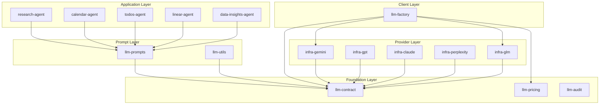

# LLM Packages Reference

> Complete reference for all LLM-related packages in IntexuraOS.

---

## Overview

IntexuraOS uses a layered architecture for LLM operations, separating concerns across multiple packages:



---

## Package Catalog

### Foundation Packages

#### `@intexuraos/llm-contract`

**Purpose:** Shared types, model definitions, and interfaces.

| Export                  | Description                               |
| ----------------------- | ----------------------------------------- |
| `LlmModels`             | All supported model identifiers           |
| `LlmProviders`          | Provider constants (Google, OpenAI, etc.) |
| `getProviderForModel()` | Map model to provider                     |
| `ModelPricing`          | Pricing structure type                    |
| `LLMError`              | Standardized error type                   |

```typescript
import { LlmModels, getProviderForModel } from '@intexuraos/llm-contract';

const model = LlmModels.Gemini25Flash;
const provider = getProviderForModel(model); // 'google'
```

#### `@intexuraos/llm-pricing`

**Purpose:** Token cost calculation and usage tracking.

| Export                | Description                      |
| --------------------- | -------------------------------- |
| `calculateCost()`     | Calculate cost from token counts |
| `createUsageLogger()` | Create usage tracking logger     |
| `ModelPricing`        | Pricing configuration type       |

```typescript
import { calculateCost } from '@intexuraos/llm-pricing';

const cost = calculateCost({
  inputTokens: 1000,
  outputTokens: 500,
  pricing: { inputPricePerMillion: 0.075, outputPricePerMillion: 0.3 },
});
```

#### `@intexuraos/llm-audit`

**Purpose:** Usage tracking and audit logging via Pub/Sub.

| Export              | Description                     |
| ------------------- | ------------------------------- |
| `LlmAuditPublisher` | Pub/Sub publisher for LLM calls |
| `LlmCallEvent`      | Event schema type               |

---

### Prompt Package

#### `@intexuraos/llm-prompts`

**Purpose:** All prompt builders, schemas, parsers, and type guards.

**Domains:**

| Domain           | Prompts                                                                                     | Purpose                    |
| ---------------- | ------------------------------------------------------------------------------------------- | -------------------------- |
| `generation`     | `titlePrompt`, `labelPrompt`, `feedNamePrompt`                                              | Generate text from content |
| `classification` | `commandClassifierPrompt`, `calendarActionExtractionPrompt`, `linearActionExtractionPrompt` | Classify and extract       |
| `validation`     | `inputQualityPrompt`, `inputImprovementPrompt`                                              | Validate input quality     |
| `research`       | `buildResearchPrompt`, `buildInferResearchContextPrompt`                                    | Research operations        |
| `synthesis`      | `buildSynthesisPrompt`, `buildInferSynthesisContextPrompt`                                  | Multi-model synthesis      |
| `dataInsights`   | `dataAnalysisPrompt`, `chartDefinitionPrompt`, `dataTransformPrompt`                        | Data analysis              |
| `image`          | `thumbnailPrompt`, `generateThumbnailPrompt`                                                | Image generation           |
| `approvals`      | `approvalIntentPrompt`                                                                      | Approval classification    |
| `todos`          | `itemExtractionPrompt`                                                                      | Todo extraction            |

**Zod Schemas:**

- `ResearchContextSchema`, `SynthesisContextSchema`
- `DomainSchema`, `ModeSchema`
- All context validation schemas

See [llm-prompts README](../../packages/llm-prompts/README.md) for full catalog.

---

### Utility Package

#### `@intexuraos/llm-utils`

**Purpose:** Redaction and parse error utilities.

| Export                  | Description                         |
| ----------------------- | ----------------------------------- |
| `redactToken()`         | Redact API keys for logging         |
| `redactObject()`        | Recursively redact sensitive fields |
| `SENSITIVE_FIELDS`      | List of auto-redacted field names   |
| `createLlmParseError()` | Create standardized parse errors    |
| `logLlmParseError()`    | Log parse errors consistently       |

See [llm-utils README](../../packages/llm-utils/README.md) for details.

---

### Client Layer

#### `@intexuraos/llm-factory`

**Purpose:** Unified client creation across providers.

| Export                  | Description                     |
| ----------------------- | ------------------------------- |
| `createLlmClient()`     | Create provider-specific client |
| `isSupportedProvider()` | Check provider support          |
| `LlmGenerateClient`     | Client interface                |

**Supported Providers:**

- Google (Gemini)
- Zai (GLM)

See [llm-factory README](../../packages/llm-factory/README.md) for details.

---

### Provider Packages

All provider packages implement the same interface but wrap different APIs.

| Package                        | Provider   | Models                  |
| ------------------------------ | ---------- | ----------------------- |
| `@intexuraos/infra-gemini`     | Google AI  | Gemini 2.5 Flash, Pro   |
| `@intexuraos/infra-gpt`        | OpenAI     | GPT-5.2, O4 Mini        |
| `@intexuraos/infra-claude`     | Anthropic  | Claude Opus 4.5, Sonnet |
| `@intexuraos/infra-perplexity` | Perplexity | Sonar, Sonar Pro        |
| `@intexuraos/infra-glm`        | Zai        | GLM-4.7, GLM-4.7-Flash  |

---

## Dependency Graph

```
llm-contract (foundation - no LLM deps)
    ↑
llm-pricing (depends on llm-contract)
    ↑
llm-prompts (depends on llm-contract, common-core, zod)
    ↑
llm-utils (depends on common-core)
    ↑
llm-factory (depends on llm-contract, llm-pricing, infra-*)
    ↑
infra-* (depend on llm-contract, llm-prompts)
    ↑
apps/* (depend on all above as needed)
```

**Key Rules:**

- `llm-contract` has NO dependencies on other LLM packages
- `llm-prompts` depends only on `llm-contract` (not provider packages)
- Provider packages (`infra-*`) depend on `llm-prompts` for prompts
- Apps compose all layers as needed

---

## Adding New Prompts

1. **Choose the domain** (generation, classification, research, etc.)

2. **Create the prompt file:**

   ```
   packages/llm-prompts/src/<domain>/<promptName>.ts
   ```

3. **Implement the PromptBuilder interface:**

   ```typescript
   import { type PromptBuilder } from '../shared/types.js';

   export interface MyPromptInput {
     content: string;
     options?: string[];
   }

   export interface MyPromptDeps {
     examples?: string[];
   }

   export const myPrompt: PromptBuilder<MyPromptInput> = {
     build: (input: MyPromptInput, deps?: MyPromptDeps): string => {
       return `Process this: ${input.content}`;
     },
   };
   ```

4. **Add tests** with 95% coverage:

   ```
   packages/llm-prompts/src/<domain>/__tests__/<promptName>.test.ts
   ```

5. **Export from domain index:**

   ```typescript
   // packages/llm-prompts/src/<domain>/index.ts
   export { myPrompt, type MyPromptInput, type MyPromptDeps } from './myPrompt.js';
   ```

6. **Verify:** `pnpm run ci:tracked`

---

## Adding New Models

1. **Update `llm-contract`:**

   ```typescript
   // packages/llm-contract/src/models.ts
   export const LlmModels = {
     // ... existing models
     MyNewModel: 'my-new-model-v1' as const,
   };
   ```

2. **Add to provider mapping:**

   ```typescript
   // packages/llm-contract/src/providers.ts
   export function getProviderForModel(model: LLMModel): LlmProvider {
     // Add case for new model
   }
   ```

3. **Add pricing** in `llm-pricing` or dynamically from `app-settings-service`

4. **Update provider package** (`infra-*`) if needed

5. **Update `llm-factory`** if adding new provider

---

## Common Patterns

### Result Types

All LLM operations return `Result<T, E>`:

```typescript
const result = await client.generate(prompt);
if (!result.ok) {
  logger.error({ error: result.error }, 'LLM call failed');
  return { ok: false, error: result.error };
}
return { ok: true, value: result.value.content };
```

### Prompt Building

Prompts follow the builder pattern:

```typescript
const prompt = myPrompt.build(input, deps);
const response = await client.generate(prompt);
```

### Response Validation

Use Zod schemas for structured responses:

```typescript
import { ResearchContextSchema } from '@intexuraos/llm-prompts';

const parsed = JSON.parse(response);
const result = ResearchContextSchema.safeParse(parsed);
if (!result.success) {
  // Attempt repair or return error
}
```

---

**Related:**

- [AI Architecture](./ai-architecture.md) - High-level AI design
- [LLM Response Validation](../patterns/llm-response-validation.md) - Validation patterns

**Last updated:** 2026-01-24
