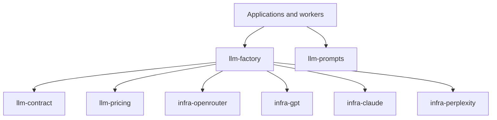

# LLM Packages Reference

> Current package boundaries and routing rules for LLM operations.

## Architecture


```mermaid
graph TB
    A["Applications and workers"] --> F["llm-factory"]
    A --> P["llm-prompts"]
    F --> C["llm-contract"]
    F --> R["llm-pricing"]
    F --> O["infra-openrouter"]
    F --> GPT["infra-gpt"]
    F --> CL["infra-claude"]
    F --> PX["infra-perplexity"]
```

## Routing rule

Platform-owned LLM calls use OpenRouter and `INTEXURAOS_OPENROUTER_APP_API_KEY`. A Google-hosted model is valid only through an `or:google/...` identifier. Raw `gemini-*` identifiers and direct Google API keys are rejected by `llm-factory`.

## Package catalog

| Package | Responsibility |
| --- | --- |
| `@intexuraos/llm-contract` | Model identifiers, provider mapping, shared LLM types |
| `@intexuraos/llm-pricing` | Usage and cost reporting |
| `@intexuraos/llm-prompts` | Central prompt builders and parsers |
| `@intexuraos/llm-utils` | Redaction and parse-error helpers |
| `@intexuraos/llm-factory` | Fail-closed provider routing and client construction |
| `@intexuraos/infra-openrouter` | OpenRouter generation, research, and tool-calling clients |
| `@intexuraos/infra-gpt` | Direct OpenAI client for supported OpenAI-only features |
| `@intexuraos/infra-claude` | Direct Anthropic client |
| `@intexuraos/infra-perplexity` | Direct Perplexity research client |

## Core invariants

1. `llm-contract` does not depend on provider packages.
2. `llm-prompts` does not instantiate provider clients.
3. Applications construct LLM clients through `llm-factory` or a deliberately scoped provider adapter.
4. Google-hosted models are routed through OpenRouter; no direct Google adapter exists.
5. Every production call supplies a `UsageSink` and stable `promptType`.

## Adding a model

1. Add the model to the curated contract or OpenRouter allowlist.
2. Add pricing and display metadata.
3. Add factory routing tests, including a fail-closed test for unsupported providers.
4. Add service-level tests for the intended operation.
5. Run `pnpm run ci:tracked`.

## Adding a prompt

1. Add a typed builder under `packages/llm-prompts/src/<domain>/`.
2. Add parser/schema tests for structured output.
3. Export it from the domain index.
4. Use a stable `promptType` at the client call site.

## Example

```ts
const client = createLlmClient({
  apiKey: openRouterApiKey,
  model: 'or:google/gemini-3.6-flash',
  userId,
  logger,
  usageSink,
});

const result = await client.generate(prompt, { promptType: 'research-title' });
```

See [AI Architecture](./ai-architecture.md) and [LLM Response Validation](../patterns/llm-response-validation.md).
