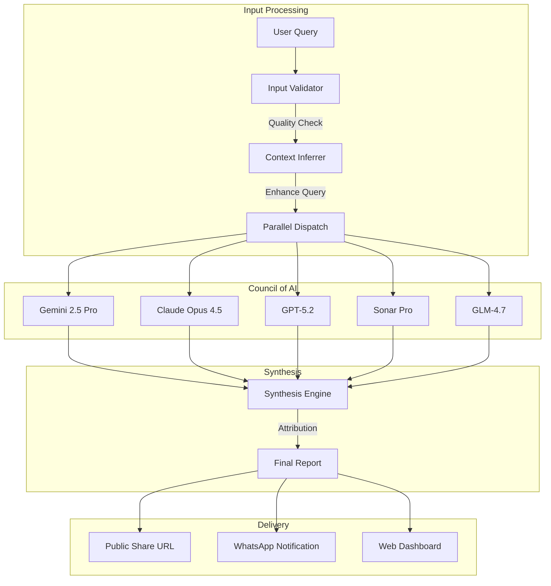
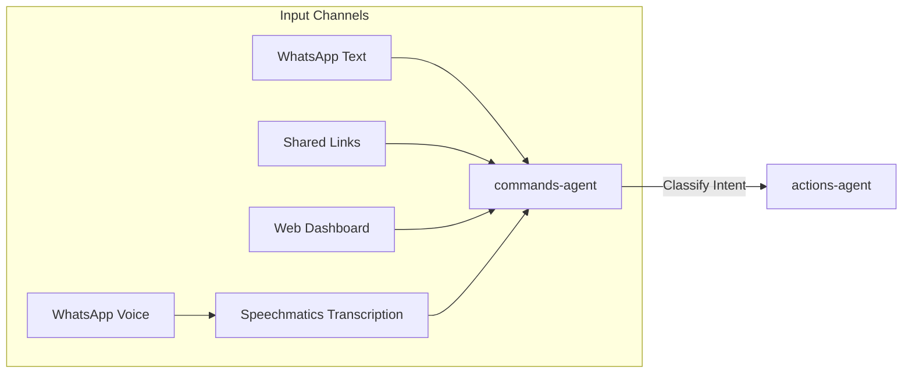

# IntexuraOS Platform Overview

> **The AI-Native Personal Operating System** — An autonomous agent platform that transforms fragmented information into structured intelligence.

**Version 2.0.0** — January 24, 2026

---

## Vision: Intelligence as Infrastructure

IntexuraOS reimagines personal productivity as an **AI-first system**. Instead of building another app that uses AI as a feature, IntexuraOS builds AI agents that use apps as tools.

**The Core Insight**: Your brain excels at creative thinking and decision-making. It struggles with remembering, scheduling, aggregating, and cross-referencing. IntexuraOS handles the cognitive load while you remain the commander.

---

## What's New in v2.0.0

### WhatsApp Approval Workflow

Approve or reject actions directly from WhatsApp using:

- **Text replies** — "Yes", "Ok", "Reject" with LLM-based intent classification
- **Emoji reactions** — 👍 to approve, 👎 to reject

### Calendar Preview Before Commit

See exactly what will be created before approving calendar events:

- Event title, time, duration, and all-day detection
- Preview generation via async Pub/Sub workflow
- Users approve with full visibility

### Natural Language Model Selection

Specify LLM models directly in your WhatsApp messages:

- "Research AI using Claude and GPT"
- "Research with all models except Perplexity"
- "Synthesize with Gemini Pro"

### LLM Package Restructuring

Modular architecture with clear separation of concerns:

- `llm-factory` — Provider creation and configuration
- `llm-prompts` — All prompt templates and builders with Zod validation
- `llm-utils` — Shared utilities (redaction, error parsing)

### Linear Board Redesign

New 3-column layout optimized for workflow visibility:

- **Planning** — Todo + Backlog (stacked)
- **In Progress** — In Progress → In Review → To Test
- **Recently Closed** — Done (last 7 days)

---

## The AI Stack

### Multi-Model Intelligence Layer

IntexuraOS integrates with **5 AI providers** and **17 models**, treating them as a **council of experts** rather than a single oracle:

| Provider   | Models                                      | Capabilities                                  |
| ---------- | ------------------------------------------- | --------------------------------------------- |
| Google     | Gemini 2.5 Pro, Flash, Flash-Image          | Reasoning, classification, images             |
| OpenAI     | GPT-5.2, o4-mini-deep-research, GPT Image 1 | Deep research, synthesis, images              |
| Anthropic  | Claude Opus 4.5, Sonnet 4.5, Haiku 3.5      | Analysis, research, validation                |
| Perplexity | Sonar, Sonar Pro, Sonar Deep Research       | Web search, real-time information             |
| Zai        | GLM-4.7, GLM-4.7-Flash                      | Multilingual, free tier (v2.0.0: Flash added) |

### Intelligent Routing

The **commands-agent** uses Gemini 2.5 Flash to classify natural language into action types with a **5-step decision tree** (v2.0.0):

```
"Schedule a call with the team for Tuesday at 3pm"
    → calendar action (confidence: 0.94)

"Remind me to review the quarterly report"
    → todo action (confidence: 0.91)

"What are the latest developments in quantum computing?"
    → research action (confidence: 0.97)

"Save bookmark https://research-world.com"
    → link action (v2.0.0: URL keywords ignored, explicit intent detected)
```

**v2.0.0 Classification Improvements:**

- URL keyword isolation — keywords inside URLs don't affect classification
- Explicit intent priority — "save bookmark" overrides incidental keywords
- Polish language support for command phrases

### Research Synthesis Protocol

The **research-agent** implements a unique **parallel consensus** protocol:



---

## Agent Architecture

IntexuraOS deploys **18 specialized microservices**, each with a distinct AI-powered role:

### AI Agents (Primary Intelligence)

| Agent                   | AI Capabilities                                                                 |
| ----------------------- | ------------------------------------------------------------------------------- |
| **research-agent**      | Multi-model orchestration, parallel queries, synthesis, Zod validation (v2.0.0) |
| **commands-agent**      | 5-step classification, URL isolation, explicit intent detection (v2.0.0)        |
| **data-insights-agent** | Data analysis, chart generation, trend detection via LLM                        |
| **bookmarks-agent**     | AI summarization with WhatsApp delivery, language preservation (v2.0.0)         |
| **todos-agent**         | Natural language task extraction, priority inference                            |
| **calendar-agent**      | Preview generation before commit, duration/all-day detection (v2.0.0)           |
| **linear-agent**        | 3-column dashboard, Todo/To Test categories (v2.0.0)                            |
| **notes-agent**         | Content structuring, tag inference                                              |
| **web-agent**           | Separated crawling from LLM summarization, parser+repair pattern (v2.0.0)       |

### Infrastructure Services

| Service                          | Purpose                                                                     |
| -------------------------------- | --------------------------------------------------------------------------- |
| **actions-agent**                | Atomic status transitions, race condition prevention via Firestore (v2.0.0) |
| **image-service**                | GPT Image 1 & Gemini Flash Image image generation                           |
| **whatsapp-service**             | Approval via replies/reactions, OutboundMessage correlation (v2.0.0)        |
| **user-service**                 | Rate limit detection precedence, API key validation (v2.0.0)                |
| **mobile-notifications-service** | Push notifications, device management                                       |
| **notion-service**               | Notion integration, sync management                                         |
| **promptvault-service**          | Prompt template versioning                                                  |
| **app-settings-service**         | LLM pricing, usage analytics                                                |
| **api-docs-hub**                 | OpenAPI documentation aggregator                                            |

---

## The Capture-to-Action Pipeline

### Phase 1: Multi-Channel Ingestion



- **WhatsApp Voice**: Audio transcribed via Speechmatics API
- **WhatsApp Text**: Direct message parsing
- **Shared Links**: OpenGraph extraction + AI summarization
- **Web Dashboard**: Direct action creation

### Phase 2: Intelligent Classification

The **commands-agent** analyzes input to determine:

1. **Action Type**: research, todo, note, link, calendar, linear
2. **Confidence Score**: 0.0 - 1.0 (low confidence = draft for review)
3. **Model Preference**: User's preferred LLM for this task type
4. **Context Extraction**: Dates, priorities, entities

### Phase 3: Specialized Execution

Each agent type executes domain-specific logic:

| Action Type | Agent           | AI Operations                                     |
| ----------- | --------------- | ------------------------------------------------- |
| Research    | research-agent  | Parallel LLM queries, synthesis, cover generation |
| Todo        | todos-agent     | Item extraction, priority inference               |
| Note        | notes-agent     | Content structuring                               |
| Link        | bookmarks-agent | Summarization, metadata extraction                |
| Calendar    | calendar-agent  | Date parsing, availability checking               |
| Linear      | linear-agent    | Issue creation, project mapping                   |

### Phase 4: Notification & Storage

- Results persisted in Firestore (one collection per service)
- WhatsApp notification sent via Pub/Sub
- Web dashboard updated in real-time
- Shareable URLs generated for research

---

## Event-Driven Architecture

### Pub/Sub Topics

All inter-service communication uses Cloud Pub/Sub:

| Topic                   | Publisher        | Subscriber(s)               | v2.0.0 |
| ----------------------- | ---------------- | --------------------------- | ------ |
| `commands-ingest`       | whatsapp-service | commands-agent              |        |
| `action-created`        | actions-agent    | research-agent, todos-agent |        |
| `action-approval-reply` | whatsapp-service | actions-agent               | ✓      |
| `calendar-preview`      | actions-agent    | calendar-agent              | ✓      |
| `research-process`      | actions-agent    | research-agent              |        |
| `whatsapp-send`         | All agents       | whatsapp-service            |        |
| `llm-call`              | All LLM services | usage tracking              |        |
| `bookmark-enrich`       | bookmarks-agent  | web-agent                   |        |
| `bookmark-summarize`    | bookmarks-agent  | web-agent                   |        |

### Firestore Collections

Each service owns its collections (enforced by CI):

| Collection                   | Owner               | v2.0.0 |
| ---------------------------- | ------------------- | ------ |
| `research`                   | research-agent      |        |
| `actions`                    | actions-agent       |        |
| `commands`                   | commands-agent      |        |
| `todos`, `todoItems`         | todos-agent         |        |
| `bookmarks`                  | bookmarks-agent     |        |
| `notes`                      | notes-agent         |        |
| `dataSources`                | data-insights-agent |        |
| `users`                      | user-service        |        |
| `calendarEvents`             | calendar-agent      |        |
| `calendar_previews`          | calendar-agent      | ✓      |
| `whatsapp_outbound_messages` | whatsapp-service    | ✓      |

---

## Cost Intelligence

### LLM Usage Tracking

Every LLM call is tracked with:

- Model used
- Input/output tokens
- Cost calculation (per-model pricing)
- User attribution
- Timestamp

### Pricing Transparency

The **app-settings-service** maintains real-time pricing for all 16 models, enabling:

- Pre-execution cost estimates
- Post-execution cost reporting
- Monthly usage analytics
- Per-model cost comparison

---

## Security & Privacy

### API Key Management

```
User API Keys → AES-256-GCM Encryption → Firestore
                      ↓
            Decrypted at Runtime Only
                      ↓
            Never Logged, Never Stored Unencrypted
```

### Authentication Flow

- **Auth0 Integration**: Device code flow for CLI/WhatsApp
- **Google OAuth**: Calendar and Gmail access
- **Internal Auth**: Service-to-service with `X-Internal-Auth` header
- **Mobile**: Signature-based device authentication

---

## Technology Stack

| Layer          | Technology                                 |
| -------------- | ------------------------------------------ |
| Runtime        | Node.js 22 on Cloud Run                    |
| Framework      | Fastify with OpenAPI                       |
| Database       | Firestore (NoSQL)                          |
| Storage        | Google Cloud Storage                       |
| Messaging      | Cloud Pub/Sub                              |
| AI Providers   | Google, OpenAI, Anthropic, Perplexity, Zai |
| Transcription  | Speechmatics                               |
| Authentication | Auth0, Google OAuth                        |
| Infrastructure | Terraform                                  |
| Monorepo       | pnpm workspaces                            |
| Language       | TypeScript 5.7 (strict mode)               |

---

## Services Quick Reference

### By AI Capability

**Multi-Model Orchestration**

- [research-agent](services/research-agent/features.md) - Parallel LLM research with synthesis

**Intent Classification**

- [commands-agent](services/commands-agent/features.md) - Natural language to action routing

**Data Analysis**

- [data-insights-agent](services/data-insights-agent/features.md) - AI-powered data visualization

**Image Generation**

- [image-service](services/image-service/features.md) - GPT Image 1 and Gemini Flash Image

**Content Intelligence**

- [bookmarks-agent](services/bookmarks-agent/features.md) - AI link summarization
- [web-agent](services/web-agent/features.md) - Web scraping with AI

**Task Intelligence**

- [todos-agent](services/todos-agent/features.md) - Natural language task extraction

### By Integration

**External APIs**

- [whatsapp-service](services/whatsapp-service/features.md) - WhatsApp Business API
- [calendar-agent](services/calendar-agent/features.md) - Google Calendar
- [notion-service](services/notion-service/features.md) - Notion API
- [linear-agent](services/linear-agent/features.md) - Linear API

**Infrastructure**

- [actions-agent](services/actions-agent/features.md) - Action orchestration
- [user-service](services/user-service/features.md) - Auth & settings
- [mobile-notifications-service](services/mobile-notifications-service/features.md) - Push notifications
- [api-docs-hub](services/api-docs-hub/features.md) - API documentation

---

## Documentation Index

| Document                                              | Purpose                        |
| ----------------------------------------------------- | ------------------------------ |
| [AI Architecture](architecture/ai-architecture.md)    | Deep dive into LLM integration |
| [Services Catalog](services/index.md)                 | All 18 services documented     |
| [Architecture Patterns](architecture/)                | System design decisions        |
| [Setup Guide](setup/01-gcp-project.md)                | Getting started                |
| [API Contracts](architecture/api-contracts.md)        | HTTP API standards             |
| [Pub/Sub Standards](architecture/pubsub-standards.md) | Event messaging patterns       |

---

**Last updated:** 2026-01-24 (v2.0.0)
