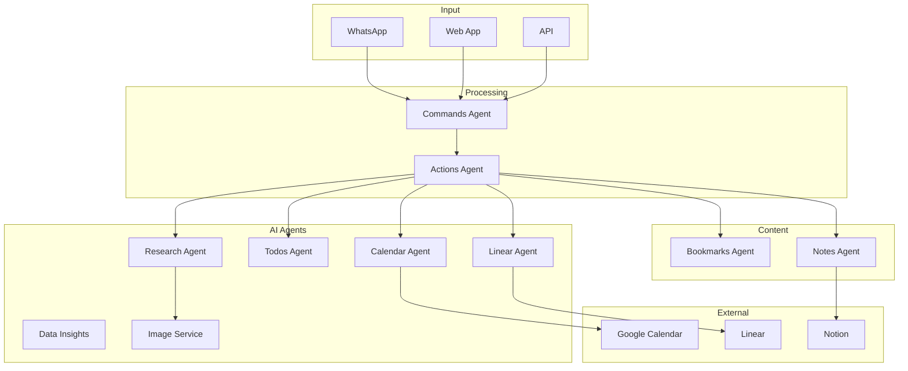
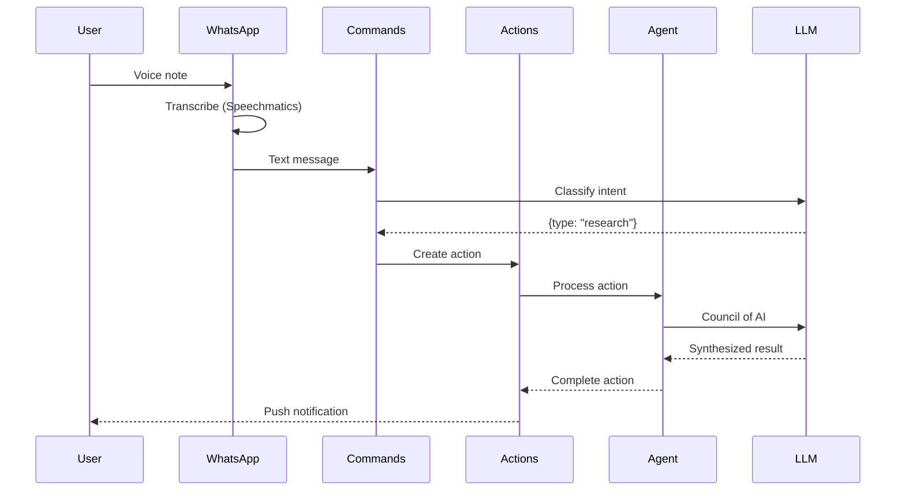

# IntexuraOS Platform Overview

IntexuraOS is an AI-native autonomous agent platform that transforms chaotic inputs into structured, actionable intelligence. It leverages a "Council of AI" - 15 models across 5 providers - to understand, process, and execute on your behalf.

## The Problem

Information is fragmented. A thought arrives via WhatsApp voice note. A link needs saving. A meeting needs scheduling. A research question needs deep analysis. Each task requires context-switching between apps, manual data entry, and cognitive overhead.

**The result**: Important ideas get lost, tasks fall through the cracks, and your brain becomes a stressed-out task manager instead of a creative engine.

## How IntexuraOS Helps

IntexuraOS acts as your autonomous cognitive layer:

1. **Capture** - Single entry point via WhatsApp voice, web, or API
2. **Understand** - AI classifies intent: research, todo, note, link, calendar, issue
3. **Execute** - Specialized agents process each action type
4. **Integrate** - Results sync to Linear, Google Calendar, Notion
5. **Notify** - Push notifications and WhatsApp messages keep you updated

## The AI Advantage

### Multi-Model Intelligence

Unlike single-model assistants, IntexuraOS consults multiple AI experts:

| Task                   | Models Used                                      |
| ---------------------- | ------------------------------------------------ |
| Research Synthesis     | Claude Opus 4.5, GPT-5.2, Gemini 2.5 Pro, Sonar  |
| Intent Classification  | Gemini 2.5 Flash, GLM-4.7                        |
| Deep Research          | O4 Mini Deep Research, Sonar Deep Research       |
| Image Generation       | DALL-E 3, Gemini Imagen                          |
| Data Analysis          | Gemini (multiple specialized prompts)            |

### Council of AI Research

When you ask a research question, IntexuraOS:

1. Validates the question is research-worthy
2. Queries 3-5 models in parallel
3. Each model performs independent web search and reasoning
4. A synthesis agent aggregates findings with confidence scores
5. You receive a comprehensive briefing, not a chat bubble

## Core Agents

### Action Orchestrator

**[actions-agent](services/actions-agent/features.md)** - The central nervous system

Routes classified intents to specialized agents, manages action lifecycle (pending, processing, completed, failed), handles retries, and coordinates cross-service workflows.

### Research Agent

**[research-agent](services/research-agent/features.md)** - Your AI research team

Orchestrates the Council of AI for deep research. Generates shareable HTML reports with cover images, citations, and confidence-weighted conclusions.

**AI Models**: Claude Opus 4.5, Claude Sonnet 4.5, GPT-5.2, Gemini 2.5 Pro, Perplexity Sonar/Pro/Deep, O4 Mini Deep Research, GLM-4.7

### Commands Agent

**[commands-agent](commands-agent/features.md)** - Intent understanding

Classifies natural language into action types using Gemini 2.5 Flash. Detects model preferences ("ask Claude about...") and routes accordingly.

**AI Models**: Gemini 2.5 Flash, GLM-4.7

### Data Insights Agent

**[data-insights-agent](services/data-insights-agent/features.md)** - AI data analyst

Upload datasets, get AI-generated insights, trend analysis, and visualizations. Supports composite feeds that aggregate multiple data sources.

**AI Models**: Gemini (analysis, chart definition, data transformation)

### Todos Agent

**[todos-agent](services/todos-agent/features.md)** - Task extraction

Converts natural language to structured tasks with AI-extracted items, due dates, and priorities.

**AI Models**: Gemini 2.5 Flash, GLM-4.7

### Calendar Agent

**[calendar-agent](services/calendar-agent/features.md)** - Schedule management

Parses event descriptions into Google Calendar events. Extracts times, locations, and attendees from voice.

**AI Models**: Gemini 2.5 Flash

### Linear Agent

**[linear-agent](services/linear-agent/features.md)** - Issue tracking

Creates Linear issues from natural language with AI-extracted title, priority, and structured description.

**AI Models**: Gemini 2.5 Flash, GLM-4.7

### Image Service

**[image-service](services/image-service/features.md)** - Visual creation

Generates images from text prompts using DALL-E 3 or Gemini Imagen. Creates cover images for research reports.

**AI Models**: DALL-E 3, Gemini 2.5 Flash Image

## Integration Services

### WhatsApp Service

**[whatsapp-service](services/whatsapp-service/features.md)** - Voice-first input

Receives WhatsApp messages, downloads media, triggers voice transcription via Speechmatics. Your primary input channel.

### Bookmarks Agent

**[bookmarks-agent](services/bookmarks-agent/features.md)** - Link intelligence

Saves links with OpenGraph metadata extraction. Uses Crawl4AI for AI-powered page summarization.

### Notes Agent

**[notes-agent](services/notes-agent/features.md)** - Thought capture

Simple note-taking with tags, draft states, and CRUD operations.

### Notion Service

**[notion-service](services/notion-service/features.md)** - Knowledge sync

Connects IntexuraOS to Notion workspaces for prompt template sync and future bidirectional data flow.

### PromptVault Service

**[promptvault-service](services/promptvault-service/features.md)** - Prompt management

Syncs prompt templates from Notion database. Version tracking and retrieval for consistent AI interactions.

## Infrastructure Services

### User Service

**[user-service](services/user-service/features.md)** - Identity & secrets

Auth0 authentication, encrypted API key storage (AES-256-GCM), Google OAuth token refresh, user settings.

### Mobile Notifications Service

**[mobile-notifications-service](services/mobile-notifications-service/features.md)** - Push delivery

Signature-based device authentication for secure push notifications. Notification filtering and routing.

### Web Agent

**[web-agent](services/web-agent/features.md)** - Web intelligence

OpenGraph metadata extraction, page summarization via Crawl4AI. Powers bookmark enrichment.

### App Settings Service

**[app-settings-service](services/app-settings-service/features.md)** - Configuration

LLM pricing data, usage analytics, platform configuration. Single source of truth for model costs.

### API Docs Hub

**[api-docs-hub](services/api-docs-hub/features.md)** - Documentation

Aggregates OpenAPI specs from all services into unified Swagger UI.

## System Architecture

## Data Flow

## Services Summary

| Service                      | Purpose                           | AI Capability                  |
| ---------------------------- | --------------------------------- | ------------------------------ |
| actions-agent                | Action orchestration              | Routing, lifecycle             |
| research-agent               | Multi-model research              | 10 LLMs + synthesis            |
| commands-agent               | Intent classification             | Gemini, GLM                    |
| data-insights-agent          | Data analysis                     | Gemini analysis suite          |
| todos-agent                  | Task management                   | Item extraction                |
| calendar-agent               | Google Calendar                   | Event parsing                  |
| linear-agent                 | Linear integration                | Issue extraction               |
| image-service                | Image generation                  | DALL-E 3, Imagen               |
| bookmarks-agent              | Link saving                       | AI summaries                   |
| notes-agent                  | Note-taking                       | -                              |
| whatsapp-service             | Voice input                       | Transcription trigger          |
| user-service                 | Auth & keys                       | -                              |
| mobile-notifications-service | Push notifications                | -                              |
| web-agent                    | Web scraping                      | Crawl4AI                       |
| app-settings-service         | Configuration                     | -                              |
| api-docs-hub                 | Documentation                     | -                              |
| notion-service               | Notion integration                | -                              |
| promptvault-service          | Prompt templates                  | -                              |

## Documentation

- [AI Architecture](architecture/ai-architecture.md) - Deep dive into LLM integration
- [Services Catalog](services/index.md) - All 18 services documented
- [Architecture Patterns](architecture/) - System design documentation
- [Setup Guides](setup/) - Installation and configuration

**Last Updated**: 2026-01-19
