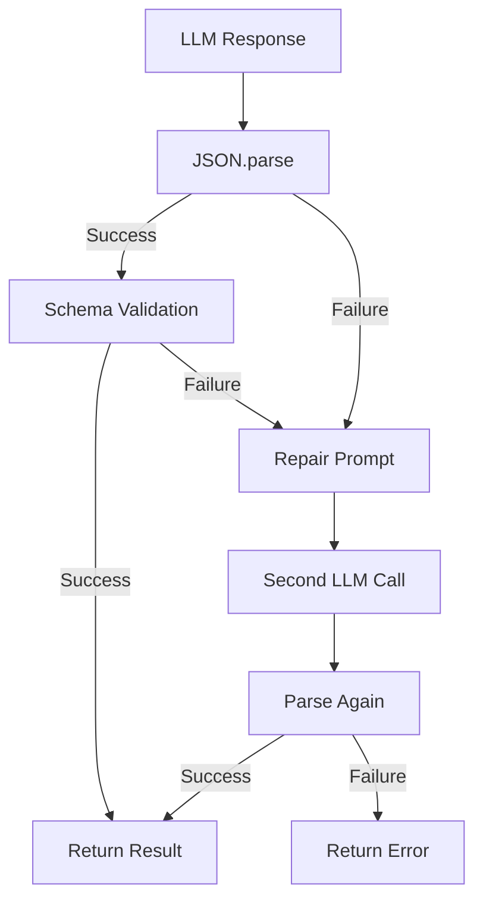

# LLM Response Validation Pattern

> How IntexuraOS validates and parses LLM responses across services.

---

## Overview

LLM responses require validation to ensure they match expected schemas before processing. IntexuraOS uses three validation approaches depending on response complexity and structure.

---

## Validation Approaches

### Summary

| Approach               | Count | When to Use                         | Key Feature              |
| ---------------------- | ----- | ----------------------------------- | ------------------------ |
| **Zod Schemas**        | 10    | Complex JSON with nested types      | Field-level error paths  |
| **Manual Type Guards** | 2     | Simple JSON with known fields       | Custom validation logic  |
| **No Validation**      | 6     | Unstructured text (prose, markdown) | Raw content pass-through |

---

## Approach 1: Zod Schemas (Recommended for New Code)

**Package:** `@intexuraos/llm-prompts`

**When to use:** Structured JSON responses with multiple fields, enums, or nested objects.

### Benefits

1. **Detailed error paths** - `mode: expected 'compact' | 'standard', received 'deep'`
2. **Type inference** - TypeScript types derived from schemas via `z.infer<>`
3. **Single source of truth** - No manual type/guard duplication
4. **Auto-repair support** - Errors can drive repair prompts

### Implementation

```typescript
import { z } from 'zod';

// Define schema
export const ResearchContextSchema = z.object({
  domain: z.enum(['technical', 'general', 'academic', 'business']),
  mode: z.enum(['compact', 'standard', 'audit']),
  research_plan: z.object({
    preferred_source_types: z.array(z.enum(['official', 'primary_docs', 'academic'])),
  }),
});

// Derive type from schema
export type ResearchContext = z.infer<typeof ResearchContextSchema>;

// Validate with safeParse
function parseJsonWithZod<T>(raw: string, schema: z.ZodSchema<T>): Result<T, string> {
  const parsed = JSON.parse(raw);
  const result = schema.safeParse(parsed);

  if (!result.success) {
    return { ok: false, error: formatZodErrors(result.error) };
  }
  return { ok: true, value: result.data };
}
```

### Error Formatting

```typescript
function formatZodErrors(error: ZodError): string {
  return error.issues
    .slice(0, 5) // Limit to prevent log bloat
    .map((issue) => {
      const path = issue.path.join('.') || '(root)';
      if (issue.code === 'invalid_enum_value') {
        const options = issue.options.map((o) => `'${o}'`).join(' | ');
        return `${path}: expected ${options}, received '${issue.received}'`;
      }
      return `${path}: ${issue.message}`;
    })
    .join('; ');
}
```

### Current Usage

| Service        | File                                 | Method                    | Schema                         |
| -------------- | ------------------------------------ | ------------------------- | ------------------------------ |
| research-agent | `ContextInferenceAdapter.ts`         | `inferResearchContext()`  | `ResearchContextSchema`        |
| research-agent | `ContextInferenceAdapter.ts`         | `inferSynthesisContext()` | `SynthesisContextSchema`       |
| todos-agent    | `todoItemExtractionService.ts`       | `extractItem()`           | `TodoExtractionResponseSchema` |
| linear-agent   | `linearActionExtractionService.ts`   | `extractLinearIssue()`    | `LinearIssueDataSchema`        |
| calendar-agent | `calendarActionExtractionService.ts` | `extractEvent()`          | `CalendarEventSchema`          |
| commands-agent | `classifier.ts`                      | `classify()`              | `CommandClassificationSchema`  |
| data-insights  | `chartDefinitionService.ts`          | `parseChartDefinition()`  | `VegaLiteConfigSchema`         |
| data-insights  | `contextSchemas.ts`                  | (export)                  | `DataInsightSchema`            |
| data-insights  | `contextSchemas.ts`                  | (export)                  | `TransformedDataSchema`        |

### Schema Locations

```
packages/llm-prompts/src/
  shared/contextSchemas.ts      # InputQuality, DefaultApplied, SafetyInfo
  todos/contextSchemas.ts       # TodoExtractionResponse, ExtractedItem
  linear/contextSchemas.ts      # LinearIssueData with literal union priority
  calendar/contextSchemas.ts    # CalendarEvent with ISO date-time validation
  classification/contextSchemas.ts # CommandClassification with enum types
  dataInsights/contextSchemas.ts # DataInsight, TransformedData, VegaLiteConfig
```

**Pattern:** Each domain has `contextSchemas.ts` with Zod schemas and type exports.

---

## Approach 2: Manual Type Guards

**When to use:** Simple JSON with a few fields, or when Zod is overkill.

### Implementation

```typescript
interface ExtractionResponse {
  title: string;
  priority: number;
  valid: boolean;
  reasoning: string;
}

function isValidExtractionResponse(value: unknown): value is ExtractionResponse {
  if (typeof value !== 'object' || value === null) return false;
  const obj = value as Record<string, unknown>;
  return (
    typeof obj.title === 'string' &&
    typeof obj.priority === 'number' &&
    obj.priority >= 0 &&
    obj.priority <= 4 &&
    typeof obj.valid === 'boolean' &&
    typeof obj.reasoning === 'string'
  );
}
```

### Current Usage

| Service             | File                        | Guard/Parser Function    |
| ------------------- | --------------------------- | ------------------------ |
| research-agent      | `InputValidationAdapter.ts` | `isInputQualityResult()` |
| data-insights-agent | `parseInsightResponse.ts`   | `parseInsightResponse()` |

**Note:** The `parseInsightResponse()` function uses custom text-based parsing (not JSON), so manual validation is appropriate.

---

## Approach 3: No Validation

**When to use:** Unstructured text responses (markdown, prose) that don't have a schema.

### Rationale

Research and synthesis outputs are free-form markdown prose. Validation would require complex content analysis with no clear schema to validate against.

### Current Usage

| Service        | File                   | Methods                          |
| -------------- | ---------------------- | -------------------------------- |
| research-agent | `GeminiAdapter.ts`     | `research()`, `synthesize()`     |
| research-agent | `GptAdapter.ts`        | `research()`, `synthesize()`     |
| research-agent | `ClaudeAdapter.ts`     | `research()`                     |
| research-agent | `GlmAdapter.ts`        | `research()`, `synthesize()`     |
| research-agent | `PerplexityAdapter.ts` | `research()`, `synthesize()`     |
| user-service   | `LlmValidatorImpl.ts`  | `validateKey()`, `testRequest()` |

---

## Repair Mechanism

Both Zod and manual validation support **repair attempts** when initial parsing fails.

### Flow



### Repair Prompt Template

```typescript
function buildRepairPrompt(invalidResponse: string, errorMessage: string): string {
  return `The following JSON response was invalid:

\`\`\`json
${invalidResponse}
\`\`\`

Error: ${errorMessage}

Please fix the JSON to match the expected schema. Return ONLY valid JSON.`;
}
```

---

## Migration Guide: Manual Guards to Zod

### When to Migrate

- Guard has >5 field checks
- Need better error messages for debugging
- Schema has enums or nested objects
- Want automatic TypeScript type inference

### Steps

1. **Create Zod schema** in `packages/llm-prompts/src/<domain>/`
2. **Export type** via `z.infer<typeof Schema>`
3. **Replace guard** with `schema.safeParse()`
4. **Update error handling** to use `formatZodErrors()`
5. **Keep backwards-compatible guard** if needed:

```typescript
// Backwards-compatible guard wrapping Zod
export function isResearchContext(value: unknown): value is ResearchContext {
  return ResearchContextSchema.safeParse(value).success;
}
```

---

## Best Practices

### Do

- Use Zod for new structured JSON parsing
- Limit Zod error output (max 5 issues)
- Use `safeStringify()` when logging parsed JSON
- Include repair mechanism for critical paths
- Export both schema and derived type

### Don't

- Apply validation to unstructured text (prose, markdown)
- Create schemas for simple key-value responses
- Throw on validation failure (use Result type)
- Log full LLM response on error (truncate to ~1000 chars)

---

**Related:**

- [AI Architecture](../architecture/ai-architecture.md) - Error handling overview
- [INT-218](https://linear.app/pbuchman/issue/INT-218) - Zod migration epic (completed)

**Last updated:** 2026-01-25
