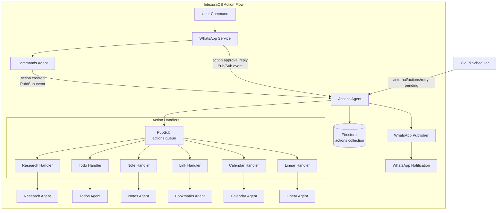
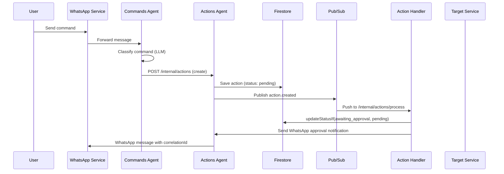
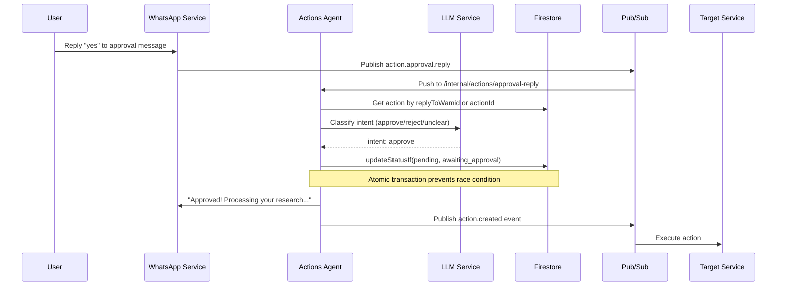

# Actions Agent - Technical Reference

## Overview

Actions-agent is the central action lifecycle management service for IntexuraOS. It receives classified commands from
commands-agent, maintains action state in Firestore, routes actions to appropriate handlers via Pub/Sub, and tracks
execution status. In v2.0.0, it gained WhatsApp approval reply handling with LLM-based intent classification and
atomic status transitions to prevent race conditions. In v2.1.0, it migrated to the centralized
`@intexuraos/internal-clients/user-service` package for improved code quality and consistency.

## Architecture



## Recent Changes

| Commit    | Description                                                  | Date       |
| --------- | ------------------------------------------------------------ | ---------- |
| `88cec45` | INT-269 Migrate to @intexuraos/internal-clients/user-service | 2026-01-25 |
| `b1c7a4b` | INT-269 Create internal-clients package and migrate apps     | 2026-01-25 |
| `24c9e29` | Fix duplicate approval messages for all action types         | 2026-01-24 |
| `4fa0fed` | Release v2.0.0                                               | 2026-01-24 |
| `a0263b1` | Fix approval message ordering for note actions               | 2026-01-22 |
| `d26ed6a` | Prevent race condition in approval reply processing          | 2026-01-22 |
| `c2e3c10` | Publish action.created event after WhatsApp approval         | 2026-01-21 |

## Data Flow

### Standard Action Flow



### Approval Reply Flow (New in v2.0.0)



## API Endpoints

### Public Endpoints

| Method | Path                                   | Description                            | Auth         |
| ------ | -------------------------------------- | -------------------------------------- | ------------ |
| GET    | `/actions`                             | List actions for authenticated user    | Bearer token |
| PATCH  | `/actions/:actionId`                   | Update action status or type           | Bearer token |
| DELETE | `/actions/:actionId`                   | Delete an action                       | Bearer token |
| POST   | `/actions/batch`                       | Fetch multiple actions by IDs (max 50) | Bearer token |
| POST   | `/actions/:actionId/execute`           | Synchronously execute an action        | Bearer token |
| GET    | `/actions/:actionId/preview`           | Get calendar action preview            | Bearer token |
| POST   | `/actions/:actionId/resolve-duplicate` | Skip or update duplicate bookmark      | Bearer token |

### Internal Endpoints

| Method | Path                               | Description                                      | Auth                    |
| ------ | ---------------------------------- | ------------------------------------------------ | ----------------------- |
| POST   | `/internal/actions`                | Create new action from classification            | Internal header or OIDC |
| POST   | `/internal/actions/:actionType`    | Process action from Pub/Sub (type-specific)      | Pub/Sub OIDC            |
| POST   | `/internal/actions/process`        | Process action from Pub/Sub (unified)            | Pub/Sub OIDC            |
| POST   | `/internal/actions/retry-pending`  | Retry actions stuck in pending (Cloud Scheduler) | OIDC or Internal        |
| POST   | `/internal/actions/approval-reply` | Handle WhatsApp approval replies (v2.0.0)        | Pub/Sub OIDC            |

## Domain Models

### Action

| Field        | Type                    | Description                             |
| ------------ | ----------------------- | --------------------------------------- |
| `id`         | string (UUID)           | Unique action identifier                |
| `userId`     | string                  | User who owns the action                |
| `commandId`  | string                  | Original command ID from commands-agent |
| `type`       | ActionType              | Classification result                   |
| `confidence` | number (0-1)            | Classification confidence score         |
| `title`      | string                  | Action title/description                |
| `status`     | ActionStatus            | Current lifecycle state                 |
| `payload`    | Record<string, unknown> | Action-specific data                    |
| `createdAt`  | string (ISO 8601)       | Creation timestamp                      |
| `updatedAt`  | string (ISO 8601)       | Last update timestamp                   |

### ActionType Enum

| Value      | Handler                     | Auto-Execute |
| ---------- | --------------------------- | ------------ |
| `todo`     | HandleTodoActionUseCase     | No           |
| `research` | HandleResearchActionUseCase | No           |
| `note`     | HandleNoteActionUseCase     | No           |
| `link`     | HandleLinkActionUseCase     | Yes (>= 90%) |
| `calendar` | HandleCalendarActionUseCase | No           |
| `linear`   | HandleLinearActionUseCase   | No           |
| `reminder` | Not implemented             | N/A          |

### ActionStatus Enum

| Value               | Description                            |
| ------------------- | -------------------------------------- |
| `pending`           | Approved and ready for processing      |
| `awaiting_approval` | Low confidence, requires user approval |
| `processing`        | Handler is executing                   |
| `completed`         | Successfully executed                  |
| `failed`            | Execution failed                       |
| `rejected`          | User rejected the action               |
| `archived`          | No longer relevant                     |

### ApprovalMessage (New in v2.0.0)

| Field         | Type              | Description                           |
| ------------- | ----------------- | ------------------------------------- |
| `id`          | string (UUID)     | Firestore document ID                 |
| `wamid`       | string            | WhatsApp message ID (indexed)         |
| `actionId`    | string            | Reference to action awaiting approval |
| `userId`      | string            | User who should approve/reject        |
| `sentAt`      | string (ISO 8601) | When approval request was sent        |
| `actionType`  | ActionType        | Action type for logging               |
| `actionTitle` | string            | Action title for logging              |

### ApprovalReplyEvent (New in v2.0.0)

| Field          | Type              | Description                             |
| -------------- | ----------------- | --------------------------------------- |
| `type`         | string            | Always `action.approval.reply`          |
| `replyToWamid` | string            | Original approval message wamid         |
| `replyText`    | string            | User's reply text                       |
| `userId`       | string            | User ID                                 |
| `timestamp`    | string (ISO 8601) | Reply timestamp                         |
| `actionId`     | string (optional) | Action ID extracted from correlation ID |

### ApprovalIntent (New in v2.0.0)

| Value     | Description                      |
| --------- | -------------------------------- |
| `approve` | User wants to approve the action |
| `reject`  | User wants to reject the action  |
| `unclear` | Intent couldn't be determined    |

### ActionTransition

| Field       | Type              | Description              |
| ----------- | ----------------- | ------------------------ |
| `id`        | string            | Unique transition ID     |
| `actionId`  | string            | Reference to action      |
| `fromType`  | ActionType        | Original type            |
| `toType`    | ActionType        | Corrected type           |
| `userId`    | string            | User who made correction |
| `timestamp` | string (ISO 8601) | When correction occurred |

## Key Use Cases

### handleApprovalReply (New in v2.0.0)

Processes WhatsApp approval replies using LLM-based intent classification.

**Flow:**

1. Receive `action.approval.reply` event from whatsapp-service
2. Look up action by `actionId` (from correlationId) or `replyToWamid` (from approval_messages)
3. Verify user ownership and action is not in terminal state
4. Create LLM classifier using user's configured API key
5. Classify intent: approve, reject, or unclear
6. On approve: atomically update status via `updateStatusIf`, send confirmation, publish `action.created`
7. On reject: atomically update status, record rejection reason, send confirmation
8. On unclear: request clarification via WhatsApp

**Race Condition Prevention:**

```typescript
const updateResult = await actionRepository.updateStatusIf(
  action.id,
  'pending', // new status
  'awaiting_approval' // expected current status
);

if (updateResult.outcome === 'status_mismatch') {
  // Another handler already processed this - idempotent return
  return ok({ matched: true, actionId: action.id });
}
```

### createIdempotentActionHandler

Wraps action handlers with idempotency protection to prevent duplicate WhatsApp notifications.

**Pattern:**

```typescript
const handler = registerActionHandler(createHandleXxxActionUseCase, deps);
// Internally calls updateStatusIf(awaiting_approval, [pending, failed])
// before invoking the wrapped handler
```

## Pub/Sub Events

### Published

| Event Type       | Topic           | Payload              |
| ---------------- | --------------- | -------------------- |
| `action.created` | `actions` queue | `ActionCreatedEvent` |

### Subscribed

| Event Type              | Subscription       | Handler                            |
| ----------------------- | ------------------ | ---------------------------------- |
| `action.created`        | `actions-queue`    | `/internal/actions/process`        |
| `action.approval.reply` | `approval-replies` | `/internal/actions/approval-reply` |

## Dependencies

### Internal Services

| Service           | Purpose                                                                                 |
| ----------------- | --------------------------------------------------------------------------------------- |
| `commands-agent`  | Create new commands from transitions                                                    |
| `research-agent`  | Execute research actions                                                                |
| `todos-agent`     | Execute todo actions                                                                    |
| `notes-agent`     | Execute note actions                                                                    |
| `bookmarks-agent` | Execute link actions                                                                    |
| `calendar-agent`  | Execute calendar actions                                                                |
| `linear-agent`    | Execute Linear issue creation actions                                                   |
| `user-service`    | Fetch user API keys for LLM (via `@intexuraos/internal-clients/user-service` in v2.1.0) |

### Infrastructure

| Component                                    | Purpose                            |
| -------------------------------------------- | ---------------------------------- |
| Firestore (`actions` collection)             | Action persistence                 |
| Firestore (`actions_transitions` collection) | Type correction tracking           |
| Firestore (`approval_messages` collection)   | WhatsApp message to action mapping |
| Pub/Sub (`actions` queue)                    | Event distribution                 |
| Pub/Sub (`whatsapp-send`)                    | Notification delivery              |
| Pub/Sub (`approval-replies`)                 | Approval reply events              |

## Configuration

| Environment Variable              | Required | Description                                |
| --------------------------------- | -------- | ------------------------------------------ |
| `INTEXURAOS_RESEARCH_AGENT_URL`   | Yes      | Research-agent base URL                    |
| `INTEXURAOS_USER_SERVICE_URL`     | Yes      | User-service base URL                      |
| `INTEXURAOS_COMMANDS_AGENT_URL`   | Yes      | Commands-agent base URL                    |
| `INTEXURAOS_TODOS_AGENT_URL`      | Yes      | Todos-agent base URL                       |
| `INTEXURAOS_NOTES_AGENT_URL`      | Yes      | Notes-agent base URL                       |
| `INTEXURAOS_BOOKMARKS_AGENT_URL`  | Yes      | Bookmarks-agent base URL                   |
| `INTEXURAOS_CALENDAR_AGENT_URL`   | Yes      | Calendar-agent base URL                    |
| `INTEXURAOS_LINEAR_AGENT_URL`     | Yes      | Linear-agent base URL                      |
| `INTEXURAOS_INTERNAL_AUTH_TOKEN`  | Yes      | Shared secret for service-to-service calls |
| `INTEXURAOS_GCP_PROJECT_ID`       | Yes      | Google Cloud project ID                    |
| `INTEXURAOS_PUBSUB_ACTIONS_QUEUE` | Yes      | Unified actions queue topic name           |
| `INTEXURAOS_PUBSUB_WHATSAPP_SEND` | Yes      | WhatsApp send topic                        |
| `INTEXURAOS_WEB_APP_URL`          | Yes      | Web app URL for notification links         |

## Gotchas

**Unified queue routing**: The `/internal/actions/process` endpoint receives all action types and dynamically selects
handlers. Unknown types are ignored (action stays pending) rather than failing.

**Pub/Sub authentication**: Pub/Sub push requests use OIDC tokens validated by Cloud Run. Direct service calls use
`X-Internal-Auth` header. Both paths are supported.

**Action type correction**: When user changes action type, the old type is logged to `actions_transitions` for ML
training data.

**Duplicate link handling**: Link actions may fail with `existingBookmarkId` in payload. Use
`/actions/:id/resolve-duplicate` to skip or refresh the existing bookmark.

**Batch endpoint limit**: Maximum 50 action IDs per batch request to prevent abuse.

**Reminder actions**: The reminder type is defined in the enum but has no handler. Actions of this type remain
in pending status indefinitely.

**Auto-execution for links**: Link actions with confidence >= 90% are auto-executed immediately via `shouldAutoExecute()`.
All other action types require manual approval before execution.

**Approval reply idempotency (v2.0.0)**: The `updateStatusIf` method uses Firestore transactions to atomically check
and update status. If the status doesn't match expectations, the operation is a no-op, preventing race conditions
when multiple Pub/Sub messages arrive concurrently.

**Note actions direct execution (v2.0.0)**: When approving note actions, the system executes directly rather than
publishing `action.created` to avoid duplicate "ready for approval" notifications.

**LLM classifier creation**: The approval intent classifier is created per-user using their configured LLM API key.
If no key is configured, the user receives an error message asking them to configure their API key.

## File Structure

```
apps/actions-agent/src/
  domain/
    models/
      action.ts              # Action entity and factory
      actionEvent.ts         # Event schemas
      actionTransition.ts    # Type correction tracking
      approvalMessage.ts     # WhatsApp approval tracking (v2.0.0)
      approvalReplyEvent.ts  # Approval reply event schema (v2.0.0)
    ports/
      actionRepository.ts    # Action storage interface + updateStatusIf
      actionTransitionRepository.ts
      approvalMessageRepository.ts   # Approval message storage (v2.0.0)
      approvalIntentClassifier.ts    # LLM intent classification port (v2.0.0)
      approvalIntentClassifierFactory.ts  # Classifier factory port (v2.0.0)
      actionEventPublisher.ts        # Event publishing port
      notificationSender.ts  # WhatsApp notifications
      *ServiceClient.ts      # HTTP clients for other services
    usecases/
      handleApprovalReply.ts     # WhatsApp reply handling (v2.0.0)
      handle*Action.ts           # Pub/Sub handlers (async)
      execute*Action.ts          # Direct execution (sync)
      createIdempotentActionHandler.ts  # Idempotency wrapper
      shouldAutoExecute.ts       # Auto-execution logic
      changeActionType.ts        # Type correction
      retryPendingActions.ts     # Scheduled retry
      actionHandlerRegistry.ts   # Handler routing
  infra/
    firestore/
      actionRepository.ts            # Includes atomic updateStatusIf
      actionTransitionRepository.ts
      approvalMessageRepository.ts   # Approval message persistence (v2.0.0)
    llm/
      llmApprovalIntentClassifier.ts  # LLM-based classifier (v2.0.0)
      approvalIntentClassifierFactory.ts  # Factory implementation (v2.0.0)
    pubsub/
      actionEventPublisher.ts
    http/
      *ServiceHttpClient.ts  # HTTP clients
    notification/
      whatsappNotificationSender.ts
  routes/
    publicRoutes.ts          # User-facing endpoints
    internalRoutes.ts        # Service-to-service + Pub/Sub (includes approval-reply)
  services.ts                # DI container
```
