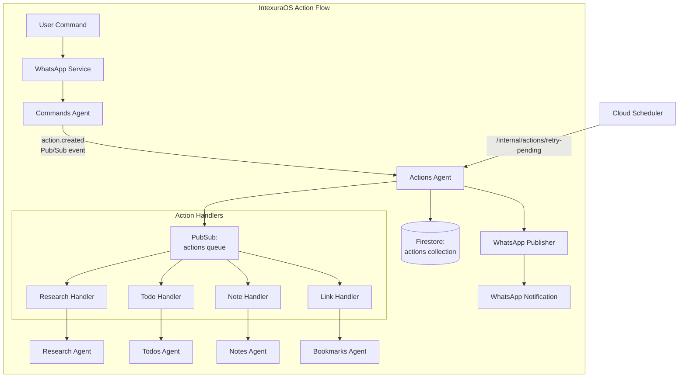
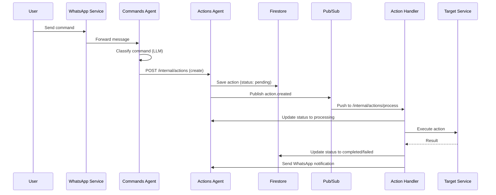

# Actions Agent - Technical Reference

## Overview

Actions-agent is the central action lifecycle management service for IntexuraOS. It receives classified commands from
commands-agent, maintains action state in Firestore, routes actions to appropriate handlers via Pub/Sub, and tracks
execution status.

## Architecture



## Data Flow



## API Endpoints

### Public Endpoints

| Method | Path                                   | Description                            | Auth         |
| ------ | -------------------------------------- | -------------------------------------- | ------------ |
| GET    | `/actions`                             | List actions for authenticated user    | Bearer token |
| PATCH  | `/actions/:actionId`                   | Update action status or type           | Bearer token |
| DELETE | `/actions/:actionId`                   | Delete an action                       | Bearer token |
| POST   | `/actions/batch`                       | Fetch multiple actions by IDs (max 50) | Bearer token |
| POST   | `/actions/:actionId/execute`           | Synchronously execute an action        | Bearer token |
| POST   | `/actions/:actionId/resolve-duplicate` | Skip or update duplicate bookmark      | Bearer token |

### Internal Endpoints

| Method | Path                              | Description                                      | Auth                    |
| ------ | --------------------------------- | ------------------------------------------------ | ----------------------- |
| POST   | `/internal/actions`               | Create new action from classification            | Internal header or OIDC |
| POST   | `/internal/actions/:actionType`   | Process action from Pub/Sub (type-specific)      | Pub/Sub OIDC            |
| POST   | `/internal/actions/process`       | Process action from Pub/Sub (unified)            | Pub/Sub OIDC            |
| POST   | `/internal/actions/retry-pending` | Retry actions stuck in pending (Cloud Scheduler) | OIDC or Internal        |

## Domain Models

### Action

| Field        | Type                    | Description                             |
| ------------ | ----------------------- | --------------------------------------- |
| `id`         | string (UUID)           | Unique action identifier                |
| `userId`     | string                  | User who owns the action                |
| `commandId`  | string                  | Original command ID from commands-agent |
| `type`       | ActionType              | Classification result                   |
| `confidence` | number (0-1)            | Classification confidence score         |
| `title`      | string                  | Action title/description                |
| `status`     | ActionStatus            | Current lifecycle state                 |
| `payload`    | Record<string, unknown> | Action-specific data                    |
| `createdAt`  | string (ISO 8601)       | Creation timestamp                      |
| `updatedAt`  | string (ISO 8601)       | Last update timestamp                   |

### ActionType Enum

| Value      | Handler                     | Auto-Execute |
| ---------- | --------------------------- | ------------ |
| `todo`     | HandleTodoActionUseCase     | No           |
| `research` | HandleResearchActionUseCase | No           |
| `note`     | HandleNoteActionUseCase     | No           |
| `link`     | HandleLinkActionUseCase     | Yes (>= 90%) |
| `calendar` | HandleCalendarActionUseCase | No           |
| `linear`   | HandleLinearActionUseCase   | No           |
| `reminder` | Not implemented             | N/A          |

### ActionStatus Enum

| Value               | Description                            |
| ------------------- | -------------------------------------- |
| `pending`           | Initial state, awaiting processing     |
| `awaiting_approval` | Low confidence, requires user approval |
| `processing`        | Handler is executing                   |
| `completed`         | Successfully executed                  |
| `failed`            | Execution failed                       |
| `rejected`          | User rejected the action               |
| `archived`          | No longer relevant                     |

### ActionTransition

| Field       | Type              | Description              |
| ----------- | ----------------- | ------------------------ |
| `id`        | string            | Unique transition ID     |
| `actionId`  | string            | Reference to action      |
| `fromType`  | ActionType        | Original type            |
| `toType`    | ActionType        | Corrected type           |
| `userId`    | string            | User who made correction |
| `timestamp` | string (ISO 8601) | When correction occurred |

## Pub/Sub Events

### Published

| Event Type       | Topic           | Payload              |
| ---------------- | --------------- | -------------------- |
| `action.created` | `actions` queue | `ActionCreatedEvent` |

### Subscribed

| Subscription                | Handler                         |
| --------------------------- | ------------------------------- |
| `actions-{type}` (per-type) | `/internal/actions/:actionType` |
| `actions-queue` (unified)   | `/internal/actions/process`     |

## Dependencies

### Internal Services

| Service           | Purpose                               |
| ----------------- | ------------------------------------- |
| `commands-agent`  | Create new commands from transitions  |
| `research-agent`  | Execute research actions              |
| `todos-agent`     | Execute todo actions                  |
| `notes-agent`     | Execute note actions                  |
| `bookmarks-agent` | Execute link actions                  |
| `calendar-agent`  | Execute calendar actions              |
| `linear-agent`    | Execute Linear issue creation actions |
| `user-service`    | Fetch user API keys                   |

### Infrastructure

| Component                                    | Purpose                  |
| -------------------------------------------- | ------------------------ |
| Firestore (`actions` collection)             | Action persistence       |
| Firestore (`actions_transitions` collection) | Type correction tracking |
| Pub/Sub (`actions` queue)                    | Event distribution       |
| Pub/Sub (`whatsapp-send`)                    | Notification delivery    |

## Configuration

| Environment Variable              | Required | Description                                |
| --------------------------------- | -------- | ------------------------------------------ |
| `INTEXURAOS_RESEARCH_AGENT_URL`   | Yes      | Research-agent base URL                    |
| `INTEXURAOS_USER_SERVICE_URL`     | Yes      | User-service base URL                      |
| `INTEXURAOS_COMMANDS_AGENT_URL`   | Yes      | Commands-agent base URL                    |
| `INTEXURAOS_TODOS_AGENT_URL`      | Yes      | Todos-agent base URL                       |
| `INTEXURAOS_NOTES_AGENT_URL`      | Yes      | Notes-agent base URL                       |
| `INTEXURAOS_BOOKMARKS_AGENT_URL`  | Yes      | Bookmarks-agent base URL                   |
| `INTEXURAOS_CALENDAR_AGENT_URL`   | Yes      | Calendar-agent base URL                    |
| `INTEXURAOS_LINEAR_AGENT_URL`     | Yes      | Linear-agent base URL                      |
| `INTEXURAOS_INTERNAL_AUTH_TOKEN`  | Yes      | Shared secret for service-to-service calls |
| `INTEXURAOS_GCP_PROJECT_ID`       | Yes      | Google Cloud project ID                    |
| `INTEXURAOS_PUBSUB_ACTIONS_QUEUE` | Yes      | Unified actions queue topic name           |
| `INTEXURAOS_PUBSUB_WHATSAPP_SEND` | Yes      | WhatsApp send topic                        |
| `INTEXURAOS_WEB_APP_URL`          | Yes      | Web app URL for notification links         |

## Gotchas

**Unified queue routing**: The `/internal/actions/process` endpoint receives all action types and dynamically selects
handlers. Unknown types are ignored (action stays pending) rather than failing.

**Pub/Sub authentication**: Pub/Sub push requests use OIDC tokens validated by Cloud Run. Direct service calls use
`X-Internal-Auth` header. Both paths are supported.

**Action type correction**: When user changes action type, the old type is logged to `actions_transitions` for ML
training data.

**Duplicate link handling**: Link actions may fail with `existingBookmarkId` in payload. Use
`/actions/:id/resolve-duplicate` to skip or refresh the existing bookmark.

**Batch endpoint limit**: Maximum 50 action IDs per batch request to prevent abuse.

**Reminder actions**: The reminder type is defined in the enum but has no handler. Actions of this type remain
in pending status indefinitely.

**Auto-execution for links**: Link actions with confidence >= 90% are auto-executed immediately via `shouldAutoExecute()`.
All other action types require manual approval before execution.

## File Structure

```
apps/actions-agent/src/
  domain/
    models/
      action.ts              # Action entity and factory
      actionEvent.ts         # Event schemas
      actionTransition.ts    # Type correction tracking
    ports/
      actionRepository.ts    # Action storage interface
      actionTransitionRepository.ts
      notificationSender.ts  # WhatsApp notifications
      *ServiceClient.ts      # HTTP clients for other services
    usecases/
      handle*Action.ts       # Pub/Sub handlers (async)
      execute*Action.ts      # Direct execution (sync)
      changeActionType.ts    # Type correction
      retryPendingActions.ts # Scheduled retry
      actionHandlerRegistry.ts
  infra/
    firestore/
      actionRepository.ts
      actionTransitionRepository.ts
    pubsub/
      actionEventPublisher.ts
    http/
      *ServiceHttpClient.ts  # HTTP clients
    notification/
      whatsappNotificationSender.ts
  routes/
    publicRoutes.ts          # User-facing endpoints
    internalRoutes.ts        # Service-to-service + Pub/Sub
  services.ts                # DI container
```
