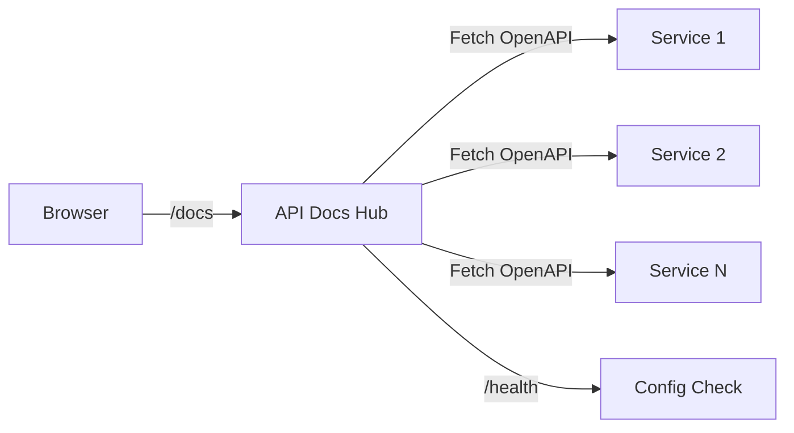

# API Docs Hub - Technical Reference

## Overview

API-docs-hub is a lightweight Fastify server that aggregates OpenAPI specifications from all IntexuraOS services into a
single Swagger UI instance.

## Architecture



## API Endpoints

| Method   | Path        | Description    | Auth   |
| --------  | -----------  | --------------  | ------  |
| GET      | `/docs`     | Swagger UI     | None   |
| GET      | `/health`   | Health check   | None   |

## Configuration

The service loads `openApiSources` from config:

```typescript
interface OpenApiSource {
  name: string;  // Display name in dropdown
  url: string;   // URL to OpenAPI JSON/YAML
}
```

## Health Check

Response includes:

- `status`: "ok" if sources configured, "down" otherwise
- `sourceCount`: Number of configured sources

## Dependencies

**Packages:**

- `@fastify/swagger` - OpenAPI 3.1.1 generation
- `@fastify/swagger-ui` - Swagger UI with multi-spec support

**No external service dependencies.**

**No database dependencies.**

## Gotchas

**Config validation** - Empty `openApiSources` array returns health status "down".

**URL accessibility** - Swagger UI fetches specs client-side. Services must be accessible from browser.

**CORS** - Services must allow cross-origin requests from docs hub.

**Static config** - Changes require redeployment.

## File Structure

```
apps/api-docs-hub/src/
  config.ts         # OpenAPI sources configuration
  server.ts         # Fastify server with Swagger UI
  index.ts          # Entry point
```
