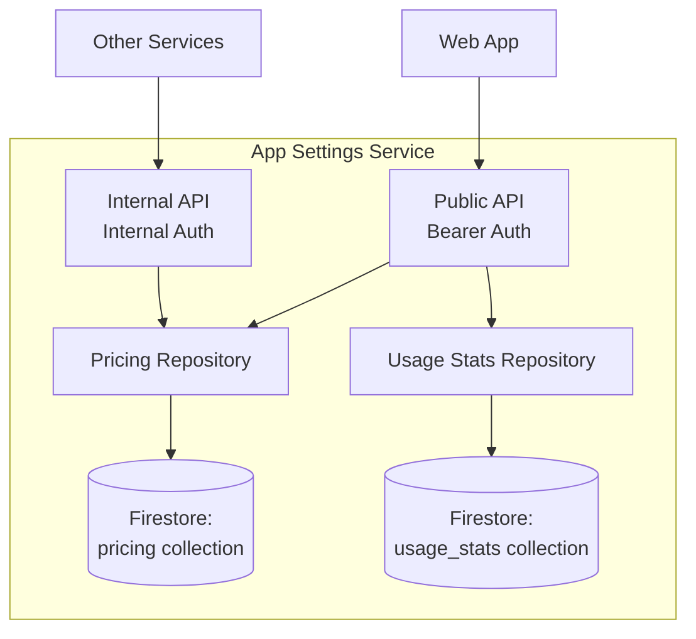

# App Settings Service - Technical Reference

## Overview

App-settings-service provides application-wide LLM pricing configuration and user-specific usage cost analytics. It serves both internal (service-to-service) and public (authenticated user) endpoints.

## Architecture



## API Endpoints

### Public Endpoints

| Method | Path                    | Description                          | Auth         |
| ------ | ----------------------- | ------------------------------------ | ------------ |
| GET    | `/settings/pricing`     | Get all LLM provider pricing         | Bearer token |
| GET    | `/settings/usage-costs` | Get authenticated user's usage costs | Bearer token |

### Internal Endpoints

| Method | Path                         | Description                  | Auth            |
| ------ | ---------------------------- | ---------------------------- | --------------- |
| GET    | `/internal/settings/pricing` | Get all LLM provider pricing | Internal header |

### Pricing Response

```typescript
{
  google: ProviderPricing,
  openai: ProviderPricing,
  anthropic: ProviderPricing,
  perplexity: ProviderPricing,
  zai: ProviderPricing
}
```

### Usage Costs Query Parameters

| Parameter | Type    | Default | Max | Description                        |
| --------- | ------- | ------- | --- | ---------------------------------- |
| `days`    | integer | 90      | 365 | Number of days of history to fetch |

### Usage Costs Response

```typescript
{
  totalCostUsd: number,
  totalCalls: number,
  dailyBreakdown: DailyCost[],
  monthlyBreakdown: MonthlyCost[],
  byModel: ModelCost[],
  byCallType: CallTypeCost[]
}
```

## Domain Models

### ProviderPricing

| Field      | Type                         | Description       |
| ---------- | ---------------------------- | ----------------- |
| `provider` | string                       | Provider name     |
| `models`   | Record<string, ModelPricing> | Per-model pricing |

### ModelPricing

| Field              | Type   | Description                           |
| ------------------ | ------ | ------------------------------------- |
| `inputCostUsd`     | number | Cost per 1M input tokens              |
| `outputCostUsd`    | number | Cost per 1M output tokens             |
| `groundingCostUsd` | number | Cost per grounding request (optional) |

### AggregatedCosts

| Field              | Type           | Description                 |
| ------------------ | -------------- | --------------------------- |
| `totalCostUsd`     | number         | Total cost across all calls |
| `totalCalls`       | number         | Total number of calls       |
| `dailyBreakdown`   | DailyCost[]    | Cost grouped by day         |
| `monthlyBreakdown` | MonthlyCost[]  | Cost grouped by month       |
| `byModel`          | ModelCost[]    | Cost grouped by model       |
| `byCallType`       | CallTypeCost[] | Cost grouped by call type   |

## Configuration

| Environment Variable                | Required | Description                                |
| ----------------------------------- | -------- | ------------------------------------------ |
| `INTEXURAOS_PRICING_COLLECTION`     | Yes      | Firestore pricing collection name          |
| `INTEXURAOS_USAGE_STATS_COLLECTION` | Yes      | Firestore usage stats collection name      |
| `INTEXURAOS_INTERNAL_AUTH_TOKEN`    | Yes      | Shared secret for service-to-service calls |

## Dependencies

### Infrastructure

| Component                            | Purpose                 |
| ------------------------------------ | ----------------------- |
| Firestore (`pricing` collection)     | Provider pricing config |
| Firestore (`usage_stats` collection) | User usage statistics   |

### Internal Services

| Service    | Purpose                  |
| ---------- | ------------------------ |
| (multiple) | Fetch pricing on startup |

## Gotchas

**Missing providers**: Returns 500 if any provider pricing is missing from Firestore. All 5 providers (Google, OpenAI, Anthropic, Perplexity, Zai) must be present.

**Default days**: Usage endpoint defaults to 90 days if not specified.

**Max days**: Maximum 365 days. Requesting higher returns 400 error.

**User scoping**: Usage costs automatically scoped to authenticated user via `requireAuth()`.

**Internal vs Public**: Internal endpoint used by services to load pricing at startup. Public endpoint used by web UI.

## File Structure

```
apps/app-settings-service/src/
  infra/firestore/
    pricingRepository.ts     # Provider pricing data
    usageStatsRepository.ts  # User analytics
  routes/
    publicRoutes.ts          # Pricing and usage endpoints (Bearer auth)
    internalRoutes.ts        # Internal endpoints (Internal auth)
  services.ts                # DI container
  server.ts                  # Fastify server
```
