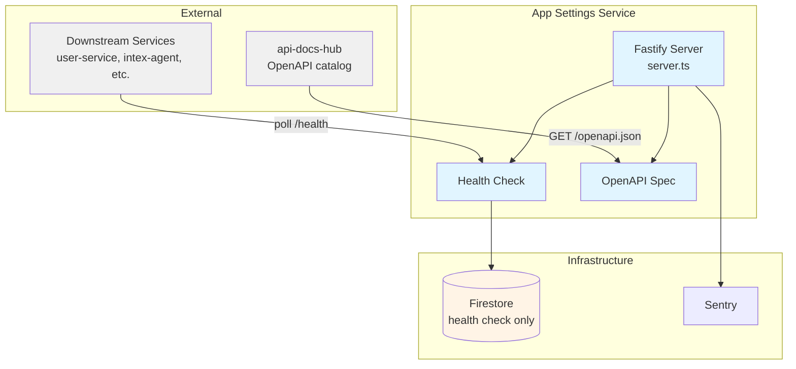

# App Settings Service — Technical Reference

## Overview

App-settings-service is a Fastify-based microservice running on Cloud Run (port 8122 locally). As of v3.6.0, all LLM pricing and usage cost functionality has been migrated to `llm-usage-service`. The service retains its infrastructure scaffolding (Sentry, CORS, health checks, OpenAPI) but has no business endpoints or domain logic.

## Architecture


```mermaid
graph TB
    subgraph "External"
        Services[Downstream Services<br/>user-service, intex-agent, etc.]
        ApiDocs[api-docs-hub<br/>OpenAPI catalog]
    end

    subgraph "App Settings Service"
        Server[Fastify Server<br/>server.ts]
        Health[Health Check]
        OpenAPI[OpenAPI Spec]
    end

    subgraph "Infrastructure"
        Firestore[(Firestore<br/>health check only)]
        Sentry[Sentry]
    end

    Services -->|poll /health| Health
    ApiDocs -->|GET /openapi.json| OpenAPI
    Server --> Health
    Server --> OpenAPI
    Health --> Firestore
    Server --> Sentry

    classDef service fill:#e1f5ff
    classDef storage fill:#fff4e6
    classDef external fill:#f0f0f0

    class Server,Health,OpenAPI service
    class Firestore storage
    class Services,ApiDocs external
```

## Recent Changes

| Commit     | Description                                                        | Date       |
| ---------- | ------------------------------------------------------------------ | ---------- |
| `2d3a0a9d` | Remove /settings/usage-costs page and backend (INT-1342 Part D)    | 2026-04-11 |
| `8767c5e2` | Migrate all pricing consumers to llm-usage-service (INT-1339)      | 2026-04-11 |
| `549c9698` | Enforce strict v8 ignore validation with blocker keyword checks    | 2026-03-24 |
| `93aeac4a` | Remove ZAI provider and GLM-4.7 models, finalize GLM-5             | 2026-03-12 |
| `6063175b` | Add dev-mode log formatting for PM2 readability                    | 2026-02-16 |

## API Endpoints

### System Endpoints

| Method | Path            | Purpose        | Auth |
| ------ | --------------- | -------------- | ---- |
| GET    | `/health`       | Health check   | None |
| GET    | `/openapi.json` | OpenAPI spec   | None |
| GET    | `/docs`         | Swagger UI     | None |

There are no public or internal business endpoints. All pricing endpoints (`/settings/pricing`, `/internal/settings/pricing`) and usage cost endpoints were removed in v3.6.0.

## Domain Model

Empty. The `domain/ports/index.ts` file exports nothing. All pricing-related domain models (ProviderPricing, ModelPricing, AggregatedCosts) were removed with the migration to `llm-usage-service`.

## Pub/Sub

None. The service neither publishes nor subscribes to any Pub/Sub topics.

## Dependencies

### Internal Services

None. The service does not call any other services.

### Infrastructure

| Dependency | Purpose                                  |
| ---------- | ---------------------------------------- |
| Firestore  | Health check connectivity verification   |
| SentryBox  | Error tracking and log streaming         |

### Dependent Services

These services poll `/health` before starting (configured in `ecosystem.config.cjs`):

| Service        | Why                                            |
| -------------- | ---------------------------------------------- |
| user-service   | Startup dependency (waitForService)            |
| intex-agent    | Startup dependency (waitForService)            |
| research-agent | Startup dependency (waitForService)            |

### Service Catalog

Api-docs-hub registers app-settings-service in its OpenAPI source catalog.

## Configuration

| Variable                         | Purpose                         | Required |
| -------------------------------- | ------------------------------- | -------- |
| `INTEXURAOS_GCP_PROJECT_ID`      | GCP project identifier          | Yes      |
| `INTEXURAOS_INTERNAL_AUTH_TOKEN` | Service-to-service auth         | Yes      |
| `INTEXURAOS_SENTRY_DSN`          | Sentry error tracking DSN       | No       |
| `INTEXURAOS_ENVIRONMENT`         | Environment name                | No       |
| `PORT`                           | Server port (default: 8080)     | No       |
| `HOST`                           | Server host (default: 0.0.0.0)  | No       |
| `LOG_LEVEL`                      | Pino log level (default: info)  | No       |

## Packages

| Package                       | Purpose                               |
| ----------------------------- | ------------------------------------- |
| `@intexuraos/common-http`     | Fastify plugin, auth, request logging |
| `@intexuraos/common-core`     | Error message utilities               |
| `@intexuraos/http-contracts`  | Core JSON schemas                     |
| `@intexuraos/http-server`     | Health checks, env validation         |
| `@intexuraos/infra-firestore` | Firestore client singleton            |
| `@intexuraos/infra-sentry`    | Sentry init, app logger, log stream   |
| `@intexuraos/llm-contract`    | Unused (stale dependency)             |

## Gotchas

- **Several services still depend on this service's health endpoint.** Removing or decommissioning the service requires updating `ecosystem.config.cjs` `waitForService` entries for user-service, intex-agent, and research-agent.
- **Empty service container.** `ServiceContainer` is typed as `Record<string, never>` — it holds no adapters. The DI wiring (`getServices`, `setServices`, `resetServices`) exists but is unused.
- **No test files.** All test files were removed with the pricing migration. The service currently has no test coverage.
- **Firestore collection still registered.** The `settings` collection is registered in `firestore-collections.json` with `app-settings-service` as owner, but nothing in the service code reads or writes it.
- **`@intexuraos/llm-contract` still in dependencies.** The `package.json` lists `@intexuraos/llm-contract` as a dependency, but no source file imports it.

## File Structure

```
apps/app-settings-service/src/
├── domain/
│   └── ports/
│       └── index.ts          # Empty (exports nothing)
├── infra/
│   └── firestore/
│       └── index.ts          # Empty (exports nothing)
├── index.ts                  # Entry point, env validation, startup
├── server.ts                 # Fastify setup, health check, OpenAPI
└── services.ts               # Empty DI container (Record<string, never>)
```
