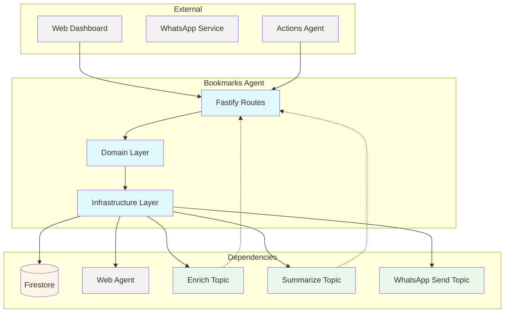
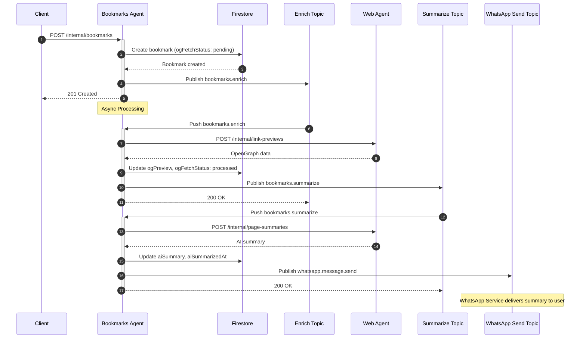

# Bookmarks Agent - Technical Reference

## Overview

Bookmarks-agent provides CRUD operations for user bookmarks with automatic OpenGraph metadata fetching via web-agent and AI summarization with WhatsApp delivery. The service uses a decoupled event-driven architecture where bookmark enrichment and summarization are processed asynchronously via Pub/Sub.

## Architecture



## Data Flow

### Bookmark Creation and Enrichment Flow (INT-210)



## Recent Changes

| Commit    | Description                                         | Date       |
| --------- | --------------------------------------------------- | ---------- |
| `eb345c7` | Release v2.0.0                                      | 2026-01-24 |
| (INT-210) | WhatsApp delivery for bookmark AI summaries         | 2026-01-24 |
| (INT-210) | WhatsAppSendPublisher integration in summarize flow | 2026-01-24 |
| (INT-172) | Improved test coverage for enrichment pipeline      | 2026-01-20 |

## API Endpoints

### Public Endpoints

| Method | Path                       | Description                        | Auth         |
| ------ | -------------------------- | ---------------------------------- | ------------ |
| GET    | `/bookmarks`               | List user's bookmarks (filterable) | Bearer token |
| POST   | `/bookmarks`               | Create new bookmark                | Bearer token |
| GET    | `/bookmarks/:id`           | Get specific bookmark              | Bearer token |
| PATCH  | `/bookmarks/:id`           | Update bookmark                    | Bearer token |
| DELETE | `/bookmarks/:id`           | Delete bookmark                    | Bearer token |
| POST   | `/bookmarks/:id/archive`   | Archive a bookmark                 | Bearer token |
| POST   | `/bookmarks/:id/unarchive` | Unarchive a bookmark               | Bearer token |
| GET    | `/images/proxy`            | Proxy external images (no auth)    | None         |

### Internal Endpoints

| Method | Path                                    | Description                         | Auth            |
| ------ | --------------------------------------- | ----------------------------------- | --------------- |
| POST   | `/internal/bookmarks`                   | Create bookmark from other services | Internal header |
| GET    | `/internal/bookmarks/:id`               | Get bookmark for internal services  | Internal header |
| PATCH  | `/internal/bookmarks/:id`               | Update bookmark (AI summary, OG)    | Internal header |
| POST   | `/internal/bookmarks/:id/force-refresh` | Force refresh OG metadata           | Internal header |
| POST   | `/internal/bookmarks/pubsub/enrich`     | Pub/Sub push handler for enrichment | Pub/Sub OIDC    |
| POST   | `/internal/bookmarks/pubsub/summarize`  | Pub/Sub push handler for AI summary | Pub/Sub OIDC    |

## Domain Model

### Bookmark

| Field            | Type                                   | Description                      |
| ---------------- | -------------------------------------- | -------------------------------- |
| `id`             | `string`                               | Unique bookmark identifier       |
| `userId`         | `string`                               | Owner user ID                    |
| `status`         | `'draft' \                             | 'active'`                        | Draft or active status |
| `url`            | `string`                               | Bookmark URL                     |
| `title`          | `string \                              | null`                            | Page title |
| `description`    | `string \                              | null`                            | Page description |
| `tags`           | `string[]`                             | User-defined tags                |
| `ogPreview`      | `OpenGraphPreview \                    | null`                            | Fetched metadata |
| `ogFetchedAt`    | `Date \                                | null`                            | When metadata was fetched |
| `ogFetchStatus`  | `'pending' \                           | 'processed' \                    | 'failed'` | Metadata fetch status |
| `aiSummary`      | `string \                              | null`                            | AI-generated summary |
| `aiSummarizedAt` | `Date \                                | null`                            | When summary was generated |
| `source`         | `string`                               | Source system (e.g., 'whatsapp') |
| `sourceId`       | `string`                               | ID in source system              |
| `archived`       | `boolean`                              | Soft delete flag                 |
| `createdAt`      | `Date`                                 | Creation timestamp               |
| `updatedAt`      | `Date`                                 | Last update timestamp            |

### OpenGraphPreview

| Field         | Type             | Description    |
| ------------- | ---------------- | -------------- |
| `title`       | `string \        | null`          | OG title |
| `description` | `string \        | null`          | OG description |
| `image`       | `string \        | null`          | OG image URL |
| `siteName`    | `string \        | null`          | OG site name |
| `type`        | `string \        | null`          | OG type |
| `favicon`     | `string \        | null`          | Favicon URL |

### Status Values

| Status      | Meaning                              |
| ----------- | ------------------------------------ |
| `pending`   | Awaiting OG fetch                    |
| `processed` | OG metadata successfully fetched     |
| `failed`    | OG fetch failed (site blocked, etc.) |

## Pub/Sub Events

### Published Events

| Topic                                  | Event Type              | Payload                              | Trigger                    |
| -------------------------------------- | ----------------------- | ------------------------------------ | -------------------------- |
| `INTEXURAOS_PUBSUB_BOOKMARK_ENRICH`    | `bookmarks.enrich`      | `{ bookmarkId, userId, url }`        | After bookmark creation    |
| `INTEXURAOS_PUBSUB_BOOKMARK_SUMMARIZE` | `bookmarks.summarize`   | `{ bookmarkId, userId }`             | After OG enrichment        |
| `INTEXURAOS_PUBSUB_WHATSAPP_SEND`      | `whatsapp.message.send` | `{ userId, message, correlationId }` | After AI summary (INT-210) |

### Subscribed Events

| Topic                                  | Handler                                | Action                               |
| -------------------------------------- | -------------------------------------- | ------------------------------------ |
| `INTEXURAOS_PUBSUB_BOOKMARK_ENRICH`    | `/internal/bookmarks/pubsub/enrich`    | Fetch OG metadata, trigger summarize |
| `INTEXURAOS_PUBSUB_BOOKMARK_SUMMARIZE` | `/internal/bookmarks/pubsub/summarize` | Generate AI summary, send WhatsApp   |

## Dependencies

### Internal Services

| Service     | Endpoint                   | Purpose                       |
| ----------- | -------------------------- | ----------------------------- |
| `web-agent` | `/internal/link-previews`  | OpenGraph metadata fetching   |
| `web-agent` | `/internal/page-summaries` | AI-powered page summarization |

### Infrastructure

| Component                          | Purpose                       |
| ---------------------------------- | ----------------------------- |
| Firestore (`bookmarks` collection) | Bookmark persistence          |
| Pub/Sub (3 topics)                 | Event-driven async processing |

### Decoupled WhatsApp Delivery (INT-210)

The service uses `WhatsAppSendPublisher` from `@intexuraos/infra-pubsub` to publish `SendMessageEvent` events. This decouples bookmarks-agent from whatsapp-service:

```typescript
interface SendMessageEvent {
  type: 'whatsapp.message.send';
  userId: string;
  message: string;
  correlationId: string;
  timestamp: string;
  replyToMessageId?: string;
}
```

The `summarizeBookmark` use case publishes this event after successful AI summarization. whatsapp-service's SendMessageWorker processes the event and delivers the message.

## Configuration

| Environment Variable                   | Required | Description                |
| -------------------------------------- | -------- | -------------------------- |
| `INTEXURAOS_WEB_AGENT_URL`             | Yes      | Web-agent base URL         |
| `INTEXURAOS_PUBSUB_BOOKMARK_ENRICH`    | Yes      | Enrichment topic name      |
| `INTEXURAOS_PUBSUB_BOOKMARK_SUMMARIZE` | Yes      | Summarization topic name   |
| `INTEXURAOS_PUBSUB_WHATSAPP_SEND`      | Yes      | WhatsApp send topic name   |
| `INTEXURAOS_INTERNAL_AUTH_TOKEN`       | Yes      | Internal auth header value |
| `INTEXURAOS_GCP_PROJECT_ID`            | Yes      | GCP project for Pub/Sub    |

## Gotchas

- **Enrichment is async** - `POST /internal/bookmarks` returns immediately; OG data and AI summary populate later via Pub/Sub
- **Duplicate detection by userId+url** - Same URL can exist for different users
- **OG fetch can fail** - Some sites block scrapers; status will be `failed`
- **WhatsApp delivery is fire-and-forget** - If Pub/Sub publish fails, no retry for WhatsApp notification
- **Force refresh always fetches** - Unlike enrichment, force-refresh ignores `processed` status

## File Structure

```
apps/bookmarks-agent/src/
  domain/
    models/
      bookmark.ts                    # Bookmark entity and types
    ports/
      bookmarkRepository.ts          # Repository interface
      bookmarkSummaryService.ts      # Summary service interface
      linkPreviewFetcher.ts          # Link preview interface
      summarizePublisher.ts          # Summarize event publisher interface
    usecases/
      createBookmark.ts              # Create with duplicate check
      getBookmark.ts                 # Get by ID
      listBookmarks.ts               # List with filters
      updateBookmark.ts              # User-facing update
      deleteBookmark.ts              # Hard delete
      archiveBookmark.ts             # Soft delete
      unarchiveBookmark.ts           # Restore
      enrichBookmark.ts              # OG fetch + trigger summarize
      summarizeBookmark.ts           # AI summary + WhatsApp delivery
      updateBookmarkInternal.ts      # Internal updates (OG, AI)
      forceRefreshBookmark.ts        # Force OG re-fetch
  infra/
    firestore/
      firestoreBookmarkRepository.ts # Firestore implementation
    linkpreview/
      webAgentClient.ts              # Web-agent OG client
    summary/
      webAgentSummaryClient.ts       # Web-agent summary client
    pubsub/
      enrichPublisher.ts             # Enrich event publisher
      summarizePublisher.ts          # Summarize event publisher
  routes/
    bookmarkRoutes.ts                # Public CRUD routes
    internalRoutes.ts                # Internal service routes
    pubsubRoutes.ts                  # Pub/Sub push handlers
  services.ts                        # DI container
  server.ts                          # Fastify setup
  config.ts                          # Configuration loading
  index.ts                           # Entry point
```
