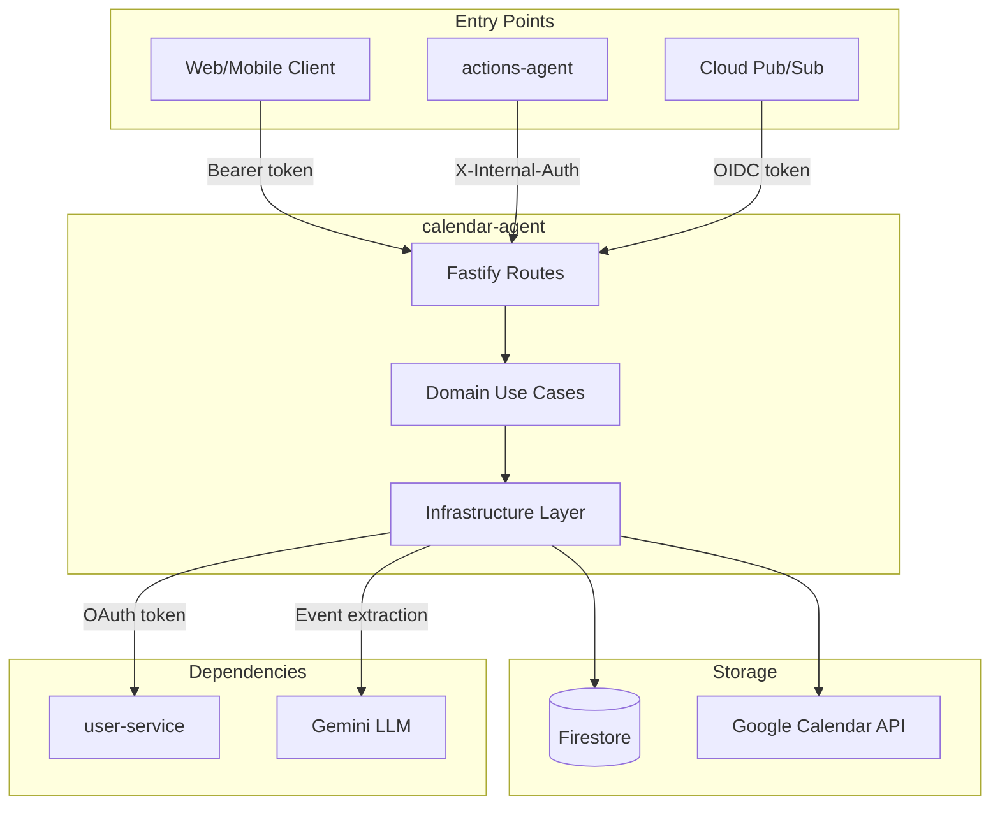
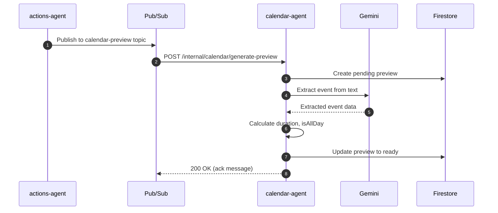
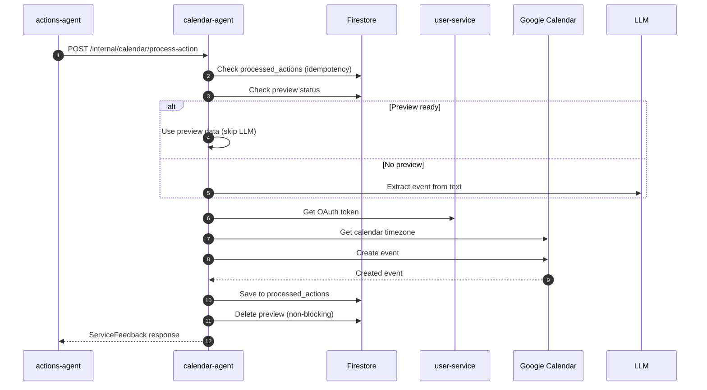

# Calendar Agent - Technical Reference

## Overview

Calendar-agent provides a REST API for Google Calendar operations using the googleapis library. It handles OAuth token retrieval via user-service, LLM-powered event extraction via Gemini, and maps Google Calendar errors to IntexuraOS error codes. Runs on Cloud Run with auto-scaling.

## Architecture



## Data Flow

### Preview Generation Flow (v2.0.0)



### Event Creation Flow



## Recent Changes (v2.0.0)

| Commit  | Description                                   | Issue   |
| ------- | --------------------------------------------- | ------- |
| INT-189 | Calendar preview generation before approval   | INT-189 |
| INT-200 | Calendar preview cleanup after event creation | INT-200 |
| INT-171 | Improved test coverage for calendar-agent     | INT-171 |

## API Endpoints

### Public Endpoints

| Method | Path                        | Description              | Auth         |
| ------ | --------------------------- | ------------------------ | ------------ |
| GET    | `/calendar/events`          | List events with filters | Bearer token |
| GET    | `/calendar/events/:eventId` | Get specific event       | Bearer token |
| POST   | `/calendar/events`          | Create event             | Bearer token |
| PATCH  | `/calendar/events/:eventId` | Update event             | Bearer token |
| DELETE | `/calendar/events/:eventId` | Delete event             | Bearer token |
| POST   | `/calendar/freebusy`        | Get free/busy info       | Bearer token |
| GET    | `/calendar/failed-events`   | List failed extractions  | Bearer token |

### Internal Endpoints

| Method | Path                                   | Description                      | Caller        |
| ------ | -------------------------------------- | -------------------------------- | ------------- |
| POST   | `/internal/calendar/process-action`    | Process calendar action          | actions-agent |
| POST   | `/internal/calendar/generate-preview`  | Generate event preview (Pub/Sub) | Cloud Pub/Sub |
| GET    | `/internal/calendar/preview/:actionId` | Get preview by action ID         | actions-agent |

## Query Parameters

**listEvents:**

| Parameter    | Type     | Description                      |
| ------------ | -------- | -------------------------------- |
| `calendarId` | string   | Calendar ID (default: primary)   |
| `timeMin`    | datetime | Lower bound for event start time |
| `timeMax`    | datetime | Upper bound for event start time |
| `maxResults` | integer  | Max events (1-2500)              |
| `q`          | string   | Free text search                 |

## Domain Models

### CalendarEvent

| Field         | Type             | Description                     |
| ------------- | ---------------- | ------------------------------- |
| `id`          | string           | Google event ID                 |
| `summary`     | string           | Event title                     |
| `description` | string?          | Event description               |
| `location`    | string?          | Event location                  |
| `start`       | EventDateTime    | Start time                      |
| `end`         | EventDateTime    | End time                        |
| `status`      | EventStatus      | confirmed, tentative, cancelled |
| `htmlLink`    | string?          | Google Calendar web link        |
| `created`     | string?          | Creation timestamp              |
| `updated`     | string?          | Last update timestamp           |
| `organizer`   | EventPerson?     | Event organizer                 |
| `attendees`   | EventAttendee[]? | Event attendees                 |

### CalendarPreview (v2.0.0)

| Field         | Type                             | Description                   |
| ------------- | -------------------------------- | ----------------------------- |
| `actionId`    | string                           | Action ID (document ID)       |
| `userId`      | string                           | User ID                       |
| `status`      | 'pending' \                      | 'ready' \                     | 'failed' | Preview generation status |
| `summary`     | string?                          | Extracted event title         |
| `start`       | string?                          | ISO 8601 start datetime       |
| `end`         | string?                          | ISO 8601 end datetime         |
| `location`    | string?                          | Extracted location            |
| `description` | string?                          | Extracted description         |
| `duration`    | string?                          | Human-readable duration       |
| `isAllDay`    | boolean?                         | True if all-day event         |
| `error`       | string?                          | Error message (if failed)     |
| `reasoning`   | string?                          | LLM reasoning for extraction  |
| `generatedAt` | string                           | ISO 8601 generation timestamp |

### ProcessedAction

| Field         | Type   | Description                      |
| ------------- | ------ | -------------------------------- |
| `actionId`    | string | Action ID (document ID)          |
| `userId`      | string | User ID                          |
| `eventId`     | string | Created Google Calendar event ID |
| `resourceUrl` | string | URL to view created event        |
| `createdAt`   | string | ISO 8601 creation timestamp      |

### FailedEvent

| Field          | Type    | Description           |
| -------------- | ------- | --------------------- |
| `id`           | string  | Firestore document ID |
| `userId`       | string  | User ID               |
| `actionId`     | string  | Action ID             |
| `originalText` | string  | Original user input   |
| `summary`      | string  | Attempted extraction  |
| `start`        | string? | Extracted start time  |
| `end`          | string? | Extracted end time    |
| `location`     | string? | Extracted location    |
| `description`  | string? | Extracted description |
| `error`        | string  | Failure reason        |
| `reasoning`    | string  | LLM reasoning         |
| `createdAt`    | Date    | Failure timestamp     |

### EventDateTime

| Field      | Type    | Description                         |
| ---------- | ------- | ----------------------------------- |
| `dateTime` | string? | ISO 8601 datetime (timed events)    |
| `date`     | string? | ISO 8601 date (all-day events)      |
| `timeZone` | string? | Timezone (e.g., "America/New_York") |

## Pub/Sub

### Subscribed Events

| Topic                               | Handler                               | Action                     |
| ----------------------------------- | ------------------------------------- | -------------------------- |
| `intexuraos-calendar-preview-{env}` | `/internal/calendar/generate-preview` | Generate preview from text |

**Message Format:**

```typescript
interface GeneratePreviewMessage {
  actionId: string;
  userId: string;
  text: string;
  currentDate: string; // YYYY-MM-DD
}
```

## Firestore Collections

| Collection                   | Document ID | Purpose                        |
| ---------------------------- | ----------- | ------------------------------ |
| `calendar_previews`          | actionId    | Pending/ready event previews   |
| `calendar_processed_actions` | actionId    | Idempotency for event creation |
| `calendar_failed_events`     | auto        | Failed extraction for review   |

## Error Codes

| Code                | HTTP Status | Description                          |
| ------------------- | ----------- | ------------------------------------ |
| `NOT_CONNECTED`     | 403         | User hasn't connected Google account |
| `TOKEN_ERROR`       | 401         | OAuth token invalid/expired          |
| `NOT_FOUND`         | 404         | Event/calendar not found             |
| `INVALID_REQUEST`   | 400         | Malformed request                    |
| `PERMISSION_DENIED` | 403         | Insufficient permissions             |
| `QUOTA_EXCEEDED`    | 403         | API rate limit exceeded              |
| `INTERNAL_ERROR`    | 500         | Downstream error                     |

## Dependencies

### Internal Services

| Service        | Endpoint                          | Purpose                         |
| -------------- | --------------------------------- | ------------------------------- |
| `user-service` | `/internal/google-oauth-token`    | Fetch Google OAuth access token |
| `user-service` | `/internal/users/:id/llm-api-key` | Get LLM API key for extraction  |

### External APIs

| Service                | Purpose                           |
| ---------------------- | --------------------------------- |
| Google Calendar API v3 | Event CRUD and free/busy queries  |
| Gemini LLM             | Natural language event extraction |

## Configuration

| Environment Variable             | Required | Description                     |
| -------------------------------- | -------- | ------------------------------- |
| `INTEXURAOS_USER_SERVICE_URL`    | Yes      | user-service base URL           |
| `INTEXURAOS_INTERNAL_AUTH_TOKEN` | Yes      | Shared secret for internal auth |

## Gotchas

**Default calendar** - If `calendarId` not provided, defaults to `primary`.

**EventDateTime format** - Use `dateTime` for timed events, `date` for all-day. Never both.

**All-day detection** - Events with date format `YYYY-MM-DD` (no time) are treated as all-day.

**Duration calculation** - Calculated from start/end difference. Returns null for invalid dates.

**Preview idempotency** - If preview already exists for actionId, returns existing preview.

**Preview cleanup** - Deletion after successful event creation is non-blocking (logs warning on failure).

**LLM fallback** - If preview is not ready, processCalendarAction falls back to direct LLM extraction.

**Patch vs update** - Update uses `events.patch` (partial), not `events.update` (full replace).

**OAuth tokens** - Access tokens fetched from user-service on each request. No caching.

**Error mapping** - Google API errors mapped to IntexuraOS codes (403 PERMISSION_DENIED vs QUOTA_EXCEEDED).

**maxResults maximum** - Google caps at 2500. Requesting higher returns error.

## File Structure

```
apps/calendar-agent/src/
  domain/
    models.ts                    # CalendarEvent, CalendarPreview, etc.
    errors.ts                    # CalendarError types
    ports.ts                     # Repository/client interfaces
    useCases/
      listEvents.ts              # List operation
      getEvent.ts                # Get single event
      createEvent.ts             # Create operation
      updateEvent.ts             # Patch operation
      deleteEvent.ts             # Delete operation
      getFreeBusy.ts             # Free/busy query
      processCalendarAction.ts   # Action processing with preview
      generateCalendarPreview.ts # Preview generation (v2.0.0)
  infra/
    google/
      googleCalendarClient.ts    # Google Calendar API v3 wrapper
    firestore/
      failedEventRepository.ts   # Failed events storage
      processedActionRepository.ts # Idempotency tracking
      calendarPreviewRepository.ts # Preview storage (v2.0.0)
    gemini/
      calendarActionExtractionService.ts # LLM extraction
    user/
      userServiceClient.ts       # user-service HTTP client
      llmUserServiceClient.ts    # LLM API key client
  routes/
    calendarRoutes.ts            # Public endpoints
    internalRoutes.ts            # Internal + Pub/Sub endpoints
  services.ts                    # DI container
  server.ts                      # Fastify server
```

---

**Last updated:** 2026-01-24
