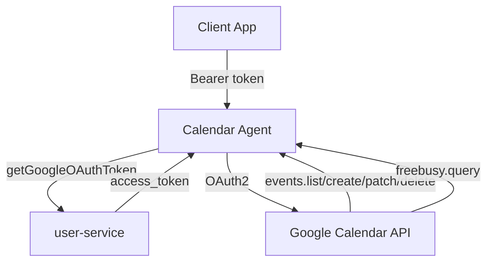

# Calendar Agent - Technical Reference

## Overview

Calendar-agent provides a REST API for Google Calendar operations using the googleapis library. It handles OAuth token retrieval via user-service and maps Google Calendar errors to IntexuraOS error codes.

## Architecture



## API Endpoints

| Method | Path                        | Description              | Auth         |
| ------ | --------------------------- | ------------------------ | ------------ |
| GET    | `/calendar/events`          | List events with filters | Bearer token |
| GET    | `/calendar/events/:eventId` | Get specific event       | Bearer token |
| POST   | `/calendar/events`          | Create event             | Bearer token |
| PATCH  | `/calendar/events/:eventId` | Update event             | Bearer token |
| DELETE | `/calendar/events/:eventId` | Delete event             | Bearer token |
| POST   | `/calendar/freebusy`        | Get free/busy info       | Bearer token |

## Query Parameters

**listEvents:**
| Parameter | Type | Description |
| ------------ | -------- | -------------------------------- |
| `calendarId` | string | Calendar ID (default: primary) |
| `timeMin` | datetime | Lower bound for event start time |
| `timeMax` | datetime | Upper bound for event start time |
| `maxResults` | integer | Max events (1-2500) |
| `q` | string | Free text search |

## Domain Models

### CalendarEvent

| Field         | Type               | Description                     |
| ------------- | ------------------ | ------------------------------- | ------------------------ |
| `id`          | string             | Google event ID                 |
| `summary`     | string             | Event title                     |
| `description` | string \           | undefined                       | Event description        |
| `location`    | string \           | undefined                       | Event location           |
| `start`       | EventDateTime      | Start time                      |
| `end`         | EventDateTime      | End time                        |
| `status`      | EventStatus        | confirmed, tentative, cancelled |
| `htmlLink`    | string \           | undefined                       | Google Calendar web link |
| `created`     | string \           | undefined                       | Creation timestamp       |
| `updated`     | string \           | undefined                       | Last update timestamp    |
| `organizer`   | EventPerson \      | undefined                       | Event organizer          |
| `attendees`   | EventAttendee[] \  | undefined                       | Event attendees          |

### EventDateTime

| Field      | Type      | Description |
| ---------- | --------- | ----------- | ----------------------------------- |
| `dateTime` | string \  | undefined   | ISO 8601 datetime (timed events)    |
| `date`     | string \  | undefined   | ISO 8601 date (all-day events)      |
| `timeZone` | string \  | undefined   | Timezone (e.g., "America/New_York") |

### EventPerson

| Field         | Type       | Description |
| ------------- | ---------- | ----------- | -------------------- |
| `email`       | string \   | undefined   | Email address        |
| `displayName` | string \   | undefined   | Display name         |
| `self`        | boolean \  | undefined   | True if current user |

### EventAttendee (extends EventPerson)

| Field            | Type              | Description |
| ---------------- | ----------------- | ----------- | ------------------------------------------ |
| `responseStatus` | ResponseStatus \  | undefined   | needsAction, declined, tentative, accepted |
| `optional`       | boolean \         | undefined   | Optional attendee flag                     |

### FreeBusySlot

| Field   | Type   | Description             |
| ------- | ------ | ----------------------- |
| `start` | string | ISO 8601 start datetime |
| `end`   | string | ISO 8601 end datetime   |

## Error Codes

| Code                | HTTP Status | Description                          |
| ------------------- | ----------- | ------------------------------------ |
| `NOT_CONNECTED`     | 403         | User hasn't connected Google account |
| `TOKEN_ERROR`       | 401         | OAuth token invalid/expired          |
| `NOT_FOUND`         | 404         | Event/calendar not found             |
| `INVALID_REQUEST`   | 400         | Malformed request                    |
| `PERMISSION_DENIED` | 403         | Insufficient permissions             |
| `QUOTA_EXCEEDED`    | 403         | API rate limit exceeded              |
| `INTERNAL_ERROR`    | 500         | Downstream error                     |

## Dependencies

### Internal Services

| Service        | Purpose                         |
| -------------- | ------------------------------- |
| `user-service` | Fetch Google OAuth access token |

### External APIs

| Service                | Purpose                          |
| ---------------------- | -------------------------------- |
| Google Calendar API v3 | Event CRUD and free/busy queries |
| googleapis npm package | API client library               |

## Configuration

| Environment Variable             | Required | Description                     |
| -------------------------------- | -------- | ------------------------------- |
| `INTEXURAOS_USER_SERVICE_URL`    | Yes      | user-service base URL           |
| `INTEXURAOS_INTERNAL_AUTH_TOKEN` | Yes      | Shared secret for internal auth |

## Gotchas

**Default calendar** - If `calendarId` not provided, defaults to `primary`.

**EventDateTime format** - Use `dateTime` for timed events, `date` for all-day. Never both.

**Patch vs update** - Update uses `events.patch` (partial), not `events.update` (full replace).

**OAuth tokens** - Access tokens fetched from user-service on each request. No caching.

**Error mapping** - Google API errors mapped to IntexuraOS codes (403 PERMISSION_DENIED vs QUOTA_EXCEEDED).

**Free/busy format** - Returns Map of calendarId to busy slots. Empty array = no conflicts.

**Attendees without emails** - Google requires email for all attendees.

**Search scope** - `q` parameter searches title, description, location, attendees.

**maxResults maximum** - Google caps at 2500. Requesting higher returns error.

**Single events** - listEvents defaults to singleEvents=true (expands recurring).

## File Structure

```
apps/calendar-agent/src/
  domain/
    models.ts              # CalendarEvent, EventDateTime, etc.
    errors.ts              # CalendarError types
    ports.ts               # GoogleCalendarClient interface
    usecases/
      listEvents.ts        # List operation
      getEvent.ts          # Get single event
      createEvent.ts       # Create operation
      updateEvent.ts       # Patch operation
      deleteEvent.ts       # Delete operation
      getFreeBusy.ts       # Free/busy query
  infra/
    google/
      googleCalendarClient.ts  # google Calendar API v3 wrapper
    user/
      userServiceClient.ts     # user-service HTTP client
  routes/
    calendarRoutes.ts     # All 6 public endpoints
  services.ts              # DI container
  server.ts                # Fastify server
```
