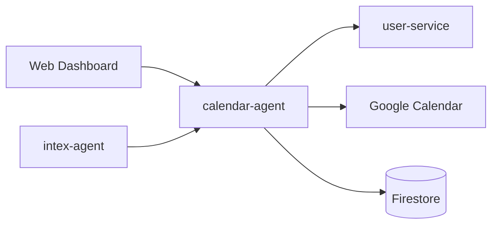

# Calendar Agent Technical Reference

Calendar Agent provides Google Calendar operations using the Google APIs client, user-service OAuth token retrieval, LLM-powered event extraction, and Firestore-backed failed-event recovery.

## Architecture

```mermaid
flowchart LR
    Web[Web Dashboard] --> Calendar[calendar-agent]
    Intex[intex-agent] --> Calendar
    Calendar --> User[user-service]
    Calendar --> Google[Google Calendar]
    Calendar --> Store[(Firestore)]
```

## Public Routes

| Method | Path | Purpose |
| --- | --- | --- |
| `GET` | `/connection` | Check Google Calendar connection |
| `GET` | `/events` | List calendar events |
| `POST` | `/events` | Create an event |
| `GET` | `/failed-events` | List failed extractions |
| `POST` | `/failed-events/:id/retry` | Retry a failed event |

## Internal Routes

| Method | Path | Purpose | Caller |
| --- | --- | --- | --- |
| `POST` | `/internal/calendar/events` | Create an event from a trusted service | Intex/internal clients |
| `POST` | `/internal/calendar/preview` | Generate a synchronous event preview | Internal clients |
| `GET` | `/internal/calendar/preview/:actionId` | Fetch a stored preview | Internal clients |

## Calendar Queries And Confirmed Updates

- `POST /internal/calendar/events/query` supports bounded list/count requests.
- `PATCH /internal/calendar/events/:eventId` updates identified events, including attendee additions/removals and supported event fields.
- Intex owns clarification and user confirmation. The update contract checks the confirmed event’s ETag and rejects stale snapshots with `CONFLICT`; unspecified fields are preserved.
- Multi-event Intex updates call the singular endpoint per event; they do not provide atomic rollback.

## Daily Lookahead

- `GET /schedules/calendar-daily-lookahead` reads the authenticated user’s schedule and delivery status.
- `PUT /schedules/calendar-daily-lookahead` accepts `enabled`, `localTime`, and `timeZone`; `localTime` must fall on a 15-minute boundary.
- `POST /internal/calendar/schedules/tick` claims due schedules with leases and sends the fixed next-24-hours calendar request through WhatsApp’s Matrix outbound path with `startNewSession: true`.
- Scheduling follows the configured IANA zone, including DST. A per-schedule/local-date idempotency key prevents duplicate outbound requests; transport failures retry after 15 minutes, while setup-required outcomes are recorded without that transient retry.

Every internal route must call `logIncomingRequest()` before auth validation.

