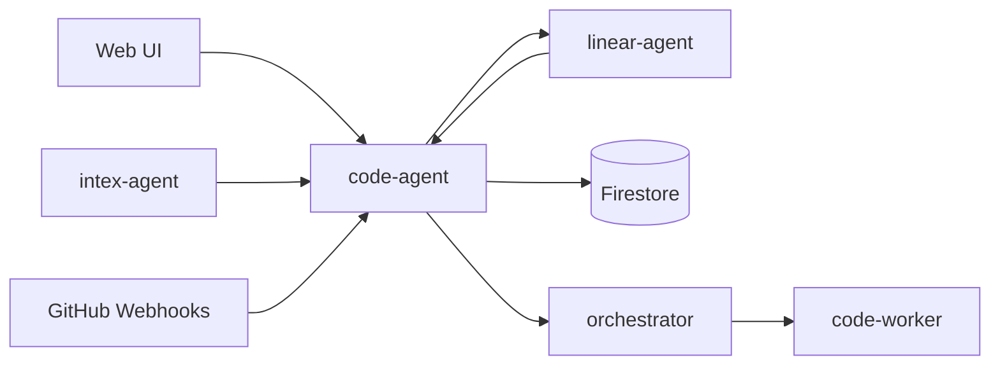

# Code Agent Technical Reference

Code Agent orchestrates autonomous code execution tasks. It accepts task submissions from the web UI, Intex Agent, trusted internal services, GitHub PR comments, and Linear assignment automation. It sanitizes prompts, deduplicates tasks, dispatches signed worker requests, streams logs, processes completion webhooks, manages PR automation, syncs Linear state, and records task lifecycle events.

## Architecture

## Current Internal Entry Points

| Method | Path | Purpose |
| --- | --- | --- |
| `POST` | `/internal/code/submit` | Create a code task from Intex Agent or another trusted service |
| `POST` | `/internal/code/submit-phase2` | Submit Phase 2 implementation from an approved planning task |
| `PATCH` | `/internal/code-tasks/:taskId` | Receive worker status callbacks for a code task |
| `PATCH` | `/internal/code-tasks/:id/status` | Commit terminal task status through the redundant status endpoint |
| `GET` | `/internal/code-tasks/zombies` | List zombie tasks for diagnostics |
| `POST` | `/internal/code/detect-zombies` | Detect and interrupt zombie tasks from scheduler automation |
| `POST` | `/internal/code/cancel-with-nonce` | Cancel a task through a signed WhatsApp nonce |
| `GET` | `/internal/code-tasks/linear/:linearIssueId/active` | Check whether a Linear issue has an active blocking task |
| `POST` | `/internal/code/heartbeat` | Process orchestrator heartbeats |
| `POST` | `/internal/code/group-summary/recompute` | Recompute issue group summaries after Linear label changes |
| `POST` | `/internal/code/pubsub/pr-triage` | Receive Pub/Sub-triggered PR triage events |
| `GET` | `/internal/linear/issue-context/:identifier` | Fetch Linear issue context for orchestrator diagnostics |
| `POST` | `/internal/drain-queue` | Drain queued code tasks |
| `GET` | `/internal/tasks/:taskId/dispatch-metadata` | Fetch dispatch metadata for internal task diagnostics |
| `POST` | `/internal/webhooks/task-complete` | Receive task completion callbacks from orchestrator |
| `POST` | `/internal/webhooks/task-event` | Receive worker task events |
| `POST` | `/internal/webhooks/compliance-report` | Receive orchestrator compliance reports |
| `POST` | `/internal/webhooks/usage-events` | Forward orchestrator usage events to LLM usage service |
| `POST` | `/internal/logs` | Receive log chunks from orchestrator |
| `POST` | `/internal/turn-metrics` | Receive turn metrics from orchestrator |
| `POST` | `/internal/merge-queue/tick` | Run the merge queue scheduler tick |
| `POST` | `/internal/merge-conflicts/reconcile` | Reconcile merge-conflict state from scheduler automation |
| `POST` | `/internal/execution-memory/process` | Process execution memory backlog entries |
| `POST` | `/internal/execution-memory/sweep-errored` | Requeue permanently errored execution memory applications |
| `POST` | `/internal/execution-memory/prune-stale` | Prune aged zero-application execution memories |
| `POST` | `/internal/archive-stale-groups` | Archive stale task groups from scheduler automation |
| `POST` | `/internal/auto-archive-merged-tasks` | Archive merged tasks from scheduler automation |

`POST /internal/code/submit` uses internal auth, accepts `userId`, `prompt`, optional `workerType`, optional `taskMode`, and optional `linearIssueId`, then delegates to the same direct task submission use case as user-facing code task creation.

## GitHub Review Routing

GitHub Agent review triage supports `code_quality`, `security`, `architecture`, `test_quality`, and `documentation` review scopes. Plan-only PRs still route to `plan_review` through deterministic file matching. Docs-only non-plan PRs now route deterministically to a `documentation` review without LLM triage; mixed documentation and code changes continue through GitHub Agent triage so multiple review scopes can be requested when appropriate.

## Changes Since v3.8.0

- **Error remediation:** `POST /webhooks/sentry` verifies SentryBox signatures and accepts supported issue/event alerts. `processSentryWebhook` uses durable leased reservations; repeated correlated errors and active remediation work reuse existing tasks. Retryable reservation failures remain retryable.
- **Dispatch ownership:** queue dispatch claims a per-user lease and task attempt before contacting the worker. Attempt/owner checks prevent stale acknowledgments or rollbacks from overwriting newer ownership. Review reservations and PR locks coordinate competing review requests; queued non-review work runs before review.
- **Lifecycle evidence:** `statusChangedAt` records status transitions separately from ordinary updates; `taskLifecycleTime.ts` resolves legacy timestamps. Merge-ready evidence and invalidation decisions persist with task-group summaries rather than depending only on the latest task.
- **Planning and messages:** planning uses one artifact and one evidence PR; `sendTaskMessage` accepts planning tasks but still rejects ephemeral review/remediation tasks. `startAskAgent` selects `workerType: codex`.
- **Provider routing:** platform LLM clients use OpenRouter through the shared factory. Expected recovery/validation warnings remain in logs without duplicate error alerts.

## Removed Compatibility Behavior

- No action status mirror service.
- No action-status callback client.
- No action approval fields on new task records.
- No public or internal command/action compatibility routes.

## Verification Notes

Task completion, cancellation, interruption, and failure should update code-task state and Linear state only. Tests should assert no removed callback route is invoked even when old stored task records contain legacy metadata.
