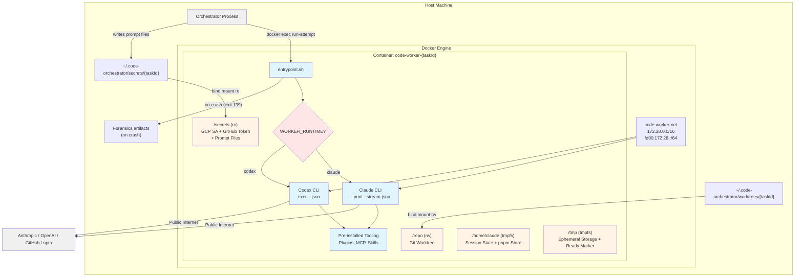
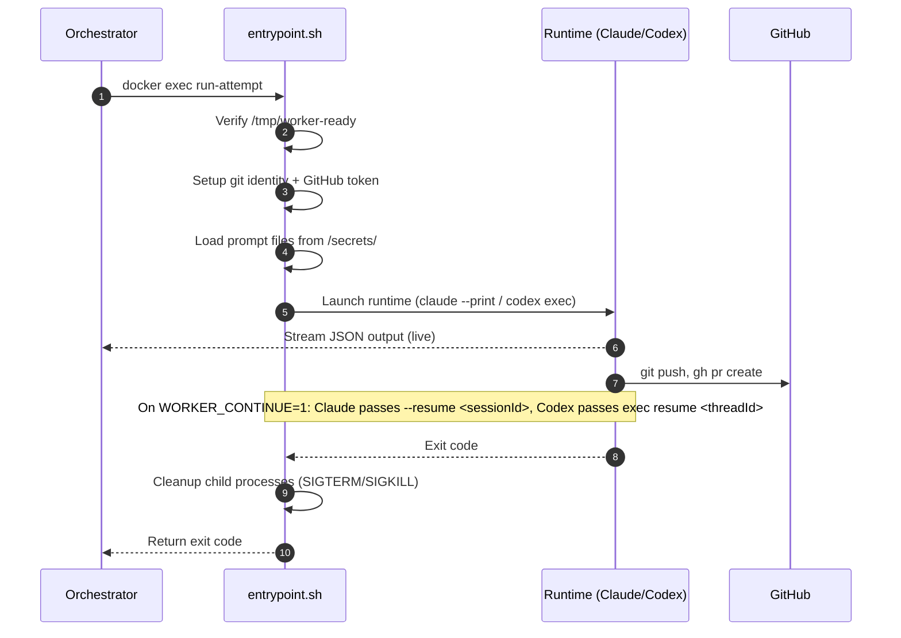

# Code Worker — Technical Reference

## Overview

Code Worker is a Docker container image that provides an isolated execution environment for Claude Code and Codex sessions. It is not a standalone service with HTTP endpoints; instead, the orchestrator manages its lifecycle via the Docker API (dockerode). The image bundles both CLIs, a full developer toolchain (including Playwright/Chromium and pre-installed worker tooling), and a bash entrypoint that handles authentication, secret syncing, dependency installation, and runtime-specific execution. Two image variants exist: a production image (`Dockerfile`) and a test image (`Dockerfile.test`) that substitutes bash stubs for the Claude and Codex CLI paths used in container tests. The image is stored at `europe-central2-docker.pkg.dev/intexuraos-dev-pbuchman/intexuraos-dev/code-worker:latest` and is rebuilt daily at 4 AM UTC via Cloud Build.

## Architecture



## Data Flow



## Changes Since v3.8.0

The entrypoint restores Codex MCP configuration from `/opt/codex-home/.codex` into its temporary home. `config-defaults/codex-config.toml` configures Linear with `LINEAR_API_KEY` and `error_hub` with `ERROR_HUB_HOST`; the Error Hub client connects to the private SentryBox compatibility API with Seer disabled.

The worker no longer mounts/activates a general GCP service-account key for startup secret sync. It consumes the host-rendered task projection. Docker image and orchestrator MCP verification tests cover the restored configuration and private error-service connection.

## Recent Changes

| Commit      | Description                                                               | Date       |
| ----------- | ------------------------------------------------------------------------- | ---------- |
| `b622a5ea`  | Use `--resume` with explicit session ID for Claude resumes                | 2026-04-10 |
| `10d395d5`  | Add Codex streaming regression tests                                      | 2026-04-04 |
| `3e06904a`  | Stream Codex output live instead of buffering to temp file                | 2026-04-04 |
| `2ad29f77`  | Remove process-level timeout from Codex entrypoint                        | 2026-04-04 |
| `2f1bf669`  | Use BusyBox-compatible timeout flags in Codex entrypoint                  | 2026-04-04 |
| `2130968f`  | Code-worker enforcement for Linear MCP timeout (INT-1205)                 | 2026-04-03 |
| `adbd37d2`  | Add Codex session automation parity evidence (INT-1108)                   | 2026-03-29 |
| `19f7b8e4`  | Add codex-xhigh worker type preset for high-effort Codex tasks (INT-1109) | 2026-03-28 |
| `1b525d1e`  | Generalize code worker auth and image naming (INT-1104)                   | 2026-03-27 |

### Claude Resume Fix — `--resume` Replaces `--continue` (b622a5ea)

Replaced the `--continue` flag with `--resume "$CLAUDE_SESSION_ID"` for Claude session resumption. The `--continue` flag in `--print` mode with `--system-prompt` override silently created a fresh session instead of resuming the prior one. The `--resume <id>` mechanism is the only reliable way to resume a Claude session in this invocation shape. Added a fail-fast guard requiring `CLAUDE_SESSION_ID` when `WORKER_CONTINUE=1` — mirroring the existing Codex guard that requires `CODEX_THREAD_ID`.

### Rename from claude-worker to code-worker (1b525d1e)

Renamed the service from `claude-worker` to `code-worker` to reflect its runtime-agnostic design. Generalized all Claude-specific environment variable names (`CLAUDE_CONTINUE` to `WORKER_CONTINUE`, `CLAUDE_FORENSICS` to `WORKER_FORENSICS`) and added the `WORKER_RUNTIME` dispatch mechanism that routes to either the Claude or Codex attempt handler.

### Codex Runtime Support (adbd37d2, 19f7b8e4)

Added a full `run_codex_attempt()` handler that invokes `codex exec --json` with stdin-based prompt delivery, thread-based session resumption (`codex exec resume <threadId>`), and configurable reasoning effort (`CODEX_REASONING_EFFORT`). The `codex-xhigh` worker type sets effort to `xhigh` for complex tasks. Bootstrap evidence logging tracks Codex skill discovery, GCP auth, and envrc loading state.

### Codex Live Streaming (3e06904a)

Replaced the temp-file buffering approach for Codex output with direct stdout streaming. Codex output now flows live to the orchestrator's log pipeline — each line appears as it is produced. This matches the Claude runtime's existing stream-json behavior and enables real-time dashboard updates for Codex tasks.

### Linear MCP Timeout Enforcement (2130968f)

Added timeout enforcement for the Linear MCP server integration to prevent hung MCP connections from stalling worker attempts indefinitely.

## Container Configuration

### Security Controls

| Control          | Setting                                            |
| ---------------- | -------------------------------------------------- |
| User             | Host user (dynamic UID/GID)                        |
| CapDrop          | ALL                                                |
| CapAdd           | NET_RAW (+ SYS_PTRACE in forensics mode)           |
| SecurityOpt      | no-new-privileges                                  |
| Secrets mount    | Read-only bind mount                               |
| Repo mount       | Read-write bind mount                              |
| Root filesystem  | Writable (required by runtime CLIs)                |
| Docker socket    | NOT mounted                                        |
| Removed binaries | wget, nc                                           |
| Max concurrent   | 4 (configurable via `maxConcurrent`)               |
| Timeout          | 2 hours per attempt (configurable via `timeoutMs`) |

### Network Isolation

| Target                                    | Access  | Enforcement                 |
| ----------------------------------------- | ------- | --------------------------- |
| Public internet                           | Allowed | User-defined worker bridge  |
| Cloud metadata                            | Blocked | iptables on production host |
| Localhost (127.0.0.0/8)                   | Blocked | iptables on production host |
| Private IPs (10/8, 172.16/12, 192.168/16) | Blocked | iptables on production host |

Network: `code-worker-net` (dual-stack bridge driver, fixed Linux bridge `code-worker-br`, IPv4 subnet `172.28.0.0/16`, IPv6 subnet `fd00:172:28::/64`, IP masquerade enabled).

## Mount Points

| Container Path            | Host Source                                 | Mode      | Purpose                                               |
| ------------------------- | ------------------------------------------- | --------- | ----------------------------------------------------- |
| `/repo`                   | `{secretsBasePath}/../worktrees/{taskId}`   | rw        | Git worktree for the task                             |
| `/secrets`                | `{secretsBasePath}/{taskId}`                | ro        | GCP SA key + GitHub token + prompt files              |
| `/home/claude/pnpm-store` | `{secretsBasePath}/../pnpm-store`           | rw        | Shared pnpm content-addressable store                 |
| `/home/claude/.claude`    | `{secretsBasePath}/claude-session-{taskId}` | rw        | Claude session state (persists across attempts)       |
| `/home/claude/.codex`     | `{secretsBasePath}/codex-state-{taskId}`    | rw        | Codex runtime state (persists across attempts)        |
| `/tmp`                    | tmpfs (2 GB)                                | rw,noexec | Ephemeral scratch + ready marker                      |
| `/home/claude`            | tmpfs (500 MB)                              | rw,noexec | Home directory (pnpm-store, .claude, .codex overlaid) |
| `/repo/node_modules`      | tmpfs (4 GB)                                | rw,exec   | Linux-native node_modules (shadows Mac host mount)    |
| `{mainGitDir}`            | Main `.git` directory (for worktrees)       | rw        | Git operations on worktrees                           |

### Secrets Directory Files

| File                | Required | Description                                       |
| ------------------- | -------- | ------------------------------------------------- |
| `github-token`      | Optional | GitHub access token (refreshed every 30 min)      |
| `system-prompt.txt` | Required | Worker system prompt (read at `run-attempt` time) |
| `user-prompt.txt`   | Required | Worker user prompt (read via stdin redirect)      |

## Environment Variables

| Variable                              | Source           | Description                                                                              |
| ------------------------------------- | ---------------- | ---------------------------------------------------------------------------------------- |
| `TASK_ID`                             | Orchestrator     | Unique task identifier                                                                   |
| `WORKER_RUNTIME`                      | Orchestrator     | `claude` or `codex` — selects which CLI to invoke                                        |
| `ANTHROPIC_API_KEY`                   | Orchestrator env | API key for Anthropic (opus/auto/sonnet types); omitted when shared credentials are used |
| `ANTHROPIC_BASE_URL`                  | Worker type map  | API endpoint URL; omitted when shared credentials are used                               |
| `ANTHROPIC_MODEL`                     | Worker type map  | Model override (set per worker type when defined)                                        |
| `CLAUDE_SESSION_ID`                   | Orchestrator     | Session ID for resumed Claude attempts (required when `WORKER_CONTINUE=1`)               |
| `CODEX_HOME`                          | Orchestrator     | `/home/claude/.codex` for Codex runtime                                                  |
| `CODEX_SQLITE_HOME`                   | Orchestrator     | `/home/claude/.codex` for Codex thread persistence                                       |
| `CODEX_THREAD_ID`                     | Orchestrator     | Thread ID for resumed Codex attempts (required when `WORKER_CONTINUE=1`)                 |
| `CODEX_REASONING_EFFORT`              | Orchestrator     | Reasoning effort level for Codex runtime (e.g., `xhigh`)                                 |
| `LINEAR_API_KEY`                      | Orchestrator env | Linear integration key                                                                   |
| `ERROR_HUB_HOST`                      | Orchestrator env | Private SentryBox host for the `error_hub` MCP entry                                      |
| `CLAUDE_PROJECT_DIR`                  | Fixed            | `/repo`                                                                                  |
| `CODE_WORKER_MODE`                    | Fixed            | `1` — identifies this as an automated worker process                                     |
| `WORKER_MANAGED_MODE`                 | Orchestrator     | `1` = stay alive, accept `run-attempt` via docker exec                                   |
| `WORKER_CONTINUE`                     | Orchestrator     | `1` = pass `--continue` (Claude) or `exec resume` (Codex) to resume previous session     |
| `WORKER_FORENSICS`                    | Orchestrator     | `1` = enable crash forensics collection                                                  |
| `WORKER_FORENSICS_DIR`                | Orchestrator     | Base directory for forensics output (default: `/var/crash`)                              |
| `GIT_USER_NAME`                       | Orchestrator env | Git commit author name                                                                   |
| `GIT_USER_EMAIL`                      | Orchestrator env | Git commit author email                                                                  |
| `HOME`                                | Dockerfile       | `/home/claude`                                                                           |
| `NODE_ENV`                            | Dockerfile       | `production` (or `test` in test image)                                                   |
| `COREPACK_ENABLE_DOWNLOAD_PROMPT`     | Dockerfile/env   | `0` — suppress corepack prompts in CI                                                    |
| `PLAYWRIGHT_SKIP_BROWSER_DOWNLOAD`    | Dockerfile       | `1` — use system Chromium                                                                |
| `PLAYWRIGHT_CHROMIUM_EXECUTABLE_PATH` | Dockerfile       | `/usr/bin/chromium-browser`                                                              |

## Worker Types

| Type              | Runtime | Authentication           | Model override           | Effort |
| ----------------- | ------- | ------------------------ | ------------------------ | ------ |
| `auto`            | claude  | Claude subscription      | runtime default          | —      |
| `opus`            | claude  | Claude subscription      | `opus`                   | high   |
| `sonnet`          | claude  | Claude subscription      | `sonnet`                 | —      |
| `codex`           | codex   | Codex subscription       | runtime default          | —      |
| `codex-xhigh`     | codex   | Codex subscription       | runtime default          | xhigh  |
| `openrouter-free` | claude  | `OPENROUTER_API_KEY`     | `qwen/qwen3.6-plus:free` | high   |

The `openrouter-free` type routes through OpenRouter's free tier with experimental betas disabled.

## Entrypoint Flow

The `entrypoint.sh` script supports two invocation modes:

### Primary Container Startup (always runs)

1. **Root check** — Exits with error if running as UID 0
2. **Network verification** — Background check that cloud metadata server (169.254.169.254) is unreachable
3. **Directory creation** — Creates `/home/claude/.config/gcloud`, `/home/claude/.claude`, and `/home/claude/.agents/skills` (tmpfs wipes image-time directories)
4. **Config restoration** — Copies baked-in Claude defaults from `/opt/claude-defaults/` to `/home/claude/`
5. **Plugin restoration** — Copies pre-installed Claude Code plugins from `/opt/claude-plugins/.claude/plugins/` to `/home/claude/.claude/plugins/`, rewriting staging paths to match the runtime HOME directory
6. **Codex skill restoration** — Copies pre-staged Codex Superpowers skills from `/opt/codex-home/.agents/` to `/home/claude/.agents/`
7. **Mount verification** — Checks that `/repo` exists and contains a git repository (supports both `.git` directory and worktree `.git` file)
8. **Codex MCP restoration** — Copies `/opt/codex-home/.codex/` into `/home/claude/.codex/`
9. **Host configuration boundary** — Uses the host-rendered, task-filtered `/repo/.envrc`; does not activate GCP credentials or fetch Secret Manager values
10. **Environment loading** — Sources `/repo/.envrc` and runs `direnv allow /repo` so env vars auto-load for all subsequent commands
11. **Git identity setup** — Configures `user.name` / `user.email` from `GIT_USER_NAME` / `GIT_USER_EMAIL` env vars at both global and repo level
12. **GitHub token setup** — Reads token from `/secrets/github-token`; configures git credential helper to read the token file directly on each git operation
13. **Bootstrap evidence** — Emits `[entrypoint] Bootstrap evidence:` log line showing status of codex_skills, github_token, gcp_auth, secret_sync, and envrc
14. **pnpm configuration** — Configures pnpm to use `/home/claude/pnpm-store` as the persistent store directory
15. **pnpm install** — If `/repo/pnpm-lock.yaml` exists, runs `pnpm install --frozen-lockfile` with `CI=true`
16. **Attribution config** — Picks a random verb from 25 options and writes `{ attribution: { commit, pr } }` to `/repo/.claude/settings.local.json`
17. **Readiness marker** — Writes `/tmp/worker-ready`

### Managed Mode (`WORKER_MANAGED_MODE=1`)

After startup, sleeps in an infinite loop. The orchestrator triggers work via:

```bash
docker exec <container> /entrypoint.sh run-attempt
```

The `run-attempt` handler:

1. Verifies `/tmp/worker-ready` exists
2. Dispatches to the selected runtime based on `WORKER_RUNTIME`:
   - `claude`: calls `run_claude_attempt()`
   - `codex`: calls `run_codex_attempt()`
3. Checks `/secrets/system-prompt.txt` and `/secrets/user-prompt.txt` are present
4. Sets up git identity and GitHub token for this attempt
5. If `WORKER_FORENSICS=1`: enables core dumps (`ulimit -c unlimited`), creates a timestamped forensics directory, and writes attempt metadata
6. Invokes the runtime:
   - **Claude:** `claude --print --verbose --output-format stream-json --dangerously-skip-permissions --system-prompt <content> [--resume <sessionId>] < /secrets/user-prompt.txt`
   - **Codex:** Merges system + user prompts into a temp file, then `codex exec --json --skip-git-repo-check --dangerously-bypass-approvals-and-sandbox [-c model_reasoning_effort=<effort>] - < /tmp/codex-prompt.*`
7. If `WORKER_CONTINUE=1`:
   - Claude: passes `--resume "$CLAUDE_SESSION_ID"` to resume the previous session (requires `CLAUDE_SESSION_ID` to be set)
   - Codex: passes `exec resume <CODEX_THREAD_ID>` (requires `CODEX_THREAD_ID` to be set)
8. Codex output streams directly to stdout (live, not buffered)
9. If forensics enabled and exit code is 139 (segfault): captures crash forensics (core dumps, GDB backtraces, debug logs, session state, shell snapshots)
10. If forensics enabled: tees runtime output to `claude-stream.log` or `codex-stream.log` in the forensics directory
11. Terminates lingering child processes (SIGTERM, wait 0.5s, SIGKILL) to prevent Docker exec file descriptor leaks

### Codex Runtime Evidence

Codex runtime setup is surfaced through stable log evidence:

- `[entrypoint] Bootstrap evidence: ...`
  Shows whether Codex skill discovery, GitHub token setup, GCP auth, secret sync, and `.envrc` loading all executed during worker startup.
- `[entrypoint] Codex runtime evidence: ...`
  Shows whether the attempt is fresh vs resume, whether a thread id was available, and which reasoning effort mode is being used.

### Legacy Mode (default, `WORKER_MANAGED_MODE` unset)

After startup, immediately calls the selected runtime attempt runner and exits with its exit code. No `docker exec` needed.

## Crash Forensics

When `WORKER_FORENSICS=1` is set, the entrypoint collects diagnostic artifacts on crash:

| Artifact                   | Location in forensics dir          | Content                                         |
| -------------------------- | ---------------------------------- | ----------------------------------------------- |
| `crash-summary.txt`        | Root                               | Task ID, user, system info, Claude binary info  |
| `claude-exit-code.txt`     | Root                               | Numeric exit code                               |
| `codex-exit-code.txt`      | Root                               | Numeric exit code (Codex runtime)               |
| `claude-stream.log`        | Root                               | Full Claude stdout/stderr output                |
| `codex-stream.log`         | Root                               | Full Codex stdout/stderr output                 |
| `attempt-meta.txt`         | Root                               | Start time, task ID, runtime, continue flag     |
| `claude-cmd-timing`        | `claude-cmd-timing/`               | Command timing data from `/tmp`                 |
| `claude-debug`             | `claude-debug/`                    | Claude debug directory contents                 |
| `claude-projects-repo`     | `claude-projects-repo/`            | Claude project state for `/repo`                |
| `shell-snapshots`          | `shell-snapshots/`                 | Claude shell snapshot files                     |
| `.claude.json`             | Root                               | Claude config at time of crash                  |
| `core*`                    | Root                               | Core dump files (if generated)                  |
| `core*.gdb.txt`            | Root                               | GDB backtrace of core dump                      |
| `core-files.txt`           | Root                               | List of found core files                        |

Forensics directories are named `attempt-{timestamp}-{pid}` under `WORKER_FORENSICS_DIR` (default `/var/crash`).

## Pre-installed Claude Code Plugins

Plugins are installed at image build time into `/opt/claude-plugins/.claude/plugins/` and restored to the runtime `.claude` directory at container start:

| Plugin                | Marketplace                     | Purpose                        |
| --------------------- | ------------------------------- | ------------------------------ |
| superpowers           | superpowers-marketplace         | Enhanced tool capabilities     |
| context7              | claude-plugins-official         | Documentation lookup via MCP   |
| commit-commands       | claude-plugins-official         | Commit attribution management  |
| pr-review-toolkit     | claude-plugins-official         | PR review automation           |
| playwright            | claude-plugins-official         | Browser automation via MCP     |
| frontend-design       | claude-plugins-official         | Frontend design assistance     |

## Pre-installed Codex Skills

Codex discovers skills from `~/.agents/skills`. The Superpowers skill set is cloned at build time from `github.com/obra/superpowers` into `/opt/codex-superpowers/` and symlinked into `/opt/codex-home/.agents/skills/superpowers`. At container start, the entrypoint copies this into the runtime home directory.

## Config Defaults

### claude.json (baked at `/opt/claude-defaults/.claude.json`)

Pre-populates onboarding and migration state to skip all interactive setup flows:

```json
{
  "firstStartTime": "2026-01-01T00:00:00.000Z",
  "hasCompletedOnboarding": true,
  "lastOnboardingVersion": "2.1.37",
  "autoUpdates": false,
  "sonnet45MigrationComplete": true,
  "opus45MigrationComplete": true,
  "opusProMigrationComplete": true,
  "thinkingMigrationComplete": true,
  "cachedChromeExtensionInstalled": false,
  "bypassPermissionsModeAccepted": true
}
```

### .bashrc (baked at `/opt/claude-defaults/.bashrc`)

Hooks direnv into bash so environment variables from `.envrc` auto-load when entering `/repo`:

```bash
eval "$(direnv hook bash)"
```

### settings.local.json (runtime-generated at `/repo/.claude/settings.local.json`)

Written by the entrypoint at startup with a randomized attribution verb. The dev reference file also configures `CLAUDE_CODE_ENABLE_TASKS=1` via the `env` key:

```json
{
  "preferredNotifChannel": "terminal_bell",
  "outputStyle": "explanatory",
  "env": {
    "CLAUDE_CODE_ENABLE_TASKS": "1"
  },
  "attribution": {
    "commit": "Crafted with love by ... Intex",
    "pr": "Crafted with love by ... Intex"
  }
}
```

If `/repo/.claude/settings.local.json` already exists, the entrypoint merges the `attribution` key using `jq` rather than overwriting.

## Installed Toolchain

| Tool                  | Install Source         | Purpose                                                    |
| --------------------- | ---------------------- | ---------------------------------------------------------- |
| git                   | Alpine package         | Version control                                            |
| openssh-client        | Alpine package         | SSH keys for git operations                                |
| pnpm                  | Corepack               | Package management (CI)                                    |
| ripgrep               | Alpine edge/community  | Fast code search                                           |
| fd                    | Alpine edge/community  | Fast file finder                                           |
| bat                   | Alpine edge/community  | Syntax-highlighted file viewer                             |
| jq                    | Alpine package         | JSON processing                                            |
| gh                    | Alpine edge/community  | GitHub CLI (PR creation)                                   |
| chromium              | Alpine edge/community  | Browser for @playwright/mcp                                |
| direnv                | Alpine edge/community  | Automatic .envrc loading                                   |
| terraform             | HashiCorp binary 1.7.0 | Infrastructure validation                                  |
| gcloud                | Google Cloud SDK       | GCP authentication and ops                                 |
| python3 / py3-pip     | Alpine package         | gcloud CLI dependency + MCP deps                           |
| curl                  | Alpine package         | HTTP requests                                              |
| strace / gdb          | Alpine package         | Crash forensics debugging                                  |
| file                  | Alpine package         | File type identification                                   |
| @upstash/context7-mcp | npm global             | Context7 MCP server                                        |
| @sentry/mcp-server    | npm global             | Pinned MCP client for the private SentryBox compatibility API |
| @playwright/mcp       | npm global             | Playwright MCP server (uses system Chromium)               |
| @openai/codex         | npm global             | Codex CLI (AI coding agent runtime)                        |
| claude                | Anthropic installer    | Claude Code CLI (AI coding agent runtime)                  |

## Build and CI

### Local Build

```bash
# Build for local architecture
./scripts/build-worker-image.sh

# Build and push multi-arch (amd64 + arm64)
PUSH=true ./scripts/build-worker-image.sh latest
```

The build script uses Docker BuildKit with `docker buildx` for multi-architecture support. The build context is the repository root (not the worker directory), enabling `COPY` of files from `docker/code-worker/`.

### Cloud Build

The image is built and pushed via Cloud Build using `docker/code-worker/cloudbuild.yaml`. The trigger does not fire on git push — it is invoked manually or by the daily rebuild schedule.

### Daily Rebuild

A Cloud Scheduler job (`code-worker-daily-rebuild-{env}`) triggers the Cloud Build at 4 AM UTC daily. This ensures the image picks up the latest Claude CLI and Codex CLI releases. The schedule targets the window after Anthropic's peak release hours (3-6 PM PST / 23:00-02:00 UTC).

### Image Registry

```
europe-central2-docker.pkg.dev/intexuraos-dev-pbuchman/intexuraos-dev/code-worker:latest
```

The `DockerProvider` pulls the image before each container creation (with `imagePullPolicy: 'always'`), resolves the immutable digest from `RepoDigests`, and uses that digest as the actual image reference. Registry auth uses the GCP service account (`username: '_json_key'`).

## Orchestrator Integration

The `DockerProvider` class in the orchestrator manages the full container lifecycle:

| Operation           | Method                          | Description                                                               |
| ------------------- | ------------------------------- | ------------------------------------------------------------------------- |
| Create container    | `createWorker(config)`          | Creates, starts container; waits for ready marker; triggers first attempt |
| Destroy container   | `destroyWorker(taskId, force?)` | SIGTERM (10s grace) or SIGKILL, then remove + cleanup                     |
| Check status        | `isWorkerRunning(taskId)`       | Docker inspect on container state                                         |
| Get logs            | `getWorkerLogs(taskId)`         | Container stdout/stderr + buffered attempt logs                           |
| Stream logs         | `streamLogs(taskId, onChunk)`   | Real-time log streaming via Docker follow                                 |
| Wait for completion | `waitForCompletion(taskId, ms)` | Blocks until exit or timeout (returns exit code)                          |
| Get resource usage  | `getResourceUsage(taskId)`      | CPU%, memory used/limit from Docker stats                                 |
| List workers        | `listWorkers()`                 | All active worker handles                                                 |
| Cleanup orphans     | `cleanupOrphanedContainers()`   | Remove containers older than 24 hours from previous runs                  |
| Cleanup session     | `cleanupTaskSession(taskId)`    | Delete per-task Claude or Codex runtime state directory                   |
| Preserve worker     | `preserveWorker(taskId)`        | Park container in preserved map (keep alive for debugging)                |
| List preserved      | `listPreservedWorkers()`        | Active preserved (not-yet-destroyed) worker entries                       |
| List containers     | `listWorkerContainers()`        | Discover all code-worker containers on the Docker engine                  |
| Image info          | `getImageInfo()`                | Configured image ref, last pulled digest, pull policy                     |
| Pull image          | `pullImage(taskId, onProgress)` | Pull image and return resolved digest reference                           |

### Shared Credentials Mode

When `DockerProviderConfig.sharedCredsPath` is set, Anthropic workers (opus, auto, sonnet) use pre-fetched OAuth credentials stored in a `.credentials.json` file at that path. The file is mounted at `/home/claude/.claude/.credentials.json`. In this mode, `ANTHROPIC_API_KEY` and `ANTHROPIC_BASE_URL` are omitted from the container environment — Claude CLI reads credentials directly from the mounted file.

### Shared Codex Auth Mode

When `DockerProviderConfig.sharedCodexAuthPath` is set, Codex tasks mount `auth.json` from that directory to `/home/claude/.codex/auth.json`. Per-task Codex thread state lives in `/home/claude/.codex`, allowing `codex exec resume <threadId>` to recover the same task-local session across attempts.

### Container Ready Detection (Managed Mode)

After `container.start()`, the orchestrator polls for the `/tmp/worker-ready` marker file before sending work. This marker is written by the entrypoint after setup (GCP auth, secret sync, pnpm install, attribution config) is complete. The orchestrator should not call `runAttempt` until the marker is present.

## File Structure

```
docker/code-worker/
  Dockerfile                          # Production image (multi-arch: amd64+arm64)
  Dockerfile.test                     # Test image (Claude + Codex stubs)
  entrypoint.sh                       # Container entrypoint script
  cloudbuild.yaml                     # Cloud Build config (build+push only)
  config-defaults/
    claude.json                       # Pre-baked Claude onboarding state
    settings.local.json               # Dev reference (not baked into image)
  test-fixtures/
    claude-stub.sh                    # Bash stub for Claude CLI E2E testing
    codex-stub.sh                     # Bash stub for Codex CLI E2E testing
```

## Gotchas

**Managed mode vs. legacy mode** — If `WORKER_MANAGED_MODE=1` is not set, the container runs the selected runtime once and exits. The orchestrator must set this flag if it wants to reuse the container across multiple attempts or resume sessions.

**Readiness marker before run-attempt** — The `run-attempt` handler checks for `/tmp/worker-ready` and exits with error if it is missing. The orchestrator must wait for this marker before calling `docker exec run-attempt`, or the attempt will fail silently.

**Both runtimes require session IDs for resume** — When `WORKER_CONTINUE=1` is set, Claude requires `CLAUDE_SESSION_ID` and Codex requires `CODEX_THREAD_ID`. Without the respective ID, the entrypoint exits with an error. The previous `--continue` flag for Claude was replaced with `--resume <sessionId>` because `--continue` in `--print` mode with `--system-prompt` silently created fresh sessions instead of resuming.

**Codex prompt delivery differs from Claude** — Claude receives the system prompt via `--system-prompt` argument and user prompt via stdin redirect. Codex receives both merged into a single temp file (`/tmp/codex-prompt.*`) with `[SYSTEM PROMPT]` and `[USER PROMPT]` markers, piped to `codex exec` via stdin.

**Worktree git mounts** — Git worktrees use a `.git` file (not directory) pointing to the main repo's `.git/worktrees/` directory. The DockerProvider detects this and bind-mounts the main `.git` directory so that git operations (commit, push) work inside the container.

**tmpfs wipes image contents** — The `/home/claude` tmpfs mount replaces the image-time directory contents at container start. Config defaults are baked into `/opt/claude-defaults/` and plugins into `/opt/claude-plugins/` (both outside the tmpfs) and copied in by the entrypoint.

**Plugin path rewriting** — Plugins are installed at build time with `HOME=/opt/claude-plugins`. At runtime, the entrypoint copies the plugin cache and rewrites paths in `installed_plugins.json` and `known_marketplaces.json` from `/opt/claude-plugins/.claude` to `/home/claude/.claude`.

**pnpm store is host-mounted** — The orchestrator creates `{secretsBasePath}/../pnpm-store` on the host and bind-mounts it at `/home/claude/pnpm-store:rw`. This directory survives container teardown and is shared across all containers started by the same orchestrator instance. However, the entrypoint still calls `pnpm install --frozen-lockfile` at startup, which re-links packages from the store — the first container may be slow, but subsequent ones benefit from the populated store cache.

**GitHub token is read from file, not env** — The `GITHUB_TOKEN` env var set at startup is a point-in-time snapshot that may go stale within long-running attempts. The git credential helper reads `/secrets/github-token` directly on each git operation (`$(cat /secrets/github-token)` in gitconfig). The `gh` CLI uses a wrapper at `/usr/local/bin/gh` that re-reads the file before each invocation. Both mechanisms pick up token refreshes from the orchestrator's `TokenRefresher` without any background watcher.

**Configuration is prepared on the host** — The entrypoint loads the host-rendered, task-filtered `/repo/.envrc`. Container-side GCP activation and Secret Manager synchronization are removed; prepare the projection before starting the worker.

**direnv hook in .bashrc** — The entrypoint bakes `eval "$(direnv hook bash)"` into `.bashrc` so that environment variables from `.envrc` auto-load when Claude (or any bash subprocess) enters `/repo`. The `.envrc` is also sourced explicitly during startup before the direnv hook takes effect.

**Attribution file uses jq merge** — If `/repo/.claude/settings.local.json` already exists (e.g. from a previous orchestrator run on the same worktree), the entrypoint uses `jq` to merge the `attribution` key rather than overwriting the file. This preserves any user settings already present.

**Host UID, not UID 1001** — The `DockerProvider` sets the container user to the host's current UID/GID (via `os.userInfo().uid`), not the fixed UID 1001 defined in the Dockerfile. The tmpfs mounts specify matching `uid` and `gid` options so file permissions are correct.

**Multi-arch build** — The image is built for both `linux/amd64` and `linux/arm64` using Docker BuildKit (`docker buildx`). This allows the same image tag to run natively on x86_64 servers (production GCE host) and Apple Silicon Macs (local development) without Rosetta emulation.

**Forensics require gdb** — The crash forensics system uses `gdb` (installed in the production image) to generate backtraces from core dumps. The test image does not include gdb or strace.

**No Docker-level resource limits** — The `DockerProvider` does not set `Memory` or `NanoCpus` limits on the container. Resource constraints depend on the host machine's capacity and the `maxConcurrent` setting (default 4) that limits how many containers run simultaneously.
