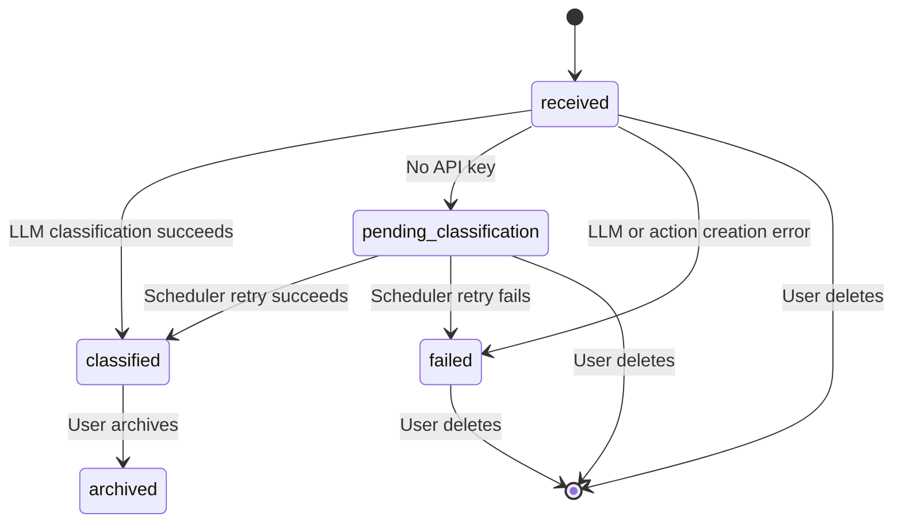

# Commands Agent - API Reference

## Base URL

- **Production:** `https://intexuraos-commands-agent-cj44trunra-lm.a.run.app`
- **Local:** `http://localhost:8080`

## Authentication

All public endpoints require Bearer token authentication (Auth0 JWT).

```bash
-H "Authorization: Bearer YOUR_ACCESS_TOKEN"
```

Internal endpoints use either:

- Pub/Sub OIDC (validated by Cloud Run automatically)
- `X-Internal-Auth` header with shared secret

---

## Public Endpoints

### GET /commands

List commands for the authenticated user.

**Request:**

```bash
curl -X GET https://intexuraos-commands-agent-cj44trunra-lm.a.run.app/commands \
  -H "Authorization: Bearer YOUR_ACCESS_TOKEN"
```

**Response (200 OK):**

```json
{
  "success": true,
  "data": {
    "commands": [
      {
        "id": "pwa-shared:1706097600000-abc123",
        "userId": "user-123",
        "sourceType": "pwa-shared",
        "externalId": "1706097600000-abc123",
        "text": "Buy groceries",
        "timestamp": "2025-01-25T10:00:00.000Z",
        "status": "classified",
        "classification": {
          "type": "todo",
          "confidence": 0.92,
          "reasoning": "Clear actionable task with no time specification",
          "classifiedAt": "2025-01-25T10:00:01.000Z"
        },
        "actionId": "uuid-action-123",
        "createdAt": "2025-01-25T10:00:00.000Z",
        "updatedAt": "2025-01-25T10:00:01.000Z"
      }
    ]
  },
  "diagnostics": {
    "requestId": "req-abc123",
    "durationMs": 45
  }
}
```

---

### POST /commands

Create a new command from shared text or link.

**Request:**

```bash
curl -X POST https://intexuraos-commands-agent-cj44trunra-lm.a.run.app/commands \
  -H "Authorization: Bearer YOUR_ACCESS_TOKEN" \
  -H "Content-Type: application/json" \
  -d '{
    "text": "Buy groceries",
    "source": "pwa-shared"
  }'
```

**Request Body:**

| Field        | Type   | Required | Description                               |
| ------------ | ------ | -------- | ----------------------------------------- |
| `text`       | string | Yes      | Command text                              |
| `source`     | string | Yes      | Must be `"pwa-shared"`                    |
| `externalId` | string | No       | Client-provided ID (generated if omitted) |

**Response (201 Created):**

```json
{
  "success": true,
  "data": {
    "command": {
      "id": "pwa-shared:1706097600000-abc123",
      "status": "classified",
      "classification": {
        "type": "todo",
        "confidence": 0.92,
        "reasoning": "Clear actionable task",
        "classifiedAt": "2025-01-25T10:00:01.000Z"
      },
      "actionId": "uuid-action-123",
      ...
    }
  }
}
```

**Error Response (400 Bad Request):**

```json
{
  "success": false,
  "error": {
    "code": "INVALID_REQUEST",
    "message": "Field 'text' is required"
  }
}
```

---

### DELETE /commands/:commandId

Delete an unclassified command.

**Restrictions:** Only commands with status `received`, `pending_classification`, or `failed` can be deleted.

**Request:**

```bash
curl -X DELETE https://intexuraos-commands-agent-cj44trunra-lm.a.run.app/commands/pwa-shared:123 \
  -H "Authorization: Bearer YOUR_ACCESS_TOKEN"
```

**Response (200 OK):**

```json
{
  "success": true,
  "diagnostics": {
    "requestId": "req-def456",
    "durationMs": 32
  }
}
```

**Error Response (400 Bad Request):**

```json
{
  "success": false,
  "error": {
    "code": "INVALID_REQUEST",
    "message": "Cannot delete classified command. Use archive instead."
  }
}
```

---

### PATCH /commands/:commandId

Archive a classified command.

**Restrictions:** Only commands with status `classified` can be archived.

**Request:**

```bash
curl -X PATCH https://intexuraos-commands-agent-cj44trunra-lm.a.run.app/commands/pwa-shared:456 \
  -H "Authorization: Bearer YOUR_ACCESS_TOKEN" \
  -H "Content-Type: application/json" \
  -d '{
    "status": "archived"
  }'
```

**Request Body:**

| Field    | Type   | Required | Description          |
| -------- | ------ | -------- | -------------------- |
| `status` | string | Yes      | Must be `"archived"` |

**Response (200 OK):**

```json
{
  "success": true,
  "data": {
    "command": {
      "id": "pwa-shared:456",
      "status": "archived",
      ...
    }
  }
}
```

**Error Response (400 Bad Request):**

```json
{
  "success": false,
  "error": {
    "code": "INVALID_REQUEST",
    "message": "Can only archive classified commands"
  }
}
```

---

## Internal Endpoints

### POST /internal/commands

Ingest command from Pub/Sub (WhatsApp integration).

**Authentication:** Pub/Sub OIDC (auto-validated by Cloud Run) or `X-Internal-Auth` header.

**Request:** Pub/Sub push format

```json
{
  "message": {
    "data": "base64-encoded-json",
    "messageId": "123456789",
    "publishTime": "2025-01-25T10:00:00.000Z"
  },
  "subscription": "projects/PROJECT/subscriptions/SUBSCRIPTION"
}
```

**Decoded Message Data:**

```json
{
  "type": "command.ingest",
  "userId": "user-123",
  "sourceType": "whatsapp_text",
  "externalId": "wa-msg-123",
  "text": "Buy groceries",
  "timestamp": "2025-01-25T10:00:00.000Z"
}
```

**Response (200 OK):**

```json
{
  "success": true,
  "commandId": "whatsapp_text:wa-msg-123",
  "isNew": true
}
```

---

### POST /internal/retry-pending

Retry pending command classifications (called by Cloud Scheduler).

**Authentication:** OIDC (Cloud Scheduler) or `X-Internal-Auth` header.

**Request:** No body required

**Response (200 OK):**

```json
{
  "success": true,
  "processed": 5,
  "skipped": 2,
  "failed": 0,
  "total": 7
}
```

| Field       | Type   | Description                                |
| ----------- | ------ | ------------------------------------------ |
| `processed` | number | Commands successfully classified           |
| `skipped`   | number | Commands skipped (no API key)              |
| `failed`    | number | Commands that failed during classification |
| `total`     | number | Total pending commands found               |

---

### GET /internal/commands/:commandId

Get command by ID (internal service-to-service lookup).

**Authentication:** `X-Internal-Auth` header required.

**Request:**

```bash
curl -X GET https://intexuraos-commands-agent-cj44trunra-lm.a.run.app/internal/commands/pwa-shared:123 \
  -H "X-Internal-Auth: SHARED_SECRET"
```

**Response (200 OK):**

```json
{
  "success": true,
  "data": {
    "command": {
      "id": "pwa-shared:123",
      "text": "Buy groceries",
      "sourceType": "pwa-shared"
    }
  }
}
```

---

## Command Status Lifecycle



---

## Error Codes

| Code               | Description                         |
| ------------------ | ----------------------------------- |
| `INVALID_REQUEST`  | Request body validation failed      |
| `UNAUTHORIZED`     | Missing or invalid authentication   |
| `FORBIDDEN`        | Insufficient permissions            |
| `NOT_FOUND`        | Resource not found                  |
| `CONFLICT`         | Resource conflict (e.g., duplicate) |
| `DOWNSTREAM_ERROR` | External service failure            |
| `INTERNAL_ERROR`   | Unexpected server error             |
| `MISCONFIGURED`    | Service configuration issue         |

---

## Rate Limits

No rate limiting currently enforced.

---

## OpenAPI Specification

Full OpenAPI 3.1.1 specification available at:

- `https://intexuraos-commands-agent-cj44trunra-lm.a.run.app/openapi.json`
- `https://intexuraos-commands-agent-cj44trunra-lm.a.run.app/docs` (Swagger UI)

---

**Last updated:** 2025-01-25
