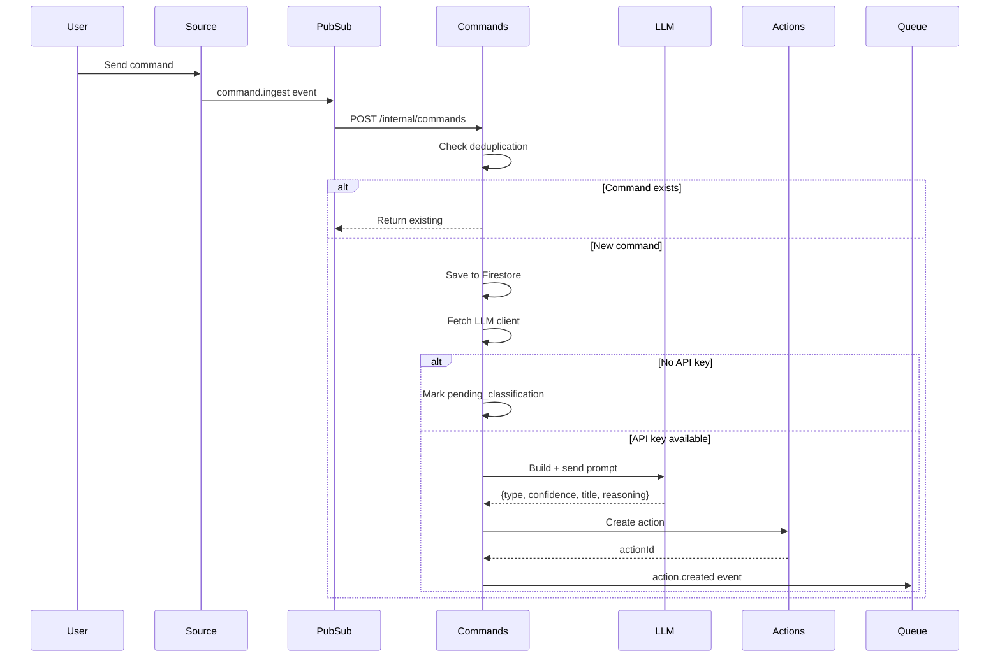

# Commands Agent - Technical Reference

## Overview

Commands-agent classifies natural language input into action types using a structured 5-step LLM prompt. It receives commands from WhatsApp (via Pub/Sub) and PWA (via REST), creates actions through actions-agent, and publishes events for downstream processing. Runs on Cloud Run with auto-scaling.

## Architecture

```mermaid
graph TB
    subgraph Sources
        WhatsApp[WhatsApp Service]
        PWA[PWA Web App]
    end

    subgraph PubSub
        Ingest[command.ingest topic]
    end

    subgraph CommandsAgent[Commands Agent]
        IngestRoute[/internal/commands]
        ProcessUC[processCommand useCase]
        Classifier[LLM Classifier]
        ActionsClient[actions-agent client]
        UserClient[user-service client]
    end

    subgraph LLMPrompts[llm-prompts package]
        Prompt[commandClassifierPrompt]
    end

    subgraph Storage
        Commands[(Firestore:<br/>commands)]
    end

    subgraph Actions
        ActionsSvc[actions-agent]
        ActionsQueue[actions PubSub]
    end

    WhatsApp -->|PubSub push| IngestRoute
    PWA -->|POST /commands| ProcessUC

    ProcessUC -->|getApiKeys| UserClient
    ProcessUC -->|classify| Classifier
    Classifier -->|build prompt| Prompt
    ProcessUC -->|createAction| ActionsClient
    ProcessUC -->|save| Commands
    ActionsClient -->|HTTP| ActionsSvc
    ActionsSvc -->|publishes| ActionsQueue

    ProcessUC -->|action.created| ActionsQueue

    classDef service fill:#e1f5ff
    classDef storage fill:#fff4e6
    classDef external fill:#f0f0f0

    class IngestRoute,ProcessUC,Classifier,ActionsClient,UserClient service
    class Commands storage
    class WhatsApp,PWA,ActionsSvc external
```

## Data Flow



## Recent Changes

| Commit    | Description                                                        | Date       |
| --------- | ------------------------------------------------------------------ | ---------- |
| `88cec45` | INT-269 Fix deployment: Remove internal-clients subpath exports    | 2025-01-25 |
| `b1c7a4b` | INT-269 Create internal-clients package and migrate all apps       | 2025-01-25 |
| `51b4a32` | INT-266 Migrate LLM clients to UsageLogger class                   | 2025-01-25 |
| `3830dc0` | INT-218 Add logging to classifier validation failures              | 2025-01-25 |
| `aba1375` | INT-223 Migrate commands-agent classifier to Zod schema            | 2025-01-25 |
| `f7a21a2` | INT-243 Apply E2_MEDIUM machine type to all app cloudbuild configs | 2025-01-24 |
| `6d0a653` | Rename misleading gemini/ directory to llm/                        | 2025-01-24 |

## API Endpoints

### Public Endpoints

| Method | Path                   | Description                                   | Auth         |
| ------ | ---------------------- | --------------------------------------------- | ------------ |
| GET    | `/commands`            | List user's commands                          | Bearer token |
| POST   | `/commands`            | Create command from web app                   | Bearer token |
| DELETE | `/commands/:commandId` | Delete command (received/pending/failed only) | Bearer token |
| PATCH  | `/commands/:commandId` | Archive classified command                    | Bearer token |

### Internal Endpoints

| Method | Path                            | Description                   | Auth                           |
| ------ | ------------------------------- | ----------------------------- | ------------------------------ |
| POST   | `/internal/commands`            | Ingest command from Pub/Sub   | Pub/Sub OIDC or internal token |
| POST   | `/internal/retry-pending`       | Retry pending classifications | OIDC or internal token         |
| GET    | `/internal/commands/:commandId` | Get command by ID             | Internal token                 |

## Domain Models

### Command

| Field            | Type                  | Description                                                    |
| ---------------- | --------------------- | -------------------------------------------------------------- |
| `id`             | string                | `{sourceType}:{externalId}` composite key                      |
| `userId`         | string                | Owner user ID                                                  |
| `sourceType`     | CommandSourceType     | whatsapp_text, whatsapp_voice, pwa-shared                      |
| `externalId`     | string                | Source system identifier (e.g., WhatsApp message ID)           |
| `text`           | string                | Original command text                                          |
| `summary`        | string (optional)     | Summary for voice transcriptions                               |
| `timestamp`      | string                | ISO 8601 timestamp from source                                 |
| `status`         | CommandStatus         | received, classified, pending_classification, failed, archived |
| `classification` | CommandClassification | Classification result (null if not classified)                 |
| `actionId`       | string (optional)     | Created action ID                                              |
| `failureReason`  | string (optional)     | Error details if failed                                        |
| `createdAt`      | string                | ISO 8601 creation time                                         |
| `updatedAt`      | string                | ISO 8601 last update                                           |

### CommandClassification

| Field          | Type        | Description                                            |
| -------------- | ----------- | ------------------------------------------------------ |
| `type`         | CommandType | todo, research, note, link, calendar, linear, reminder |
| `confidence`   | number      | 0-1 confidence score                                   |
| `reasoning`    | string      | LLM explanation for classification                     |
| `classifiedAt` | string      | ISO 8601 classification timestamp                      |

### Confidence Semantics

| Range     | Meaning                                         |
| --------- | ----------------------------------------------- |
| 0.90+     | Clear match (explicit prefix, multiple signals) |
| 0.70-0.90 | Strong match (single clear signal)              |
| 0.50-0.70 | Choosing between 2-3 plausible categories       |
| <0.50     | Genuinely uncertain, defaults to `note`         |

## Status Enums

**CommandStatus:**

- `received` - Initial state, not yet processed
- `classified` - Successfully classified with action created
- `pending_classification` - Waiting for API keys
- `failed` - Classification or action creation failed
- `archived` - Soft deleted by user

## Classification Prompt Structure (v2.0.0)

The classification prompt in `packages/llm-prompts/src/classification/commandClassifierPrompt.ts` uses a 5-step decision tree executed in strict order:

### Step 1: Explicit Prefix Override

If message starts with a category keyword (with or without colon), that category wins.

```
"linear: buy groceries" → linear
"todo: meeting tomorrow" → todo
"do lineara: fix bug" → linear (Polish)
```

### Step 2: Explicit Intent Command Detection (HIGH PRIORITY)

Explicit command phrases override all other signals including URL content.

**English phrases (confidence 0.90+):**

- link: "save bookmark", "save link", "bookmark this"
- todo: "create todo", "add todo", "add task"
- research: "perform research", "do research", "investigate"
- note: "create note", "save note", "write note"
- reminder: "set reminder", "remind me"
- calendar: "schedule", "add to calendar", "book appointment"
- linear: "create issue", "add bug", "report issue"

**Polish phrases:**

- link: "zapisz link", "dodaj zakladke"
- todo: "stwórz zadanie", "dodaj zadanie"
- research: "zbadaj", "sprawdz", "przeprowadz research"
- note: "stwórz notatke", "zapisz notatke"
- reminder: "przypomnij mi"
- calendar: "zaplanuj", "dodaj do kalendarza"
- linear: "zglos blad", "stwórz issue", "dodaj do lineara"

### Step 3: Linear Detection

Engineering context triggers linear classification:

- Keywords: bug, issue, ticket, feature request, PR, pull request
- Phrases: "add to linear", "create linear issue", "in linear"

**Exception:** Math/science context ("linear regression", "linear algebra") excluded.

### Step 4: URL Presence Check

If message contains `http://` or `https://`, strongly prefer `link` classification.

**Critical:** Keywords inside URLs are IGNORED. "https://research-world.com" does not trigger `research`.

### Step 5: Category Detection (Fallback)

Traditional signal matching when no URL and no explicit intent:

| Category | Signals                                             |
| -------- | --------------------------------------------------- |
| calendar | tomorrow, today, weekday names, time (3pm), meeting |
| reminder | remind me, przypomnij, don't forget                 |
| research | how does, what is, why, find out, learn about, ?    |
| note     | notes, idea, remember that, jot down                |
| todo     | (default for actionable requests)                   |

## Pub/Sub Events

### Subscribed

| Event Type       | Topic            | Handler                 |
| ---------------- | ---------------- | ----------------------- |
| `command.ingest` | `command-ingest` | POST /internal/commands |

### Published

| Event Type       | Topic     | Purpose                 |
| ---------------- | --------- | ----------------------- |
| `action.created` | `actions` | Triggers action handler |

## Dependencies

### Internal Services

| Service         | Purpose                                 |
| --------------- | --------------------------------------- |
| `user-service`  | Fetch LLM client for classification     |
| `actions-agent` | Create actions from classified commands |

### Packages

| Package                        | Purpose                                  |
| ------------------------------ | ---------------------------------------- |
| `@intexuraos/internal-clients` | Shared HTTP client for user-service      |
| `llm-prompts`                  | Classification prompt builder            |
| `llm-factory`                  | LLM client abstraction                   |
| `llm-utils`                    | Zod validation helpers (formatZodErrors) |

### Infrastructure

| Component                         | Purpose                   |
| --------------------------------- | ------------------------- |
| Firestore (`commands` collection) | Command persistence       |
| Pub/Sub (`command-ingest` topic)  | Command ingestion events  |
| Pub/Sub (`actions` topic)         | Action creation events    |
| Cloud Scheduler                   | Retry pending every 5 min |

### External APIs

| Service                                    | Purpose                |
| ------------------------------------------ | ---------------------- |
| Gemini 2.5 Flash / GLM-4.7 / GLM-4.7-Flash | Command classification |

## Configuration

| Environment Variable                  | Required | Description                      |
| ------------------------------------- | -------- | -------------------------------- |
| `INTEXURAOS_USER_SERVICE_URL`         | Yes      | user-service base URL            |
| `INTEXURAOS_ACTIONS_AGENT_URL`        | Yes      | actions-agent base URL           |
| `INTEXURAOS_APP_SETTINGS_SERVICE_URL` | Yes      | app-settings-service for pricing |
| `INTEXURAOS_INTERNAL_AUTH_TOKEN`      | Yes      | Shared secret for internal auth  |
| `INTEXURAOS_GCP_PROJECT_ID`           | Yes      | Google Cloud project ID          |
| `INTEXURAOS_PUBSUB_ACTIONS_QUEUE`     | Yes      | PubSub topic for action events   |

## Gotchas

**URL keyword isolation** - The prompt instructs the LLM to ignore keywords inside URLs. This is prompt-level guidance, not code-level URL parsing. LLM compliance is high but not guaranteed.

**Explicit intent priority** - Step 2 executes BEFORE Step 4. "research this https://example.com" classifies as `research` (explicit intent), not `link` (URL presence).

**PWA-shared confidence boost** - Links from `pwa-shared` source get +0.1 confidence boost (capped at 1.0) because share sheet usage strongly indicates link-saving intent.

**Idempotency key format** - `{sourceType}:{externalId}` must be unique. WhatsApp message IDs can be reused across different phone numbers.

**Classification pricing** - Uses Gemini 2.5 Flash at ~$0.001 per classification, GLM-4.7-Flash is free.

**Pub/Sub push authentication** - Uses `from: noreply@google.com` header to detect Pub/Sub pushes vs direct service calls.

**Archive vs delete** - Classified commands can only be archived, not deleted. Only received/pending/failed can be deleted.

**Zod validation fallback** - When LLM response fails Zod validation, classification defaults to `note` with 0.3 confidence and logs the validation error for debugging.

## File Structure

```
apps/commands-agent/src/
  domain/
    models/
      command.ts           # Command entity with factory functions
      action.ts            # Action entity (forwarded type)
    ports/
      classifier.ts        # Classifier interface
      commandRepository.ts # Repository interface
      eventPublisher.ts    # PubSub publisher interface
      userServiceClient.ts # user-service client port
      actionsAgentClient.ts # actions-agent client port
    usecases/
      processCommand.ts    # Main command processing logic
      retryPendingCommands.ts
    events/
      actionCreatedEvent.ts
  infra/
    firestore/
      commandRepository.ts
    llm/
      classifier.ts        # LLM classifier implementation with Zod validation
    pubsub/
      actionEventPublisher.ts
      config.ts
    actionsAgent/
      client.ts            # actions-agent HTTP client
    user/
      index.ts            # user-service client (uses internal-clients)
  routes/
    commandsRoutes.ts      # Public endpoints
    internalRoutes.ts      # Pub/Sub and internal endpoints
    index.ts
  services.ts              # DI container
  server.ts                # Fastify server setup
  index.ts                 # Entry point

packages/llm-prompts/src/
  classification/
    commandClassifierPrompt.ts  # 5-step classification prompt
    CommandClassificationSchema.ts # Zod schema for validation
```

---

**Last updated:** 2025-01-25
