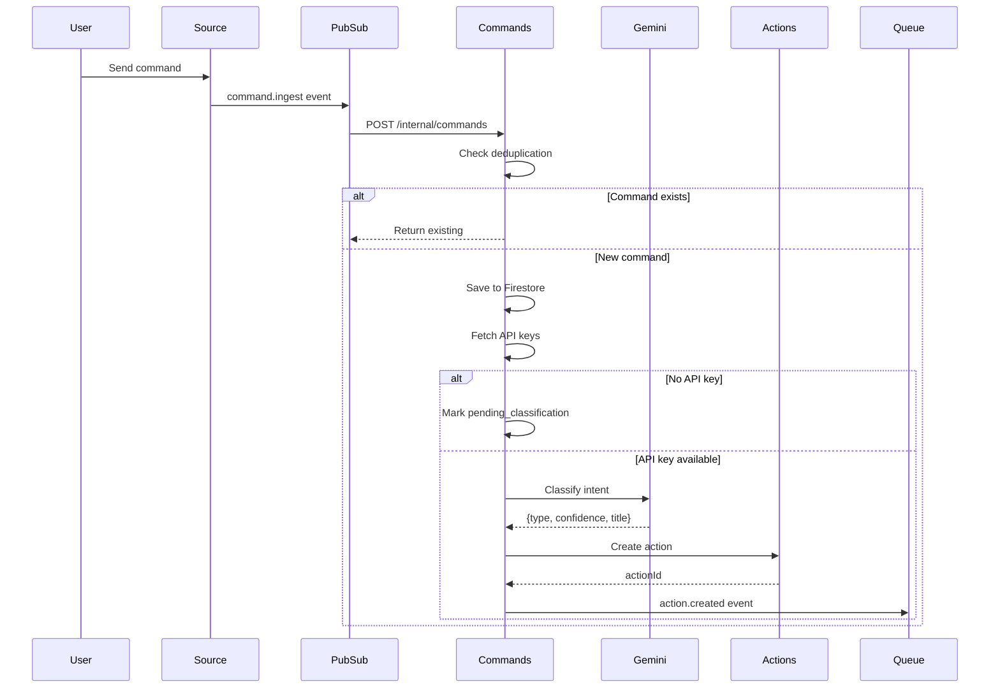

# Commands Agent - Technical Reference

## Overview

Commands-agent receives user commands from multiple channels, classifies intent using Gemini LLM, creates actions via actions-agent, and publishes events for downstream processing.

## Architecture

```mermaid
graph TB
    subgraph Sources
        WhatsApp[WhatsApp Service]
        PWA[PWA Web App]
    end

    subgraph PubSub
        Ingest[command.ingest topic]
    end

    subgraph CommandsAgent[Commands Agent]
        IngestRoute[/internal/commands]
        ProcessUC[processCommand useCase]
        Classifier[Gemini Classifier]
        ActionsClient[actions-agent client]
        UserClient[user-service client]
    end

    subgraph Storage
        Commands[(Firestore:<br/>commands)]
    end

    subgraph Actions
        ActionsSvc[actions-agent]
        ActionsQueue[actions PubSub]
    end

    WhatsApp -->|PubSub push| IngestRoute
    PWA -->|POST /commands| ProcessUC

    ProcessUC -->|getApiKeys| UserClient
    ProcessUC -->|classify| Classifier
    ProcessUC -->|createAction| ActionsClient
    ProcessUC -->|save| Commands
    ActionsClient -->|HTTP| ActionsSvc
    ActionsSvc -->|publishes| ActionsQueue

    ProcessUC -->|action.created| ActionsQueue
```

## Data Flow



## API Endpoints

### Public Endpoints

| Method | Path                   | Description                                   | Auth         |
| ------ | ---------------------- | --------------------------------------------- | ------------ |
| GET    | `/commands`            | List user's commands                          | Bearer token |
| POST   | `/commands`            | Create command from web app                   | Bearer token |
| DELETE | `/commands/:commandId` | Delete command (received/pending/failed only) | Bearer token |
| PATCH  | `/commands/:commandId` | Archive classified command                    | Bearer token |

### Internal Endpoints

| Method | Path                            | Description                   | Auth                           |
| ------ | ------------------------------- | ----------------------------- | ------------------------------ |
| POST   | `/internal/commands`            | Ingest command from Pub/Sub   | Pub/Sub OIDC or internal token |
| POST   | `/internal/retry-pending`       | Retry pending classifications | OIDC or internal token         |
| GET    | `/internal/commands/:commandId` | Get command by ID             | Internal token                 |

## Domain Models

### Command

| Field            | Type                     | Description                                                    |
| ---------------- | ------------------------ | -------------------------------------------------------------- | ------------------------------------ |
| `id`             | string                   | `{sourceType}:{externalId}` composite key                      |
| `userId`         | string                   | Owner user ID                                                  |
| `sourceType`     | CommandSourceType        | whatsapp_text, whatsapp_voice, pwa-shared                      |
| `externalId`     | string                   | Source system identifier (e.g., WhatsApp message ID)           |
| `text`           | string                   | Original command text                                          |
| `timestamp`      | string                   | ISO 8601 timestamp from source                                 |
| `status`         | CommandStatus            | received, classified, pending_classification, failed, archived |
| `classification` | CommandClassification \  | null                                                           | Classification result with reasoning |
| `actionId`       | string \                 | null                                                           | Created action ID                    |
| `failureReason`  | string \                 | null                                                           | Error details if failed              |
| `createdAt`      | string                   | ISO 8601 creation time                                         |
| `updatedAt`      | string                   | ISO 8601 last update                                           |

### CommandClassification

| Field          | Type        | Description                                                  |
| -------------- | ----------- | ------------------------------------------------------------ |
| `type`         | CommandType | todo, research, note, link, calendar, reminder, unclassified |
| `confidence`   | number      | 0-1 confidence score                                         |
| `reasoning`    | string      | LLM explanation for classification                           |
| `classifiedAt` | string      | ISO 8601 classification timestamp                            |

### Action (forwarded type)

| Field        | Type                    | Description                                                                   |
| ------------ | ----------------------- | ----------------------------------------------------------------------------- |
| `id`         | string                  | UUID                                                                          |
| `userId`     | string                  | Owner user ID                                                                 |
| `commandId`  | string                  | Source command ID                                                             |
| `type`       | ActionType              | Same as CommandType without unclassified                                      |
| `confidence` | number                  | Classification confidence                                                     |
| `title`      | string                  | Generated title from LLM                                                      |
| `status`     | ActionStatus            | pending, awaiting_approval, processing, completed, failed, rejected, archived |
| `payload`    | Record<string, unknown> | Action-specific data                                                          |
| `createdAt`  | string                  | ISO 8601 creation time                                                        |
| `updatedAt`  | string                  | ISO 8601 last update                                                          |

## Status Enums

**CommandStatus:**

- `received` - Initial state, not yet processed
- `classified` - Successfully classified with action created
- `pending_classification` - Waiting for API keys to be configured
- `failed` - Classification or action creation failed
- `archived` - Soft deleted by user

**ActionStatus:**

- `pending` - Awaiting agent processing
- `awaiting_approval` - Requires user confirmation (research)
- `processing` - Agent working on action
- `completed` - Action finished successfully
- `failed` - Action execution failed
- `rejected` - User declined action
- `archived` - Soft deleted

## Pub/Sub Events

### Subscribed

| Event Type       | Topic            | Handler                 |
| ---------------- | ---------------- | ----------------------- |
| `command.ingest` | `command-ingest` | POST /internal/commands |

### Published

| Event Type       | Topic     | Purpose                 |
| ---------------- | --------- | ----------------------- |
| `action.created` | `actions` | Triggers action handler |

## Model Detection

The classifier detects LLM preferences from command text:

| Pattern                       | Models Selected                                            |
| ----------------------------- | ---------------------------------------------------------- |
| "all LLMs", "every model"     | DEFAULT_MODELS (Gemini Pro, Claude Opus, GPT-5, Sonar Pro) |
| "claude", "anthropic", "opus" | Claude Opus 4.5                                            |
| "sonar", "perplexity", "pplx" | Sonar Pro                                                  |
| "gpt", "openai", "chatgpt"    | GPT-5.2                                                    |
| "o4", "deep research"         | O4 Mini Deep Research                                      |
| "gemini", "google"            | Gemini 2.5 Pro                                             |

## Dependencies

### Internal Services

| Service         | Purpose                                 |
| --------------- | --------------------------------------- |
| `user-service`  | Fetch Google API key for classification |
| `actions-agent` | Create actions from classified commands |

### Infrastructure

| Component                         | Purpose                  |
| --------------------------------- | ------------------------ |
| Firestore (`commands` collection) | Command persistence      |
| Pub/Sub (`command-ingest` topic)  | Command ingestion events |
| Pub/Sub (`actions` topic)         | Action creation events   |

### External APIs

| Service          | Purpose                |
| ---------------- | ---------------------- |
| Gemini 2.5 Flash | Command classification |

## Configuration

| Environment Variable             | Required | Description                     |
| -------------------------------- | -------- | ------------------------------- |
| `INTEXURAOS_USER_SERVICE_URL`    | Yes      | user-service base URL           |
| `INTEXURAOS_ACTIONS_AGENT_URL`   | Yes      | actions-agent base URL          |
| `INTEXURAOS_INTERNAL_AUTH_TOKEN` | Yes      | Shared secret for internal auth |
| `INTEXURAOS_GCP_PROJECT_ID`      | Yes      | Google Cloud project ID         |

## Gotchas

**Idempotency key format** - `{sourceType}:{externalId}` must be unique. WhatsApp message IDs can be reused across different phone numbers.

**Classification pricing** - Uses Gemini 2.5 Flash at $0.30/M input, $2.50/M output. Each classification costs ~$0.001.

**Pending retry window** - Cloud Scheduler calls `/internal/retry-pending` every 5 minutes.

**Action ownership** - Actions are owned by actions-agent. commands-agent only creates them via HTTP.

**Model selection only for research** - Selected models passed as `selectedModels` in payload, only consumed by research-agent.

**Pub/Sub push authentication** - Uses `from: noreply@google.com` header detection to distinguish from direct service calls.

**No reclassification** - Failed commands stay failed. Must be deleted and re-sent.

**Archive vs delete** - Classified commands can only be archived (PATCH), not deleted. Only received/pending/failed can be deleted.

## File Structure

```
apps/commands-agent/src/
  domain/
    models/
      command.ts           # Command entity with factory functions
      action.ts            # Action entity (forwarded type)
    ports/
      classifier.ts        # Classifier interface
      commandRepository.ts # Repository interface
      eventPublisher.ts    # PubSub publisher interface
    usecases/
      processCommand.ts    # Main command processing logic
      retryPendingCommands.ts
    events/
      actionCreatedEvent.ts
  infra/
    firestore/
      commandRepository.ts
    gemini/
      classifier.ts        # Gemini 2.5 Flash implementation
    pubsub/
      actionEventPublisher.ts
      config.ts
    actionsAgent/
      client.ts            # actions-agent HTTP client
    user/
      userServiceClient.ts # user-service HTTP client
  routes/
    commandsRoutes.ts      # Public endpoints
    internalRoutes.ts      # Pub/Sub and internal endpoints
    index.ts
  services.ts              # DI container
  server.ts                # Fastify server setup
```
