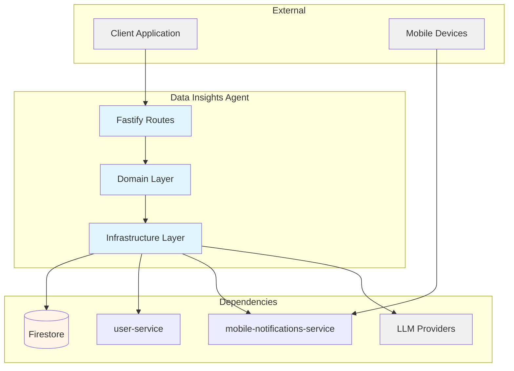
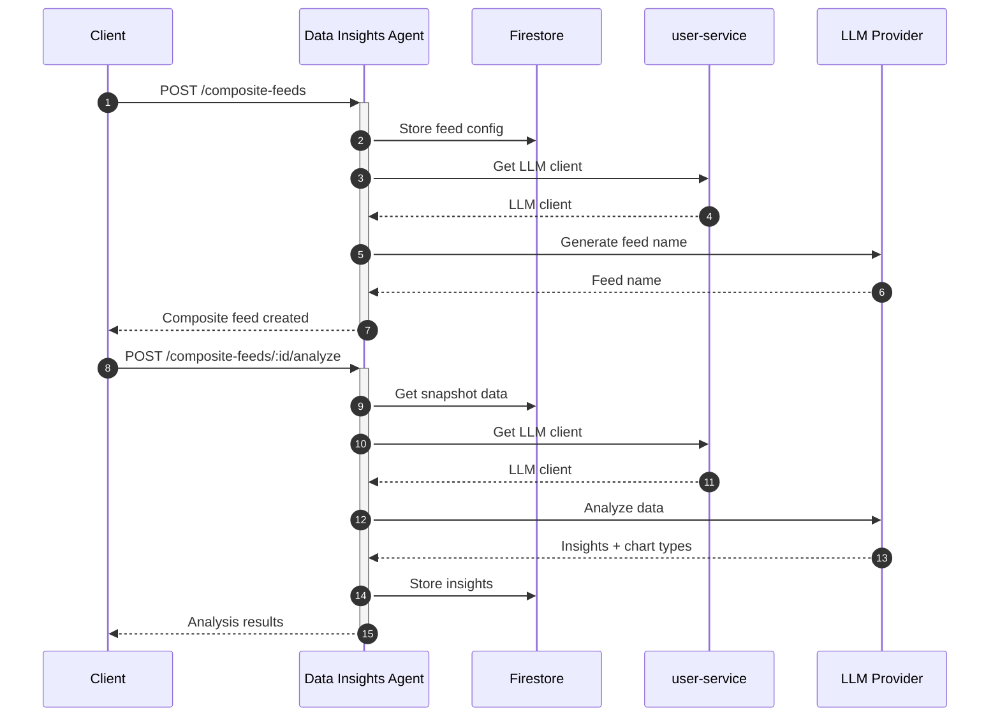

# Data Insights Agent — Technical Reference

## Overview

AI-powered data analysis service that combines static data sources with mobile notifications into composite feeds, performs LLM-driven analysis using user's configured API keys, and generates Vega-Lite chart definitions. Runs on Cloud Run with Firestore persistence.

## Architecture



## Data Flow



## Recent Changes

| Commit     | Description                                            | Date       |
| ---------- | ------------------------------------------------------ | ---------- |
| `88cec45`  | INT-269 Migrate to `@intexuraos/internal-clients`      | 2025-01-25 |
| `b1c7a4b`  | INT-269 Create internal-clients package                | 2025-01-24 |
| `8aad909`  | INT-241/242 Migrate imports, delete llm-common         | 2025-01-21 |
| `2c3a98c`  | Add GLM-4.7-Flash support as free Zai AI model         | 2025-01-21 |
| `a68f5fd`  | INT-160 Fix empty chart definition                     | 2025-01-19 |
| `06b1361`  | INT-137 Relax LM response sentence count validation    | 2025-01-17 |
| `0664d57`  | INT-79 Add LLM response repair pattern for insights    | 2025-01-15 |
| `0e238abb` | INT-77 Return success for no insights instead of error | 2025-01-15 |
| `df6aaa35` | Enforce Clean Architecture domain->infra boundary      | 2025-01-15 |

## API Endpoints

### Public Endpoints

| Method | Path                                                            | Purpose                          | Auth   |
| ------ | --------------------------------------------------------------- | -------------------------------- | ------ |
| POST   | `/data-sources`                                                 | Create data source               | Bearer |
| GET    | `/data-sources`                                                 | List user's data sources         | Bearer |
| GET    | `/data-sources/:id`                                             | Get specific data source         | Bearer |
| PUT    | `/data-sources/:id`                                             | Update data source               | Bearer |
| DELETE | `/data-sources/:id`                                             | Delete data source               | Bearer |
| POST   | `/data-sources/generate-title`                                  | Generate AI title for content    | Bearer |
| POST   | `/composite-feeds`                                              | Create composite feed            | Bearer |
| GET    | `/composite-feeds`                                              | List composite feeds             | Bearer |
| GET    | `/composite-feeds/:id`                                          | Get composite feed               | Bearer |
| PUT    | `/composite-feeds/:id`                                          | Update composite feed            | Bearer |
| DELETE | `/composite-feeds/:id`                                          | Delete composite feed            | Bearer |
| GET    | `/composite-feeds/:id/schema`                                   | Get JSON schema for feed data    | Bearer |
| GET    | `/composite-feeds/:id/data`                                     | Get aggregated feed data         | Bearer |
| GET    | `/composite-feeds/:id/snapshot`                                 | Get pre-computed snapshot        | Bearer |
| POST   | `/composite-feeds/:feedId/analyze`                              | Analyze feed with AI             | Bearer |
| POST   | `/composite-feeds/:feedId/insights/:insightId/chart-definition` | Generate chart config            | Bearer |
| POST   | `/composite-feeds/:feedId/preview`                              | Transform data for chart preview | Bearer |

### Internal Endpoints

| Method | Path                          | Purpose                    | Caller                    |
| ------ | ----------------------------- | -------------------------- | ------------------------- |
| POST   | `/internal/snapshots/refresh` | Refresh all feed snapshots | Cloud Scheduler (Pub/Sub) |

## Domain Model

### DataSource

| Field       | Type   | Description                   |
| ----------- | ------ | ----------------------------- |
| `id`        | string | Unique identifier             |
| `userId`    | string | Owner user ID                 |
| `title`     | string | Data source title             |
| `content`   | string | Data content (CSV, JSON, etc) |
| `createdAt` | Date   | Creation timestamp            |
| `updatedAt` | Date   | Last update timestamp         |

### CompositeFeed

| Field                 | Type                       | Description                 |
| --------------------- | -------------------------- | --------------------------- |
| `id`                  | string                     | Unique identifier           |
| `userId`              | string                     | Owner user ID               |
| `name`                | string                     | AI-generated feed name      |
| `purpose`             | string                     | User-provided feed purpose  |
| `staticSourceIds`     | string[]                   | Data source IDs (max 5)     |
| `notificationFilters` | NotificationFilterConfig[] | Notification filter configs |
| `dataInsights`        | DataInsight[] \| null      | AI analysis results         |
| `createdAt`           | Date                       | Creation timestamp          |
| `updatedAt`           | Date                       | Last update timestamp       |

### NotificationFilterConfig

| Field    | Type     | Description                  |
| -------- | -------- | ---------------------------- |
| `id`     | string   | Filter identifier            |
| `name`   | string   | Filter name                  |
| `app`    | string[] | Multi-select app filter      |
| `source` | string   | Single-select source filter  |
| `title`  | string   | Title filter substring match |

### DataInsight

| Field                | Type        | Description                    |
| -------------------- | ----------- | ------------------------------ |
| `id`                 | string      | Unique identifier              |
| `title`              | string      | Insight title                  |
| `description`        | string      | Insight description            |
| `trackableMetric`    | string      | Measurable metric to track     |
| `suggestedChartType` | ChartTypeId | Recommended chart type (C1-C6) |
| `generatedAt`        | string      | ISO timestamp                  |

**Chart Type Values:**

| Type | Name         | Best For                         |
| ---- | ------------ | -------------------------------- |
| `C1` | Line Chart   | Time-series trends               |
| `C2` | Bar Chart    | Category comparison              |
| `C3` | Scatter Plot | Correlation analysis             |
| `C4` | Area Chart   | Cumulative trends                |
| `C5` | Pie Chart    | Part-to-whole composition        |
| `C6` | Heatmap      | Density patterns and matrix data |

### Snapshot

| Field         | Type   | Description                  |
| ------------- | ------ | ---------------------------- |
| `id`          | string | Unique identifier            |
| `feedId`      | string | Associated composite feed ID |
| `userId`      | string | Owner user ID                |
| `feedName`    | string | Feed name at snapshot time   |
| `generatedAt` | Date   | Snapshot creation timestamp  |
| `expiresAt`   | Date   | Snapshot expiration (15 min) |
| `data`        | object | Aggregated feed data         |

## Pub/Sub

### Subscribed Events

| Topic       | Handler                       | Action                     |
| ----------- | ----------------------------- | -------------------------- |
| (scheduled) | `/internal/snapshots/refresh` | Refresh all feed snapshots |

## Dependencies

### External Services

| Service       | Purpose                                           | Failure Mode                       |
| ------------- | ------------------------------------------------- | ---------------------------------- |
| LLM Providers | Data analysis, title generation, chart generation | Return error, prompt configure key |
| Firestore     | Data persistence                                  | Propagate error                    |
| user-service  | LLM client management                             | Propagate error                    |

### Internal Services

| Service                      | Endpoint          | Purpose                      |
| ---------------------------- | ----------------- | ---------------------------- |
| user-service                 | (internal client) | Get user's LLM API key       |
| mobile-notifications-service | (internal client) | Query filtered notifications |

## Configuration

| Variable                                      | Required | Description                         |
| --------------------------------------------- | -------- | ----------------------------------- |
| `INTEXURAOS_GCP_PROJECT_ID`                   | Yes      | GCP project ID                      |
| `INTEXURAOS_AUTH_JWKS_URL`                    | Yes      | Auth0 JWKS endpoint                 |
| `INTEXURAOS_AUTH_ISSUER`                      | Yes      | Auth0 issuer URL                    |
| `INTEXURAOS_AUTH_AUDIENCE`                    | Yes      | Auth0 audience                      |
| `INTEXURAOS_USER_SERVICE_URL`                 | No       | user-service base URL               |
| `INTEXURAOS_MOBILE_NOTIFICATIONS_SERVICE_URL` | No       | mobile-notifications base URL       |
| `INTEXURAOS_APP_SETTINGS_SERVICE_URL`         | No       | app-settings base URL (for pricing) |
| `INTEXURAOS_INTERNAL_AUTH_TOKEN`              | No       | Internal service auth token         |

## Gotchas

- **Delete protection**: Data sources used by composite feeds return 409 Conflict with feed names
- **LLM repair pattern**: Analysis auto-retries with repair prompt on parse failure (INT-79)
- **Empty insights**: Returns success with empty array and `noInsightsReason` instead of error (INT-77)
- **Chart type IDs**: Use compact format (C1-C6) not full names in storage
- **Snapshot expiration**: Snapshots expire after 15 minutes, scheduled job refreshes all feeds
- **Internal client**: Uses `@intexuraos/internal-clients` package for user-service access (INT-269)

## File Structure

```
apps/data-insights-agent/src/
├── domain/
│   ├── dataSource/          # Data source models and ports
│   │   ├── models/          # DataSource entity
│   │   └── ports/           # DataSourceRepository interface
│   ├── compositeFeed/       # Composite feed models and ports
│   │   ├── models/          # CompositeFeed, NotificationFilterConfig
│   │   ├── schemas/         # Zod schemas
│   │   ├── ports/           # Repository and service interfaces
│   │   └── usecases/        # createCompositeFeed, getCompositeFeedData
│   ├── snapshot/            # Snapshot caching
│   │   ├── models/          # Snapshot entity
│   │   ├── ports/           # SnapshotRepository interface
│   │   └── usecases/        # refreshSnapshot, getDataInsightSnapshot
│   └── dataInsights/        # AI analysis capabilities
│       ├── types.ts         # DataInsight, ChartTypeDefinition
│       ├── chartTypes.ts    # CHART_TYPES array (C1-C6)
│       ├── ports.ts         # Service interfaces
│       └── usecases/        # analyzeData, generateChartDefinition, transformDataForPreview
├── infra/
│   ├── firestore/           # Repository implementations
│   │   ├── dataSourceRepository.ts
│   │   ├── compositeFeedRepository.ts
│   │   └── snapshotRepository.ts
│   ├── gemini/              # LLM service implementations
│   │   ├── dataAnalysisService.ts
│   │   ├── chartDefinitionService.ts
│   │   ├── dataTransformService.ts
│   │   ├── titleGenerationService.ts
│   │   └── feedNameGenerationService.ts
│   ├── http/                # External service clients
│   │   └── mobileNotificationsClient.ts
│   └── user/                # user-service client setup
├── routes/
│   ├── dataSourceRoutes.ts
│   ├── compositeFeedRoutes.ts
│   ├── dataInsightsRoutes.ts
│   └── internalRoutes.ts    # Scheduled snapshot refresh
├── services.ts              # DI container
├── config.ts                # Environment configuration
├── server.ts                # Fastify app builder
└── index.ts                 # Entry point
```

## Firestore Collections

| Collection                 | Owner               | Access Pattern            |
| -------------------------- | ------------------- | ------------------------- |
| `custom_data_sources`      | data-insights-agent | By userId, by id          |
| `composite_feeds`          | data-insights-agent | By userId, by id          |
| `composite_feed_snapshots` | data-insights-agent | By feedId+userId, TTL 15m |
| `visualizations`           | data-insights-agent | By feedId (future use)    |
