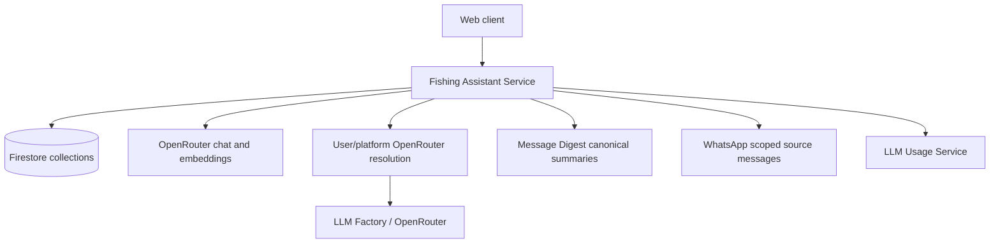

# Fishing Assistant Service - Technical Reference

## Overview

`fishing-assistant-service` is a Fastify app under `apps/fishing-assistant-service`. It owns Fishing Assistant knowledge folders, pages, chunks, chats, and chat messages in Firestore. Chat and embeddings execute through OpenRouter.

## Architecture



## API Endpoints

All application routes use bearer authentication through `withAuth`. `/status`, `/openapi.json`, `/docs`, and the health route are system surfaces registered by the Fastify app.

### Chat

| Method | Path | Description | Auth |
| ------ | ---- | ----------- | ---- |
| GET | `/chats` | List the authenticated user's chats ordered by latest message. | Bearer token |
| POST | `/chats` | Create a chat titled `New Chat`. | Bearer token |
| GET | `/chats/:chatId` | Load one chat for the authenticated user. | Bearer token |
| GET | `/chats/:chatId/messages` | List chat messages ordered by creation time. | Bearer token |
| POST | `/chats/:chatId/messages` | Store a user message, retrieve evidence, generate a validated answer, and store the assistant message. | Bearer token |

### Knowledge Base

| Method | Path | Description | Auth |
| ------ | ---- | ----------- | ---- |
| GET | `/folders` | List knowledge folders for the authenticated user. | Bearer token |
| POST | `/folders` | Create a folder with `name`, optional `parentId`, and optional `sortOrder`. | Bearer token |
| PATCH | `/folders/:folderId` | Rename or reposition a folder for the authenticated user. | Bearer token |
| DELETE | `/folders/:folderId` | Delete an empty folder. | Bearer token |
| GET | `/pages` | List pages, optionally filtered by `folderId`. | Bearer token |
| POST | `/pages` | Create, normalize, classify, chunk, embed, and store a knowledge page. | Bearer token |
| GET | `/pages/:pageId` | Load one page for the authenticated user. | Bearer token |
| PATCH | `/pages/:pageId` | Update raw page text and reindex it. | Bearer token |
| DELETE | `/pages/:pageId` | Delete a page and its chunks. | Bearer token |
| POST | `/pages/:pageId/reindex` | Reindex the current raw text for a page. | Bearer token |

### Digests

| Method | Path | Description | Auth |
| ------ | ---- | ----------- | ---- |
| GET | `/digest-groups` | Compatibility view of the user's migrated Fishing definition in message-digest-service. | Bearer token |
| GET | `/digests` | Query digests by `groupKey`, `dateFrom`, `dateTo`, optional comma-separated `terms`, and optional `limit`. | Bearer token |
| GET | `/digests/:groupKey/:date` | Load one canonical digest; legacy digest state is not returned. | Bearer token |

### System

| Method | Path | Description | Auth |
| ------ | ---- | ----------- | ---- |
| GET | `/status` | Return `{ service: "fishing-assistant-service", status: "ready" }`. | None in route |
| GET | `/openapi.json` | Return generated OpenAPI JSON. | None in route |
| GET | `/docs` | Swagger UI. | None in route |

## Domain Models

### KnowledgeFolder

| Field | Type | Description |
| ----- | ---- | ----------- |
| `id` | string | Folder document ID. |
| `userId` | string | Owning user. |
| `name` | string | Display name. |
| `parentId` | string \| null | Optional parent folder. |
| `sortOrder` | number | Folder ordering value. |
| `pageCount` | number | Maintained count of pages in the folder. |
| `createdAt`, `updatedAt` | Timestamp | Firestore timestamps serialized as ISO strings in responses. |

### KnowledgePage

| Field | Type | Description |
| ----- | ---- | ----------- |
| `id` | string | Page document ID. |
| `userId` | string | Owning user. |
| `folderId` | string | Folder containing the page. |
| `title` | string | Inferred from normalized text. |
| `rawText` | string | Stored source text. |
| `normalizedText` | string | Normalized source text used for indexing. |
| `contentType` | `recipe` \| `guide` \| `species` \| `theory` \| `additive` \| `qna` \| `other` | Classified content type. |
| `indexingStatus` | `pending` \| `ready` \| `failed` | Current indexing status. |
| `chunkCount` | number | Number of indexed chunks. |
| `indexingError` | string | Present when indexing failed. |

### FishingChatMessage

| Field | Type | Description |
| ----- | ---- | ----------- |
| `id` | string | Message document ID. |
| `chatId` | string | Parent chat. |
| `userId` | string | Owning user. |
| `role` | `user` \| `assistant` | Message author role. |
| `content` | string | User text or assistant markdown. |
| `citations` | FishingMessageCitation[] | Stored assistant source references. |
| `confidence` | `high` \| `medium` \| `low` | Assistant answer confidence. |
| `createdAt` | Timestamp | Firestore timestamp serialized as ISO string in responses. |

## Retrieval and Answer Generation

- Knowledge pages are chunked into text sections, embedded with `text-embedding-3-small`, and stored in `fishing_knowledge_chunks` with 1536-dimensional Firestore vectors.
- Chat retrieval embeds the question, runs nearest-neighbor search over the user's chunks, queries message-digest-service for canonical summary evidence, and queries whatsapp-service for source messages scoped to the owned Fishing definition.
- Knowledge evidence is ranked first, then digest/raw-message evidence fills remaining prompt slots.
- Follow-up prompts asking for the full recipe/page/text can expand recent knowledge-page citations into full-page evidence.
- Prompt source IDs are short aliases such as `S1`; validated citations are remapped to canonical source IDs before persistence.
- The answer prompt requires strict JSON with `answerMarkdown`, `citations`, and `confidence`.

## Dependencies

| Dependency | Purpose |
| ---------- | ------- |
| Firestore | Persists folders, pages, chunks, chats, and messages. |
| OpenRouter embeddings | Generates `openai/text-embedding-3-small` embeddings while preserving the persisted `text-embedding-3-small` alias and 1536 dimensions. |
| user-service | Resolves the authenticated user's OpenRouter key with platform fallback for chat generation. |
| message-digest-service | Supplies the migrated Fishing definition and canonical summary history. |
| whatsapp-service | Supplies source-message evidence through the definition-scoped private WhatsApp contract. |
| llm-usage-service | Receives LLM usage through `HttpInternalAuthUsageSink`. |
| llm-factory | Builds the fixed chat model client for `or:google/gemini-3.6-flash`. |

## Configuration

| Environment Variable | Required | Description |
| -------------------- | -------- | ----------- |
| `INTEXURAOS_GCP_PROJECT_ID` | Yes | Firestore project configuration. |
| `INTEXURAOS_AUTH_JWKS_URL` | Yes | Auth JWT key set URL. |
| `INTEXURAOS_AUTH_ISSUER` | Yes | Auth issuer. |
| `INTEXURAOS_AUTH_AUDIENCE` | Yes | Auth audience. |
| `INTEXURAOS_INTERNAL_AUTH_TOKEN` | Yes | Internal service auth token. |
| `INTEXURAOS_USER_SERVICE_URL` | Yes | user-service base URL. |
| `INTEXURAOS_MESSAGE_DIGEST_SERVICE_URL` | Yes | message-digest-service base URL. |
| `INTEXURAOS_WHATSAPP_SERVICE_URL` | Yes | whatsapp-service base URL for scoped source evidence. |
| `INTEXURAOS_LLM_USAGE_SERVICE_URL` | Yes | llm-usage-service base URL. |
| `INTEXURAOS_OPENROUTER_APP_API_KEY` | Yes | Platform OpenRouter fallback and embedding credential. |
| `INTEXURAOS_SENTRY_DSN` | No | Sentry DSN. |
| `INTEXURAOS_ENVIRONMENT` | No | Runtime environment label. |
| `PORT` | No | HTTP port, default `8080`. |

## Firestore Collections and Indexes

The service owns `fishing_knowledge_folders`, `fishing_knowledge_pages`, `fishing_knowledge_chunks`, `fishing_chats`, and `fishing_chat_messages`. Migration 101 defines knowledge-base composite and vector indexes. Migration 104 defines chat and message composite indexes.

## Gotchas

**Chat generation requires resolved access** - The fixed chat client uses the user OpenRouter key or platform fallback and returns `NO_API_KEY` only when both are unavailable.

**Embedding failure stores failed pages** - Create/update paths can persist pages with `indexingStatus: failed`, `indexingError`, and `chunkCount: 0`.

**Folder deletes are strict** - `DELETE /folders/:folderId` fails with `FOLDER_NOT_EMPTY` if the folder still has pages.

**Digest retrieval is best effort for chat evidence** - Retrieval skips failed canonical-summary or scoped source-message pages and still answers from any remaining evidence. Compatibility routes remain intentionally limited to the migrated Fishing group key.

## File Structure

```text
apps/fishing-assistant-service/src/
  config.ts
  index.ts
  server.ts
  services.ts
  domain/
    chunking/
    models/
    ports/
    prompts/
    retrieval/
    usecases/
  infra/
    firestore/
    llm/
  routes/
```
