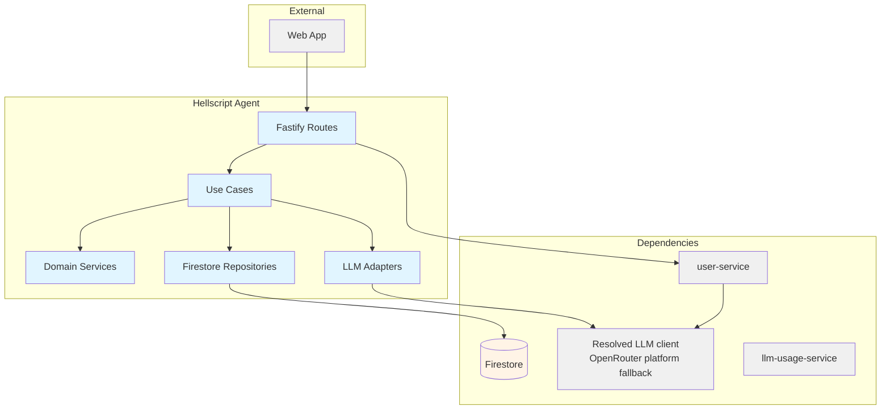
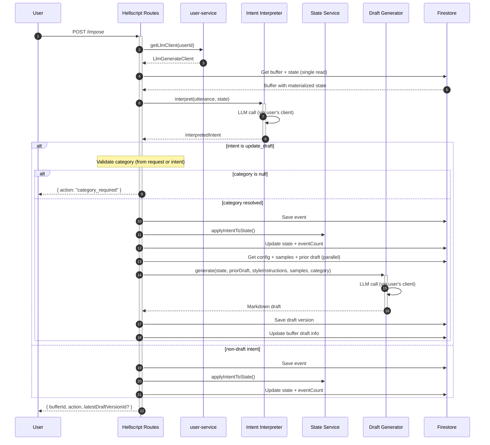

# Hellscript Agent — Technical Reference

## Overview

Hellscript Agent is a voice-to-draft writing assistant that accumulates user utterances into a structured buffer, interprets intent via LLM, and generates versioned markdown drafts. Runs on Cloud Run as a Fastify service (port 8131). Depends on Firestore for persistence and user-service for per-user LLM client resolution. Supports categorized writing configuration — style instructions and writing samples organized per platform (threads, linkedin, general).

## Architecture



## Data Flow



## Recent Changes

### Changes since v3.8.0

Platform fallback now uses the required `INTEXURAOS_OPENROUTER_APP_API_KEY`. `LlmIntentInterpreter` and `LlmDraftGenerator` consume the per-user `LlmGenerateClient`; the direct `infra-gemini` dependency and optional Gemini fallback warning have been removed. Buffer events, writing settings, and draft-generation routes retain their existing contracts.

Introduced in v3.4.0 (INT-1032). Major update in v3.5.0 with categorized writing configuration (INT-1064).

| Commit      | Description                                                                  | Date       |
| ----------- | ---------------------------------------------------------------------------- | ---------- |
| `8aae64e4b` | Make `promptType` required in `LlmGenerateClient` calls (INT-1392)           | 2026-04-18 |
| `a4f53cd70` | Remove centralized LLM pricing from this service (INT-1387)                  | 2026-04-16 |
| `2f8388fdf` | Address final code review issues for Gemini client mapping (INT-1369)        | 2026-04-14 |
| `ebee67901` | Replace startup `GeminiClient` with per-user `LlmGenerateClient` (INT-1369)  | 2026-04-14 |
| `8b1211dc0` | Wire `HttpInternalAuthUsageSink` in all LLM calls (INT-1342)                 | 2026-04-10 |

**v3.5.0 changes (previous):**

| Commit      | Description                                                                  | Date       |
| ----------- | ---------------------------------------------------------------------------- | ---------- |
| `e3ea2bf60` | Defer event save for `category_required` and pass category as separate field | 2026-03-22 |
| `ad1793aa5` | Typed errors for hellscript routes                                           | 2026-03-22 |
| `6c1bd4de2` | Replace string-based error matching with typed errors at repository boundary | 2026-03-22 |
| `82c2a525b` | Address PR review — double-escaping, typed errors, utterance preservation    | 2026-03-22 |
| `fda8de8e4` | Return error Result for draft generation failure                             | 2026-03-22 |
| `10558106a` | Address code review and add missing composite index                          | 2026-03-22 |
| `3fc740ded` | Align updateSample parameter order and parallelize reads                     | 2026-03-22 |
| `3b295b69a` | Categorized writing config for style instructions and writing samples        | 2026-03-22 |

## API Endpoints

### Public Endpoints — Buffer Operations

| Method | Path                      | Purpose                                           | Auth   |
| ------ | ------------------------- | ------------------------------------------------- | ------ |
| POST   | `/impose`      | Send an utterance to a buffer (creates if needed) | Bearer |
| GET    | `/buffers`     | List all buffers for the authenticated user       | Bearer |
| GET    | `/buffers/:id` | Get buffer workspace (events, drafts, state)      | Bearer |

### Public Endpoints — Writing Configuration

| Method | Path                                                     | Purpose                                      | Auth   |
| ------ | -------------------------------------------------------- | -------------------------------------------- | ------ |
| GET    | `/writing-config`                             | Get style instructions for all categories    | Bearer |
| PUT    | `/writing-config/:category/style`             | Set style instructions for a category        | Bearer |
| DELETE | `/writing-config/:category/style`             | Clear style instructions for a category      | Bearer |
| GET    | `/writing-config/:category/samples`           | List writing samples for a category          | Bearer |
| POST   | `/writing-config/:category/samples`           | Create a writing sample (max 5 per category) | Bearer |
| PUT    | `/writing-config/:category/samples/:sampleId` | Update a writing sample                      | Bearer |
| DELETE | `/writing-config/:category/samples/:sampleId` | Delete a writing sample                      | Bearer |

### System Endpoints

| Method | Path             | Purpose                | Auth |
| ------ | ---------------- | ---------------------- | ---- |
| GET    | `/health`        | Health check           | None |
| GET    | `/openapi.json`  | OpenAPI specification  | None |
| GET    | `/docs`          | Swagger UI             | None |

## Domain Model

### HellscriptBuffer

| Field                      | Type             | Description                              |
| -------------------------- | ---------------- | ---------------------------------------- |
| `id`                       | `string`         | Unique identifier (Firestore doc ID)     |
| `userId`                   | `string`         | Owner user ID                            |
| `title`                    | `string`         | Auto-derived from first thought (max 80) |
| `eventCount`               | `number`         | Cached count of events                   |
| `latestDraftVersionNumber` | `number \        | null`                                    | Cached latest draft version number |
| `latestDraftVersionId`     | `string \        | null`                                    | Cached latest draft version ID |
| `createdAt`                | `string`         | ISO 8601 timestamp                       |
| `updatedAt`                | `string`         | ISO 8601 timestamp                       |

### HellscriptEvent

| Field          | Type                | Description                          |
| -------------- | ------------------- | ------------------------------------ |
| `id`           | `string`            | Unique identifier (Firestore doc ID) |
| `bufferId`     | `string`            | Parent buffer ID                     |
| `rawUtterance` | `string`            | Original user input                  |
| `intent`       | `InterpretedIntent` | Parsed intent from LLM               |
| `createdAt`    | `string`            | ISO 8601 timestamp                   |

### InterpretedIntent

| Field            | Type                      | Description                    |
| ---------------- | ------------------------- | ------------------------------ |
| `kind`           | `IntentKind`              | Intent type                    |
| `payload`        | `Record<string, unknown>` | Intent-specific data           |
| `fallbackReason` | `string \                 | undefined`                     | Why fallback was used (if any) |

**IntentKind Values:**

| Kind               | Meaning                               | Payload                                |
| ------------------ | ------------------------------------- | -------------------------------------- |
| `append_thought`   | Add a new thought                     | `{ text }`                             |
| `delete_thought`   | Remove a thought by ID                | `{ thoughtId }`                        |
| `reorder_thoughts` | Reorder thoughts                      | `{ thoughtIds: string[] }`             |
| `update_draft`     | Generate or update the draft          | `{ text, category }`                   |
| `fallback_append`  | Unclear intent — treat as new thought | `{ text }`                             |

### HellscriptDraftVersion

| Field           | Type     | Description                          |
| --------------- | -------- | ------------------------------------ |
| `id`            | `string` | Unique identifier (Firestore doc ID) |
| `bufferId`      | `string` | Parent buffer ID                     |
| `versionNumber` | `number` | Sequential version number            |
| `markdown`      | `string` | Generated markdown content           |
| `requestText`   | `string` | Text that triggered the draft        |
| `createdAt`     | `string` | ISO 8601 timestamp                   |

### MaterializedBufferState

| Field      | Type             | Description              |
| ---------- | ---------------- | ------------------------ |
| `thoughts` | `ThoughtEntry[]` | Ordered list of thoughts |

### ThoughtEntry

| Field     | Type     | Description        |
| --------- | -------- | ------------------ |
| `id`      | `string` | UUID               |
| `text`    | `string` | Thought content    |
| `addedAt` | `string` | ISO 8601 timestamp |

### WritingCategory

Union type: `'threads' | 'linkedin' | 'general'`

### WritingStyleConfig

| Field       | Type             | Description                        |
| ----------- | ---------------- | ---------------------------------- |
| `threads`   | `string \        | null`                              | Style instructions for Threads |
| `linkedin`  | `string \        | null`                              | Style instructions for LinkedIn |
| `general`   | `string \        | null`                              | Style instructions for General |
| `updatedAt` | `string`         | ISO 8601 timestamp                 |

### WritingSample

| Field       | Type               | Description                          |
| ----------- | ------------------ | ------------------------------------ |
| `id`        | `string`           | Unique identifier                    |
| `category`  | `WritingCategory`  | Platform category                    |
| `title`     | `string`           | Sample title (max 200 chars)         |
| `text`      | `string`           | Sample content (max 10,000 chars)    |
| `createdAt` | `string`           | ISO 8601 timestamp                   |
| `updatedAt` | `string`           | ISO 8601 timestamp                   |

## Firestore Collections

| Collection                  | Type          | Purpose                                                    |
| --------------------------- | ------------- | ---------------------------------------------------------- |
| `hellscript_buffers`        | Top-level     | Buffer documents with embedded materialized state          |
| `events`                    | Subcollection | Events under `hellscript_buffers/{id}`                     |
| `draft_versions`            | Subcollection | Draft versions under `hellscript_buffers/{id}`             |
| `hellscript_writing_config` | Top-level     | User-level writing config keyed by userId                  |
| `writing_samples`           | Subcollection | Writing samples under `hellscript_writing_config/{userId}` |

The materialized state is stored as an embedded field (`materializedState`) within the buffer document itself, allowing buffer + state retrieval in a single Firestore read.

## Dependencies

### Internal Services

| Service           | Purpose                                            | Failure Mode                                                  |
| ----------------- | -------------------------------------------------- | ------------------------------------------------------------- |
| user-service      | Resolve per-user `LlmGenerateClient`               | Returns 500 — impose cannot proceed without LLM client        |
| llm-usage-service | LLM usage tracking via `HttpInternalAuthUsageSink` | Non-blocking — usage tracking failure does not block requests |

### External Services

| Service      | Purpose               | Failure Mode                                      |
| ------------ | --------------------- | ------------------------------------------------- |
| Resolved LLM | Intent interpretation | Falls back to `fallback_append` intent            |
| Resolved LLM | Draft generation      | Returns `DraftGenerationError`; no draft saved    |

### Packages

| Package                        | Purpose                                     |
| ------------------------------ | ------------------------------------------- |
| `@intexuraos/internal-clients` | UserServiceClient for LLM client resolution |
| `@intexuraos/llm-factory`      | `LlmGenerateClient` interface               |
| `@intexuraos/llm-pricing`      | `HttpInternalAuthUsageSink`                 |
| `@intexuraos/llm-prompts`      | PromptBuilder interface                     |
| `@intexuraos/common-core`      | Result types, Logger                        |
| `@intexuraos/common-http`      | Auth, logging, reply helpers                |
| `@intexuraos/http-server`      | Health checks, env validation               |
| `@intexuraos/http-contracts`   | Shared JSON schemas                         |
| `@intexuraos/infra-firestore`  | Firestore access                            |
| `@intexuraos/infra-sentry`     | Error tracking                              |

## Configuration

| Variable                           | Purpose                                         | Required |
| ---------------------------------- | ----------------------------------------------- | -------- |
| `INTEXURAOS_GCP_PROJECT_ID`        | GCP project                                     | Yes      |
| `INTEXURAOS_AUTH_JWKS_URL`         | JWT verification URL                            | Yes      |
| `INTEXURAOS_AUTH_ISSUER`           | JWT issuer                                      | Yes      |
| `INTEXURAOS_AUTH_AUDIENCE`         | JWT audience                                    | Yes      |
| `INTEXURAOS_INTERNAL_AUTH_TOKEN`   | Internal service auth                           | Yes      |
| `INTEXURAOS_USER_SERVICE_URL`      | user-service base URL for LLM client resolution | Yes      |
| `INTEXURAOS_LLM_USAGE_SERVICE_URL` | LLM usage tracking service URL                  | Yes      |
| `INTEXURAOS_SENTRY_DSN`            | Sentry error tracking DSN                       | Yes      |
| `INTEXURAOS_OPENROUTER_APP_API_KEY` | Platform OpenRouter key                         | Yes      |
| `PORT`                             | HTTP port (default: 8131)                       | No       |

## Prompts

Two versioned prompts using `PromptBuilder`:

| Prompt              | Version | Purpose                                     |
| ------------------- | ------- | ------------------------------------------- |
| `interpret-impose`  | 2.0.0   | Interprets utterance into structured intent |
| `generate-draft`    | 2.0.0   | Generates markdown from materialized state  |

Both prompts wrap untrusted user input in XML-style tags with injection defense instructions. The `generate-draft` prompt accepts category-specific style instructions, writing samples, and a prior draft for iterative refinement.

## Gotchas

- **Per-user LLM resolution:** LLM adapters (interpreter, draft generator) are created per-request using the authenticated user's model configuration via `UserServiceClient.getLlmClient()`. Platform-owned fallback traffic uses OpenRouter.
- The materialized state is stored as an embedded field on the buffer document, not as a separate Firestore document. A single read retrieves both buffer metadata and state.
- Buffer titles are auto-derived from the first thought's text (truncated at 80 characters). There is no endpoint to set the title directly.
- Event count and latest draft version info are cached on the buffer document to avoid reading all subcollection documents. These are updated during impose operations.
- For `update_draft` intents, the category must be resolved before the event is saved. If the category cannot be determined (neither provided by the caller nor inferred by the LLM), the impose returns `action: "category_required"` without saving an event — this prevents phantom timeline entries.
- Writing config and samples are fetched in parallel with the prior draft during draft generation to minimize latency.
- The `fallback_append` intent is used as a safety net when the LLM cannot parse the utterance or returns an invalid response. The raw utterance text is appended as a thought.
- Maximum 5 writing samples per category per user. Attempting to exceed this returns a `CONFLICT` error.
- Style instructions are stored per-category on a single user document using Firestore merge writes. Clearing a category sets its field to `null` rather than deleting the document.
- XML tag escaping (`escapeXmlTags`) is applied to user content in the draft generation prompt to prevent prompt injection.
- Direct Google credentials are not accepted as a platform fallback. User LLM resolution falls back to the platform OpenRouter key.

## File Structure

```
apps/hellscript-agent/src/
├── domain/
│   ├── errors.ts
│   ├── models/
│   │   ├── hellscriptBuffer.ts
│   │   ├── hellscriptDraftVersion.ts
│   │   ├── hellscriptEvent.ts
│   │   ├── materializedBufferState.ts
│   │   ├── writingCategory.ts
│   │   ├── writingSample.ts
│   │   ├── writingStyleConfig.ts
│   │   └── index.ts
│   ├── ports/
│   │   ├── draftGenerator.ts
│   │   ├── hellscriptRepository.ts
│   │   ├── intentInterpreter.ts
│   │   ├── writingConfigRepository.ts
│   │   └── index.ts
│   ├── services/
│   │   ├── applyIntentToState.ts
│   │   └── sanitize.ts
│   └── usecases/
│       ├── clearStyleInstructions.ts
│       ├── createWritingSample.ts
│       ├── deleteWritingSample.ts
│       ├── getBufferWorkspace.ts
│       ├── getWritingConfig.ts
│       ├── imposeOnBuffer.ts
│       ├── listBuffers.ts
│       ├── listWritingSamples.ts
│       ├── updateStyleInstructions.ts
│       └── updateWritingSample.ts
├── infra/
│   ├── firestore/
│   │   ├── firestoreHellscriptRepository.ts
│   │   └── firestoreWritingConfigRepository.ts
│   └── llm/
│       ├── llmDraftGenerator.ts
│       └── llmIntentInterpreter.ts
├── prompts/
│   ├── generate-draft-prompt.ts
│   └── interpret-impose-prompt.ts
├── routes/
│   ├── hellscriptRoutes.ts
│   └── writingConfigRoutes.ts
├── __tests__/
│   ├── applyIntentToState.test.ts
│   ├── config.test.ts
│   ├── fakeDraftGenerator.ts
│   ├── fakeHellscriptRepository.ts
│   ├── fakeIntentInterpreter.ts
│   ├── fakeUserServiceClient.ts
│   ├── fakeWritingConfigRepository.ts
│   ├── firestoreHellscriptRepository.test.ts
│   ├── firestoreWritingConfigRepository.test.ts
│   ├── llmDraftGenerator.test.ts
│   ├── llmIntentInterpreter.test.ts
│   ├── hellscriptRoutes.test.ts
│   ├── imposeOnBuffer.test.ts
│   ├── prompts.test.ts
│   ├── sanitize.test.ts
│   ├── server.test.ts
│   ├── services.test.ts
│   ├── testUtils.ts
│   ├── usecases.test.ts
│   ├── writingConfigRoutes.test.ts
│   └── writingConfigUsecases.test.ts
├── config.ts
├── index.ts
├── server.ts
└── services.ts
```
