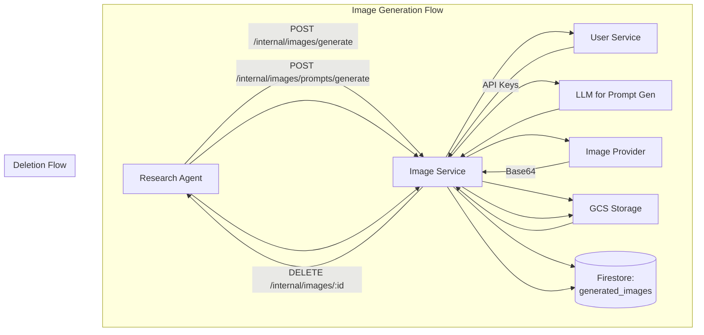

# Image Service - Technical Reference

## Overview

Image-service generates AI images using OpenAI DALL-E 3 and Google Imagen 3, with LLM-powered prompt enhancement. Images are stored in GCS with automatic thumbnail generation.

## Architecture



## API Endpoints

### Internal Endpoints

| Method | Path                                | Description                     | Auth            |
| ------  | -----------------------------------  | -------------------------------  | ---------------  |
| POST   | `/internal/images/prompts/generate` | Generate image prompt from text | Internal header |
| POST   | `/internal/images/generate`         | Generate image from prompt      | Internal header |
| DELETE | `/internal/images/:id`              | Delete image (used on unshare)  | Internal header |

## Domain Models

### GeneratedImage

| Field          | Type   | Description                          |
| --------------  | ------  | ------------------------------------  |
| `id`           | string | Unique image identifier              |
| `userId`       | string | User who requested generation        |
| `model`        | string | Model used (e.g., `gpt-image-1`)     |
| `prompt`       | string | Original or enhanced prompt          |
| `thumbnailUrl` | string | Signed GCS URL for thumbnail (256px) |
| `fullSizeUrl`  | string | Signed GCS URL for full-size image   |
| `slug`         | string | URL-safe identifier (optional)       |
| `createdAt`    | string | Creation timestamp                   |

### ThumbnailPrompt

| Field    | Type   | Description                          |
| --------  | ------  | ------------------------------------  |
| `prompt` | string | Generated image prompt               |
| `model`  | string | LLM model used for prompt generation |

## Supported Models

### Image Generation Models

| Model                    | Provider | Description |
| ------------------------  | --------  | -----------  |
| `gpt-image-1`            | OpenAI   | DALL-E 3    |
| `gemini-2.5-flash-image` | Google   | Imagen 3    |

### Prompt Generation Models

| Model            | Provider | Description                           |
| ----------------  | --------  | -------------------------------------  |
| `gpt-4.1`        | OpenAI   | GPT-4.1 for prompt enhancement        |
| `gemini-2.5-pro` | Google   | Gemini 2.5 Pro for prompt enhancement |

## Dependencies

### Internal Services

| Service        | Purpose                          |
| --------------  | --------------------------------  |
| `user-service` | Fetch API keys for LLM providers |

### External Services

| Service           | Purpose                   |
| -----------------  | -------------------------  |
| OpenAI API        | DALL-E 3 image generation |
| Google Imagen API | Imagen 3 image generation |

### Infrastructure

| Component                                 | Purpose                    |
| -----------------------------------------  | --------------------------  |
| Firestore (`generated_images` collection) | Image metadata persistence |
| GCS (`generated-images/` bucket)          | Image storage              |

## Configuration

| Environment Variable             | Required | Description                      |
| --------------------------------  | --------  | --------------------------------  |
| `INTEXURAOS_USER_SERVICE_URL`    | Yes      | User-service base URL            |
| `INTEXURAOS_INTERNAL_AUTH_TOKEN` | Yes      | Shared secret for internal auth  |
| `INTEXURAOS_GCP_PROJECT_ID`      | Yes      | Google Cloud project ID          |
| `INTEXURAOS_GCS_BUCKET_NAME`     | Yes      | GCS bucket for image storage     |
| `INTEXURAOS_OPENAI_IMAGE_SIZE`   | No       | Image size (default: 1024x1024)  |
| `INTEXURAOS_OPENAI_IMAGE_MODEL`  | No       | DALL-E model (default: dall-e-3) |
| `INTEXURAOS_GOOGLE_IMAGE_SIZE`   | No       | Imagen size (default: 1024x1024) |

## Gotchas

**Slug generation**: The `slug` field is derived from the title using slugify() for clean URLs. Only used for research cover images.

**Thumbnail size**: Thumbnails are exactly 256px on the longest edge, maintaining aspect ratio.

**Signed URL expiry**: GCS signed URLs expire after 15 minutes (900 seconds). For persistent access, regenerate the URL.

**Deletion cascade**: When deleting an image, both the GCS objects and Firestore record are removed. If GCS deletion fails, the record is still removed from Firestore.

**API key validation**: The service validates that the user has the required API key before generation. Missing keys return 400.

**Image format**: All images are generated as PNG format for maximum quality.

**Base64 handling**: OpenAI returns base64-encoded images which must be decoded before uploading to GCS.

**Prompt enhancement**: The `/prompts/generate` endpoint only generates prompts; it does not generate images.

**Idempotent generation**: Each image generation creates a new unique ID. There is no deduplication for identical prompts.

## File Structure

```
apps/image-service/src/
  domain/
    models/
      ImageGenerationModel.ts    # Supported models
      ImagePromptModel.ts         # Prompt generation models
      GeneratedImage.ts           # GeneratedImage entity
      ThumbnailPrompt.ts          # Prompt response
    ports/
      generatedImageRepository.ts
      imageGenerator.ts           # Image generation interface
      imageStorage.ts             # GCS storage interface
      promptGenerator.ts          # LLM prompt generation
  infra/
    firestore/
      GeneratedImageFirestoreRepository.ts
    image/
      OpenAIImageGenerator.ts     # DALL-E 3 integration
      GoogleImageGenerator.ts     # Imagen 3 integration
      FakeImageGenerator.ts       # Testing
    llm/
      GptPromptAdapter.ts         # OpenAI prompt generation
      GeminiPromptAdapter.ts      # Gemini prompt generation
    storage/
      GcsImageStorage.ts          # GCS operations
    user/
      userServiceClient.ts        # API key fetching
  routes/
    internalRoutes.ts             # All endpoints (internal only)
    schemas/
      imageSchemas.ts
      promptSchemas.ts
  services.ts                     # DI container
```
