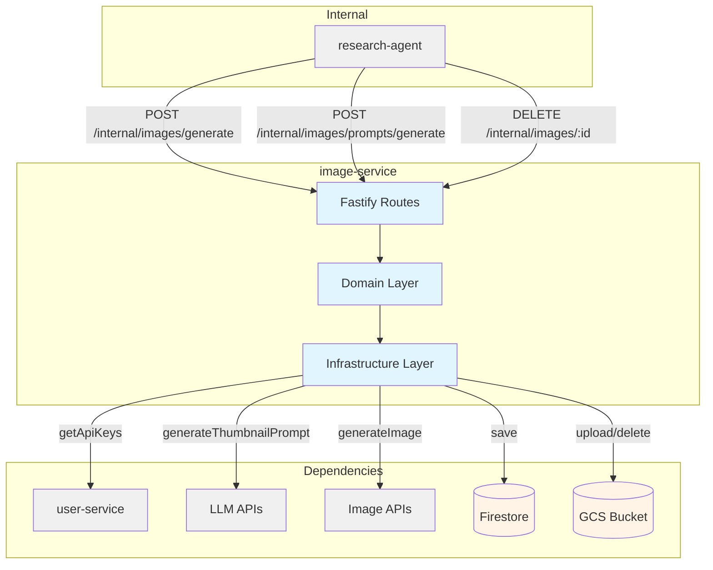
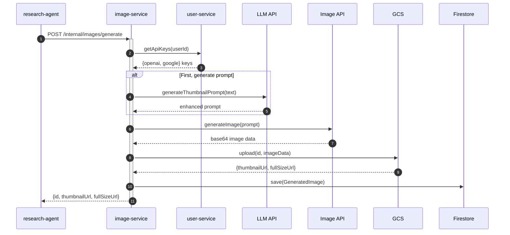

# Image Service - Technical Reference

## Overview

Image-service generates AI images using OpenAI GPT Image 1 and Google Gemini Flash Image, with LLM-powered prompt enhancement via GPT-4.1 and Gemini 2.5 Pro. Images are stored in GCS with automatic thumbnail generation (256px max edge, JPEG at 80% quality). Runs on Cloud Run with auto-scaling.

## Architecture



## Data Flow



## Recent Changes

| Commit     | Description                                                  | Date       |
| ---------- | ------------------------------------------------------------ | ---------- |
| `88cec45f` | Fix deployment: Remove internal-clients subpath exports      | 2025-01-25 |
| `b1c7a4bb` | INT-269 Create internal-clients package and migrate all apps | 2025-01-25 |
| `51b4a325` | INT-266 Migrate LLM clients to UsageLogger class             | 2025-01-24 |
| `4fa0fed3` | Release v2.0.0                                               | 2025-01-24 |
| `32cc2826` | Add tests for image-service uncovered branches               | 2025-01-19 |

## API Endpoints

### Internal Endpoints

| Method | Path                                | Purpose                         | Auth            |
| ------ | ----------------------------------- | ------------------------------- | --------------- |
| POST   | `/internal/images/prompts/generate` | Generate image prompt from text | Internal header |
| POST   | `/internal/images/generate`         | Generate image from prompt      | Internal header |
| DELETE | `/internal/images/:id`              | Delete image (used on unshare)  | Internal header |

### System Endpoints

| Method | Path            | Purpose               | Auth |
| ------ | --------------- | --------------------- | ---- |
| GET    | `/health`       | Health check          | None |
| GET    | `/docs`         | Swagger UI            | None |
| GET    | `/openapi.json` | OpenAPI specification | None |

## Domain Model

### GeneratedImage

| Field          | Type                | Description                                       |
| -------------- | ------------------- | ------------------------------------------------- |
| `id`           | `string`            | Unique image identifier (UUID v4)                 |
| `userId`       | `string`            | User who requested generation                     |
| `prompt`       | `string`            | Original or enhanced prompt used for generation   |
| `thumbnailUrl` | `string`            | GCS public URL for thumbnail (256px, JPEG)        |
| `fullSizeUrl`  | `string`            | GCS public URL for full-size image (PNG)          |
| `model`        | `string`            | Model used (e.g., `gpt-image-1`)                  |
| `createdAt`    | `string` (ISO 8601) | Creation timestamp                                |
| `slug`         | `string?`           | URL-safe identifier derived from title (optional) |

### ThumbnailPrompt

| Field            | Type                        | Description                                     |
| ---------------- | --------------------------- | ----------------------------------------------- |
| `title`          | `string`                    | Short title for the image (max 10 words)        |
| `visualSummary`  | `string`                    | One sentence describing the visual metaphor     |
| `prompt`         | `string`                    | Image generation prompt (80-180 words)          |
| `negativePrompt` | `string`                    | What to avoid (20-80 words)                     |
| `parameters`     | `ThumbnailPromptParameters` | Generation settings (aspect ratio, style, etc.) |

### ThumbnailPromptParameters

| Field             | Type           | Values                                                           |
| ----------------- | -------------- | ---------------------------------------------------------------- |
| `aspectRatio`     | `string`       | `"16:9"` (fixed)                                                 |
| `framing`         | `string`       | LLM-generated framing description                                |
| `textOnImage`     | `string`       | `"none"` (fixed)                                                 |
| `realism`         | `RealismStyle` | `"photorealistic"`, `"cinematic illustration"`, `"clean vector"` |
| `people`          | `string`       | LLM-generated people description                                 |
| `logosTrademarks` | `string`       | `"none"` (fixed)                                                 |

## Supported Models

### Image Generation Models

| Model                    | Provider | Description                           |
| ------------------------ | -------- | ------------------------------------- |
| `gpt-image-1`            | OpenAI   | GPT Image 1 (image generation model)  |
| `gemini-2.5-flash-image` | Google   | Gemini Flash Image (image generation) |

### Prompt Generation Models

| Model            | Provider | Purpose            |
| ---------------- | -------- | ------------------ |
| `gpt-4.1`        | OpenAI   | Prompt enhancement |
| `gemini-2.5-pro` | Google   | Prompt enhancement |

## Dependencies

### Internal Services

| Service        | Endpoint                           | Purpose                  |
| -------------- | ---------------------------------- | ------------------------ |
| `user-service` | `/internal/users/:userId/api-keys` | Fetch encrypted API keys |

### External Services

| Service           | Purpose                            |
| ----------------- | ---------------------------------- |
| OpenAI API        | GPT Image 1, GPT-4.1               |
| Google Imagen API | Gemini Flash Image, Gemini 2.5 Pro |

### Infrastructure

| Component                                 | Purpose                    |
| ----------------------------------------- | -------------------------- |
| Firestore (`generated_images` collection) | Image metadata persistence |
| GCS (`INTEXURAOS_IMAGE_BUCKET`)           | Image storage              |

## Configuration

| Variable                              | Required | Description                         |
| ------------------------------------- | -------- | ----------------------------------- |
| `INTEXURAOS_USER_SERVICE_URL`         | Yes      | User-service base URL               |
| `INTEXURAOS_INTERNAL_AUTH_TOKEN`      | Yes      | Shared secret for internal auth     |
| `INTEXURAOS_GCP_PROJECT_ID`           | Yes      | Google Cloud project ID             |
| `INTEXURAOS_AUTH_JWKS_URL`            | Yes      | JWKS endpoint for JWT verification  |
| `INTEXURAOS_AUTH_ISSUER`              | Yes      | JWT issuer                          |
| `INTEXURAOS_AUTH_AUDIENCE`            | Yes      | JWT audience                        |
| `INTEXURAOS_IMAGE_BUCKET`             | Yes      | GCS bucket for image storage        |
| `INTEXURAOS_IMAGE_PUBLIC_BASE_URL`    | No       | Public base URL for GCS objects     |
| `INTEXURAOS_APP_SETTINGS_SERVICE_URL` | Yes      | App settings service (pricing data) |
| `INTEXURAOS_SENTRY_DSN`               | No       | Sentry error tracking               |

## Gotchas

**Slug generation**: The `slug` field is derived from the title using slugify() for clean URLs (max 50 chars, lowercase, hyphens for spaces). Only used for research cover images.

**Thumbnail size**: Thumbnails are exactly 256px on the longest edge, maintaining aspect ratio, saved as JPEG at 80% quality for size optimization.

**GCS path patterns**:

- With slug: `images/{id}-{slug}.png` / `images/{id}-{slug}-thumb.jpg`
- Without slug: `images/{id}/full.png` / `images/{id}/thumbnail.jpg`

**Deletion cascade**: When deleting an image, both GCS objects and Firestore record are removed. If GCS deletion fails, the record is still removed from Firestore (orphan cleanup not implemented).

**API key validation**: Service validates that the user has the required provider API key before generation. Missing keys return 400 with specific provider mentioned.

**Image format**: All images are generated as PNG format for maximum quality; thumbnails are JPEG for size optimization.

**Base64 handling**: OpenAI returns base64-encoded images which are decoded before uploading to GCS.

**Prompt-only endpoint**: `/prompts/generate` only generates prompts; it does not generate images. Caller must call `/images/generate` separately.

**No deduplication**: Each image generation creates a new unique ID. Identical prompts generate separate images.

**Internal-only access**: All functional endpoints require `X-Internal-Auth` header. No public API endpoints.

## File Structure

```
apps/image-service/src/
  domain/
    models/
      ImageGenerationModel.ts      # GPT Image 1, Gemini Flash Image
      ImagePromptModel.ts           # GPT-4.1, Gemini 2.5 Pro
      GeneratedImage.ts             # GeneratedImage entity
      ThumbnailPrompt.ts            # Prompt response structure
    ports/
      generatedImageRepository.ts   # Firestore interface
      imageGenerator.ts             # Image generation interface
      imageStorage.ts               # GCS storage interface
      promptGenerator.ts            # LLM prompt generation interface
  infra/
    firestore/
      GeneratedImageFirestoreRepository.ts
    image/
      OpenAIImageGenerator.ts       # GPT Image 1 integration
      GoogleImageGenerator.ts       # Gemini Flash Image integration
      FakeImageGenerator.ts         # Testing fake
    llm/
      GptPromptAdapter.ts           # GPT-4.1 prompt generation
      GeminiPromptAdapter.ts        # Gemini prompt generation
      parseResponse.ts              # LLM response parser
    storage/
      GcsImageStorage.ts            # GCS operations with Sharp
    user/
      index.ts                      # Re-exports from @intexuraos/internal-clients
  routes/
    internalRoutes.ts               # POST /internal/images/generate
                                   # POST /internal/images/prompts/generate
                                   # DELETE /internal/images/:id
    schemas/
      imageSchemas.ts               # Image generation schemas
      promptSchemas.ts              # Prompt generation schemas
  services.ts                       # DI container
  index.ts                          # Entry point
  server.ts                         # Fastify server setup
```

## INT-269 Migration Notes

**v2.1.0 Changes**:

- User service client migrated from direct HTTP calls to `@intexuraos/internal-clients/user-service` package
- `UserServiceClient` now imported from `internal-clients` rather than implemented locally
- `getApiKeys()` method signature unchanged - backwards compatible
