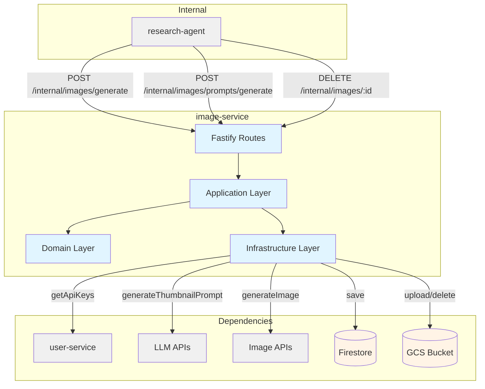
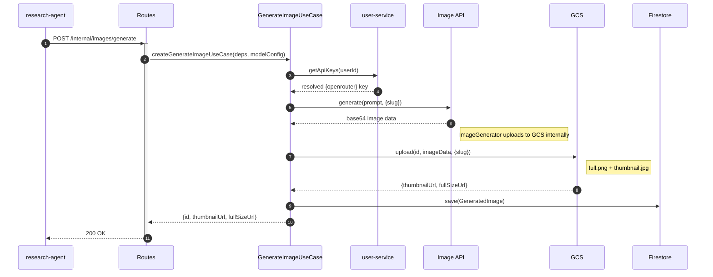
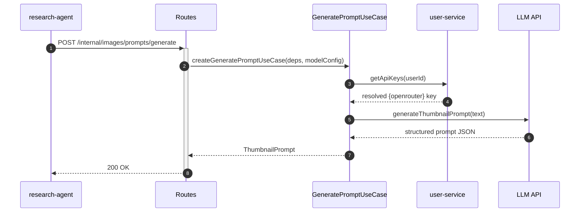

# Image Service — Technical Reference

## Overview

Image-service generates AI images through OpenRouter using the stable `gpt-image-1` public alias, with prompt enhancement through the stable `gpt-4.1` alias. Images are stored in GCS with automatic thumbnail generation (256px max edge, JPEG at 80% quality). Image metadata is persisted unchanged in Firestore.

## Architecture


```mermaid
graph TB
    subgraph "Internal"
        Caller[research-agent]
    end

    subgraph "image-service"
        API[Fastify Routes]
        App[Application Layer]
        Domain[Domain Layer]
        Infra[Infrastructure Layer]
    end

    subgraph "Dependencies"
        UserSvc[user-service]
        LLM[LLM APIs]
        ImgGen[Image APIs]
        Firestore[(Firestore)]
        GCS[(GCS Bucket)]
    end

    Caller -->|POST /internal/images/generate| API
    Caller -->|POST /internal/images/prompts/generate| API
    Caller -->|DELETE /internal/images/:id| API

    API --> App
    App --> Domain
    App --> Infra

    Infra -->|getApiKeys| UserSvc
    Infra -->|generateThumbnailPrompt| LLM
    Infra -->|generateImage| ImgGen
    Infra -->|save| Firestore
    Infra -->|upload/delete| GCS

    classDef service fill:#e1f5ff
    classDef storage fill:#fff4e6
    classDef external fill:#f0f0f0

    class API,App,Domain,Infra service
    class Firestore,GCS storage
    class Caller,UserSvc,LLM,ImgGen external
```

## Data Flow

### Image Generation


```mermaid
sequenceDiagram
    autonumber
    participant Caller as research-agent
    participant Routes as Routes
    participant UC as GenerateImageUseCase
    participant UserSvc as user-service
    participant ImgGen as Image API
    participant GCS as GCS
    participant Firestore as Firestore

    Caller->>+Routes: POST /internal/images/generate
    Routes->>UC: createGenerateImageUseCase(deps, modelConfig)
    UC->>UserSvc: getApiKeys(userId)
    UserSvc-->>UC: resolved {openrouter} key

    UC->>ImgGen: generate(prompt, {slug})
    ImgGen-->>UC: base64 image data

    Note right of ImgGen: ImageGenerator uploads to GCS internally
    UC->>GCS: upload(id, imageData, {slug})
    Note right of GCS: full.png + thumbnail.jpg
    GCS-->>UC: {thumbnailUrl, fullSizeUrl}

    UC->>Firestore: save(GeneratedImage)
    UC-->>Routes: {id, thumbnailUrl, fullSizeUrl}
    Routes-->>-Caller: 200 OK
```

### Prompt Generation


```mermaid
sequenceDiagram
    autonumber
    participant Caller as research-agent
    participant Routes as Routes
    participant UC as GeneratePromptUseCase
    participant UserSvc as user-service
    participant LLM as LLM API

    Caller->>+Routes: POST /internal/images/prompts/generate
    Routes->>UC: createGeneratePromptUseCase(deps, modelConfig)
    UC->>UserSvc: getApiKeys(userId)
    UserSvc-->>UC: resolved {openrouter} key

    UC->>LLM: generateThumbnailPrompt(text)
    LLM-->>UC: structured prompt JSON

    UC-->>Routes: ThumbnailPrompt
    Routes-->>-Caller: 200 OK
```

## Recent Changes

### Changes since v3.8.0

Prompt enhancement and image generation now execute through OpenRouter with user-key precedence and platform fallback. The public aliases remain `gpt-4.1` and `gpt-image-1`, so stored image metadata stays readable. Direct Google generation has been removed; `INTEXURAOS_OPENROUTER_APP_API_KEY` is required at startup.

### v3.6.0 (since v3.5.0)

Centralized LLM pricing removal and usage sink migration. No new endpoints or user-facing behavior changes.

| Commit      | Description                                                                                                          | Date       |
| ----------- | -------------------------------------------------------------------------------------------------------------------- | ---------- |
| `398d351a`  | Fix digest LLM usage sink + brand UsageSink nominally (INT-1421)                                                     | 2026-04-22 |
| `a4f53cd7`  | Remove LLM pricing from image-service — delete `REQUIRED_MODELS`, `pricingContext`, `ModelPricing` fields (INT-1387) | 2026-04-15 |
| `6f2a13c1`  | Address PR review: remove pricing from client configs                                                                | 2026-04-15 |
| `012ce46c`  | Replace remaining hardcoded provider strings in tests                                                                | 2026-04-14 |
| `4c0a27b6`  | Replace hardcoded model/provider strings with LlmModels/LlmProviders constants                                       | 2026-04-14 |
| `84b5d81a`  | Rename ambiguous `geminiFlashPricing` var and drop dead pricing code                                                 | 2026-04-14 |
| `a96e4857`  | Fix pricing mismatch — pass model explicitly to `createPromptGenerator` (INT-1369)                                   | 2026-04-14 |
| `830d5a91`  | Add retry with exponential backoff to pricing fetch (llm-pricing)                                                    | 2026-04-13 |
| `8b1211dc`  | Wire `HttpInternalAuthUsageSink` in all LLM call sites (INT-1342)                                                    | 2026-04-12 |
| `209f59e8`  | Migrate LLM usage sinks to HTTP + delete llm-usage Firestore writes (INT-1342)                                       | 2026-04-11 |
| `8767c5e2`  | Migrate pricing consumers from app-settings-service to llm-pricing package                                           | 2026-04-10 |

**Key changes:**

- **Pricing fully removed (INT-1387):** `REQUIRED_MODELS` array, `pricingContext` parameter, `ModelPricing` fields in adapter configs, and the `fetchAllPricingWithRetry` call in `initializeServices` — all deleted. `initializeServices()` is now synchronous (no `await` needed). This eliminates the pricing model mismatch gotcha documented in v3.5.0.
- **Explicit model in prompt generation (INT-1369):** `createPromptGenerator` signature changed from `(provider, apiKey, userId, logger)` to `(provider, model, apiKey, userId, logger)`. The Gemini adapter no longer defaults to `Gemini25Pro` — the model is always passed explicitly from `ImagePromptModelConfig.modelId`.
- **HTTP-based usage sinks (INT-1342):** All LLM call sites now use `HttpInternalAuthUsageSink` to report usage to `llm-usage-service` via HTTP, replacing the previous direct Firestore-based `UsageLogger`. Requires `INTEXURAOS_LLM_USAGE_SERVICE_URL` env var.
- **Usage sink branding (INT-1421):** Each usage sink is branded with a `component` identifier (e.g., `gemini-prompt-adapter`, `openai-image-generator`) for granular cost attribution.

### v3.5.0 (since v3.4.0)

Minor maintenance changes only — no new features or architectural changes to image-service itself. The headline change affecting this service (INT-1310 provider failover for cover image generation) is implemented in **research-agent**, the primary caller.

| Commit      | Description                                                                        | Date       |
| ----------- | ---------------------------------------------------------------------------------- | ---------- |
| `613ac528`  | Replace v8 ignore override blocks with real tests for env var fallbacks (INT-1072) | 2026-03-25 |
| `287db2b6`  | Add `getUserTimezone` to `FakeUserServiceClient` (interface conformance)           | 2026-03-27 |

**Key changes:**
- v8 ignore blocks removed from `serviceFactory.ts` — env var fallback branches now covered by a real test that deletes env vars and verifies `initializeServices` still succeeds
- `FakeUserServiceClient` updated to conform to new `getUserTimezone` method added to `UserServiceClient` interface in `@intexuraos/internal-clients`

**Historical caller-side change (INT-1310):** research-agent previously retried an alternate direct provider for cover images. The current caller uses one OpenRouter pipeline and continues publishing without a cover if that pipeline fails.

### v3.4.0 (since v3.3.0)

The primary focus of this release was an architectural refactoring — extracting business logic from route handlers into a clean application layer with use cases and port/adapter patterns.

| Commit      | Description                                                                      | Date       |
| ----------- | -------------------------------------------------------------------------------- | ---------- |
| `a1655a30`  | Split `services.ts` into `serviceContainer.ts` and `serviceFactory.ts` (INT-900) | 2026-03-16 |
| `3e0be5c5`  | Move business logic from `internalRoutes.ts` to use-cases (INT-899)              | 2026-03-16 |
| `9c80ff62`  | Create application-layer use-cases for image-service (INT-898)                   | 2026-03-16 |
| `9fb00bef`  | Add v8 ignore blocks for env var fallback branches in `serviceFactory.ts`        | 2026-03-16 |
| `00b44d31`  | Add v8 ignore coverage exemptions for env var fallbacks                          | 2026-03-16 |

**Key architectural changes:**
- New `application/` layer with three use cases: `generateImage`, `generatePrompt`, `deleteImage`
- Routes are now thin handlers that delegate to use cases
- `services.ts` split into `serviceContainer.ts` (DI interface + getServices/setServices) and `serviceFactory.ts` (initialization logic)
- New `slugify` utility extracted for URL-safe filename generation

### Previous Releases

| Commit      | Description                                                                  | Date       |
| ----------- | ---------------------------------------------------------------------------- | ---------- |
| `c4e3a13c`  | Release v3.3.0                                                               | 2026-03-15 |
| `93aeac4a`  | Remove ZAI provider and GLM-4.7 models; ZAI pricing removed from services.ts | 2026-03-12 |
| `e348b66e`  | Fix silent dispatch failures and nested transaction (INT-810/811)            | 2026-03-10 |
| `44ea683a`  | Release v3.2.0 (package.json version bump only)                              | 2026-03-07 |
| `99febe66`  | Wire GitHub OAuth integration, update cross-service mocks                    | 2026-03-02 |
| `7fbf7668`  | Remove stale fields from test fixtures per code review                       | 2026-02-27 |
| `8fb90669`  | Align thumbnail output contract with consumed parser fields (INT-605)        | 2026-02-27 |

## API Endpoints

### Internal Endpoints

| Method | Path                                | Purpose                         | Auth            |
| ------ | ----------------------------------- | ------------------------------- | --------------- |
| POST   | `/internal/images/prompts/generate` | Generate image prompt from text | Internal header |
| POST   | `/internal/images/generate`         | Generate image from prompt      | Internal header |
| DELETE | `/internal/images/:id`              | Delete image (used on unshare)  | Internal header |

### System Endpoints

| Method | Path            | Purpose               | Auth |
| ------ | --------------- | --------------------- | ---- |
| GET    | `/health`       | Health check          | None |
| GET    | `/docs`         | Swagger UI            | None |
| GET    | `/openapi.json` | OpenAPI specification | None |

## Domain Model

### GeneratedImage

| Field          | Type                | Description                                       |
| -------------- | ------------------- | ------------------------------------------------- |
| `id`           | `string`            | Unique image identifier (UUID v4)                 |
| `userId`       | `string`            | User who requested generation                     |
| `prompt`       | `string`            | Prompt used for generation                        |
| `thumbnailUrl` | `string`            | GCS public URL for thumbnail (256px, JPEG)        |
| `fullSizeUrl`  | `string`            | GCS public URL for full-size image (PNG)          |
| `model`        | `string`            | Model used (e.g., `gpt-image-1`)                  |
| `createdAt`    | `string` (ISO 8601) | Creation timestamp                                |
| `slug`         | `string?`           | URL-safe identifier derived from title (optional) |

### ThumbnailPrompt

| Field            | Type                        | Description                                  |
| ---------------- | --------------------------- | -------------------------------------------- |
| `title`          | `string`                    | Short title for the image (max 10 words)     |
| `visualSummary`  | `string`                    | One sentence describing the visual metaphor  |
| `prompt`         | `string`                    | Image generation prompt (80–180 words)       |
| `negativePrompt` | `string`                    | What to avoid (20–80 words)                  |
| `parameters`     | `ThumbnailPromptParameters` | Generation settings (framing, style, people) |

### ThumbnailPromptParameters

| Field     | Type           | Values                                                           |
| --------- | -------------- | ---------------------------------------------------------------- |
| `framing` | `string`       | LLM-generated framing description                                |
| `realism` | `RealismStyle` | `"photorealistic"`, `"cinematic illustration"`, `"clean vector"` |
| `people`  | `string`       | LLM-generated people description                                 |

## Application Layer (Use Cases)

### GeneratePromptUseCase

Resolves OpenRouter access via user-service and delegates to the OpenRouter-backed `PromptGenerator` port. Distinguishes `RATE_LIMITED` errors (retryable) from `GENERATION_FAILED` (terminal).

### GenerateImageUseCase

Resolves API keys, generates the image via the `ImageGenerator` port, uploads to GCS via the `ImageStorage` port, persists metadata via `GeneratedImageRepository`. On save failure, performs cleanup by deleting the uploaded GCS object. Derives a slug from the title using `slugify()` for human-readable file paths.

### DeleteImageUseCase

Best-effort deletion — looks up the image record for its slug, deletes from GCS and Firestore independently, logs errors but always returns `{ deleted: true }`. Error type is `never`.

## Supported Models

### Image Generation Models

| Model alias    | Provider   | Description                          |
| -------------- | ---------- | ------------------------------------ |
| `gpt-image-1`  | OpenRouter | GPT Image 1 (image generation model) |

### Prompt Generation Models

| Model alias | Provider   | Purpose            |
| ----------- | ---------- | ------------------ |
| `gpt-4.1`   | OpenRouter | Prompt enhancement |

## Pub/Sub

None. Image-service does not publish or subscribe to Pub/Sub events.

## Dependencies

### Internal Services

| Service        | Endpoint                           | Purpose                  |
| -------------- | ---------------------------------- | ------------------------ |
| `user-service` | `/internal/users/:userId/api-keys` | Fetch encrypted API keys |

### External Services

| Service    | Purpose              | Failure Mode     |
| ---------- | -------------------- | ---------------- |
| OpenRouter API | GPT Image 1, GPT-4.1 | DOWNSTREAM_ERROR |

### Infrastructure

| Component                                 | Purpose                    |
| ----------------------------------------- | -------------------------- |
| Firestore (`generated_images` collection) | Image metadata persistence |
| GCS (`INTEXURAOS_IMAGE_BUCKET`)           | Image file storage         |

## Configuration

| Variable                              | Required | Description                                   |
| ------------------------------------- | -------- | --------------------------------------------- |
| `INTEXURAOS_GCP_PROJECT_ID`           | Yes      | Google Cloud project ID                       |
| `INTEXURAOS_AUTH_JWKS_URL`            | Yes      | JWKS endpoint for JWT verification            |
| `INTEXURAOS_AUTH_ISSUER`              | Yes      | JWT issuer                                    |
| `INTEXURAOS_AUTH_AUDIENCE`            | Yes      | JWT audience                                  |
| `INTEXURAOS_USER_SERVICE_URL`         | Yes      | User-service base URL                         |
| `INTEXURAOS_INTERNAL_AUTH_TOKEN`      | Yes      | Shared secret for internal auth               |
| `INTEXURAOS_IMAGE_BUCKET`             | Yes      | GCS bucket name for image storage             |
| `INTEXURAOS_IMAGE_PUBLIC_BASE_URL`    | Yes      | Public base URL for GCS objects               |
| `INTEXURAOS_LLM_USAGE_SERVICE_URL`    | Yes      | LLM usage service URL for usage reporting     |
| `INTEXURAOS_OPENROUTER_APP_API_KEY` | Yes | Platform OpenRouter credential and fallback |
| `INTEXURAOS_SENTRY_DSN`               | No       | Sentry error tracking DSN                     |

## Gotchas

**Slug generation**: The `slug` field is derived from the title using `slugify()` — max 50 characters, lowercase, normalized unicode, hyphens for spaces. Only used when a title is provided (research cover images).

**Thumbnail size**: Thumbnails are exactly 256px on the longest edge, maintaining aspect ratio, saved as JPEG at 80% quality. Created using the Sharp image processing library.

**GCS path patterns**:
- With slug: `images/{id}-{slug}.png` / `images/{id}-{slug}-thumb.jpg`
- Without slug: `images/{id}/full.png` / `images/{id}/thumbnail.jpg`

**Deletion cascade**: When deleting an image, both GCS objects and Firestore record are removed independently. If either operation fails, the error is logged but the endpoint still returns `{ deleted: true }` — best-effort cleanup with no rollback.

**API key resolution**: The service uses the user's OpenRouter key when present and the platform OpenRouter key otherwise. If neither is available, a 400 error is returned.

**Image format**: Full-size images are PNG; thumbnails are JPEG. No format selection available.

**Prompt-only endpoint**: `/internal/images/prompts/generate` only generates prompts; it does not generate images. The caller must call `/internal/images/generate` separately.

**No deduplication**: Each image generation creates a new UUID. Identical prompts generate separate images with separate storage objects.

**Internal-only access**: All functional endpoints require `X-Internal-Auth` header. No public API endpoints exist.

**Rate limit propagation**: Rate limited responses from upstream providers are propagated as `RATE_LIMITED` error code. The prompt generation endpoint returns this directly; the image generation endpoint wraps it in `DOWNSTREAM_ERROR`.

**Delete endpoint resilience**: The DELETE endpoint attempts both GCS deletion and Firestore deletion independently. If either fails, it logs the error but still returns `{ deleted: true }` to the caller.

**Prompt parameters trimmed (INT-605)**: The `ThumbnailPromptParameters` type only contains `framing`, `realism`, and `people`. Previously documented fields `aspectRatio`, `textOnImage`, and `logosTrademarks` were removed from the consumed contract. The LLM prompt may still produce them, but the parser discards any fields not in the validated schema.

**Direct providers removed**: Prompt and image generation execute through OpenRouter. Direct Gemini and OpenAI clients are not exposed by image-service.

**Stable aliases**: image-service exposes only `gpt-4.1` and `gpt-image-1`; both route through OpenRouter, and a failed request is returned to the caller.

## File Structure

```
apps/image-service/src/
  application/
    generatePrompt.ts              # GeneratePromptUseCase — API key resolution + prompt generation
    generateImage.ts               # GenerateImageUseCase — full pipeline: keys, generate, upload, save
    deleteImage.ts                 # DeleteImageUseCase — best-effort GCS + Firestore cleanup
    slugify.ts                     # URL-safe slug from title (max 50 chars, NFD normalization)
  domain/
    models/
      ImageGenerationModel.ts      # GPT Image 1 config
      ImagePromptModel.ts          # GPT-4.1 config
      GeneratedImage.ts            # GeneratedImage entity
      ThumbnailPrompt.ts           # Prompt response structure + RealismStyle
    ports/
      generatedImageRepository.ts  # Firestore persistence interface
      imageGenerator.ts            # Image generation interface
      imageStorage.ts              # GCS storage interface
      promptGenerator.ts           # LLM prompt generation interface
  infra/
    firestore/
      GeneratedImageFirestoreRepository.ts  # Firestore CRUD for generated_images
    image/
      OpenAIImageGenerator.ts      # Compatibility filename; OpenRouter image integration
      FakeImageGenerator.ts        # Testing fake (no API calls)
    llm/
      GptPromptAdapter.ts          # Compatibility filename; OpenRouter prompt generation
      parseResponse.ts             # LLM JSON response parser + validation
    storage/
      GcsImageStorage.ts           # GCS upload/delete with Sharp thumbnailing
  routes/
    internalRoutes.ts              # 3 internal endpoints (generate prompt, generate image, delete)
    schemas/
      imageSchemas.ts              # Image generation + delete request/response schemas
      promptSchemas.ts             # Prompt generation request/response schemas
  serviceContainer.ts              # DI container interface (ServiceContainer type + get/set/reset)
  serviceFactory.ts                # Service initialization with env vars and usage sinks
  services.ts                      # Re-exports from serviceContainer.ts and serviceFactory.ts
  index.ts                         # Entry point with env validation
  server.ts                        # Fastify server setup with Swagger, CORS, health
```

## Migration Notes

### OpenRouter-only transport (2026-08-18)

- Prompt and image generation now use OpenRouter with user BYOK → platform-key fallback
- Public and persisted aliases remain `gpt-4.1` and `gpt-image-1`

### v3.6.0: LLM Pricing Removal and Usage Sink Migration (2026-04-10–2026-04-22)

- **LLM pricing fully removed (INT-1387):** `REQUIRED_MODELS`, `pricingContext` parameter, `ModelPricing` fields in all adapter configs, and the async `fetchAllPricingWithRetry` call in `initializeServices` — all deleted. `initializeServices()` is now synchronous.
- **Pricing model mismatch resolved:** The v3.5.0 gotcha about `REQUIRED_MODELS` fetching pricing for wrong models (`gemini-2.5-flash`/`gpt-4o-mini` vs actual `gemini-2.5-pro`/`gpt-4.1`) is no longer relevant — pricing is handled centrally in `llm-usage-service`.
- **Explicit model in prompt generation (INT-1369):** `createPromptGenerator` signature expanded with `model: string` parameter. `GeminiPromptAdapter` no longer has a hardcoded default model — it must be passed explicitly.
- **HTTP-based usage sinks (INT-1342):** `UsageLogger` (direct Firestore writes) replaced with `HttpInternalAuthUsageSink` (HTTP calls to `llm-usage-service`). Each adapter gets a component-branded sink for granular attribution.
- **New env var required:** `INTEXURAOS_LLM_USAGE_SERVICE_URL` — base URL for the centralized LLM usage reporting service.

### v3.5.0: Test Coverage Improvements (2026-03-25)

- v8 ignore blocks removed from `serviceFactory.ts` — replaced with real test that exercises env var fallback branches (INT-1072)
- `FakeUserServiceClient` updated with `getUserTimezone()` stub for interface conformance
- No functional changes to image-service behavior

### v3.4.0: Application Layer Extraction (2026-03-16)

- New `application/` directory with three use cases: `generatePrompt.ts`, `generateImage.ts`, `deleteImage.ts`
- Business logic extracted from `internalRoutes.ts` — routes are now thin handlers delegating to use cases
- `services.ts` split into `serviceContainer.ts` (interface + state management) and `serviceFactory.ts` (initialization)
- `slugify.ts` extracted as a standalone utility from inline logic
- v8 ignore blocks added to `serviceFactory.ts` for `process.env` fallback branches that cannot be controlled in tests

### v3.3.0: ZAI Provider Removal (2026-03-12)

- ZAI pricing entry removed from `services.ts` (`REQUIRED_MODELS` now has 4 models)
- Platform Gemini fallback was removed
- No functional change to image generation flows

### INT-605: Thumbnail Output Contract Alignment (2026-02-27)

- `ThumbnailPromptParameters` trimmed to 3 fields: `framing`, `realism`, `people`
- Removed `aspectRatio`, `textOnImage`, `logosTrademarks` from the consumed interface
- Parser (`parseResponse.ts`) only validates the 3 consumed fields
- Test fixtures updated to remove stale fields in `7fbf7668`

### Release v3.1.0 (2026-02-22)

- Version bump only, no functional changes to image-service

### Release v3.0.0 (2026-02-19)

- Version bump only, no functional changes to image-service

### Dev-Mode Log Formatting (2026-02-16)

- `server.ts` uses `createLogStream()` from `@intexuraos/infra-sentry` for colorized PM2 output
- Format: `service-name | HH:mm:ss | LEVEL | message | {extras}`
- No behavior change in production or test environments

### API Key Naming Standardization (2026-02-15)

- No shared platform LLM key is injected into image-service

### Platform Key Fallback (2026-02-09)

- Historical: users without personal API keys fell back to a platform-owned Gemini key
- That fallback was retired on 2026-08-12, when image-service temporarily required the user's OpenAI key
