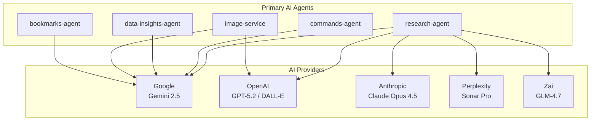
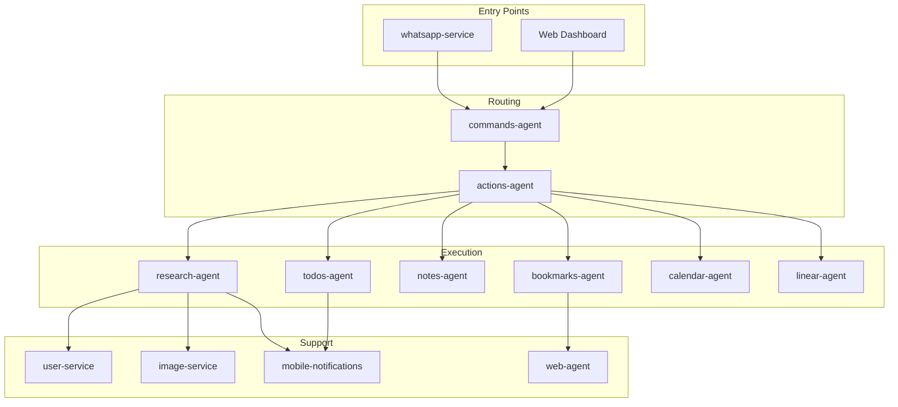

# Services Catalog

Complete documentation for all IntexuraOS services, organized by AI capability.

---

## AI Capabilities Overview

IntexuraOS integrates **5 AI providers** with **15 models** across **17 microservices**:

---

## Services by AI Capability

### Multi-Model Orchestration

| Service | AI Models | Capability |
| ------- | --------- | ---------- |
| [research-agent](research-agent/features.md) | All 10 research models | Parallel queries, synthesis, confidence scoring |

### Intent Classification

| Service | AI Models | Capability |
| ------- | --------- | ---------- |
| [commands-agent](commands-agent/features.md) | Gemini 2.5 Flash, GLM-4.7 | Natural language to action type |

### Data Intelligence

| Service | AI Models | Capability |
| ------- | --------- | ---------- |
| [data-insights-agent](data-insights-agent/features.md) | Gemini 2.5 Flash | Schema inference, trend detection, chart generation |

### Image Generation

| Service | AI Models | Capability |
| ------- | --------- | ---------- |
| [image-service](image-service/features.md) | DALL-E 3, Imagen 3 | Cover images, prompt enhancement |

### Content Intelligence

| Service | AI Models | Capability |
| ------- | --------- | ---------- |
| [bookmarks-agent](bookmarks-agent/features.md) | Via web-agent | Link summarization |
| [web-agent](web-agent/features.md) | Gemini 2.5 Flash | Content extraction, summarization |
| [todos-agent](todos-agent/features.md) | Via commands-agent | Task extraction from natural language |

### Voice & Transcription

| Service | AI Models | Capability |
| ------- | --------- | ---------- |
| [whatsapp-service](whatsapp-service/features.md) | Speechmatics | Voice-to-text transcription |

---

## All Services

### AI Agents (Primary Intelligence)

Services that directly invoke AI models for their core functionality.

| Service | Purpose | AI | Docs |
| ------- | ------- | -- | ---- |
| [research-agent](research-agent/features.md) | Multi-LLM research orchestration | Gemini, Claude, GPT, Sonar, GLM | [features](research-agent/features.md) / [technical](research-agent/technical.md) / [tutorial](research-agent/tutorial.md) / [debt](research-agent/technical-debt.md) / [agent](research-agent/agent.md) |
| [commands-agent](commands-agent/features.md) | AI command classification | Gemini 2.5 Flash | [features](commands-agent/features.md) / [technical](commands-agent/technical.md) / [debt](commands-agent/technical-debt.md) / [agent](commands-agent/agent.md) |
| [data-insights-agent](data-insights-agent/features.md) | AI-powered data analysis | Gemini 2.5 Flash | [features](data-insights-agent/features.md) / [technical](data-insights-agent/technical.md) / [debt](data-insights-agent/technical-debt.md) / [agent](data-insights-agent/agent.md) |
| [image-service](image-service/features.md) | AI image generation | DALL-E 3, Imagen 3 | [features](image-service/features.md) / [technical](image-service/technical.md) / [tutorial](image-service/tutorial.md) / [debt](image-service/technical-debt.md) / [agent](image-service/agent.md) |
| [bookmarks-agent](bookmarks-agent/features.md) | Link management with AI summaries | Via web-agent | [features](bookmarks-agent/features.md) / [technical](bookmarks-agent/technical.md) / [tutorial](bookmarks-agent/tutorial.md) / [debt](bookmarks-agent/technical-debt.md) / [agent](bookmarks-agent/agent.md) |
| [web-agent](web-agent/features.md) | Web scraping with AI | Gemini 2.5 Flash | [features](web-agent/features.md) / [technical](web-agent/technical.md) / [debt](web-agent/technical-debt.md) / [agent](web-agent/agent.md) |

### Content Management Agents

Services that manage user content with AI-enhanced features.

| Service | Purpose | AI | Docs |
| ------- | ------- | -- | ---- |
| [todos-agent](todos-agent/features.md) | Task management | NLP extraction | [features](todos-agent/features.md) / [technical](todos-agent/technical.md) / [tutorial](todos-agent/tutorial.md) / [debt](todos-agent/technical-debt.md) / [agent](todos-agent/agent.md) |
| [notes-agent](notes-agent/features.md) | Note-taking | - | [features](notes-agent/features.md) / [technical](notes-agent/technical.md) / [tutorial](notes-agent/tutorial.md) / [debt](notes-agent/technical-debt.md) / [agent](notes-agent/agent.md) |
| [calendar-agent](calendar-agent/features.md) | Google Calendar integration | Date parsing | [features](calendar-agent/features.md) / [technical](calendar-agent/technical.md) / [debt](calendar-agent/technical-debt.md) / [agent](calendar-agent/agent.md) |
| [linear-agent](linear-agent/features.md) | Linear issue management | - | [features](linear-agent/features.md) / [technical](linear-agent/technical.md) / [debt](linear-agent/technical-debt.md) / [agent](linear-agent/agent.md) |
| [promptvault-service](promptvault-service/features.md) | Prompt template management | - | [features](promptvault-service/features.md) / [technical](promptvault-service/technical.md) / [debt](promptvault-service/technical-debt.md) / [agent](promptvault-service/agent.md) |

### Infrastructure Services

Core platform services that support the AI agents.

| Service | Purpose | AI | Docs |
| ------- | ------- | -- | ---- |
| [actions-agent](actions-agent/features.md) | Central action orchestration | - | [features](actions-agent/features.md) / [technical](actions-agent/technical.md) / [tutorial](actions-agent/tutorial.md) / [debt](actions-agent/technical-debt.md) / [agent](actions-agent/agent.md) |
| [whatsapp-service](whatsapp-service/features.md) | WhatsApp Business integration | Speechmatics | [features](whatsapp-service/features.md) / [technical](whatsapp-service/technical.md) / [tutorial](whatsapp-service/tutorial.md) / [debt](whatsapp-service/technical-debt.md) / [agent](whatsapp-service/agent.md) |
| [user-service](user-service/features.md) | Auth, API keys, settings | LLM validation | [features](user-service/features.md) / [technical](user-service/technical.md) / [tutorial](user-service/tutorial.md) / [debt](user-service/technical-debt.md) / [agent](user-service/agent.md) |
| [mobile-notifications-service](mobile-notifications-service/features.md) | Push notification gateway | - | [features](mobile-notifications-service/features.md) / [technical](mobile-notifications-service/technical.md) / [debt](mobile-notifications-service/technical-debt.md) / [agent](mobile-notifications-service/agent.md) |
| [notion-service](notion-service/features.md) | Notion integration | - | [features](notion-service/features.md) / [technical](notion-service/technical.md) / [debt](notion-service/technical-debt.md) / [agent](notion-service/agent.md) |
| [app-settings-service](app-settings-service/features.md) | LLM pricing and analytics | - | [features](app-settings-service/features.md) / [technical](app-settings-service/technical.md) / [debt](app-settings-service/technical-debt.md) / [agent](app-settings-service/agent.md) |
| [api-docs-hub](api-docs-hub/features.md) | OpenAPI documentation | - | [features](api-docs-hub/features.md) / [technical](api-docs-hub/technical.md) / [debt](api-docs-hub/technical-debt.md) / [agent](api-docs-hub/agent.md) |

---

## AI Models Used

### Research Models (10)

Used for deep research queries with parallel execution:

| Model | Provider | Specialty |
| ----- | -------- | --------- |
| Gemini 2.5 Pro | Google | Reasoning, analysis |
| Gemini 2.5 Flash | Google | Fast responses |
| GPT-5.2 | OpenAI | Creative synthesis |
| o4-mini-deep-research | OpenAI | Deep research |
| Claude Opus 4.5 | Anthropic | Nuanced analysis |
| Claude Sonnet 4.5 | Anthropic | Balanced performance |
| Sonar | Perplexity | Real-time web search |
| Sonar Pro | Perplexity | Enhanced search |
| Sonar Deep Research | Perplexity | Comprehensive search |
| GLM-4.7 | Zai | Multilingual |

### Classification Models (2)

Used for intent classification and fast tasks:

| Model | Provider | Use Case |
| ----- | -------- | -------- |
| Gemini 2.5 Flash | Google | Command classification, title generation |
| GLM-4.7 | Zai | Alternative classifier |

### Image Models (2)

Used for image generation:

| Model | Provider | Capability |
| ----- | -------- | ---------- |
| GPT-Image-1 (DALL-E 3) | OpenAI | High-quality images |
| Gemini 2.5 Flash Image | Google | Fast image generation |

### Validation Models (5)

Used for API key validation (cheap, fast):

| Model | Provider |
| ----- | -------- |
| Claude Haiku 3.5 | Anthropic |
| Gemini 2.0 Flash | Google |
| GPT-4o Mini | OpenAI |
| Sonar | Perplexity |
| GLM-4.7 | Zai |

---

## Service Dependencies

---

## Documentation Coverage

| Metric | Count |
| ------ | ----- |
| Total Services | 18 |
| With features.md | 18 |
| With technical.md | 18 |
| With tutorial.md | 8 |
| With technical-debt.md | 18 |
| With agent.md | 18 |
| **Coverage** | **100%** |

---

## Quick Links

### By Use Case

**I want to...**

- **Do multi-model research**: [research-agent](research-agent/features.md)
- **Manage tasks via voice**: [todos-agent](todos-agent/features.md) + [whatsapp-service](whatsapp-service/features.md)
- **Save and summarize links**: [bookmarks-agent](bookmarks-agent/features.md)
- **Generate images**: [image-service](image-service/features.md)
- **Analyze data**: [data-insights-agent](data-insights-agent/features.md)
- **Schedule events**: [calendar-agent](calendar-agent/features.md)
- **Manage Linear issues**: [linear-agent](linear-agent/features.md)

### By Integration

- **WhatsApp**: [whatsapp-service](whatsapp-service/features.md)
- **Google Calendar**: [calendar-agent](calendar-agent/features.md)
- **Notion**: [notion-service](notion-service/features.md)
- **Linear**: [linear-agent](linear-agent/features.md)
- **Auth0**: [user-service](user-service/features.md)

---

**Last updated:** 2026-01-19

**Services documented:** 18 / 18 (100%)
