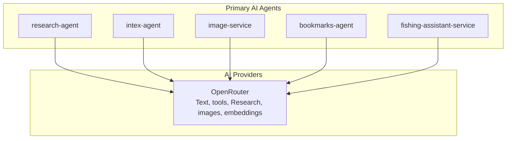
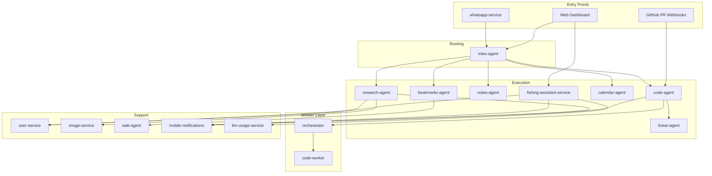

# Services Catalog

Catalog for IntexuraOS services, workers, and packages.

**Version 4.0.0** — September 10, 2026

---

## v4.0.0 Highlights

| Component | Key Changes |
| --- | --- |
| **message-digest-service** | Custom WhatsApp Message Digests with instructions, schedules, previews, run history, and delivery for a private group or direct chat |
| **whatsapp-service / web** | WhatsApp Conversation Assistant with date-range selection, inspectable captured context, and streamed responses |

## v3.8.0 Highlights (Previous)

| Component                        | Key Changes                                                                                                                                                                     |
| -------------------------------- | ------------------------------------------------------------------------------------------------------------------------------------------------------------------------------- |
| **intex-agent**                  | Unified action workflow for code tasks, research drafts, bookmarks, notes, and calendar actions, with explicit intent gates and WhatsApp session continuity                     |
| **whatsapp-service**             | Private WhatsApp workspace with private ingest, read-only conversations, sender/day views, Matrix sync, outgoing/group event sync, and preserved group classification           |
| **code-agent**                   | Documentation review dispatch reliability and unified Intex Agent code-task creation path                                                                                        |
| **orchestrator**                 | More reliable completion finalization when Docker hangs, with reduced handled Sentry noise for code-task reliability paths                                                       |
| **web**                          | Homepage and README showcase now lead with the current Intex Agent unified actions and private WhatsApp workspace capabilities                                                   |

## v3.7.0 Highlights (Previous)

| Component                         | Key Changes                                                                                                                                                                                                                   |
| --------------------------------- | ----------------------------------------------------------------------------------------------------------------------------------------------------------------------------------------------------------------------------- |
| **fishing-assistant-service**     | New Fishing Assistant RAG foundation with knowledge folders/pages, embedding-backed retrieval, persisted chat history, digest/raw-message evidence, citation validation, ISO response timestamps, and web/mobile chat support |
| **llm-usage-service**             | Richer cost visibility with prompt-type grouping, research-run cost summaries, image generation metadata, and OpenRouter model reporting                                                                                      |
| **code-agent**                    | Scheduled execution dispatch, custom per-task timeout overrides, and OpenRouter Gemini 3.6 Flash for GitHub Agent tool-calling triage                                                                                   |
| **mobile-notifications-service**  | Internal digest evidence routes for Fishing Assistant, cleaned group-message retrieval, digest state lookup, subscription-scoped access, and digest output-language preservation                                               |
| **whatsapp-service/bookmarks**    | Reliable async recovery paths for WhatsApp bookmark saves and duplicate-safe bookmark replay; bookmark rows remain scannable on mobile                                                                                         |
| **orchestrator / model catalog**  | Claude, Codex, and OpenRouter worker presets with usage reporting; Grafana Cloud PM2 log dashboards improve operations                                                                                                 |

## v3.6.0 Highlights (Previous)

| Component                        | Key Changes                                                                                                                                                                                                                                                                   |
| -------------------------------- | ----------------------------------------------------------------------------------------------------------------------------------------------------------------------------------------------------------------------------------------------------------------------------- |
| **code-worker**                  | Claude resume fix — `--resume <sessionId>` replaces `--continue` for reliable session resumption, `CLAUDE_SESSION_ID` now required for Claude resumes                                                                                                                         |
| **mobile-notifications-service** | WhatsApp Group Digest pipeline — end-to-end AI-generated daily digests from WhatsApp group messages with headline/bullets summaries, persistent group state, backfill, and WhatsApp delivery via Pub/Sub                                                                      |
| **hellscript-agent**             | Per-user LLM client resolution via user-service (INT-1369), centralized LLM pricing removal (INT-1387), usage tracking via `HttpInternalAuthUsageSink`                                                                                                                        |
| **orchestrator**                 | Execution memory pipeline simplification, 8MB log cap, five-hour default timeout, redundant status delivery, `test_quality` review scope, and an OpenRouter validation chain                                                     |
| **code-agent**                   | Robust task finalization via dedicated status endpoint, PR triage through Pub/Sub push, important flag for issue groups, GitHub Agent inherits user LLM settings, task mode selector (planning/execution), self-healing failure triage, draft PR blocking                     |

## v3.5.0 Highlights (Previous)

| Component            | Key Changes                                                                                                                                                                                                                                                                                 |
| -------------------- | ------------------------------------------------------------------------------------------------------------------------------------------------------------------------------------------------------------------------------------------------------------------------------------------- |
| **hellscript-agent** | Categorized writing config — platform-specific style instructions and writing samples (threads, linkedin, general)                                                                                                                                                                          |
| **code-agent**       | Execution Memory Graph (alpha data collection + RAG pipeline), Remediation Agent (autonomous review fix loop), Ask Agent (interactive Claude Code sessions), code tasks pagination with issue grouping, auto-archive merged tasks, CI failure auto-handling, per-agent-type worker settings |
| **orchestrator**     | Codex runtime support (OpenAI Codex as execution backend with auth and log processing), execution memory graph (data collection pipeline, alpha), remediation agent (autonomous auto-improvement with cross-LLM checks and event-sourcing)                                                  |
| **research-agent**   | OpenRouter integration — route research tasks through OpenRouter models with pricing support                                                                                                                                                                                                |
| **linear-agent**     | AI-powered Linear issue cleanup with review UI and scheduled pruning                                                                                                                                                                                                                        |
| **web-agent**        | Cloudflare Browser Rendering replaces Crawl4AI for JS-rendered pages                                                                                                                                                                                                                        |
| **code-worker**      | Multi-runtime support (Claude + Codex in same container), live Codex output streaming, codex-xhigh worker type, rename from claude-worker, bootstrap evidence logging                                                                                                                       |
| **Platform**         | `infra-openrouter` package — OpenRouter backend infrastructure and frontend model selection                                                                                                                                                                                                 |

## v3.4.0 Highlights (Previous)

| Component             | Key Changes                                                                                                                                 |
| --------------------- | ------------------------------------------------------------------------------------------------------------------------------------------- |
| **hellscript-agent**  | New: AI-powered writing assistant with intent interpretation, thought accumulation, and versioned draft generation                          |
| **code-agent**        | Merge Queue for ordered auto-merging of PRs, merge conflict cron reconciliation, orchestrator Linear proxy, expandable event log payloads   |
| **orchestrator**      | Orchestrator Linear Proxy — removed direct Linear dependency via code-agent proxy                                                           |
| **Platform**          | Unified Task Enqueue Service (queue-first dispatch), Plan-Based Review Dispatch, Auto-Enforcement of findings                               |
| **research-agent**    | Research pipeline quality fixes T0-T6: context-aware prompts, low-quality response detection, language-aware synthesis                      |
| **linear-agent**      | Context proxy endpoint (INT-1040), decomposition sprint (INT-901-907), linearApiClient split, parentId fix                                  |

## v3.3.0 Highlights (Previous)

| Component        | Key Changes                                                                                                                                                                                     |
| ---------------- | ----------------------------------------------------------------------------------------------------------------------------------------------------------------------------------------------- |
| **code-agent**   | GitHub Agent with tool calling, unified PR automation log, structured output triage with auto-repair                                                                                            |
| **orchestrator** | Review Agent, Execution Deep Validator, Docker health gate, fatal exit codes, PR branch inheritance, mandatory /simplify, already-completed outcome, reliability improvements                   |
| **web**          | Code Task Detail Page V2 (issue-centric grouped view), workers status in user menu                                                                                                              |
| **Platform**     | Expanded model routing and tool-call support                                                                                                                                                     |

## v3.2.0 Highlights (Previous)

| Component            | Key Changes                                                                          |
| -------------------- | ------------------------------------------------------------------------------------ |
| **code-agent**       | Agent-based routing, implement button lifecycle, task queueing, PR comment tasks     |
| **orchestrator**     | Label-based dispatch and automatic container cleanup                              |
| **whatsapp-service** | CTA buttons with deep links, task progress notifications                             |
| **transcription**    | Event-driven audio processing, user-level language preferences                       |
| **linear-agent**     | Live data hydration                                                                  |
| **calendar-agent**   | Calendar event previews with rich formatting                                         |
| **web**              | Code task view enhancements, website redesign                                        |
| **Platform**         | CI-enforced prompt versioning, prompt injection hardening, auto-archival of attempts |

## v3.0.0 Highlights (Previous)

| Component         | Key Changes                                                                         |
| ----------------- | ----------------------------------------------------------------------------------- |
| **code-agent**    | New: Autonomous code execution with worker dispatch and dedup                       |
| **orchestrator**  | New: Local worker orchestration for code-worker sessions via Docker                 |
| **code-worker**   | New: Docker container image for isolated Claude/Codex execution                     |
| **log-cleanup**   | New: Cloud Function for scheduled log retention management                          |
| **vm-lifecycle**  | New: Cloud Functions for GCE VM start/stop lifecycle control                        |
| **22 packages**   | New: All shared packages documented (common, infra, LLM stack)                      |

## v2.1.0 Highlights (Older)

| Service              | Key Changes                                                                                           |
| -------------------- | ----------------------------------------------------------------------------------------------------- |
| **whatsapp-service** | Interactive approval buttons, phone verification, voice transcription                                 |
| **calendar-agent**   | Preview generation before commit                                                                      |
| **research-agent**   | Natural language model selection, Zod schema validation                                               |
| **bookmarks-agent**  | WhatsApp delivery for AI summaries                                                                    |
| **web-agent**        | @intexuraos/internal-clients integration (INT-269)                                                    |
| **linear-agent**     | Multi-user webhook fan-out (INT-623), composite keys, 12 internal endpoints, dual-prompt auto-trigger |
| **user-service**     | Rate limit detection precedence fix                                                                   |

---

## AI Capabilities Overview

Active app services execute LLM, Research, image, and embedding calls through **OpenRouter**. Historical model/provider types remain readable, and Claude/Codex code-task runtimes remain a separate orchestrator boundary.

```mermaid
graph TB
    subgraph "AI Providers"
        OR[OpenRouter<br>Text, tools, Research, images, embeddings]
    end

    subgraph "Primary AI Agents"
        R[research-agent]
        X[intex-agent]
        I[image-service]
        B[bookmarks-agent]
        F[fishing-assistant-service]
    end

    R --> OR
    X --> OR
    I --> OR
    B --> OR
    F --> OR
```

---

## Services by AI Capability

### Multi-Model Orchestration

| Service                                      | AI Models              | Capability                                      |
| -------------------------------------------- | ---------------------- | ----------------------------------------------- |
| [research-agent](research-agent/features.md) | 16 curated OpenRouter models; maximum 6 per run | Parallel queries, synthesis, confidence scoring |

### Direct Tool Conversations

| Service                                | AI Models                        | Capability                                    |
| -------------------------------------- | -------------------------------- | --------------------------------------------- |
| [intex-agent](intex-agent/features.md) | OpenRouter Gemini 3.6 Flash | WhatsApp text tools with confirmed changes and read-only queries |

### Image Generation

| Service                                    | AI Models                       | Capability                       |
| ------------------------------------------ | ------------------------------- | -------------------------------- |
| [image-service](image-service/features.md) | `gpt-image-1` and `gpt-4.1` aliases via OpenRouter | Cover images, prompt enhancement |

### Content Intelligence

| Service                                        | AI Models          | Capability                            |
| ---------------------------------------------- | ------------------ | ------------------------------------- |
| [bookmarks-agent](bookmarks-agent/features.md) | Via web-agent      | Link summarization                    |
| [web-agent](web-agent/features.md)             | OpenRouter         | Content extraction, summarization     |
| [message-digest-service](message-digest-service/features.md) | OpenRouter configured model | WhatsApp group and direct-chat summaries |

### Conversational AI

| Service                              | AI Models                        | Capability                                        |
| ------------------------------------ | -------------------------------- | ------------------------------------------------- |
| [fishing-assistant-service](fishing-assistant-service/features.md) | OpenRouter Gemini 3.6 Flash | Grounded fishing chat over knowledge, digests, and raw-message evidence |

### Autonomous Code Execution

| Service                              | AI Models                                        | Capability                                                                                    |
| ------------------------------------ | ------------------------------------------------ | --------------------------------------------------------------------------------------------- |
| [code-agent](code-agent/features.md) | Claude, Codex, OpenRouter | GitHub Agent with tool calling, unified PR log, task queueing, PR creation via worker presets |

### Writing Assistance

| Service                                                  | AI Models        | Capability                                                                                  |
| -------------------------------------------------------- | ---------------- | ------------------------------------------------------------------------------------------- |
| [hellscript-agent](hellscript-agent/features.md)         | OpenRouter       | Intent interpretation, thought accumulation, categorized writing config, draft generation   |

### Messaging & Transcription

| Service                                          | AI Models    | Capability                                                                                |
| ------------------------------------------------ | ------------ | ----------------------------------------------------------------------------------------- |
| [whatsapp-service](whatsapp-service/features.md) | Intex route  | WhatsApp messaging, private conversations, captured-context analysis, and delivery                |
| [transcription](transcription/features.md)       | Speechmatics | Voice and video transcription; private chats opt in separately from text-only Intex commands |

---

## All Services

### AI Agents (Primary Intelligence)

Services that directly invoke AI models for their core functionality.

| Service                                                | Purpose                            | AI                                               | Docs                                                                                                                                                                                                                              |
| ------------------------------------------------------ | ---------------------------------- | ------------------------------------------------ | --------------------------------------------------------------------------------------------------------------------------------------------------------------------------------------------------------------------------------- |
| [intex-agent](intex-agent/features.md)                 | Confirmed actions and read-only queries | OpenRouter Gemini 3.6 Flash                | [features](intex-agent/features.md) / [technical](intex-agent/technical.md) / [tutorial](intex-agent/tutorial.md) / [debt](intex-agent/technical-debt.md) / [agent](intex-agent/agent.md)                                        |
| [research-agent](research-agent/features.md)           | Multi-LLM research orchestration   | Curated OpenRouter catalog, maximum 6 models     | [features](research-agent/features.md) / [technical](research-agent/technical.md) / [tutorial](research-agent/tutorial.md) / [debt](research-agent/technical-debt.md) / [agent](research-agent/agent.md)                          |
| [image-service](image-service/features.md)             | AI image generation                | GPT aliases executed through OpenRouter          | [features](image-service/features.md) / [technical](image-service/technical.md) / [tutorial](image-service/tutorial.md) / [debt](image-service/technical-debt.md) / [agent](image-service/agent.md)                               |
| [bookmarks-agent](bookmarks-agent/features.md)         | Link management with AI summaries  | Via web-agent                                    | [features](bookmarks-agent/features.md) / [technical](bookmarks-agent/technical.md) / [tutorial](bookmarks-agent/tutorial.md) / [debt](bookmarks-agent/technical-debt.md) / [agent](bookmarks-agent/agent.md)                     |
| [web-agent](web-agent/features.md)                     | Web scraping with AI               | OpenRouter                                       | [features](web-agent/features.md) / [technical](web-agent/technical.md) / [tutorial](web-agent/tutorial.md) / [debt](web-agent/technical-debt.md) / [agent](web-agent/agent.md)                                                   |
| [fishing-assistant-service](fishing-assistant-service/features.md) | Grounded fishing chat and knowledge base | OpenRouter Gemini 3.6 Flash + OpenRouter embeddings | [features](fishing-assistant-service/features.md) / [technical](fishing-assistant-service/technical.md) / [tutorial](fishing-assistant-service/tutorial.md) / [debt](fishing-assistant-service/technical-debt.md) / [agent](fishing-assistant-service/agent.md) |
| [message-digest-service](message-digest-service/features.md) | Scheduled private WhatsApp summaries | Configured OpenRouter model | [features](message-digest-service/features.md) / [technical](message-digest-service/technical.md) / [tutorial](message-digest-service/tutorial.md) / [debt](message-digest-service/technical-debt.md) / [agent](message-digest-service/agent.md) |
| [code-agent](code-agent/features.md)                   | Autonomous code execution          | Claude, Codex, OpenRouter                        | [features](code-agent/features.md) / [technical](code-agent/technical.md) / [tutorial](code-agent/tutorial.md) / [debt](code-agent/technical-debt.md) / [agent](code-agent/agent.md)                                              |
| [hellscript-agent](hellscript-agent/features.md)       | Voice-to-draft writing assistant   | OpenRouter                                       | [features](hellscript-agent/features.md) / [technical](hellscript-agent/technical.md) / [tutorial](hellscript-agent/tutorial.md) / [debt](hellscript-agent/technical-debt.md) / [agent](hellscript-agent/agent.md)                |

### Content Management Agents

Services that manage user content with AI-enhanced features.

| Service                                      | Purpose                     | AI             | Docs                                                                                                                                                                                                     |
| -------------------------------------------- | --------------------------- | -------------- | -------------------------------------------------------------------------------------------------------------------------------------------------------------------------------------------------------- |
| [notes-agent](notes-agent/features.md)       | Note-taking                 | -              | [features](notes-agent/features.md) / [technical](notes-agent/technical.md) / [tutorial](notes-agent/tutorial.md) / [debt](notes-agent/technical-debt.md) / [agent](notes-agent/agent.md)                |
| [calendar-agent](calendar-agent/features.md) | Google Calendar integration | Date parsing   | [features](calendar-agent/features.md) / [technical](calendar-agent/technical.md) / [tutorial](calendar-agent/tutorial.md) / [debt](calendar-agent/technical-debt.md) / [agent](calendar-agent/agent.md) |
| [linear-agent](linear-agent/features.md)     | Linear issue management     | OpenRouter     | [features](linear-agent/features.md) / [technical](linear-agent/technical.md) / [tutorial](linear-agent/tutorial.md) / [debt](linear-agent/technical-debt.md) / [agent](linear-agent/agent.md)           |

### Infrastructure Services

Core platform services that support the AI agents.

| Service                                                                  | Purpose                                             | AI              | Docs                                                                                                                                                                                                                                                                           |
| ------------------------------------------------------------------------ | --------------------------------------------------- | --------------- | ------------------------------------------------------------------------------------------------------------------------------------------------------------------------------------------------------------------------------------------------------------------------------ |
| [whatsapp-service](whatsapp-service/features.md)                         | WhatsApp messaging, private source, analysis, and delivery      | Intex route     | [features](whatsapp-service/features.md) / [technical](whatsapp-service/technical.md) / [tutorial](whatsapp-service/tutorial.md) / [debt](whatsapp-service/technical-debt.md) / [agent](whatsapp-service/agent.md)                                                             |
| [user-service](user-service/features.md)                                 | Auth, API keys, model prefs                         | LLM validation  | [features](user-service/features.md) / [technical](user-service/technical.md) / [tutorial](user-service/tutorial.md) / [debt](user-service/technical-debt.md) / [agent](user-service/agent.md)                                                                                 |
| [mobile-notifications-service](mobile-notifications-service/features.md) | Android notification capture and query               | -               | [features](mobile-notifications-service/features.md) / [technical](mobile-notifications-service/technical.md) / [tutorial](mobile-notifications-service/tutorial.md) / [debt](mobile-notifications-service/technical-debt.md) / [agent](mobile-notifications-service/agent.md) |
| [notion-service](notion-service/features.md)                             | Notion integration                                  | -               | [features](notion-service/features.md) / [technical](notion-service/technical.md) / [tutorial](notion-service/tutorial.md) / [debt](notion-service/technical-debt.md) / [agent](notion-service/agent.md)                                                                       |
| [app-settings-service](app-settings-service/features.md)                 | Platform config and health anchor                   | -               | [features](app-settings-service/features.md) / [technical](app-settings-service/technical.md) / [tutorial](app-settings-service/tutorial.md) / [debt](app-settings-service/technical-debt.md) / [agent](app-settings-service/agent.md)                                         |
| [llm-usage-service](llm-usage-service/features.md)                       | LLM usage tracking and cost                         | -               | [features](llm-usage-service/features.md) / [technical](llm-usage-service/technical.md) / [tutorial](llm-usage-service/tutorial.md) / [debt](llm-usage-service/technical-debt.md) / [agent](llm-usage-service/agent.md)                                                        |
| [api-docs-hub](api-docs-hub/features.md)                                 | OpenAPI documentation                               | -               | [features](api-docs-hub/features.md) / [technical](api-docs-hub/technical.md) / [tutorial](api-docs-hub/tutorial.md) / [debt](api-docs-hub/technical-debt.md) / [agent](api-docs-hub/agent.md)                                                                                 |

### User Interface

Progressive Web App providing the unified dashboard for IntexuraOS.

| Service                | Purpose                   | AI  | Docs                                                                                                                                              |
| ---------------------- | ------------------------- | --- | ------------------------------------------------------------------------------------------------------------------------------------------------- |
| [web](web/features.md) | Progressive Web App (PWA) | -   | [features](web/features.md) / [technical](web/technical.md) / [tutorial](web/tutorial.md) / [debt](web/technical-debt.md) / [agent](web/agent.md) |

---

## Workers

Cloud Functions and local services that run outside Cloud Run.

| Worker                                     | Type            | Purpose                                                          | Trigger                     |
| ------------------------------------------ | --------------- | ---------------------------------------------------------------- | --------------------------- |
| [orchestrator](orchestrator/features.md)   | Local service   | Spawns code-worker sessions in Docker containers                 | HTTP (HMAC-signed dispatch) |
| [code-worker](code-worker/features.md)     | Docker image    | Isolated Claude/Codex execution environment with git and tools   | Started by orchestrator     |
| [vm-lifecycle](vm-lifecycle/features.md)   | Cloud Functions | Starts and stops GCE VM instances with health polling            | HTTP (internal auth)        |
| [transcription](transcription/features.md) | Cloud Function  | Converts WhatsApp audio/video to text via Speechmatics           | Pub/Sub (audio/media stored)      |

### Worker Details

**orchestrator** — Runs on local machines behind Cloudflare Tunnel. It receives signed tasks, creates isolated Docker workspaces, and reports results through signed callbacks. Worker types are limited to subscription-authenticated Claude (`auto`, `opus`, `sonnet`), subscription-authenticated Codex (`codex`, `codex-xhigh`), and OpenRouter (`openrouter-free`). Completion contracts are deterministic; transcript compliance validation uses OpenRouter.

**code-worker** is a Docker container (Node.js 22 Alpine) pre-loaded with Claude CLI, Codex CLI, git, pnpm, GitHub CLI, ripgrep, terraform, and gcloud. Runs as non-root user with network restrictions. The orchestrator manages its lifecycle.

**vm-lifecycle** has two HTTP-triggered Cloud Functions (`startVm` and `stopVm`) that manage GCE Spot VM instances. `startVm` polls for health after boot; `stopVm` gracefully drains running tasks before shutdown.

**transcription** — Pub/Sub-triggered Cloud Function that converts stored WhatsApp audio and video into text using Speechmatics Batch API. Supports auto language detection, AI-generated summaries, and 100+ custom vocabulary terms. Publishes results (success or failure) to the transcription-completed topic for whatsapp-service consumption.

---

## Packages

Shared libraries used across apps and workers.

### Core & HTTP

| Package                                                | Purpose                                               |
| ------------------------------------------------------ | ----------------------------------------------------- |
| [common-core](../packages/common-core/README.md)       | Result types, Logger interface, error codes, tracing  |
| [common-http](../packages/common-http/README.md)       | Fastify plugin (reply.ok/fail), JWT auth, request IDs |
| [common-metrics](../packages/common-metrics/README.md) | Cloud Monitoring custom metrics client                |
| [common-worker](../packages/common-worker/README.md)   | Cloud Functions/Pub/Sub worker contract helpers       |
| [http-contracts](../packages/http-contracts/README.md) | OpenAPI and Fastify JSON Schema definitions           |
| [http-server](../packages/http-server/README.md)       | Health checks, env validation, error handler          |

### Infrastructure Adapters

| Package                                                  | Purpose                                                                      |
| -------------------------------------------------------- | ---------------------------------------------------------------------------- |
| [infra-firestore](../packages/infra-firestore/README.md) | Firestore singleton client and in-memory test fake                           |
| [infra-pubsub](../packages/infra-pubsub/README.md)       | Pub/Sub publishers for WhatsApp, calendar, and code-task events              |
| [infra-sentry](../packages/infra-sentry/README.md)       | Sentry error tracking, Pino log stream, logger factory                       |
| [infra-whatsapp](../packages/infra-whatsapp/README.md)   | WhatsApp Cloud API client (send, media, read receipts)                       |
| [infra-pdf-export](../packages/infra-pdf-export/README.md) | PDF rendering for conversation-style transcripts |
| [infra-notion](../packages/infra-notion/README.md)       | Notion API client, token validation, page retrieval                          |

### LLM Provider Clients

| Package                                                    | Provider                   | Capabilities                                    |
| ---------------------------------------------------------- | -------------------------- | ----------------------------------------------- |
| [infra-claude](../packages/infra-claude/README.md)         | Anthropic (retained)       | Inactive direct adapter kept for compatibility  |
| [infra-gpt](../packages/infra-gpt/README.md)               | OpenAI (retained)          | Inactive direct adapter kept for compatibility  |
| [infra-perplexity](../packages/infra-perplexity/README.md) | Perplexity (retained)      | Inactive direct adapter kept for compatibility  |
| [infra-openrouter](../packages/infra-openrouter/README.md) | OpenRouter                 | Text, chat, tools, Research, images, embeddings |

### LLM Stack

| Package                                            | Purpose                                                    |
| -------------------------------------------------- | ---------------------------------------------------------- |
| [llm-contract](../packages/llm-contract/README.md) | Model/provider types, LLMClient interface, pricing types   |
| [llm-factory](../packages/llm-factory/README.md)   | OpenRouter-only executable text, chat, and tool factory     |
| [llm-prompts](../packages/llm-prompts/README.md)   | Centralized prompt templates and Zod response schemas      |
| [llm-pricing](../packages/llm-pricing/README.md)   | Runtime pricing lookups, usage logging to Firestore        |
| [llm-utils](../packages/llm-utils/README.md)       | Token redaction, LLM parse error handling, Zod formatting  |

### Service Clients

| Package                                                    | Purpose                                                     |
| ---------------------------------------------------------- | ----------------------------------------------------------- |
| [code-task-domain](../packages/code-task-domain/README.md) | Shared code-task worker type and plan-document primitives   |
| [internal-clients](../packages/internal-clients/README.md) | Typed HTTP clients for internal service APIs (user-service) |
| [linear-domain](../packages/linear-domain/README.md)       | Linear label normalization and detection utilities          |
| [pr-triage-pubsub-client](../packages/pr-triage-pubsub-client/README.md) | Publisher-side client for PR triage requests               |
| [service-catalog](../packages/service-catalog/README.md)   | Canonical internal service registry and URL bindings        |
| [whatsapp-pubsub-client](../packages/whatsapp-pubsub-client/README.md) | Publisher-side client for WhatsApp send requests            |

---

## AI Models Used

### Research Models (OpenRouter)

Used for deep research queries with parallel execution. The UI lists the curated OpenRouter catalog first, and new requests accept at most six unique `or:` model IDs. Stored reports retain exact retired model IDs and provider labels for historical display without writeback.

### Fast Conversation Models (1)

Used for direct WhatsApp text conversations and fast tool-call decisions.

| Model                  | Provider   | Use Case                                |
| ---------------------- | ---------- | --------------------------------------- |
| Gemini 3.6 Flash | OpenRouter | Intex tool selection and concise replies |

### Image Models

Used for image generation:

| Public alias | Provider   | Capability          |
| ------------ | ---------- | ------------------- |
| `gpt-image-1` | OpenRouter | Image generation    |
| `gpt-4.1`     | OpenRouter | Prompt enhancement  |

### LLM Key Validation

The only configurable LLM credential is OpenRouter. User-service validates it through the zero-cost `/api/v1/key` endpoint; active settings expose `user`, `platform`, or `unavailable` access.

---

## Service Dependencies

```mermaid
graph TD
    subgraph "Entry Points"
        WA[whatsapp-service]
        WEB[Web Dashboard]
        GH_PR[GitHub PR Webhooks]
    end

    subgraph "Routing"
        INTEX[intex-agent]
    end

    subgraph "Execution"
        RES[research-agent]
        FISH[fishing-assistant-service]
        NOTE[notes-agent]
        BOOK[bookmarks-agent]
        CAL[calendar-agent]
        LIN[linear-agent]
        CODE[code-agent]
    end

    subgraph "Worker Layer"
        ORCH[orchestrator]
        CW[code-worker]
    end

    subgraph "Support"
        USER[user-service]
        IMG[image-service]
        WEB_A[web-agent]
        NOTIF[mobile-notifications]
        LLM_USAGE[llm-usage-service]
    end

    WA --> INTEX
    WEB --> INTEX
    WEB --> FISH

    INTEX --> RES
    INTEX --> NOTE
    INTEX --> BOOK
    INTEX --> CAL
    INTEX --> CODE

    GH_PR --> CODE
    CODE --> ORCH
    ORCH --> CW
    CODE --> LIN

    RES --> USER
    RES --> IMG
    BOOK --> WEB_A
    FISH --> NOTIF
    FISH --> USER
    FISH --> LLM_USAGE

    RES --> NOTIF
    CODE --> NOTIF
```

---

## Documentation Coverage

| Metric                 | Count    |
| ---------------------- | -------- |
| Total Apps             | Active app docs tracked in `docs/services` |
| Total Workers          | 4 (three worker services and one Docker image) |
| Total Packages         | 27       |
| Apps with features.md  | Current service doc set |
| Apps with technical.md | Current service doc set |
| Apps with tutorial.md  | Current service doc set |
| Apps with tech-debt.md | Current service doc set |
| Apps with agent.md     | Current service doc set |
| Packages with README   | 27       |
| Workers with docs      | 4        |
| **Coverage**           | **App/package docs tracked; all 4 worker components documented** |

---

## Quick Links

### By Use Case

**I want to...**

- **Use confirmed WhatsApp actions and calendar queries**: [intex-agent](intex-agent/features.md)
- **Configure WhatsApp message digests**: [message-digest-service](message-digest-service/features.md)
- **Analyze a private WhatsApp conversation**: [whatsapp-service](whatsapp-service/features.md)
- **Do multi-model research**: [research-agent](research-agent/features.md)
- **Ask grounded fishing questions**: [fishing-assistant-service](fishing-assistant-service/features.md)
- **Automate coding tasks**: [code-agent](code-agent/features.md)
- **Save and summarize links**: [bookmarks-agent](bookmarks-agent/features.md)
- **Generate images**: [image-service](image-service/features.md)
- **Schedule events**: [calendar-agent](calendar-agent/features.md)
- **Manage Linear issues**: [linear-agent](linear-agent/features.md)
- **Turn thoughts into polished drafts**: [hellscript-agent](hellscript-agent/features.md)

### By Integration

- **WhatsApp**: [whatsapp-service](whatsapp-service/features.md)
- **Google Calendar**: [calendar-agent](calendar-agent/features.md)
- **Notion**: [notion-service](notion-service/features.md)
- **Linear**: [linear-agent](linear-agent/features.md)
- **Auth0**: [user-service](user-service/features.md)
- **GitHub**: [code-agent](code-agent/features.md)
- **Sentry**: [infra-sentry](../packages/infra-sentry/README.md)
- **OpenRouter**: [research-agent](research-agent/features.md) / [fishing-assistant-service](fishing-assistant-service/features.md) / [llm-usage-service](llm-usage-service/features.md)

### By Package Category

- **Core types and utilities**: [common-core](../packages/common-core/README.md)
- **HTTP middleware**: [common-http](../packages/common-http/README.md) / [http-server](../packages/http-server/README.md)
- **LLM integration**: [llm-contract](../packages/llm-contract/README.md) / [llm-factory](../packages/llm-factory/README.md)
- **Error tracking**: [infra-sentry](../packages/infra-sentry/README.md)
- **Database**: [infra-firestore](../packages/infra-firestore/README.md)
- **Messaging**: [infra-pubsub](../packages/infra-pubsub/README.md) / [infra-whatsapp](../packages/infra-whatsapp/README.md)
- **Observability**: [infra-sentry](../packages/infra-sentry/README.md)

---

**Last updated:** 2026-09-10

**Components tracked:** Active app docs, three worker services under `workers/`, the `docker/code-worker` image, and shared packages
