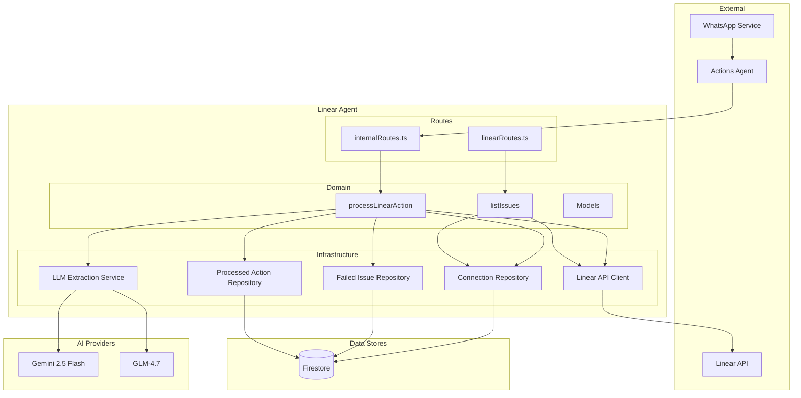
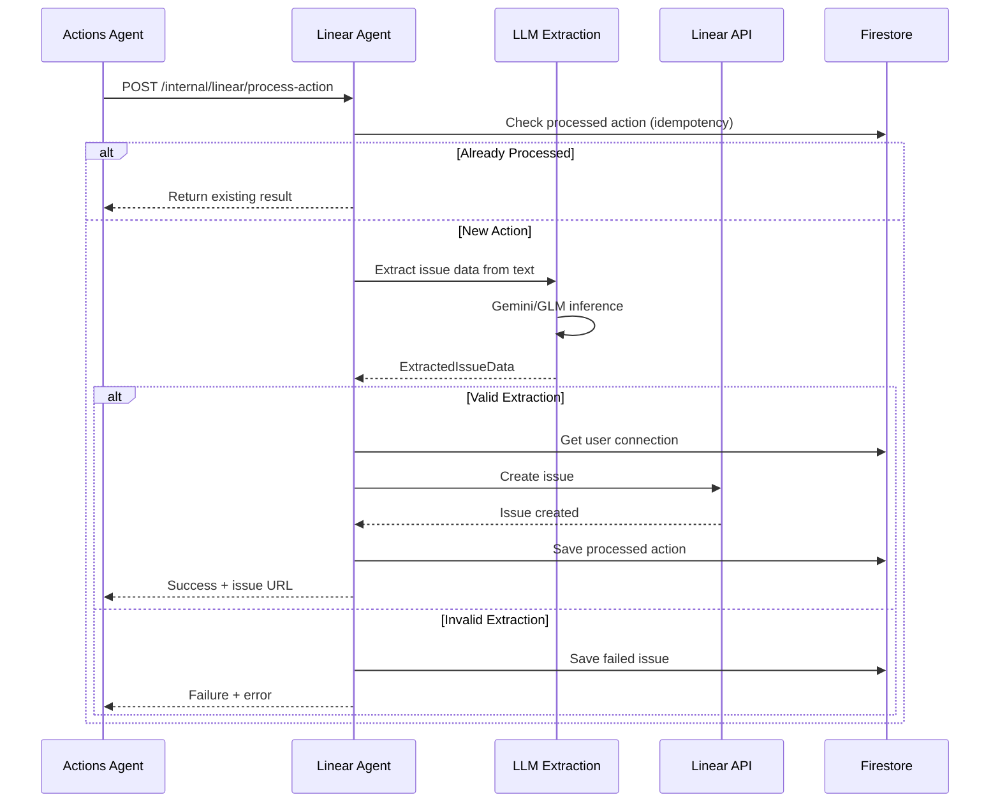

# Linear Agent - Technical Documentation

## Overview

The Linear Agent provides integration between IntexuraOS and Linear project management. It enables natural language issue creation through voice messages, with AI-powered extraction of structured issue data including title, priority, and description sections.

## Architecture



## Data Flow



## API Endpoints

### Public Endpoints

| Method | Path                          | Purpose                       | Auth   |
| ------  | -----------------------------  | -----------------------------  | ------  |
| GET    | `/linear/connection`          | Get user's connection status  | Bearer |
| POST   | `/linear/connection/validate` | Validate API key, get teams   | None   |
| POST   | `/linear/connection`          | Save connection configuration | Bearer |
| DELETE | `/linear/connection`          | Disconnect from Linear        | Bearer |
| GET    | `/linear/issues`              | List issues grouped by status | Bearer |
| GET    | `/linear/failed-issues`       | List failed extractions       | Bearer |

### Internal Endpoints

| Method | Path                              | Purpose               | Auth       |
| ------  | ---------------------------------  | ---------------------  | ----------  |
| POST   | `/internal/linear/process-action` | Process action via AI | X-Internal |

## Domain Models

### LinearConnection

```typescript
interface LinearConnection {
  userId: string;
  apiKey: string;
  teamId: string;
  teamName: string;
  connected: boolean;
  createdAt: string;
  updatedAt: string;
}
```

### LinearIssue

```typescript
interface LinearIssue {
  id: string;
  identifier: string; // e.g., "INT-123"
  title: string;
  description: string | null;
  priority: 0 | 1 | 2 | 3 | 4; // 0=none, 1=urgent, 4=low
  state: {
    id: string;
    name: string;
    type: 'backlog' | 'unstarted' | 'started' | 'completed' | 'cancelled';
  };
  url: string;
  createdAt: string;
  updatedAt: string;
}
```

### ExtractedIssueData

```typescript
interface ExtractedIssueData {
  title: string;
  priority: 0 | 1 | 2 | 3 | 4;
  functionalRequirements: string | null;
  technicalDetails: string | null;
  valid: boolean;
  error: string | null;
  reasoning: string;
}
```

### FailedLinearIssue

```typescript
interface FailedLinearIssue {
  id: string;
  userId: string;
  actionId: string;
  originalText: string;
  extractedTitle: string | null;
  extractedPriority: number | null;
  error: string;
  reasoning: string | null;
  createdAt: string;
}
```

## Firestore Collections

| Collection               | Owner        | Purpose                   |
| ------------------------  | ------------  | -------------------------  |
| `linearConnections`      | linear-agent | User Linear connections   |
| `failedLinearIssues`     | linear-agent | Failed extraction records |
| `processedLinearActions` | linear-agent | Idempotency records       |

## AI Integration

### LLM Extraction Service

The extraction service uses Gemini 2.5 Flash or GLM-4.7 to parse natural language into structured issue data.

**Prompt Strategy:**

1. Extract concise title (max 100 chars)
2. Infer priority from urgency cues
3. Generate Functional Requirements section
4. Generate Technical Details section
5. Validate extraction completeness

**Model Selection:**

- Primary: Gemini 2.5 Flash (fast, cost-effective)
- Fallback: GLM-4.7 (alternative provider)

## Configuration

| Variable                              | Required | Description               |
| -------------------------------------  | --------  | -------------------------  |
| `INTEXURAOS_USER_SERVICE_URL`         | Yes      | User service for LLM keys |
| `INTEXURAOS_INTERNAL_AUTH_TOKEN`      | Yes      | Service-to-service auth   |
| `INTEXURAOS_APP_SETTINGS_SERVICE_URL` | Yes      | Pricing context source    |

## Dependencies

### Internal Services

- **user-service**: LLM API key retrieval
- **app-settings-service**: LLM pricing data
- **actions-agent**: Upstream action orchestrator

### External Services

- **Linear API**: Issue CRUD operations
- **Gemini API**: Issue data extraction
- **GLM API**: Alternative extraction provider

## Error Handling

| Error Code          | HTTP | Description                      |
| -------------------  | ----  | --------------------------------  |
| `NOT_CONNECTED`     | 403  | User has no Linear connection    |
| `INVALID_API_KEY`   | 401  | Linear API key is invalid        |
| `RATE_LIMIT`        | 429  | Linear API rate limit exceeded   |
| `EXTRACTION_FAILED` | 500  | LLM could not extract issue data |

## File Structure

```
apps/linear-agent/
├── src/
│   ├── domain/
│   │   ├── models.ts           # Domain entities
│   │   ├── errors.ts           # Error definitions
│   │   ├── ports.ts            # Interface definitions
│   │   └── useCases/
│   │       ├── processLinearAction.ts
│   │       └── listIssues.ts
│   ├── infra/
│   │   ├── firestore/
│   │   │   ├── linearConnectionRepository.ts
│   │   │   ├── failedIssueRepository.ts
│   │   │   └── processedActionRepository.ts
│   │   ├── linear/
│   │   │   └── linearApiClient.ts
│   │   ├── llm/
│   │   │   └── linearActionExtractionService.ts
│   │   └── user/
│   │       └── llmUserServiceClient.ts
│   ├── routes/
│   │   ├── linearRoutes.ts     # Public API
│   │   └── internalRoutes.ts   # Internal API
│   ├── services.ts             # DI container
│   └── server.ts               # Fastify setup
```
