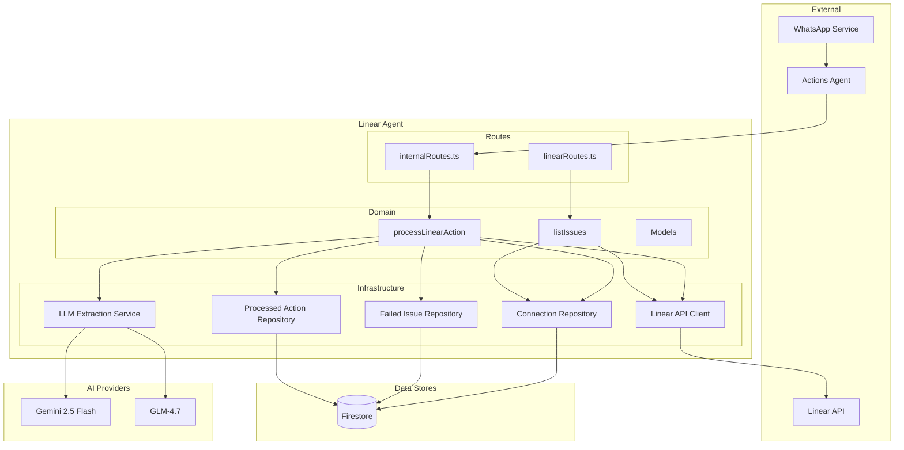
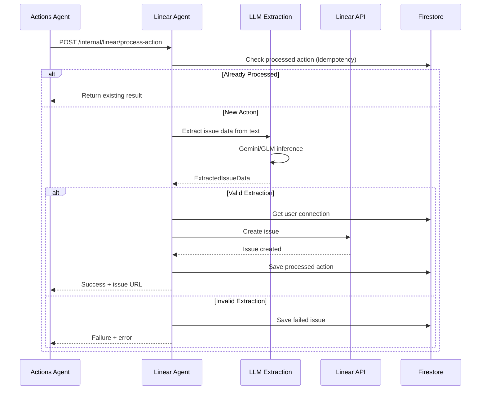

# Linear Agent - Technical Reference

## Overview

Linear Agent provides integration between IntexuraOS and Linear project management. It enables natural language issue creation through voice messages with AI-powered extraction of structured issue data. The service runs on Cloud Run with auto-scaling and uses the `@linear/sdk` for GraphQL API communication.

## Architecture



## Data Flow



## Recent Changes

| Commit     | Description                                         | Date       |
| ---------- | --------------------------------------------------- | ---------- |
| `a23ed1ef` | Redesign Linear board column layout (INT-208)       | 2026-01-22 |
| `1917d3ab` | Improve test coverage (INT-166)                     | 2026-01-21 |
| `5d5e17c2` | Apply rate limit fix (code audit)                   | 2026-01-24 |
| `5bd8b1a8` | Optimize Linear API to avoid rate limiting (INT-95) | 2026-01-16 |
| `1e1647c5` | Add idempotency check (INT-97)                      | 2026-01-16 |
| `81ff1e53` | Standardize ServiceFeedback contract (INT-125)      | 2026-01-17 |

### INT-208: Dashboard Column Redesign (v2.0.0)

Major change to issue grouping for the 3-column dashboard layout:

**New DashboardColumn Types:**

```typescript
type DashboardColumn = 'todo' | 'backlog' | 'in_progress' | 'in_review' | 'to_test' | 'done';
```

**mapStateToDashboardColumn Logic:**

```typescript
function mapStateToDashboardColumn(
  stateType: IssueStateCategory,
  stateName: string
): DashboardColumn {
  // 1. Review detection (state name contains "review")
  if (stateName.toLowerCase().includes('review')) return 'in_review';

  // 2. Test/QA detection (state name contains "test", "qa", "quality")
  if (['test', 'qa', 'quality'].some((k) => stateName.toLowerCase().includes(k))) return 'to_test';

  // 3. Todo detection (state name exactly "Todo")
  if (stateName.toLowerCase() === 'todo') return 'todo';

  // 4. Type-based mapping
  switch (stateType) {
    case 'backlog':
      return 'backlog';
    case 'unstarted':
      return stateName.toLowerCase() === 'backlog' ? 'backlog' : 'todo';
    case 'started':
      return 'in_progress';
    case 'completed':
    case 'cancelled':
      return 'done';
    default:
      return 'todo';
  }
}
```

**GroupedIssues Interface:**

```typescript
interface GroupedIssues {
  todo: LinearIssue[]; // NEW in v2.0.0
  backlog: LinearIssue[];
  in_progress: LinearIssue[];
  in_review: LinearIssue[];
  to_test: LinearIssue[]; // NEW in v2.0.0
  done: LinearIssue[];
  archive: LinearIssue[];
}
```

## API Endpoints

### Public Endpoints

| Method | Path                          | Purpose                       | Auth   |
| ------ | ----------------------------- | ----------------------------- | ------ |
| GET    | `/linear/connection`          | Get user's connection status  | Bearer |
| POST   | `/linear/connection/validate` | Validate API key, get teams   | None   |
| POST   | `/linear/connection`          | Save connection configuration | Bearer |
| DELETE | `/linear/connection`          | Disconnect from Linear        | Bearer |
| GET    | `/linear/issues`              | List issues grouped by column | Bearer |
| GET    | `/linear/failed-issues`       | List failed extractions       | Bearer |

### Internal Endpoints

| Method | Path                              | Purpose               | Auth       |
| ------ | --------------------------------- | --------------------- | ---------- |
| POST   | `/internal/linear/process-action` | Process action via AI | X-Internal |

### GET /linear/issues Response

```typescript
interface ListIssuesResponse {
  issues: {
    todo: LinearIssue[]; // Issues in "Todo" state
    backlog: LinearIssue[]; // Issues in "Backlog" state
    in_progress: LinearIssue[]; // Issues being worked on
    in_review: LinearIssue[]; // Issues in code review
    to_test: LinearIssue[]; // Issues awaiting QA
    done: LinearIssue[]; // Completed in last 7 days
    archive: LinearIssue[]; // Older completed issues
  };
  teamName: string;
}
```

## Domain Models

### LinearIssue

```typescript
interface LinearIssue {
  id: string;
  identifier: string; // e.g., "INT-123"
  title: string;
  description: string | null;
  priority: 0 | 1 | 2 | 3 | 4; // 0=none, 1=urgent, 4=low
  state: {
    id: string;
    name: string;
    type: IssueStateCategory;
  };
  url: string;
  createdAt: string;
  updatedAt: string;
  completedAt: string | null;
}
```

### IssueStateCategory

```typescript
type IssueStateCategory = 'backlog' | 'unstarted' | 'started' | 'completed' | 'cancelled';
```

Maps from Linear's state types to internal categories.

### DashboardColumn

```typescript
type DashboardColumn = 'todo' | 'backlog' | 'in_progress' | 'in_review' | 'to_test' | 'done';
```

Frontend display columns for the 3-column layout:

| Column        | Contains                 | Linear State Types                |
| ------------- | ------------------------ | --------------------------------- |
| `todo`        | Ready-to-start issues    | unstarted with name "Todo"        |
| `backlog`     | Planned but not ready    | backlog type or name "Backlog"    |
| `in_progress` | Actively being worked on | started type (not review/test)    |
| `in_review`   | Code review stage        | started + name contains "review"  |
| `to_test`     | QA/testing stage         | started + name contains test/qa   |
| `done`        | Recently completed       | completed/cancelled (last 7 days) |

### ExtractedIssueData

```typescript
interface ExtractedIssueData {
  title: string;
  priority: 0 | 1 | 2 | 3 | 4;
  functionalRequirements: string | null;
  technicalDetails: string | null;
  valid: boolean;
  error: string | null;
  reasoning: string;
}
```

### ProcessedAction

```typescript
interface ProcessedAction {
  actionId: string;
  userId: string;
  issueId: string;
  issueIdentifier: string; // e.g., "INT-123"
  resourceUrl: string;
  createdAt: string;
}
```

Used for idempotency to prevent duplicate issue creation.

## Firestore Collections

| Collection               | Owner        | Purpose                     |
| ------------------------ | ------------ | --------------------------- |
| `linearConnections`      | linear-agent | User Linear API credentials |
| `failedLinearIssues`     | linear-agent | Failed extraction records   |
| `processedLinearActions` | linear-agent | Idempotency tracking        |

## AI Integration

### LLM Extraction Service

Uses Gemini 2.5 Flash or GLM-4.7 to parse natural language into structured issue data.

**Prompt Strategy:**

1. Extract concise title (max 100 chars)
2. Infer priority from urgency cues
3. Generate Functional Requirements section
4. Generate Technical Details section
5. Validate extraction completeness

**Model Selection:**

- Primary: Gemini 2.5 Flash (fast, cost-effective)
- Alternative: GLM-4.7 (multilingual support)
- Free tier: GLM-4.7-Flash (cost-effective)

### Priority Inference

| Priority | Value | Trigger Words                             |
| -------- | ----- | ----------------------------------------- |
| Urgent   | 1     | urgent, asap, blocker, production down    |
| High     | 2     | high priority, important, critical        |
| Normal   | 3     | (default)                                 |
| Low      | 4     | when you have time, nice to have, someday |
| None     | 0     | (explicit no priority)                    |

## Linear API Client Optimizations

The Linear API client includes performance optimizations (INT-95):

### Client Caching

- Reuses `LinearClient` instances per API key
- 5-minute TTL with automatic cleanup
- Leverages SDK connection pooling

### Request Deduplication

- Caches in-flight requests for 10 seconds
- Prevents duplicate API calls during concurrent requests
- Key format: `{operation}:{apiKeyPrefix}:{params}`

### Batch State Fetching

- Uses `Promise.all` for parallel state resolution
- Eliminates N+1 queries when listing issues

## Configuration

| Variable                              | Required | Description                |
| ------------------------------------- | -------- | -------------------------- |
| `INTEXURAOS_USER_SERVICE_URL`         | Yes      | User service for LLM keys  |
| `INTEXURAOS_INTERNAL_AUTH_TOKEN`      | Yes      | Service-to-service auth    |
| `INTEXURAOS_APP_SETTINGS_SERVICE_URL` | Yes      | LLM pricing context source |
| `INTEXURAOS_AUTH_JWKS_URL`            | Yes      | Auth0 JWKS endpoint        |
| `INTEXURAOS_AUTH_ISSUER`              | Yes      | Auth0 issuer               |
| `INTEXURAOS_AUTH_AUDIENCE`            | Yes      | Auth0 audience             |
| `INTEXURAOS_SENTRY_DSN`               | Yes      | Sentry error tracking      |

## Dependencies

### Internal Services

| Service              | Endpoint                    | Purpose               |
| -------------------- | --------------------------- | --------------------- |
| user-service         | `/internal/user/llm-client` | LLM API key retrieval |
| app-settings-service | `/internal/pricing`         | LLM pricing data      |
| actions-agent        | (caller)                    | Upstream orchestrator |

### External Services

| Service    | Purpose                         | Failure Mode            |
| ---------- | ------------------------------- | ----------------------- |
| Linear API | Issue CRUD, team/state queries  | Return error to client  |
| Gemini API | Issue data extraction           | Return extraction error |
| GLM API    | Alternative extraction provider | Fallback available      |

## Error Handling

| Error Code          | HTTP | Description                        |
| ------------------- | ---- | ---------------------------------- |
| `NOT_CONNECTED`     | 403  | User has no Linear connection      |
| `INVALID_API_KEY`   | 401  | Linear API key is invalid          |
| `RATE_LIMIT`        | 429  | Linear API rate limit exceeded     |
| `EXTRACTION_FAILED` | 200  | LLM could not extract issue data\* |
| `API_ERROR`         | 500  | Generic Linear API failure         |
| `TEAM_NOT_FOUND`    | 500  | Specified team not found           |

\*Note: Extraction failures return 200 with `status: 'failed'` per ServiceFeedback contract.

## Gotchas

- Linear state names are case-insensitive for column mapping ("In Review", "IN REVIEW", "in review" all work)
- The `completedAt` field may be null even for done issues if cancelled (handled as recent)
- Archive includes issues older than 7 days only when `includeArchive=true` (default)
- Idempotency check uses `actionId`, not message content hash
- Client cache cleanup runs on interval, may hold stale clients during low traffic

## File Structure

```
apps/linear-agent/
├── src/
│   ├── domain/
│   │   ├── models.ts           # LinearIssue, DashboardColumn, GroupedIssues
│   │   ├── errors.ts           # LinearError definitions
│   │   ├── ports.ts            # Repository/client interfaces
│   │   └── useCases/
│   │       ├── processLinearAction.ts  # AI extraction + issue creation
│   │       └── listIssues.ts           # Dashboard grouping logic
│   ├── infra/
│   │   ├── firestore/
│   │   │   ├── linearConnectionRepository.ts
│   │   │   ├── failedIssueRepository.ts
│   │   │   └── processedActionRepository.ts
│   │   ├── linear/
│   │   │   └── linearApiClient.ts      # @linear/sdk wrapper
│   │   ├── llm/
│   │   │   └── linearActionExtractionService.ts
│   │   └── user/
│   │       └── llmUserServiceClient.ts
│   ├── routes/
│   │   ├── linearRoutes.ts     # Public API (6 endpoints)
│   │   └── internalRoutes.ts   # Internal API (1 endpoint)
│   ├── services.ts             # DI container
│   ├── server.ts               # Fastify setup
│   └── index.ts                # Entry point
├── __tests__/                   # Comprehensive test suite
└── package.json
```

---

**Last updated:** 2026-01-24
