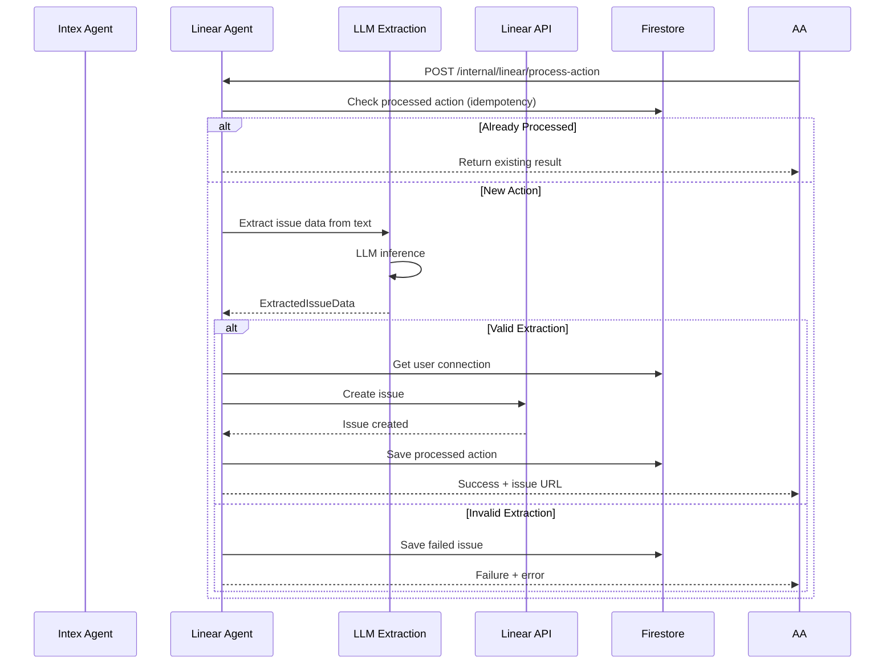
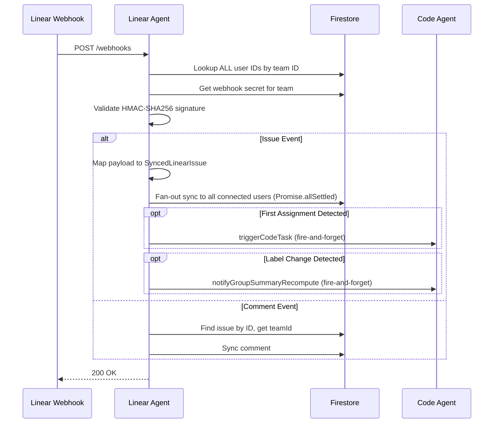
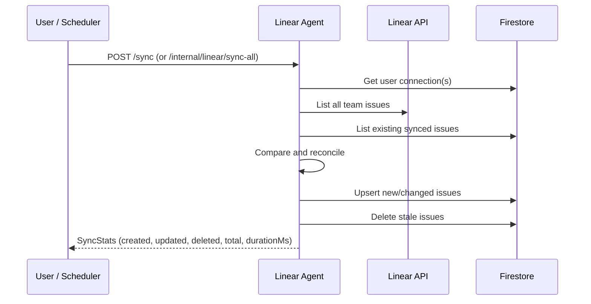
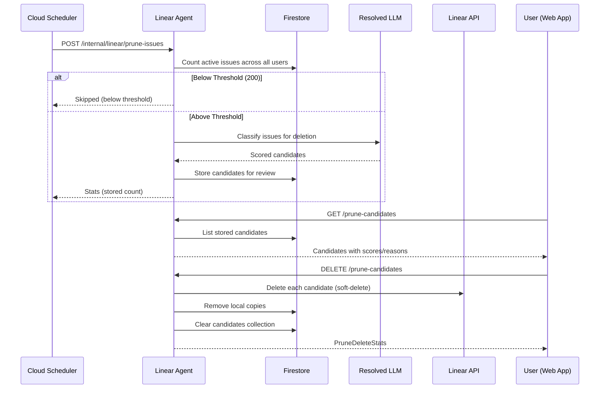

# Linear Agent — Technical Reference

## Overview

Linear Agent provides bidirectional integration between IntexuraOS and Linear project management. It enables real-time webhook synchronization with multi-user fan-out, full issue sync, issue validation, AI title generation, cross-service context proxying, programmatic issue management for code agents, assignment-triggered code tasks, and AI-powered issue pruning with user-reviewed deletion. The service runs on Cloud Run with auto-scaling and uses the `@linear/sdk` for GraphQL API communication. The dashboard reads from local Firestore (populated by webhook sync) for fast, offline-capable issue listing.

## Architecture


```mermaid
graph TB
    subgraph "External"
        WA[WhatsApp Service]
        Intex[Intex Agent]
        CA[Code Agent]
        Scheduler[Cloud Scheduler]
        Linear[Linear API]
        LinearWH[Linear Webhooks]
    end

    subgraph "Linear Agent"
        subgraph "Routes"
            LR[linearRoutes.ts]
            IR[internalRoutes.ts]
            IIR[internalIssuesRoutes.ts]
            WHR[linearWebhookRoutes.ts]
        end

        subgraph "Domain"
            UC1[processLinearAction]
            UC2[listIssues]
            UC3[syncSingleIssue]
            UC4[fullSync]
            UC5[validateIssue]
            UC6[generateIssueTitle]
            UC7[syncCommentFromWebhook]
            UC8[triggerCodeTaskFromAssignment]
            UC9[processWebhook]
            UC10[buildIssueTree]
            UC11[pruneIssues]
            UC12[confirmPruneDeletion]
            IM[issueMapper]
            M[Models + WebhookTypes]
        end

        subgraph "Infrastructure"
            LAC[Linear API Client]
            LM[Linear Mappers]
            RC[Request Cache]
            LES[LLM Extraction Service]
            IPC[Issue Pruning Classifier]
            WV[Webhook Validation]
            CAC[Code Agent HTTP Client]
            CR[Connection Repository]
            FIR[Failed Issue Repository]
            PAR[Processed Action Repository]
            ISR[Issue Repository]
            CMR[Comment Repository]
            PCR[Prune Candidate Repository]
        end
    end

    subgraph "Data Stores"
        FS[(Firestore)]
    end

    subgraph "LLM Resolution"
        LLM[LlmGenerateClient<br/>OpenRouter platform fallback]
    end

    WA --> AA
    AA --> IR
    CA --> IIR
    CA --> IR
    Scheduler --> IR
    LinearWH --> WHR
    LR --> UC2
    LR --> UC4
    LR --> UC11
    LR --> UC12
    IR --> UC1
    IR --> UC5
    IR --> UC6
    IR --> UC4
    IR --> UC11
    IIR --> LAC
    WHR --> WV
    WHR --> UC9
    UC9 --> UC3
    UC9 --> UC7
    UC9 --> UC8
    UC8 --> CAC
    CAC --> CA
    UC1 --> LAC
    UC1 --> LES
    UC1 --> CR
    UC1 --> FIR
    UC1 --> PAR
    UC2 --> ISR
    UC2 --> CR
    UC3 --> IM
    UC3 --> ISR
    UC4 --> IM
    UC4 --> ISR
    UC4 --> LAC
    UC4 --> CR
    UC5 --> LAC
    UC5 --> CR
    UC6 --> LES
    UC11 --> IPC
    UC11 --> PCR
    UC12 --> LAC
    UC12 --> PCR
    IPC --> LLM
    LAC --> LM
    LAC --> RC
    LAC --> Linear
    LES --> LLM
    CR --> FS
    FIR --> FS
    PAR --> FS
    ISR --> FS
    CMR --> FS
    PCR --> FS
```

## Data Flow

### Internal Issue Creation Pipeline


```mermaid
sequenceDiagram
    participant Intex as Intex Agent
    participant LA as Linear Agent
    participant LES as LLM Extraction
    participant Linear as Linear API
    participant FS as Firestore

    AA->>LA: POST /internal/linear/process-action
    LA->>FS: Check processed action (idempotency)
    alt Already Processed
        LA-->>AA: Return existing result
    else New Action
        LA->>LES: Extract issue data from text
        LES->>LES: LLM inference
        LES-->>LA: ExtractedIssueData
        alt Valid Extraction
            LA->>FS: Get user connection
            LA->>Linear: Create issue
            Linear-->>LA: Issue created
            LA->>FS: Save processed action
            LA-->>AA: Success + issue URL
        else Invalid Extraction
            LA->>FS: Save failed issue
            LA-->>AA: Failure + error
        end
    end
```

### Webhook Sync Flow (Multi-User Fan-Out)


```mermaid
sequenceDiagram
    participant Linear as Linear Webhook
    participant LA as Linear Agent
    participant FS as Firestore
    participant CA as Code Agent

    Linear->>LA: POST /webhooks
    LA->>FS: Lookup ALL user IDs by team ID
    LA->>FS: Get webhook secret for team
    LA->>LA: Validate HMAC-SHA256 signature
    alt Issue Event
        LA->>LA: Map payload to SyncedLinearIssue
        LA->>FS: Fan-out sync to all connected users (Promise.allSettled)
        opt First Assignment Detected
            LA->>CA: triggerCodeTask (fire-and-forget)
        end
        opt Label Change Detected
            LA->>CA: notifyGroupSummaryRecompute (fire-and-forget)
        end
    else Comment Event
        LA->>FS: Find issue by ID, get teamId
        LA->>FS: Sync comment
    end
    LA-->>Linear: 200 OK
```

### Full Sync Flow


```mermaid
sequenceDiagram
    participant User as User / Scheduler
    participant LA as Linear Agent
    participant Linear as Linear API
    participant FS as Firestore

    User->>LA: POST /sync (or /internal/linear/sync-all)
    LA->>FS: Get user connection(s)
    LA->>Linear: List all team issues
    LA->>FS: List existing synced issues
    LA->>LA: Compare and reconcile
    LA->>FS: Upsert new/changed issues
    LA->>FS: Delete stale issues
    LA-->>User: SyncStats (created, updated, deleted, total, durationMs)
```

### Issue Pruning Flow


```mermaid
sequenceDiagram
    participant Scheduler as Cloud Scheduler
    participant LA as Linear Agent
    participant FS as Firestore
    participant LLM as Resolved LLM
    participant Linear as Linear API
    participant User as User (Web App)

    Scheduler->>LA: POST /internal/linear/prune-issues
    LA->>FS: Count active issues across all users
    alt Below Threshold (200)
        LA-->>Scheduler: Skipped (below threshold)
    else Above Threshold
        LA->>LLM: Classify issues for deletion
        LLM-->>LA: Scored candidates
        LA->>FS: Store candidates for review
        LA-->>Scheduler: Stats (stored count)
    end
    User->>LA: GET /prune-candidates
    LA->>FS: List stored candidates
    LA-->>User: Candidates with scores/reasons
    User->>LA: DELETE /prune-candidates
    LA->>Linear: Delete each candidate (soft-delete)
    LA->>FS: Remove local copies
    LA->>FS: Clear candidates collection
    LA-->>User: PruneDeleteStats
```

## Changes Since v3.8.0

- `POST /internal/issues` accepts optional `idempotencyKey` (1–1024 characters). The user ID and key determine a stable Linear issue ID. The route returns an existing issue before creation and rechecks after a failed create to recover a race; reuse the key only for the same logical issue.
- Issue-list page reads retry transient 5xx and transport failures up to three times, with exponential backoff and bounded jitter. Exhaustion returns `UPSTREAM_UNAVAILABLE`; route mapping uses `SERVICE_UNAVAILABLE`. Authentication and other permanent failures do not enter this retry path.
- Webhook processing authenticates the issue/team context and HMAC before filtering unsupported event types. Missing secrets, unknown comment issues, and unrecognizable payloads fail authentication rather than being silently accepted.
- Pruning and other platform fallback AI calls use the shared OpenRouter client. Expected handled errors retain logs without redundant error reports.

## Recent Changes

| Commit      | Description                                                                           | Date       |
| ----------- | ------------------------------------------------------------------------------------- | ---------- |
| `8aae64e4b` | Make promptType required in LlmGenerateClient calls (INT-1392)                        | 2026-04-17 |
| `c05f8fab9` | Pass promptType for LLM usage tracking (INT-1390)                                     | 2026-04-16 |
| `a4f53cd70` | Remove LLM pricing from linear-agent — centralized in llm-usage-service (INT-1387)    | 2026-04-15 |
| `7a64b10e4` | Replace fixed Gemini client with per-request user LLM client for pruning (INT-1369)   | 2026-04-14 |
| `e4459fe38` | Skip pruning when candidates are pending user review (INT-1349)                       | 2026-04-12 |
| `6bea344a5` | Eliminate double getAllConnectedUserIds fetch in pruning route                        | 2026-04-14 |
| `892125a5d` | Write-through label cache in updateIssueMetadata                                      | 2026-04-05 |
| `ccbc21106` | Recompute group summaries on Linear label changes (INT-1187)                          | 2026-03-31 |

### Centralized LLM Pricing Removal (INT-1387)

LLM pricing logic has been removed from linear-agent. Pricing is now handled centrally by `llm-usage-service` via `HttpInternalAuthUsageSink`. This eliminates the direct dependency on `app-settings-service` for pricing data at startup. The service now reports LLM usage with `promptType` tags (e.g., `issue-pruning-classification`, `linear-action-extraction`, `linear-issue-title-generation`) to the usage service for cost attribution.

### Per-Request User LLM Client for Pruning (INT-1369)

Issue pruning resolves an LLM client from the first available connected user at request time via `userServiceClient.getLlmClient()`. Direct Google models are normalized to the platform OpenRouter default, so pruning never needs a direct Gemini credential. The `createClassifier` factory in the service container accepts an `LlmGenerateClient` parameter. If no connected user can provide an LLM client, pruning skips gracefully.

### Pruning Guard for Pending Candidates (INT-1349)

The hourly prune scheduler now checks for existing unreviewed candidates before running a new classification. If candidates from a previous run are still pending user review, the scheduler skips and reports the pending count. This prevents overwriting candidates the user has not yet reviewed.

### Extended Completed Issue Retention (INT-963)

The `listIssues` API call to Linear now includes issues completed within the last 60 days (previously 7 days), providing a wider window of recently closed work during full sync.

### Metadata Route Fallback (INT-1147)

The `PATCH /internal/linear/issues/:issueId/metadata` endpoint now falls back to `findByIdentifier` when `findById` returns null, supporting callers that pass an issue identifier (e.g., "INT-123") instead of a Linear UUID.

### Subtask Parent Breadcrumbs

Issue display endpoints (`display-batch`, `GET /internal/linear/issues/:identifier`) now include a `parentIdentifier` field for sub-tasks, enabling parent breadcrumb navigation in the UI.

## API Endpoints

### Public Endpoints

| Method | Path                                  | Purpose                           | Auth   |
| ------ | ------------------------------------- | --------------------------------- | ------ |
| GET    | `/connection`                  | Get user's connection status      | Bearer |
| POST   | `/connection/validate`         | Validate API key, get teams       | None   |
| POST   | `/connection`                  | Save connection configuration     | Bearer |
| DELETE | `/connection`                  | Disconnect from Linear            | Bearer |
| GET    | `/issues`                      | List issues grouped by column     | Bearer |
| GET    | `/issues/:identifier`          | Get single issue with comments    | Bearer |
| GET    | `/issues/:identifier/comments` | List paginated issue comments     | Bearer |
| GET    | `/failed-issues`               | List failed extractions           | Bearer |
| DELETE | `/failed-issues/:id`           | Delete a failed extraction        | Bearer |
| POST   | `/failed-issues/:id/retry`     | Retry a failed extraction         | Bearer |
| POST   | `/sync`                        | Trigger full issue sync           | Bearer |
| GET    | `/webhook-config`              | Get webhook URL and secret status | Bearer |
| POST   | `/webhook-config`              | Set webhook signing secret        | Bearer |
| DELETE | `/webhook-config`              | Remove webhook signing secret     | Bearer |
| GET    | `/prune-candidates`            | List prune candidates for review  | Bearer |
| DELETE | `/prune-candidates`            | Confirm and delete all candidates | Bearer |

### Webhook Endpoints

| Method | Path              | Purpose                       | Auth                   |
| ------ | ----------------- | ----------------------------- | ---------------------- |
| POST   | `/webhooks` | Receive Linear webhook events | HMAC-SHA256 (per-team) |

### Internal Endpoints

| Method | Path                                               | Purpose                                | Auth              |
| ------ | -------------------------------------------------- | -------------------------------------- | ----------------- |
| POST   | `/internal/linear/process-action`                  | Process action via AI extraction       | X-Internal        |
| GET    | `/internal/linear/issues/:identifier/validate`     | Validate issue identifier              | X-Internal        |
| POST   | `/internal/linear/issues/generate-title`           | Generate title from description        | X-Internal        |
| POST   | `/internal/linear/sync`                            | Full sync for a user                   | X-Internal        |
| POST   | `/internal/linear/sync-all`                        | Full sync for all users (Scheduler)    | X-Internal / OIDC |
| POST   | `/internal/linear/prune-issues`                    | Classify and store prune candidates    | X-Internal / OIDC |
| POST   | `/internal/issues`                                 | Create a Linear issue                  | X-Internal        |
| PATCH  | `/internal/issues/:issueId/state`                  | Update issue workflow state            | X-Internal        |
| POST   | `/internal/linear/issues/:issueId/comments`        | Add comment to issue                   | X-Internal        |
| PATCH  | `/internal/linear/issues/:issueId/metadata`        | Update assignee/labels by name         | X-Internal        |
| POST   | `/internal/linear/issues/display-batch`            | Get multiple issues for display        | X-Internal        |
| GET    | `/internal/linear/issues/:identifier`              | Get issue with comment data            | X-Internal        |
| GET    | `/internal/linear/issues/:identifier/context`      | Get issue description + comments       | X-Internal        |
| GET    | `/internal/issues/:issueId/tree`                   | Get issue + recursive descendants      | X-Internal        |
| GET    | `/internal/linear/issues/:issueId/direct-children` | Get live direct children from Linear   | X-Internal        |

### GET /issues Response

```typescript
interface ListIssuesResponse {
  issues: {
    todo: LinearIssue[];        // Issues in "Todo" state
    backlog: LinearIssue[];     // Issues in "Backlog" state
    in_progress: LinearIssue[]; // Issues being worked on
    in_review: LinearIssue[];   // Issues in code review
    to_test: LinearIssue[];     // Issues awaiting QA
    done: LinearIssue[];        // Completed in last 7 days
    archive: LinearIssue[];     // Older completed issues
  };
  teamName: string;
}
```

### GET /internal/linear/issues/:identifier/context Response

```typescript
interface IssueContextResponse {
  description: string | null;
  comments: {
    body: string;
    createdAt: string;
  }[];  // Newest-first, capped at 100, empty bodies filtered
}
```

No userId scoping — service-to-service endpoint used by orchestrator during deep validation.

### PATCH /internal/linear/issues/:issueId/metadata Request

```typescript
interface UpdateIssueMetadataBody {
  assigneeId?: string | null; // Set or unset assignee
  addLabels?: string[];       // Labels to add by name
  removeLabels?: string[];    // Labels to remove by name
}
```

The endpoint resolves label names to Linear label IDs using `listIssueLabels`, computes the desired label set, calls `updateIssue`, performs a write-through cache update to Firestore, and notifies code-agent to recompute group summaries.

### POST /internal/linear/issues/display-batch Request/Response

```typescript
// Request
interface DisplayBatchBody {
  identifiers: string[]; // e.g., ["INT-123", "INT-456"]
}

// Response
interface DisplayBatchResponse {
  issues: IssueDisplayResponse[]; // Missing identifiers are omitted
}

interface IssueDisplayResponse {
  identifier: string;
  title: string;
  state: { name: string; type: string };
  priority: number;
  assignee: { id: string; name: string } | null;
  labels: { id: string; name: string }[];
  url: string;
  commentCount: number;
  lastCommentAt: string | null;
  parentIdentifier: string | null;
}
```

### GET /internal/issues/:issueId/tree Response

```typescript
interface IssueTreeResponse {
  root: {
    id: string;
    identifier: string;
    url: string;
    parentId: string | null;
    labels: string[];        // Label names
    assigneeId: string | null;
    state: string;
  };
  descendants: {
    id: string;
    identifier: string;
    url: string;
    parentId: string | null;
    labels: string[];
    assigneeId: string | null;
    state: string;
  }[];
}
```

Builds a recursive tree from the user's synced issues using BFS traversal. Does not call the Linear API.

### POST /internal/linear/prune-issues Response

```typescript
interface PruneStats {
  skipped: boolean;
  skipReason?: string;
  totalActive: number;
  stored: number;
  remaining: number;
  storedCandidates: {
    identifier: string;
    title: string;
    score: number;
    reason: string;
    category: 'cancelled' | 'duplicate' | 'sub-issue' | 'simple-fix' | 'review-only' | 'other';
  }[];
  durationMs: number;
}
```

### DELETE /prune-candidates Response

```typescript
interface PruneDeleteStats {
  deleted: number;
  failedDeletions: { identifier: string; error: string }[];
  durationMs: number;
}
```

## Domain Models

### LinearIssue

```typescript
interface LinearIssue {
  id: string;
  identifier: string; // e.g., "INT-123"
  title: string;
  description: string | null;
  priority: 0 | 1 | 2 | 3 | 4; // 0=none, 1=urgent, 4=low
  state: {
    id: string;
    name: string;
    type: IssueStateCategory;
  };
  url: string;
  createdAt: string;
  updatedAt: string;
  completedAt: string | null;
  parentId?: string | null;
  childCount: number;
  children: LinearIssue[];
  labels: LinearLabel[];
  assignee?: { id: string; name: string } | null;
}
```

### SyncedLinearIssue

```typescript
interface SyncedLinearIssue {
  id: string;         // Linear UUID (document ID)
  identifier: string;
  title: string;
  description: string | null;
  state: string;
  stateType: IssueStateCategory;
  priority: LinearPriority;
  assigneeId: string | null;
  assigneeName: string | null;
  labels: LinearLabel[];
  url: string;
  userId: string;     // Owner user ID (for multi-tenant)
  parentId: string | null;
  createdAt: string;
  updatedAt: string;
  syncedAt: string;
  teamId: string;     // Linear team ID (for webhook secret lookup)
}
```

Stored in Firestore with composite document key `userId_issueId` to prevent cross-user overwrites.

### LinearComment

```typescript
interface LinearComment {
  id: string;              // Linear UUID
  issueId: string;         // Linear issue UUID
  issueIdentifier: string; // e.g., "INT-444"
  userId: string;          // Comment author Linear user ID
  userName: string;
  body: string;            // Markdown
  createdAt: string;
  updatedAt: string;
  syncedAt: string;
}
```

### PruneCandidate

```typescript
interface PruneCandidate {
  id: string;
  identifier: string;
  title: string;
  score: number;           // 0-100, higher = more deletable
  reason: string;
  category: 'cancelled' | 'duplicate' | 'sub-issue' | 'simple-fix' | 'review-only' | 'other';
}

interface StoredPruneCandidate extends PruneCandidate {
  classifiedAt: string;
}
```

### DashboardColumn

```typescript
type DashboardColumn = 'todo' | 'backlog' | 'in_progress' | 'in_review' | 'to_test' | 'done';
```

| Column        | Contains                 | Linear State Types                |
| ------------- | ------------------------ | --------------------------------- |
| `todo`        | Ready-to-start issues    | unstarted with name "Todo"        |
| `backlog`     | Planned but not ready    | backlog type or name "Backlog"    |
| `in_progress` | Actively being worked on | started type (not review/test)    |
| `in_review`   | Code review stage        | started + name contains "review"  |
| `to_test`     | QA/testing stage         | started + name contains test/qa   |
| `done`        | Recently completed       | completed/cancelled (last 7 days) |

## Use Cases

### processLinearAction

Extracts structured issue data from natural language via LLM, creates the issue in Linear, and tracks the action for idempotency. Saves failed extractions for manual review. Checks `processedActionRepository` first — duplicate submissions return the existing result. Decomposed into focused modules: `checkIdempotency.ts` handles dedup, `descriptionBuilder.ts` assembles the issue body.

### listIssues

Reads all synced issues from Firestore, builds parent-child relationships in memory via `issueTreeBuilder.ts`, and groups issues by dashboard column using `issueGrouper.ts`. The `syncedIssueMapper.ts` handles conversion between SyncedLinearIssue and LinearIssue. Returns `GroupedIssues` with `archive` for issues older than 7 days. Does **not** call the Linear API.

### processWebhook

Top-level orchestrator for all webhook events. Validates the HMAC-SHA256 signature, determines event type (issue or comment), performs multi-user fan-out, and delegates to `syncSingleIssue`, `syncCommentFromWebhook`, or `triggerCodeTaskFromAssignment` as appropriate. On label changes, notifies code-agent to recompute group summaries.

### pruneIssues

Orchestrates the issue pruning workflow: collects all issues across connected users, checks against the activation threshold (200 issues), classifies candidates with the resolved LLM client, and stores them in Firestore for user review. Does not delete issues directly — deletion requires user confirmation via `confirmPruneDeletion`.

### confirmPruneDeletion

Loads stored prune candidates from Firestore, soft-deletes them from Linear via the API using any connected user's API key, removes the local Firestore copies for all users who had the issue synced, and clears the candidates collection. Reports per-issue deletion failures without aborting.

### generateIssueTitle

Generates a concise issue title (max 80 chars) from a task description using LLM. Retries once on failure. Returns `err()` if all attempts fail — no silent degradation or regex fallback.

### validateIssue

Validates a Linear issue identifier (format: `XXX-123`) against the user's connected workspace. Confirms identifier format, issue existence, and team ownership. Returns `labels` as `string[]` at the HTTP boundary (names only, not full objects).

### syncSingleIssue

Processes a single webhook event. Maps payload to `SyncedLinearIssue` via `issueMapper`, then saves or deletes in the local repository. Called per-user via fan-out for multi-tenant scenarios.

### syncCommentFromWebhook

Processes a comment webhook event. Saves new or updated comments to `linear_issue_comments` or deletes removed ones.

### triggerCodeTaskFromAssignment

Triggered by webhook events when an issue is assigned for the first time. Uses `shouldTriggerCodeTask` to validate conditions: action is `update`, assignee changed from null to non-null, state is `backlog` or `unstarted`, and issue has a `planning-task` or `code-task` label. Selects prompt based on label: EXECUTION_PROMPT (code-task label) or ASSIGNMENT_PROMPT (planning-task label). Always dispatches with `workerType: 'auto'`. Fire-and-forget execution.

### fullSync / fullSyncAllUsers

`fullSync` performs a complete reconciliation for one user: fetches all issues from Linear API (including completed issues from the last 60 days), upserts to local storage with composite key `userId_issueId`, and deletes stale issues scoped to the user. `fullSyncAllUsers` iterates all connected users sequentially — used by Cloud Scheduler.

## Firestore Collections

| Collection                 | Owner        | Purpose                                 | Document Key        |
| -------------------------- | ------------ | --------------------------------------- | ------------------- |
| `linear_connections`       | linear-agent | User Linear API credentials             | userId              |
| `linear_failed_issues`     | linear-agent | Failed extraction records               | auto-generated      |
| `linear_processed_actions` | linear-agent | Idempotency tracking                    | auto-generated      |
| `linear_issues`            | linear-agent | Locally synced issue data               | `userId_issueId`    |
| `linear_issue_comments`    | linear-agent | Locally synced comments                 | Linear comment UUID |
| `linear_prune_candidates`  | linear-agent | Prune candidates for user review        | Linear issue UUID   |

## AI Integration

### LLM Extraction Service

Uses the LLM client resolved by `userServiceClient.getLlmClient()` to parse natural language into structured issue data. Supported personal provider keys remain available; platform fallback traffic is routed through OpenRouter. Parsing and validation logic lives in domain `extractionParser.ts`, separated from the LLM call infrastructure.

**Prompt Strategy:**

1. Extract concise title (max 100 chars)
2. Infer priority from urgency cues
3. Generate Functional Requirements section
4. Generate Technical Details section
5. Validate extraction completeness

### Issue Pruning Classifier

Uses the user's configured LLM provider (resolved per-request from the first available connected user via `userServiceClient.getLlmClient()`) to score synced issues as deletion candidates. The classifier:

1. Builds a structured prompt with issue metadata (identifier, title, state, labels, description preview, parent relationships)
2. Requests the LLM to return a JSON array of scored candidates
3. Validates the response with a Zod schema (`LlmCandidateArraySchema`) requiring valid identifiers, 0-100 scores, non-empty reasons, and valid categories
4. Skips gracefully if no connected user can resolve an LLM client
5. Skips if candidates from a previous run are still pending user review

The `createClassifier` factory in the service container accepts an `LlmGenerateClient` parameter, resolved at request time in the pruning route handler. LLM calls include `promptType: 'issue-pruning-classification'` for usage attribution.

Prompt version: `1.1.0`

### LLM Title Generation

Uses `linearIssueTitlePrompt` from `@intexuraos/llm-prompts`. Retries once on failure. Returns `err()` if 2 attempts fail. Empty input returns `{ title: 'Code task', issueType: 'feature' }` immediately without LLM call.

### Priority Inference

| Priority | Value | Trigger Words                             |
| -------- | ----- | ----------------------------------------- |
| Urgent   | 1     | urgent, asap, blocker, production down    |
| High     | 2     | high priority, important, critical        |
| Normal   | 3     | (default)                                 |
| Low      | 4     | when you have time, nice to have, someday |
| None     | 0     | (explicit no priority)                    |

## Webhook Integration

### Signature Validation

Linear webhooks are verified using HMAC-SHA256 signatures. The raw request body is captured via a custom Fastify content type parser and validated against the per-connection webhook secret using `crypto.timingSafeEqual` to prevent timing attacks.

### Multi-Tenant Fan-Out

1. Extract team ID from webhook payload (issue events) or look up from synced issue (comment events)
2. Look up webhook secret for team (`findWebhookSecretByTeamId`)
3. Validate HMAC-SHA256 signature before ignoring unsupported event types
4. Look up ALL connected users by team ID (`findUserIdsByTeamId`)
5. Fan out sync to ALL connected users concurrently via `Promise.allSettled`
6. Check auto-trigger conditions (first user only, to avoid duplicate code tasks)
7. On label changes, notify code-agent to recompute group summaries

### Issue Mapper

- `mapWebhookToSyncedIssue` — Maps webhook payload with assignee, labels, team data, and parent ID
- `mapApiIssueToSyncedIssue` — Maps API response with full label and assignee data

Both include safe parsing of state types (defaults to `'unstarted'`) and priority values (defaults to `0`).

## Linear API Client

### Architecture (Post INT-904 Split)

The client is split into three focused modules:

- **`linearApiClient.ts`** — SDK client operations, client instance caching (5-minute TTL), includes `deleteIssue` for pruning
- **`linearMappers.ts`** — Data mapping functions (`mapIssueStateType`, `mapTeam`, `mapLinearError`, `filterIssuesByCompletionDate`, `mapIssuesWithBatchedStates`)
- **`requestCache.ts`** — In-flight request deduplication (10-second cache, key format: `{operation}:{apiKeyPrefix}:{params}`)

### Client Caching

- Reuses `LinearClient` instances per API key
- 5-minute TTL with automatic cleanup
- Leverages SDK connection pooling

### Request Deduplication

- Caches in-flight requests for 10 seconds
- Prevents duplicate API calls during concurrent requests
- Key format: `{operation}:{apiKeyPrefix}:{params}`

## Configuration

| Variable                              | Required | Description                                            |
| ------------------------------------- | -------- | ------------------------------------------------------ |
| `INTEXURAOS_GCP_PROJECT_ID`           | Yes      | GCP project identifier                                 |
| `INTEXURAOS_USER_SERVICE_URL`         | Yes      | User service for LLM keys                              |
| `INTEXURAOS_INTERNAL_AUTH_TOKEN`      | Yes      | Service-to-service auth                                |
| `INTEXURAOS_LLM_USAGE_SERVICE_URL`    | Yes      | LLM usage reporting                                    |
| `INTEXURAOS_CODE_AGENT_URL`           | Yes      | Code agent for auto-trigger on assign                  |
| `INTEXURAOS_AUTH_JWKS_URL`            | Yes      | Auth0 JWKS endpoint                                    |
| `INTEXURAOS_AUTH_ISSUER`              | Yes      | Auth0 issuer                                           |
| `INTEXURAOS_AUTH_AUDIENCE`            | Yes      | Auth0 audience                                         |
| `INTEXURAOS_SENTRY_DSN`               | Yes      | Sentry error tracking                                  |
| `INTEXURAOS_OPENROUTER_APP_API_KEY`   | Yes      | Platform OpenRouter API key                            |
| `INTEXURAOS_ENVIRONMENT`              | No       | Sentry environment tag                                 |

## Dependencies

### Internal Services

| Service            | Endpoint                                       | Purpose                                             |
| ------------------ | ---------------------------------------------- | --------------------------------------------------- |
| user-service       | `/internal/user/llm-client`                    | LLM client resolution (per-user model)              |
| llm-usage-service  | `/internal/llm-usage`                          | LLM usage reporting (via HttpInternalAuthUsageSink) |
| code-agent         | `/internal/code/submit`                        | Auto-trigger code tasks on issue assignment         |
| code-agent         | `/internal/issue-groups/:id/recompute-summary` | Recompute group summaries on label changes          |
| intex-agent        | (caller)                                       | Supported direct-tool caller                        |
| code-agent         | (caller)                                       | Programmatic issue management                       |

### External Services

| Service         | Purpose                             | Failure Mode            |
| --------------- | ----------------------------------- | ----------------------- |
| Linear API      | Issue CRUD, team/state queries      | Return error to client  |
| Linear Webhooks | Real-time issue change events       | Retry by Linear         |
| OpenRouter API  | Issue extraction / titles / pruning | Return extraction error |

## Error Handling

| Error Code          | HTTP | Description                           |
| ------------------- | ---- | ------------------------------------- |
| `NOT_CONNECTED`     | 403  | User has no Linear connection         |
| `INVALID_API_KEY`   | 401  | Linear API key is invalid             |
| `RATE_LIMIT`        | 429  | Linear API rate limit exceeded        |
| `EXTRACTION_FAILED` | 200  | LLM could not extract issue data\*    |
| `API_ERROR`         | 500  | Generic Linear API failure            |
| `TEAM_NOT_FOUND`    | 500  | Specified team not found              |
| `INTERNAL_ERROR`    | 500  | Internal database or processing error |
| `INVALID_FORMAT`    | 400  | Invalid issue identifier format       |
| `NOT_FOUND`         | 404  | Issue not found in Linear workspace   |
| `WRONG_TEAM`        | 403  | Issue belongs to a different team     |
| `LLM_ERROR`         | 500  | Title generation LLM failure          |
| `PARSE_ERROR`       | 500  | Title generation JSON parse failure   |

\*Note: Extraction failures return 200 with `status: 'failed'` per ServiceFeedback contract.

## Gotchas

- Linear state names are case-insensitive for column mapping ("In Review", "IN REVIEW", "in review" all work)
- The `completedAt` field is not stored in `SyncedLinearIssue` — `updatedAt` is used as a proxy for archive cutoff
- Idempotency check uses `actionId`, not message content hash
- Webhook signature validation requires raw body capture via custom Fastify content type parser
- `linear_issues` documents use composite key `userId_issueId` — queries by issueId alone require a field query
- Unknown webhook state types default to `unstarted`; out-of-range priority values default to `0`
- `generateIssueTitle` returns `err()` on LLM failure — no silent degradation
- Dashboard (`GET /issues`) reads from Firestore; run a full sync if data seems stale
- `/internal/linear/sync-all` and `/internal/linear/prune-issues` accept both OIDC Bearer tokens (Cloud Scheduler) and `X-Internal-Auth`
- Labels are full objects `{ id, name, color }` internally; `validateIssue` HTTP response maps them to `string[]` (names only)
- Auto-trigger code task fires on first assignment (null -> non-null assignee) while state is `backlog` or `unstarted` AND issue has a `planning-task` or `code-task` label
- Auto-trigger selects prompt based on label: execution prompt (code-task) or enrichment prompt (planning-task)
- Webhook fan-out syncs ALL connected users per team — `Promise.allSettled` ensures one user's failure does not block others
- Comment webhooks determine teamId from the synced issue; issues without a teamId (synced before teamId was added) skip signature validation
- `findLinearIssueById` uses a field query without userId scoping — in multi-user scenarios where two users have the same issue synced, it returns whichever document Firestore returns first
- Internal issue endpoints (`/internal/issues/*` and `/internal/linear/issues/*`) require both `X-Internal-Auth` and `X-User-Id` headers
- The `/internal/linear/issues/:issueId/metadata` endpoint resolves label names to IDs using `listIssueLabels` — unknown label names are silently dropped, and the dropped labels are reported in the response
- Both `ASSIGNMENT_PROMPT` and `EXECUTION_PROMPT` in `triggerCodeTaskFromAssignment` instruct the code agent to read all Linear issue comments newest-first before starting work
- `POST /internal/issues` accepts a `labels` field for future use but does not forward it to Linear on creation
- `GET /internal/linear/issues/:identifier/context` has no userId scoping — designed for service-to-service calls where user context is unavailable
- The context endpoint caps comments at 100 and filters empty/whitespace bodies to match the old Linear GraphQL `first:100` behavior
- The metadata endpoint performs a write-through label cache update after successful Linear API call, preventing stale labels until the next webhook
- The metadata endpoint fires a best-effort `notifyGroupSummaryRecompute` call to code-agent; failures are logged but do not fail the request
- Issue pruning uses the resolved user client; absent or legacy direct-provider choices are routed through the platform OpenRouter key
- `confirmPruneDeletion` uses any connected user's API key for deletion — all users share one Linear workspace
- The `PATCH /internal/linear/issues/:issueId/metadata` endpoint accepts both Linear UUIDs and human-readable identifiers (e.g., "INT-123") as the `:issueId` parameter

## File Structure

```
apps/linear-agent/
├── src/
│   ├── domain/
│   │   ├── models.ts             # LinearIssue, SyncedLinearIssue, PruneCandidate, etc.
│   │   ├── errors.ts             # LinearError definitions
│   │   ├── ports.ts              # Repository/client interfaces
│   │   ├── webhookTypes.ts       # LinearWebhookEvent, LinearCommentWebhookEvent
│   │   ├── webhookTypeGuards.ts  # Type guards for webhook payloads
│   │   ├── issueMapper.ts        # mapWebhookToSyncedIssue, mapApiIssueToSyncedIssue
│   │   ├── issueTreeBuilder.ts   # buildIssueHierarchy
│   │   ├── issueGrouper.ts       # groupIssuesByDashboardColumn
│   │   ├── issueDisplayMapper.ts # buildIssueDisplayResponse, toCommentSummary
│   │   ├── syncedIssueMapper.ts  # syncedToLinearIssue conversion
│   │   ├── stateUtils.ts         # STATE_NAME_MAP, findStateId
│   │   ├── extractionParser.ts   # parseExtractionResponse
│   │   ├── descriptionBuilder.ts # buildIssueDescription
│   │   ├── index.ts              # Domain barrel exports
│   │   └── useCases/
│   │       ├── processLinearAction.ts           # AI extraction + issue creation
│   │       ├── processWebhook.ts                # Top-level webhook orchestrator
│   │       ├── listIssues.ts                    # Firestore-based dashboard grouping
│   │       ├── generateIssueTitle.ts            # LLM title generation
│   │       ├── validateIssue.ts                 # Issue identifier validation
│   │       ├── syncSingleIssueUseCase.ts        # Webhook event processing
│   │       ├── syncCommentFromWebhook.ts        # Comment webhook processing
│   │       ├── triggerCodeTaskFromAssignment.ts  # Auto-trigger on assignment
│   │       ├── fullSyncUseCase.ts               # Full issue reconciliation
│   │       ├── pruneIssuesUseCase.ts            # LLM-based issue classification
│   │       ├── confirmPruneDeletionUseCase.ts   # User-confirmed deletion
│   │       ├── checkIdempotency.ts              # Dedup check for process-action
│   │       ├── buildIssueTree.ts                # Issue tree BFS traversal
│   │       ├── resolveLabels.ts                 # Label name-to-ID resolution
│   │       ├── retryFailedIssue.ts              # Retry failed extraction
│   │       ├── getIssueComments.ts              # Paginated comment retrieval
│   │       └── getIssueDetail.ts                # Single issue with comment metadata
│   ├── infra/
│   │   ├── firestore/
│   │   │   ├── linearConnectionRepository.ts
│   │   │   ├── failedIssueRepository.ts
│   │   │   ├── processedActionRepository.ts
│   │   │   ├── linearIssueRepository.ts   # Composite key: userId_issueId
│   │   │   ├── linearCommentRepository.ts
│   │   │   └── pruneCandidateRepository.ts
│   │   ├── linear/
│   │   │   ├── linearApiClient.ts         # SDK client with caching + deleteIssue
│   │   │   ├── linearMappers.ts           # Data mapping functions
│   │   │   └── requestCache.ts            # In-flight request dedup
│   │   ├── http/
│   │   │   └── codeAgentHttpClient.ts     # Code agent HTTP client (30s timeout)
│   │   ├── linearWebhookValidation.ts     # HMAC-SHA256 validation
│   │   └── llm/
│   │       ├── linearActionExtractionService.ts
│   │       └── issuePruningClassifier.ts  # LLM-based prune scoring
│   ├── routes/
│   │   ├── linearRoutes.ts          # Public API (16 endpoints)
│   │   ├── internalRoutes.ts        # Internal: process-action, validate, title, sync, prune
│   │   ├── internalIssuesRoutes.ts  # Internal: issue CRUD, comments, metadata, tree, batch, context, direct-children
│   │   ├── linearWebhookRoutes.ts   # Webhook receiver with fan-out
│   │   └── routeUtils.ts           # Shared handleLinearError
│   ├── services.ts                  # DI container (11 services)
│   ├── server.ts                    # Fastify setup with raw body parser
│   ├── config.ts                    # Configuration loader + PRUNE_CONFIG
│   └── index.ts                     # Entry point
├── __tests__/                       # Comprehensive test suite
└── package.json
```

---

**Last updated:** 2026-04-07
