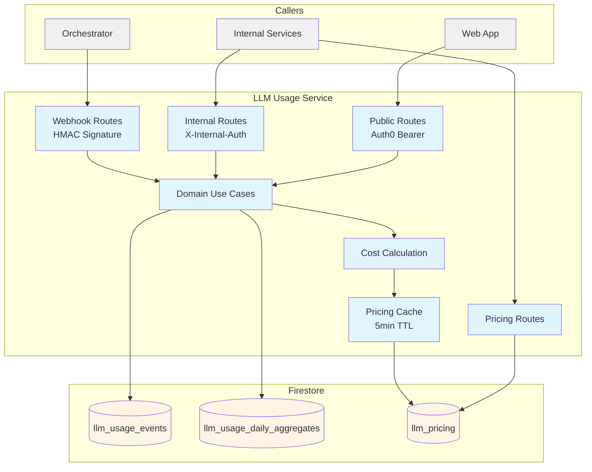
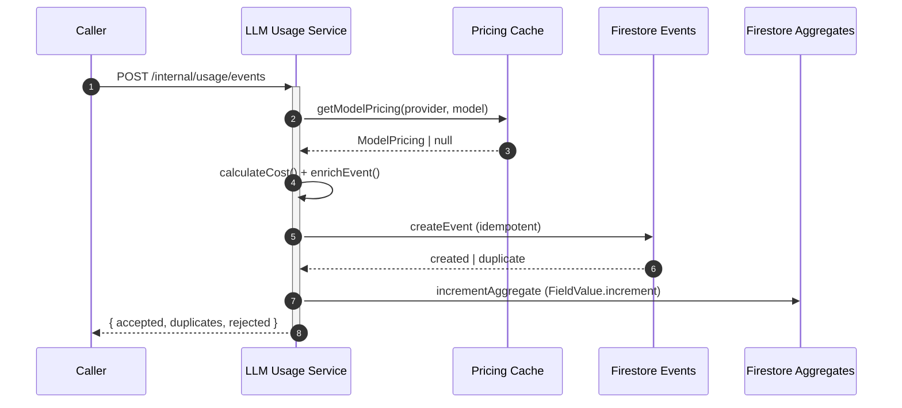

# LLM Usage Service — Technical Reference

## Overview

LLM Usage Service ingests, stores, and aggregates LLM API usage events from across IntexuraOS. It is a Fastify application backed by three Firestore collections (`llm_usage_events`, `llm_usage_daily_aggregates`, `llm_pricing`). It supports five LLM providers: Anthropic, OpenAI, Google, Perplexity, and OpenRouter.

## Architecture



## Data Flow



## Changes Since v3.8.0

The input schema and stored usage model accept additive `request.operation: embedding`. Existing operations remain valid. This supports usage attribution for OpenRouter-routed embedding workloads.

Aggregate IDs percent-escape `%` and `/` in `source.component`, in that order, while stored aggregate dimensions retain the raw value. Literal `%2F` and `/` therefore produce distinct encoded components. Client/model hashing and event replay deduplication retain their existing behavior.

## Release 3.7.0 Changes

| Commit       | Description                                                             | Date        |
| ------------ | ----------------------------------------------------------------------- | ----------- |
| `c9a599334` | Add research usage cost summary and prompt-type aggregate grouping       | 2026-05-05  |
| `2b1c2b24d` | Fix the shared v2 usage event contract, including image billing metadata | 2026-05-05  |
| `d0cbaa2a4` | Complete usage attribution across research/image usage flows             | 2026-05-06  |
| `70fd49d92` | Normalize public API resource paths used by web/API clients              | 2026-06-03  |
| `9a4a9436c` | Preserve MiMo Pro 2.5 model/client identifiers in usage reporting        | 2026-06-09  |
| `512596250` | Fail fast on unknown models outside production and add Claude 4.7 pricing | 2026-04-25  |
| PR #2109/#2110 | Remove retired tracing vendor runtime wiring and settle the Hetzner PM2/nginx surface | 2026-06-08 |

## API Endpoints

### Public Endpoints (Auth0 Bearer)

| Method | Path                         | Purpose                        |
| ------ | ---------------------------- | ------------------------------ |
| POST   | `/events/list`     | List usage events (paginated)  |
| GET    | `/events/:eventId` | Get a single usage event by ID |
| POST   | `/query`           | Query aggregated usage data    |
| GET    | `/pricing`         | Get all LLM pricing            |

### Internal Endpoints (X-Internal-Auth)

| Method | Path                                | Purpose                                     | Caller               |
| ------ | ----------------------------------- | ------------------------------------------- | -------------------- |
| POST   | `/internal/usage/events`            | Ingest usage events (v2 schema)             | Any internal service |
| POST   | `/internal/usage/research-cost-summary` | Summarize LLM usage cost for a research run | Internal services |
| POST   | `/internal/webhooks/usage-events`   | Ingest usage events (orchestrator, HMAC)    | Orchestrator         |
| POST   | `/internal/pricing`                 | Write pricing for a provider                | Admin tooling        |
| GET    | `/internal/pricing`                 | Read all pricing (for consumer boot)        | Any internal service |

### System Endpoints

| Method | Path             | Purpose            |
| ------ | ---------------- | ------------------ |
| GET    | `/health`        | Health check       |
| GET    | `/openapi.json`  | OpenAPI spec       |
| GET    | `/docs`          | Swagger UI         |

## Domain Model

### UsageEvent (stored, schemaVersion: 1)

| Field         | Type                                                               | Description                                     |
| ------------- | ------------------------------------------------------------------ | ----------------------------------------------- |
| `eventId`     | `string`                                                           | Unique event identifier (used as Firestore key) |
| `occurredAt`  | `string` (ISO 8601)                                                | When the LLM call happened                      |
| `receivedAt`  | `string` (ISO 8601)                                                | When the service received the event             |
| `ingress`     | `'internal' \                                                      | 'orchestrator_webhook'`                         | Which endpoint received the event |
| `owner`       | `{ type: 'user' \                                                  | 'system', id: string }`                         | Event owner |
| `source`      | `{ service, component, client, environment, workerLocation? }`     | Call origin metadata                            |
| `request`     | `{ provider, model, operation, success, durationMs, promptType? }` | LLM request metadata                            |
| `usage`       | `UsageTokens`                                                      | Token counts plus web-search, grounding, and image metadata |
| `cost`        | `{ billedUsd, providerReportedUsd, calculatedUsd, pricingSource }` | Resolved cost data                              |
| `correlation` | `{ requestId, traceId, taskId, researchId, attempt, sessionId }`   | Traceability fields                             |
| `error`       | `{ code, message } \                                               | null`                                           | Error details if the LLM call failed |

**Operation Values:** `research`, `generate`, `image_generation`, `tool_calling`, `other`

**Pricing Source Values:** Stored events allow `provider_reported`, `calculated`, `missing`, `mixed`, and `external`; ingestion currently produces `provider_reported`, `calculated`, or `missing`.

### UsageEventInput (ingested, schemaVersion: 2)

Same as UsageEvent but without `receivedAt`, `ingress` (server-set), and with a simplified `cost` object containing only `providerReportedUsd` and `pricingSource` (`'pending' | 'provider_reported'`). The server enriches input to full event via `calculateCost()`.

### DailyUsageAggregate

Pre-computed daily rollups keyed by a composite ID: `{date}__{ownerType}__{ownerIdHash}__{service}__{componentKey}__{clientHash}__{environment}__{provider}__{modelHash}__{operation}__{promptTypeHash}__{success}`. Uses Firestore `FieldValue.increment()` for atomic counter updates.

**Metrics:** `calls`, `costUsd`, `inputTokens`, `outputTokens`, `totalTokens`, `cacheReadTokens`, `cacheWriteTokens`, `cachedTokens`, `reasoningTokens`, `thinkingTokens`, `webSearchCalls`, `imageCount`

### UsageQueryRequest

| Field       | Type                    | Description                                                     |
| ----------- | ----------------------- | --------------------------------------------------------------- |
| `timeRange` | `{ from, to }`          | ISO date-time range                                             |
| `filters`   | `UsageEventFilters?`    | Filter by owner, service, provider, model, operation, success   |
| `groupBy`   | `string[]?`             | Group dimensions (see allowed values below)                     |
| `sortBy`    | `{ field, direction }?` | Sort by any metric field                                        |
| `limit`     | `number?`               | Max rows (default 100, max 500)                                 |

**Allowed groupBy:** `day`, `owner.type`, `owner.id`, `source.service`, `source.component`, `source.client`, `request.provider`, `request.model`, `request.operation`, `request.promptType`, `request.success`

**Allowed sortBy:** `calls`, `costUsd`, `inputTokens`, `outputTokens`, `totalTokens`, `cacheReadTokens`, `cacheWriteTokens`, `cachedTokens`, `reasoningTokens`, `thinkingTokens`, `webSearchCalls`, `imageCount`

### ResearchCostSummaryRequest

`POST /internal/usage/research-cost-summary` accepts `researchId` plus optional `owner` and `timeRange`. It returns totals, ordered event rows, and `diagnostics.missingAttribution`; missing-attribution diagnostics are populated only when both `owner` and `timeRange` are present, using events that match those guards but have `correlation.researchId === null`.

Rows include provider, model, operation, prompt type, success, request ID, token counters, web-search count, image count, billed USD, and pricing source.

## Cost Calculation

Provider-specific cost logic in `costCalculation.ts`:

| Provider    | Special Handling                                                                  |
| ----------- | --------------------------------------------------------------------------------- |
| Anthropic   | Cache read (0.1x input), cache write (1.25x input), web search per-call fee       |
| Google      | Thinking tokens at output price, grounding flat fee, image generation             |
| OpenAI      | Cached tokens subtracted from input (0.5x multiplier), web search fee, images     |
| Perplexity  | Minimum 1 web search call per request, per-call request fee                       |
| OpenRouter  | Standard input/output token pricing when no provider-reported cost is supplied    |

Token prices are stored as per-million-token input/output fields. `ModelPricing.imagePricing` stores per-image USD prices by size. Calculation uses scaled integer math with `Math.round()` for token precision. Image costs use `usage.imageCount` and optional `usage.imageSize`; older events without `imageSize` fall back to `1024x1024`.

Unknown model behavior depends on `NODE_ENV`. In production, a pending-cost event whose provider/model has no pricing entry is stored with `pricingSource: 'missing'`, `billedUsd: 0`, and `calculatedUsd: 0`. Outside production, the event is rejected with `PRICING_MISSING` and the ingest use case throws after processing the rest of the batch, so development and test environments fail fast when new models are not represented in pricing.

## Dependencies

### Internal Packages

| Package                       | Purpose                                            |
| ----------------------------- | -------------------------------------------------- |
| `@intexuraos/common-core`     | Result types, Logger, errors                       |
| `@intexuraos/common-http`     | Auth middleware, logging                           |
| `@intexuraos/http-server`     | Health checks, env validation                      |
| `@intexuraos/http-contracts`  | Core OpenAPI schemas                               |
| `@intexuraos/infra-firestore` | Firestore client                                   |
| `@intexuraos/infra-sentry`    | Error tracking                                     |
| `@intexuraos/llm-contract`    | LlmProvider, ModelPricing types, LlmProviders enum |

## Configuration

| Variable                          | Purpose                             | Required |
| --------------------------------- | ----------------------------------- | -------- |
| `INTEXURAOS_GCP_PROJECT_ID`       | GCP project for Firestore           | Yes      |
| `INTEXURAOS_INTERNAL_AUTH_TOKEN`  | Token for internal service auth     | Yes      |
| `INTEXURAOS_ORCHESTRATOR_SECRET`  | HMAC secret for webhook validation  | Yes      |
| `INTEXURAOS_SERVICE_URL`          | OpenAPI server URL                  | No       |
| `INTEXURAOS_SENTRY_DSN`           | Sentry error tracking DSN           | No       |
| `INTEXURAOS_ENVIRONMENT`          | Environment identifier              | No       |
| `NODE_ENV`                        | Production/non-production pricing behavior switch | No       |
| `PORT`                            | Server port (default 8080)          | No       |
| `HOST`                            | Server host (default 0.0.0.0)       | No       |
| `LOG_LEVEL`                       | Logging level (default info)        | No       |

## Deployment Surface

The Hetzner production runtime runs `llm-usage-service` under PM2 on port `8132`. Nginx exposes the public API under `/api/llm-usage` and proxies that prefix to the service-relative public routes such as `/query`, `/events/list`, `/events/:eventId`, and `/pricing`. Internal callers use service URLs such as `INTEXURAOS_LLM_USAGE_SERVICE_URL` and service-relative internal paths.

## Firestore Collections

| Collection                    | Owner             | Key Strategy                                  |
| ----------------------------- | ----------------- | --------------------------------------------- |
| `llm_usage_events`            | llm-usage-service | `eventId` (idempotent create via `.create()`) |
| `llm_usage_daily_aggregates`  | llm-usage-service | Composite: date + dimensions (hashed)         |
| `llm_pricing`                 | llm-usage-service | Provider name (one doc per provider)          |

## Gotchas

- **Aggregate doc IDs hash variable-length fields** (`owner.id`, `source.client`, `request.model`) using SHA-256 truncated to 32 hex chars. This prevents Firestore path issues with slashes in client strings but means you cannot reverse-lookup the original value from the doc ID.
- **Firestore disjunction limit**: The list endpoint pushes only the first populated array filter to Firestore as an `in` clause. Additional array filters are applied in-memory post-fetch, which means pages may be shorter than the requested `limit`.
- **Pricing cache has a 5-minute TTL**. After updating pricing via `POST /internal/pricing`, consumers calling the ingestion endpoint may use stale pricing for up to 5 minutes.
- **Webhook auth uses HMAC-SHA256** with a 15-minute replay window. The signature covers `{timestamp}.{rawBody}`.
- **schemaVersion discriminated union**: Input events must have `schemaVersion: 2`. Stored events are normalized to `schemaVersion: 1`. Sending `schemaVersion: 1` on the input endpoint returns a 400.
- **Orchestrator webhook requires `source.service === 'orchestrator'`** and `source.workerLocation` — enforced by the `OrchestratorUsageEventInput` JSON schema.
- **`request.promptType` is part of daily aggregate keys**. Events without a prompt type use the internal `__missing__` sentinel in aggregate rows.
- **Perplexity cost calculation floors webSearchCalls to 1** — Perplexity always charges at least one request fee per API call, even when the event reports 0 web search calls.
- **Unknown models fail fast outside production**. Production keeps the event with `pricingSource: 'missing'` and zero cost so reporting remains complete; development and test reject and throw to force pricing data updates.

## File Structure

```
apps/llm-usage-service/src/
├── domain/
│   ├── models/
│   │   ├── cursor.ts           # Base64url cursor encode/decode
│   │   ├── dailyAggregate.ts   # DailyUsageAggregate interface
│   │   ├── usageEvent.ts       # UsageEvent, UsageEventInput types
│   │   └── usageQuery.ts       # Query request/response types, allowed fields
│   ├── repositories/
│   │   ├── pricingRepository.ts        # PricingRepository port
│   │   ├── usageAggregateRepository.ts # UsageAggregateRepository port
│   │   └── usageEventRepository.ts     # UsageEventRepository port
│   ├── services/
│   │   ├── costCalculation.ts  # Provider-specific cost calculation
│   │   └── pricingCache.ts     # TTL-based pricing cache
│   └── usecases/
│       ├── getResearchCostSummary.ts # Summarize research-run usage cost
│       ├── getUsageEvent.ts    # Get single event by ID
│       ├── ingestUsageEvents.ts# Ingest + enrich + aggregate
│       ├── listUsageEvents.ts  # Paginated event listing
│       └── queryUsage.ts       # Aggregate query with groupBy/sortBy
├── infra/
│   ├── firestore/
│   │   ├── aggregateKeyUtils.ts              # SHA-256 hashing, date extraction
│   │   ├── firestorePricingRepository.ts     # Pricing CRUD
│   │   ├── firestoreUsageAggregateRepository.ts # Atomic increment aggregates
│   │   └── firestoreUsageEventRepository.ts  # Event CRUD + filtered listing
│   └── webhookValidation.ts    # HMAC-SHA256 orchestrator signature validation
├── routes/
│   ├── schemas/
│   │   ├── pricingSchema.ts        # ProviderPricing JSON schema
│   │   └── usageEventSchema.ts     # UsageEventInput + Orchestrator schemas
│   ├── index.ts                    # Route registration
│   ├── internalUsageRoutes.ts      # POST /internal/usage/events
│   ├── pricingRoutes.ts            # Pricing CRUD routes
│   ├── publicUsageRoutes.ts        # Auth0-protected usage routes
│   └── webhookUsageRoutes.ts       # Orchestrator webhook route
├── index.ts                        # Entry point, env validation
├── server.ts                       # Fastify setup, OpenAPI, health check
└── services.ts                     # DI container
```
