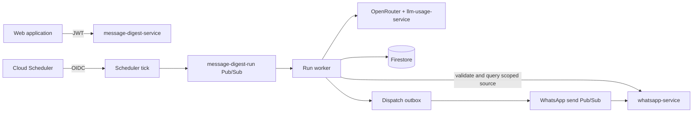

# Message Digest Service — Technical Reference

## Overview

`message-digest-service` is the canonical owner of WhatsApp digest definitions and runs. It is a Fastify service on port `8135`, exposed at `/api/message-digests` in production. It reads only scoped private WhatsApp source data, generates summaries through the shared OpenRouter stack, and asks WhatsApp Service to deliver through the user's first mapped phone number.

## Architecture

The service never derives source data from Android notifications. A definition stores a `private_whatsapp` source with `group` or `direct` chat type, source account, source generation, source revision, and canonical chat identity.

## Public API

All user routes require a bearer JWT. The production prefix is `/api/message-digests`; paths below are relative to the service root.

| Method | Path | Purpose |
| --- | --- | --- |
| `GET` | `/` | List owned definitions. |
| `POST` | `/` | Create a definition with an idempotency key. |
| `GET` | `/:definitionId` | Read one owned definition. |
| `PATCH` | `/:definitionId` | Update source-safe mutable fields. |
| `DELETE` | `/:definitionId` | Start idempotent physical erasure. |
| `GET` | `/erasures/:erasureRequestId` | Read content-free erasure progress. |
| `POST` | `/erasures/:erasureRequestId/resume` | Resume a bounded erasure cascade. |
| `GET` | `/delivery-readiness` | Read the current WhatsApp destination readiness. |
| `POST` | `/schedule-preview` | Calculate nearby boundaries and the next run. |
| `POST` | `/preview` | Generate a non-persisted, non-delivered preview. |
| `POST` | `/:definitionId/run/prepare` | Freeze a manual run window and issue a short-lived token. |
| `POST` | `/:definitionId/run` | Queue the prepared run idempotently. |
| `GET` | `/:definitionId/runs` | Page through run history. |
| `GET` | `/:definitionId/runs/:runId` | Read one run. |
| `POST` | `/:definitionId/runs/:runId/retry` | Retry an eligible failed run. |
| `GET` | `/legacy-runs/:groupKey/:date` | Read a migrated legacy run for compatibility. |

`GET /health`, `GET /openapi.json`, and `GET /docs` expose service health and OpenAPI documentation.

## Internal API

| Method | Path | Caller and purpose |
| --- | --- | --- |
| `POST` | `/internal/message-digests/scheduler/tick` | Cloud Scheduler reserves due work. |
| `POST` | `/internal/message-digests/pubsub/run` | Pub/Sub processes one reserved run. |
| `POST` | `/internal/message-digests/delivery-authorizations/acquire` | WhatsApp Service acquires an exclusive send authorization. |
| `POST` | `/internal/message-digests/delivery-authorizations/release` | WhatsApp Service records the final or retryable send outcome. |
| `POST` | `/internal/message-digests/definitions/query` | Fishing Assistant queries compatible owned definitions. |
| `POST` | `/internal/message-digests/runs/query` | Fishing Assistant queries canonical digest evidence. |

Internal token authentication is required in addition to Pub/Sub or OIDC envelope checks where applicable.

## WhatsApp contracts

Message Digest Service uses these internal WhatsApp Service contracts:

| Method | Path | Purpose |
| --- | --- | --- |
| `POST` | `/internal/whatsapp/private/digest-source/validate` | Resolve and fence an owned group or direct-chat source. |
| `POST` | `/internal/whatsapp/private/digest-source/messages/query` | Read one bounded, stable page of source messages. |
| `POST` | `/internal/whatsapp/delivery-readiness/get` | Confirm the first mapped phone number can receive the digest. |

The source query requires the validated account generation and source revision. Any mismatch fails closed and requires the user to reselect the conversation.

## Definition model

| Field | Values |
| --- | --- |
| Source | `private_whatsapp` with `group` or `direct` chat type |
| Schedule | `daily`, `weekdays`, or `weekly`; local `HH:mm`; IANA time zone; weekday for weekly |
| Instructions | `fishing_group`, `direct_sentiment`, or `custom`, plus the persisted instruction text |
| Delivery | `whatsapp_primary` only |
| Lifecycle | active or paused, with generation-fenced deletion |

Schedule calculation uses wall-clock time in the selected zone and explicitly handles DST gaps and overlaps. Updates create a new revision, and queued work is bound to the revision it was prepared from.

## Run and delivery lifecycle

A run moves through `queued`, `processing`, then `completed`, `failed`, or `skipped_no_activity`. Delivery is tracked independently as `not_sent`, `pending`, `sent`, `ambiguous`, or `failed`.

The scheduler reserves one deterministic run for a definition and schedule boundary. The worker leases it for 180 seconds and renews the lease every 60 seconds. Source reads use pages of at most 200 messages, 25 pages, 5,000 messages, and 2 MB. The prompt can include the previous three completed summaries for continuity.

After generation, a transactional outbox publishes a frozen WhatsApp payload. WhatsApp Service must acquire a delivery authorization before calling the provider. An ambiguous provider result blocks blind retry until reconciliation proves whether a send happened.

## Firestore collections

| Collection | Purpose |
| --- | --- |
| `message_digest_definitions` | User definitions, revisions, source fences, and next run. |
| `message_digest_runs` | Frozen windows, generated summaries, processing, and delivery state. |
| `message_digest_states` | Cross-run summary continuity. |
| `message_digest_dispatch_outbox` | Durable outbound dispatch records. |
| `message_digest_erasure_requests` | Bounded physical erasure progress. |
| `message_digest_migration_activations` | One-shot Fishing migration activation fence. |

Legacy archive collections remain migration evidence only; no runtime writes depend on Mobile Notifications digest code.

## Configuration

| Variable | Purpose |
| --- | --- |
| `PORT` | HTTP port; defaults to `8135`. |
| `INTEXURAOS_GCP_PROJECT_ID` | Firestore and Pub/Sub project. |
| `INTEXURAOS_AUTH_JWKS_URL` | JWT key set. |
| `INTEXURAOS_AUTH_ISSUER` | JWT issuer. |
| `INTEXURAOS_AUTH_AUDIENCE` | JWT audience. |
| `INTEXURAOS_INTERNAL_AUTH_TOKEN` | Service-to-service authentication. |
| `INTEXURAOS_WHATSAPP_SERVICE_URL` | Private source and delivery-readiness dependency. |
| `INTEXURAOS_LLM_USAGE_SERVICE_URL` | LLM usage reporting endpoint. |
| `INTEXURAOS_OPENROUTER_APP_API_KEY` | OpenRouter credential. |
| `INTEXURAOS_DIGEST_LLM_MODEL` | Digest generation model identifier. |
| `INTEXURAOS_PUBSUB_MESSAGE_DIGEST_RUN_TOPIC` | Reserved-run work topic. |
| `INTEXURAOS_PUBSUB_WHATSAPP_SEND_TOPIC` | Frozen outbound delivery topic. |
| `INTEXURAOS_WEB_APP_URL` | Base URL for run deep links. |

Local development requires both Firestore and Pub/Sub emulators. Production rejects emulator variables.

## Operational invariants

- Candidate and preview execution cannot publish a WhatsApp send.
- Prompt, summary, message body, chat identifier, and phone number are never logged.
- Definition ownership is checked on every public read and mutation.
- Source generation and revision changes fail closed.
- User deletion disables future work before physical erasure advances.
- Mobile Notifications Service has no digest routes, scheduler, LLM configuration, or WhatsApp publisher.
