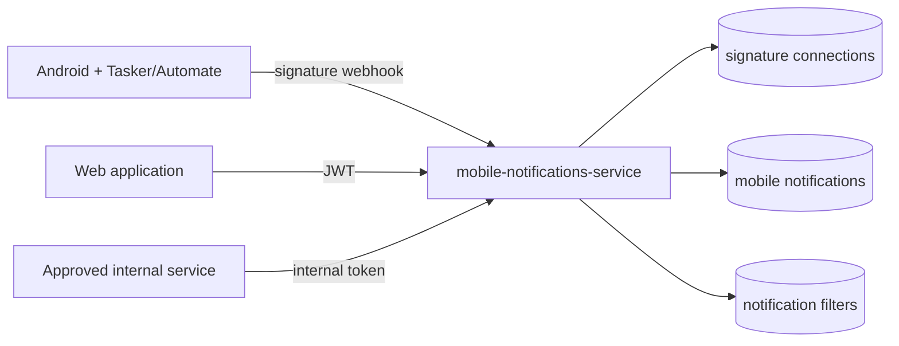

# Mobile Notifications Service — Technical Reference

## Overview

`mobile-notifications-service` is a Fastify application on production port `8114`. It receives signed Android notification webhooks, resolves the signature to a user, deduplicates and stores notifications in Firestore, maintains filter metadata, and exposes authenticated and internal query routes.

The service has no WhatsApp summary generation, scheduler, LLM client, summary state, or outbound WhatsApp publisher. Those responsibilities belong to [Message Digest Service](../message-digest-service/technical.md) and WhatsApp Service.

## Changes since v3.8.0

WhatsApp digests moved to Message Digest Service, preserving the existing Fishing digest continuity while adding configurable private-chat summaries. The former public and internal digest routes, group-message query route, digest repositories, LLM dependencies, and WhatsApp publisher have been removed here. `digestRemoval.test.ts` verifies that retired routes return 404 and ordinary notification routes remain registered.

## Architecture

## Public API

Production routes use the `/api/notifications` prefix. Paths below are relative to the service root.

| Method | Path | Purpose | Authentication |
| --- | --- | --- | --- |
| `POST` | `/connect` | Replace the active connection and return its plaintext signature once. | Bearer JWT |
| `GET` | `/status` | Return connection state and latest notification time. | Bearer JWT |
| `POST` | `/webhooks` | Accept one notification event. | Mobile signature header |
| `GET` | `/` | List owned notifications with cursor pagination and filters. | Bearer JWT |
| `DELETE` | `/:notification_id` | Delete one owned notification. | Bearer JWT |
| `GET` | `/filters` | Read discovered filter options and saved filters. | Bearer JWT |
| `POST` | `/filters/saved` | Create a saved filter. | Bearer JWT |
| `DELETE` | `/filters/saved/:id` | Delete a saved filter. | Bearer JWT |
| `GET` | `/health` | Read service health. | None |
| `GET` | `/openapi.json` | Read the OpenAPI contract. | None |
| `GET` | `/docs` | Open Swagger UI. | None |

List filters support comma-separated `source` and `app`, case-insensitive partial `title`, `limit` from 1 to 100, and a cursor.

## Internal API

`POST /internal/mobile-notifications/query` requires the shared internal token. It accepts `userId`, optional `app`, `source`, and `title` filters, plus a maximum result count from 1 to 1,000. The response maps stored text to `body` and `receivedAt` to an ISO `timestamp`.

## Webhook processing

1. Hash the supplied connection signature.
2. Resolve exactly one active connection and owner.
3. Validate the webhook schema.
4. Check the user-scoped notification identity.
5. Store a new notification or return an ignored duplicate result.
6. Update discovered app, device, and source filter values on a best-effort basis.

The signature value is never stored in plaintext. Route ownership checks prevent cross-user reads and deletion.

## Configuration

| Variable | Purpose |
| --- | --- |
| `PORT` | HTTP port; production uses `8114`. |
| `HOST` | Bind host; defaults to `0.0.0.0`. |
| `INTEXURAOS_AUTH_JWKS_URL` | JWT key set. |
| `INTEXURAOS_AUTH_ISSUER` | JWT issuer. |
| `INTEXURAOS_AUTH_AUDIENCE` | JWT audience. |
| `INTEXURAOS_INTERNAL_AUTH_TOKEN` | Internal query authentication. |
| `INTEXURAOS_GCP_PROJECT_ID` | Firestore project supplied by shared infrastructure. |

## Data ownership

The active collections hold signature connections, notifications, and per-user filter metadata. Historical archive collections created for the one-shot WhatsApp summary migration remain provenance only and are not accessed by active Mobile Notifications code.

## Operational invariants

- A new connection invalidates the previous signature.
- Duplicate webhook delivery does not duplicate user data.
- User identity comes from the verified JWT or signature mapping, never request parameters.
- Internal query callers must supply an explicit user ID and shared token.
- No route invokes an LLM or publishes a WhatsApp message.
