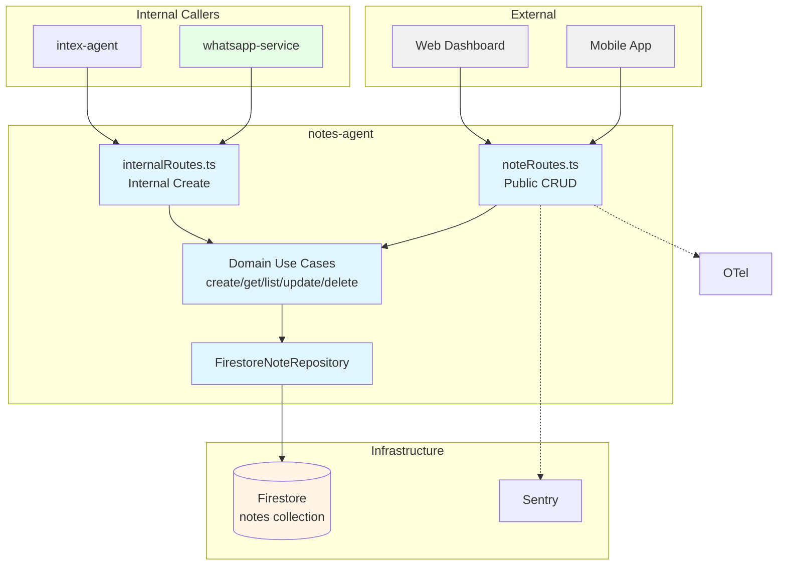
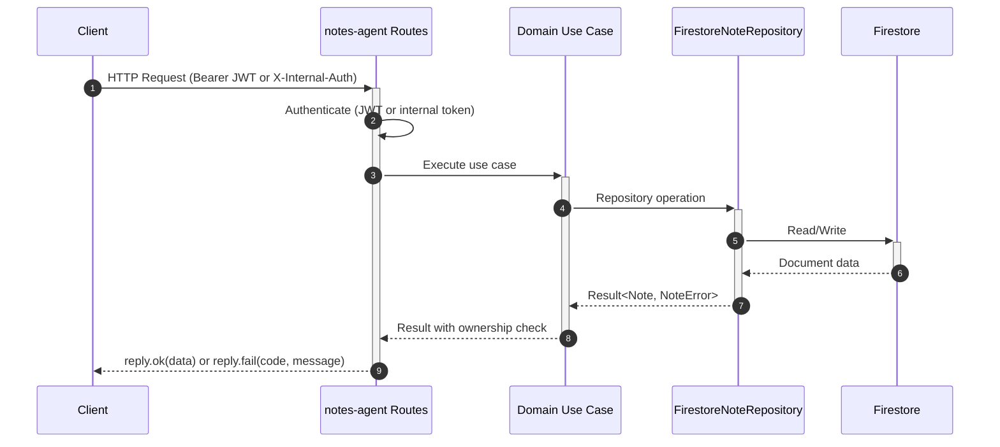

# Notes Agent — Technical Reference

## Overview

Notes-agent provides user-scoped CRUD operations for text notes with tag-based organization and source tracking. Deployed as a Cloud Run service using Fastify. Persists data in Firestore. Runs on port 8121 locally.

## Architecture



## Data Flow



## Recent Changes

### Changes since v3.8.0

Internal note creation now returns an absolute `https://intexuraos.cloud/#/notes/{id}` in `ServiceFeedback.resourceUrl`, so assistant replies contain a directly usable link.

| Commit      | Description                                       | Date       |
| ----------- | ------------------------------------------------- | ---------- |
| `c4e3a13c`  | Release v3.3.0 — version bump, docs refresh       | 2026-03-15 |
| `44ea683a`  | Release v3.2.0 — version bump, docs refresh       | 2026-03-07 |
| `b3f34d85`  | Release v3.1.0                                    | 2026-02-22 |
| `c8a42105`  | Release v3.0.0                                    | 2026-02-19 |
| `6063175b`  | Add dev-mode log formatting for PM2 readability   | 2026-02-16 |
| `d5fbb354`  | Fix start:local to use tsx instead of node        | 2026-02-14 |
| `45f001c1`  | Switch PM2 ecosystem to pnpm --filter start:local | 2026-02-14 |
| `c3198407`  | Fix response contract violations (reply.fail)     | 2026-01-30 |
| `09091782`  | Fix branch coverage for legacy status default     | 2026-01-30 |

## API Endpoints

### Public Endpoints

| Method | Path         | Description        | Auth         | Request Body                                 | Response     |
| ------ | ------------ | ------------------ | ------------ | -------------------------------------------- | ------------ |
| GET    | `/`     | List user's notes  | Bearer token | —                                            | `Note[]`     |
| POST   | `/`     | Create new note    | Bearer token | `{ title, content, tags, source, sourceId }` | `Note` (201) |
| GET    | `/:id` | Get specific note  | Bearer token | —                                            | `Note`       |
| PATCH  | `/:id` | Update note fields | Bearer token | `{ title?, content?, tags? }`                | `Note`       |
| DELETE | `/:id` | Delete note        | Bearer token | —                                            | `{}`         |

**Note:** The public note response does **not** include the `status` field. Status is stored in Firestore but is intentionally omitted from the serialized response (`formatNote` excludes it).

### Internal Endpoints

| Method | Path              | Description                       | Auth            | Request Body                                                    | Response        |
| ------ | ----------------- | --------------------------------- | --------------- | --------------------------------------------------------------- | --------------- |
| POST   | `/internal/notes` | Create note from internal service | X-Internal-Auth | `{ userId, title, content, tags, source, sourceId, status? }`   | ServiceFeedback |

**Internal response shape:** `ServiceFeedback` — `{ status: 'completed' | 'failed', message, resourceUrl?, errorCode? }` — not a raw Note object.

### System Endpoints

| Method | Path            | Description           | Auth |
| ------ | --------------- | --------------------- | ---- |
| GET    | `/health`       | Health check          | None |
| GET    | `/docs`         | Swagger UI            | None |
| GET    | `/openapi.json` | OpenAPI specification | None |

## Domain Model

### Note

| Field       | Type               | Description                                    |
| ----------- | ------------------ | ---------------------------------------------- |
| `id`        | `string`           | Auto-generated Firestore document ID           |
| `userId`    | `string`           | Owner user ID (from JWT `sub` or request body) |
| `title`     | `string`           | Note title (required, min length 1)            |
| `content`   | `string`           | Note content (can be empty string)             |
| `tags`      | `string[]`         | User-defined tags for organization             |
| `status`    | `'draft' \         | 'active'`                                      | Draft or active (defaults to `'active'`) |
| `source`    | `string`           | Source system (e.g. "whatsapp", "web", "test") |
| `sourceId`  | `string`           | ID in the source system                        |
| `createdAt` | `Date`             | Creation timestamp                             |
| `updatedAt` | `Date`             | Last update timestamp                          |

### NoteStatus Values

| Status   | Meaning                                           |
| -------- | ------------------------------------------------- |
| `active` | Default status for all notes                      |
| `draft`  | In-progress note (set via internal endpoint only) |

### CreateNoteInput

| Field      | Type                  | Required             |
| ---------- | --------------------- | -------------------- |
| `userId`   | `string`              | Yes                  |
| `title`    | `string`              | Yes                  |
| `content`  | `string`              | Yes                  |
| `tags`     | `string[]`            | Yes                  |
| `status`   | `'draft' \            | 'active'`            | No (default: active) |
| `source`   | `string`              | Yes                  |
| `sourceId` | `string`              | Yes                  |

### UpdateNoteInput

| Field     | Type       | Required |
| --------- | ---------- | -------- |
| `title`   | `string`   | No       |
| `content` | `string`   | No       |
| `tags`    | `string[]` | No       |

**Note:** `status`, `source`, `sourceId`, and `userId` cannot be updated via the PATCH endpoint.

### Error Codes

| Code             | Source        | HTTP | Meaning                                    |
| ---------------- | ------------- | ---- | ------------------------------------------ |
| `NOT_FOUND`      | Repository    | 404  | Note does not exist                        |
| `STORAGE_ERROR`  | Repository    | 500  | Firestore operation failed                 |
| `FORBIDDEN`      | Use case      | 403  | Requesting user does not own the note      |
| `UNAUTHORIZED`   | Auth plugin   | 401  | Missing or invalid JWT / internal auth     |
| `INTERNAL_ERROR` | Route handler | 500  | Catch-all for unexpected repository errors |

## Dependencies

### Infrastructure

| Component                      | Purpose                         |
| ------------------------------ | ------------------------------- |
| Firestore (`notes` collection) | Note persistence                |
| SentryBox                      | Error tracking                  |

### Internal Services (callers)

| Service       | Endpoint          | Purpose                              |
| ------------- | ----------------- | ------------------------------------ |
| intex-agent | `/internal/notes` | Creates notes from direct tool calls |

### Package Dependencies

| Package                       | Purpose                                     |
| ----------------------------- | ------------------------------------------- |
| `@intexuraos/common-core`     | Result types, error message extraction      |
| `@intexuraos/common-http`     | Auth plugin, request logging, reply helpers |
| `@intexuraos/http-contracts`  | Core OpenAPI schema registration            |
| `@intexuraos/http-server`     | Health checks, env validation               |
| `@intexuraos/infra-firestore` | Firestore singleton client                  |
| `@intexuraos/infra-sentry`    | Sentry init, log stream, error handler      |

## Configuration

| Variable                         | Required | Description                             |
| -------------------------------- | -------- | --------------------------------------- |
| `INTEXURAOS_GCP_PROJECT_ID`      | Yes      | GCP project for Firestore               |
| `INTEXURAOS_AUTH_JWKS_URL`       | Yes      | JWKS endpoint for JWT auth              |
| `INTEXURAOS_AUTH_ISSUER`         | Yes      | JWT issuer                              |
| `INTEXURAOS_AUTH_AUDIENCE`       | Yes      | JWT audience                            |
| `INTEXURAOS_INTERNAL_AUTH_TOKEN` | Yes      | Token for internal service auth         |
| `INTEXURAOS_SENTRY_DSN`          | Yes      | Sentry error reporting DSN              |
| `INTEXURAOS_ENVIRONMENT`         | No       | Environment name (default: development) |
| `PORT`                           | No       | Server port (default: 8080)             |
| `LOG_LEVEL`                      | No       | Pino log level (default: info)          |

## Gotchas

- **Status not in public API responses**: The `formatNote()` serializer omits `status` from all public endpoint responses. The field exists in Firestore and the domain model but is not surfaced over the public API.
- **Legacy documents without status field**: The Firestore repository defaults `status` to `'active'` for documents that predate the status feature (`(doc.status || 'active') as Note['status']`). This ensures backward compatibility.
- **No status update via PATCH**: `UpdateNoteInput` only accepts `title`, `content`, and `tags`. Status changes are not supported through any endpoint.
- **No tag filtering**: The `listNotes` use case returns all notes for a user without filter support. Tag filtering is planned but not yet implemented.
- **No pagination**: `findByUserId()` returns all notes for a user in a single query. Large note collections will return all documents at once.
- **List ordering**: `findByUserId()` orders results by `updatedAt` descending. Most recently updated notes appear first.
- **FORBIDDEN error is use-case inline**: The `NoteRepository` port only defines `NOT_FOUND | STORAGE_ERROR` error codes. The `FORBIDDEN` error code is produced inline by `getNote`, `updateNote`, and `deleteNote` use cases when the requesting user does not own the note.
- **Double read on update/delete**: The `update()` and `delete()` methods in `FirestoreNoteRepository` check document existence before performing the operation, and the use case also reads the document to verify ownership — resulting in two Firestore reads for each mutation.
- **Internal create returns ServiceFeedback, not Note**: The `/internal/notes` endpoint returns the standardized `ServiceFeedback` shape (`{ status, message, resourceUrl }`) rather than the raw note object. Callers cannot directly access the created note's fields from the response.

## File Structure

```
apps/notes-agent/src/
  domain/
    models/
      note.ts                  # Note entity + input types + NoteStatus
    ports/
      noteRepository.ts        # Repository interface + NoteError/NoteErrorCode types
    usecases/
      createNote.ts            # Create note with logging
      getNote.ts               # Get note with ownership check
      listNotes.ts             # List user's notes
      updateNote.ts            # Update note with ownership check
      deleteNote.ts            # Delete note with ownership check
  infra/
    firestore/
      firestoreNoteRepository.ts  # Firestore CRUD implementation
  routes/
    noteRoutes.ts              # Public CRUD endpoints (5 routes)
    internalRoutes.ts          # Internal create endpoint (ServiceFeedback response)
  __tests__/
    config.test.ts             # Config loading tests
    fakeNoteRepository.ts      # In-memory repository fake for testing
    firestoreNoteRepository.test.ts  # Firestore repository integration tests
    internalRoutes.test.ts     # Internal endpoint tests
    noteRoutes.test.ts         # Public endpoint tests
    testUtils.ts               # JWKS server, token creation, test context setup
    usecases.test.ts           # Domain use case unit tests
  config.ts                    # Config type + loadConfig()
  services.ts                  # DI container (ServiceContainer with NoteRepository)
  server.ts                    # Fastify server builder, plugins, OpenAPI, health check
  index.ts                     # Entry point: env validation, Sentry init, server start
```
