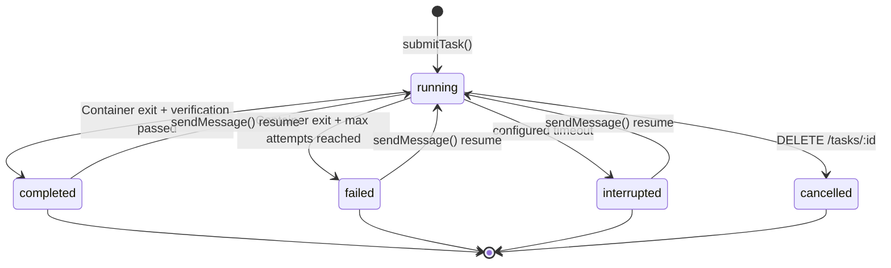

# Orchestrator — Technical Reference

## Overview

The orchestrator is a Fastify-based HTTP service that runs on local machines behind a Cloudflare Tunnel. It receives HMAC-signed task dispatch requests from code-agent, creates isolated git worktrees, spawns Docker containers running the shared code-worker runtime (Claude or Codex), streams logs back in real time, and delivers completion results via signed webhooks and a redundant StatusUpdateClient. It manages GitHub App installation tokens plus shared worker auth for Claude and Codex, persists state atomically to disk, and recovers interrupted tasks (including container adoption and pending resume recovery) on restart. After each worker attempt, a deterministic completion verifier parses the agent final block against the agent-specific contract; failed verifications automatically trigger follow-up attempts up to a configurable limit. For execution tasks, an Agent Compliance Validator performs post-completion transcript analysis via the configured validation model chain - verifying claims, checking contract compliance, detecting anomalies, and posting a structured report on the PR. The Remediation Agent autonomously addresses review findings on existing PR branches. Execution memory from past tasks is injected into prompts with a simplified verification pipeline. The Ask Agent provides interactive code-aware Q&A sessions. Inactivity detection kills unresponsive sessions after ten minutes of silence and auto-restarts them up to three times. Terminal finalization persists status, releases capacity, commits status to code-agent, and sends the completion webhook before timeout-bound worker cleanup, so Docker teardown hangs do not leave completed tasks stuck in `running`.

## Agent-Based Routing and Contracts

### Agent selection precedence

1. `agentType` field from code-agent (explicit routing, takes priority)
2. PR / issue comment / review event (label `pr-comment`) -> `pull_request`
3. `agentType === 'review'` -> `review`
4. `agentType === 'remediation'` -> `remediation`
5. `agentType === 'ask_agent'` -> `ask_agent`
6. Linear issue without `code-task` label -> `planning`
7. Linear issue with `code-task` label -> `execution`

### Prompt markers and final blocks

- Preserved marker: `[WORKER-MODE]`
- Exactly one injected marker: `[AGENT:PLANNING]` / `[AGENT:EXECUTION]` / `[AGENT:PULL_REQUEST]` / `[AGENT:REVIEW]` / `[AGENT:REMEDIATION]` / `[AGENT:ASK_AGENT]` / `[AGENT:SENTRY]`
- Final block names: `PLANNING_AGENT_FINAL`, `EXECUTION_AGENT_FINAL`, `PULL_REQUEST_AGENT_FINAL`, `REVIEW_AGENT_FINAL`, `REMEDIATION_AGENT_FINAL`, `SENTRY_AGENT_FINAL`; ask-agent conversations intentionally do not require an `ASK_AGENT_FINAL` block
- All prompts follow the versioned `PromptBuilder` pattern (semver versioned, CI-enforced bump-on-change)

### Agent types

| Agent Type     | Description                                                  | Verification Contract                        |
| -------------- | ------------------------------------------------------------ | -------------------------------------------- |
| `planning`     | Analyze issues, update one issue, produce one planning artifact               | Outcome label, Linear URL, plan doc presence |
| `execution`    | Implement code, run CI, create PRs                           | PR URL, skill usage, outcome label           |
| `pull_request` | Respond to PR comments/reviews, push to existing branch      | PR URL, comment reply status                 |
| `review`       | Read-only PR review with structured inline comments          | PR URL, review types, comments posted        |
| `remediation`  | Address review findings, push fixes, decide on re-review     | PR URL, re-review decision                   |
| `sentry` | Investigate an actionable SentryBox issue and remediate it | Sentry issue, outcome, verification evidence |
| `ask_agent`    | Interactive Q&A — no PR, no Linear, direct message delivery  | Lighter contract, no PR URL required         |

### Review Agent types

The Review Agent supports six review types, controlled by the `reviewTypes` field:

| Type           | Scope                                                                                                       |
| -------------- | ----------------------------------------------------------------------------------------------------------- |
| `code_quality` | Code style, readability, maintainability, naming, DRY, dead code, test coverage gaps                        |
| `security`     | Injection vulnerabilities, auth issues, secrets exposure, OWASP top 10                                      |
| `architecture` | Separation of concerns, dependency direction, API design, scalability, coupling/cohesion                    |
| `plan_review`  | Plan document validation — task decomposition, TDD discipline, file path accuracy, codebase cross-reference |
| `test_quality` | Comprehensive test quality review — coverage gaps, assertion quality, edge cases, naming, anti-patterns     |
| `documentation` | Documentation accuracy and usability review — implementation alignment, paths, commands, APIs, config, links |

### Planning Agent webhook semantics

- `planned` -> webhook `status=completed`
- `unclear` -> webhook `status=failed`, `error.code=PLANNING_AGENT_UNCLEAR`

Flattened Planning Agent `result` fields:

- `planning_outcome_label`
- `planning_superpowers_writing_plans_used`
- `planning_linear_url`
- `planning_has_plan_doc`
- `planning_pr_url`
- `planning_unclear_clarification`

### Execution Agent webhook semantics

- `implemented` -> webhook `status=completed`
- `already_completed` -> webhook `status=completed` with `execution_outcome_label: 'already_completed'`
- `failed` -> webhook `status=failed` with `execution_outcome_label: 'failed'` and a task error

Flattened Execution Agent `result` fields:

- `execution_outcome_label` (`'implemented'`, `'already_completed'`, or `'failed'`)
- `execution_superpowers_subagent_driven_dev_used`
- `execution_superpowers_requesting_code_review_used`
- `execution_memory_ids_used`
- `execution_memory_ids_rejected`
- `execution_memory_usage_summary`
- `execution_linear_issue_url`

### Review Agent webhook semantics

- Completed review -> webhook `status=completed`

Flattened Review Agent `result` fields:

- `review_comments_posted`
- `review_types`
- `requirements_tracker_updated`
- `gh_actions_status`
- `needs_remediation`
- `review_body`
- `review_inline_comments`
- `requires_re_review`

### Ownership split

- Orchestrator: routing, prompts, completion verification, compliance validation, execution memory injection, flattened metadata
- `code-agent`: deterministic Linear issue mutations after webhook receipt

## Architecture

```mermaid
graph TB
    subgraph "Cloud (GCP)"
        CA[code-agent<br/>Cloud Run]
        SM[Host-rendered package<br/>GitHub PEM, configuration]
        GH[GitHub API<br/>Installation tokens]
    end

    subgraph "Local Machine"
        CF[Cloudflare Tunnel<br/>cc-mac.intexuraos.cloud]
        CF --> ORCH

        subgraph "Orchestrator Process (Node.js)"
            ORCH[Fastify HTTP Server<br/>:8199]
            ORCH --> TD[TaskDispatcher<br/>capacity mutex]
            ORCH --> ROUTES[Routes<br/>HMAC verification]

            TD --> WM[WorktreeManager<br/>git worktree create/remove]
            TD --> DP[DockerProvider<br/>dockerode SDK]
            TD --> LF[LogForwarder<br/>3s chunked upload]
            TD --> WC[WebhookClient<br/>HMAC-signed callbacks]
            TD --> SUC[StatusUpdateClient<br/>direct PATCH status]
            TD --> SP[StatePersistence<br/>atomic JSON file]
            TD --> SYS[SystemPrompt<br/>6 agent types<br/>PromptBuilder versioned]
            TD --> TMC[TurnMetricsCollector<br/>cgroup + session JSONL]
            TD --> CV[CompletionVerifier<br/>deterministic parser]
            TD --> ACV[AgentComplianceValidator<br/>OpenRouter LLM]

            GTS[GitHubTokenService<br/>JWT + installation token]
            TR[TokenRefresher<br/>per-container tokens]
            HB[HeartbeatManager<br/>10min interval]
            AAS[OrchestratorFileAuditSink<br/>LLM audit JSONL]
            CM[CredentialMonitor<br/>OAuth watcher]
            CR[CredentialRefresher<br/>Docker-based refresh]
            AKV[ApiKeyValidator<br/>key health check]
            WAR[WorkerAuthRegistry<br/>Claude + Codex auth]
        end

        subgraph "Docker Containers"
            W1[code-worker-taskA<br/>Claude Code or Codex]
            W2[code-worker-taskB<br/>Claude Code or Codex]
        end

        DP --> W1
        DP --> W2
        TR --> W1
        TR --> W2

        subgraph "Filesystem"
            REPO[~/.code-orchestrator/repo<br/>main git clone]
            WT[~/code-workers/worktrees/<br/>per-task worktrees]
            STATE[~/.code-orchestrator/state.json]
            SECRETS[~/.code-orchestrator/secrets/<br/>per-task credentials]
            LOGS[~/.code-orchestrator/logs/]
            CREDS[~/.code-orchestrator/claude-creds/<br/>shared OAuth credentials]
            CODEX_AUTH[~/.code-orchestrator/codex-auth/<br/>shared Codex auth]
        end

        WM --> REPO
        WM --> WT
        SP --> STATE
        DP --> SECRETS
        LF --> LOGS
        CM --> CREDS
        CR --> CREDS
    end

    CA -->|POST /tasks HMAC| CF
    GTS --> GH
    TR --> GH
    LF -->|POST /internal/logs| CA
    WC -->|POST webhook| CA
    SUC -->|PATCH /internal/code-tasks/:id/status| CA
    HB -->|POST /internal/code/heartbeat| CA
    TMC -->|POST /internal/turn-metrics| CA
    ACV -->|gh pr comment| GH
    ORCH --> SM
```



## Changes Since v3.8.0

- **Guarded restart:** admission freezing and the versioned health contract expose active admissions, worker containers, terminal callbacks, and log-forwarder drain/activity evidence. Inspect the [health and admission-freeze contract](#hmac-authentication) before restarting the retained worker.
- **Planning contract:** a SIMPLE task updates the original issue plus one evidence PR; PLAN-DOC creates one document and one planning PR. Child-issue and subtask outputs are removed.
- **SentryBox integration:** the dedicated Sentry prompt uses the private `error_hub` MCP connection; expected retry and cleanup warnings remain in logs without redundant reports.
- **Configuration:** the host renders one pinned DEV secret package together with versioned public settings. Startup reads `INTEXURAOS_GITHUB_APP_PRIVATE_KEY_PATH`, validates PEM shape and mode `0600`, and has no Secret Manager or gcloud fallback for that key. Worker task environments receive a filtered projection.
- **Recovery:** persisted state is written privately and atomically; callback retry serialization and activity tracking retain delivery evidence during guarded shutdown.

## Recent Changes

### Current Release Documentation

Completed tasks now finalize consistently when Docker is unresponsive during worker cleanup. `finalizeTask()` persists the terminal state, emits metrics, releases the capacity slot, commits status through `StatusUpdateClient`, and sends the completion webhook before cleanup. Worker cleanup is wrapped in a 30-second timeout; failures are logged with Sentry suppression and appended to task logs instead of blocking finalization. Container startup also destroys late-created zombie containers after create timeouts on a best-effort path.

Handled reliability-path noise is reduced in Sentry. Expected HTTP 4xx route logs, webhook delivery retry failures, verifier hard errors, task timer failures, and worker cleanup failures are tagged with `_skipSentry`, while still being logged for operators.

### v3.6.0 Release

Key changes since v3.5.0: execution memory pipeline simplification, robust memory-acknowledgment recovery, an 8MB log cap, a five-hour default task timeout, redundant status delivery, validation model chain support, the `test_quality` review scope, inactivity restart tracking, and `retriedFrom` on the task schema.

### Execution Memory Pipeline Simplification (INT-1403)

The memory_acknowledgment verification was downgraded from a hard failure to a soft warning. When the memory usage triplet (memory_ids_used, memory_ids_rejected, memory_usage_summary) is internally consistent — every injected memory ID appears in either the used or rejected list — but individual acknowledgment lines are missing, the verifier now emits a soft warning instead of triggering an auto-continue loop. This prevents memory reporting issues from stalling tasks that otherwise completed their work successfully. Inconsistent triplets (unaccounted memory IDs) remain hard failures.

### Memory Acknowledgment Verifier Recovery (INT-1411, INT-1415)

Fixed a regression where the memory_acknowledgment verifier was stalling code-review tasks. The auto-continue prompt was updated to actually fix memory_acknowledgment failures by including explicit guidance with the injected memory IDs and the expected acknowledgment block template. Recovery was made robust with three separate PRs addressing the stall, the prompt fix, and edge cases around memory acknowledgment pattern matching (accepting `[index] memoryId` format).

### Log Cap and Task Timeout Increase

The log forwarding cap was raised from 4MB to 8MB per task to prevent log truncation on verbose builds. The default task timeout was extended from 3 hours to 5 hours, and individual tasks can override it with `timeoutHours` from 1 to 12. Warnings fire five minutes before the configured kill time.

### StatusUpdateClient (INT-1413)

A new `StatusUpdateClient` commits terminal task status directly to code-agent via `PATCH /internal/code-tasks/status` as a secondary delivery path alongside webhook-based completion. The body carries `taskId`. The client uses the same HMAC signing scheme as the heartbeat manager, retries with exponential backoff (1s, 3s, 9s), and surfaces 4xx errors immediately without retry.

### Docker RFC3339 Timestamp Stripping (INT-1411)

Fixed the `stripDockerHeaders()` function in the log formatter to properly strip RFC3339 timestamps that Docker prepends to log output. Previously, timestamps in the format `2026-04-15T10:30:00.123456789Z` were not being removed, causing noisy log output.

### Validation Model Chain for Resume Summaries and Compliance (INT-1371)

Resume-summary extraction and Agent Compliance Validation use the configured OpenRouter validation model chain. `INTEXURAOS_ORCHESTRATOR_VALIDATION_MODELS` accepts a comma-separated list of `or:` model IDs; direct provider model IDs are rejected. Completion verification itself remains deterministic and does not call LLMs.

### Validation Client Usage Mapping (INT-1369)

Validation model clients use `HttpWebhookUsageSink` for LLM usage reporting, sending usage data to code-agent via the usage webhook URL for cost tracking and analytics.

### Review Scope Addition: test_quality

Added `test_quality` as a review scope for the Review Agent. This scope provides comprehensive test quality analysis covering coverage gaps, assertion quality, edge case handling, test naming conventions, and anti-patterns. Configurable via the `reviewTypes` field on task submission.

### Documentation Review Scope (PR #2130)

Added `documentation` as a Review Agent scope. It compares documentation changes against the implementation, current repository paths, commands, APIs, configuration, screenshots/examples, and project terminology, and flags obsolete instructions, broken links, misleading claims, undocumented behavior changes, internal contradictions, and docs that would cause a reader to do the wrong thing.

### Inactivity Restart Tracking

Added `inactivityRestartCount` to the Task model, tracking lifetime inactivity restarts per task. The inactivity detector kills sessions after 10 minutes of no output and restarts them up to 3 times (via `MAX_INACTIVITY_RESTARTS`) before failing the task. The count is persisted to state and reported for observability.

### Other Notable Changes

- `retriedFrom` field declared in `CreateTaskRequestSchema` for retry chain tracking
- Operational steps excluded from `needs_remediation` verification
- LLM pricing removed from orchestrator validation model clients (migrated to HTTP usage sink)
- LLM usage sinks migrated to HTTP webhook pattern (INT-1342)
- Prompt type made required in `LlmGenerateClient` calls (INT-1392)
- Worker container preservation on `TASK_EXIT_CODE_OVERRIDE`

## API Endpoints

| Method | Path                   | Auth        | Request Body                        | Response                                                       |
| ------ | ---------------------- | ----------- | ----------------------------------- | -------------------------------------------------------------- |
| POST   | `/tasks`               | HMAC signed | `CreateTaskRequest` (Zod-validated) | `202 { taskId, status: "accepted" }`                           |
| GET    | `/tasks/:id`           | None        | -                                   | `200 Task` or `404`                                            |
| DELETE | `/tasks/:id`           | None        | -                                   | `200 { taskId, status: "cancelled" }` or `404`/`409`           |
| POST   | `/tasks/:id/message`   | HMAC signed | `{ message: string }`               | `200 SendMessageResult` or `404`/`409`/`410`                   |
| GET    | `/health`              | None        | -                                   | `200 { healthContractVersion: 2, admissionFrozen, pendingAdmissions, admissionActivityTotal, status, capacity, running, available, workerContainers, pendingTerminalCallbacks, terminalCallbackActivityTotal, workerAuths, providerApiKeys, dockerHealthy, diskHealthy, logForwarderDrain }` |
| GET    | `/meta/worker-image`   | None        | -                                   | `200` image diagnostics or `{ error }` if unavailable          |
| POST   | `/admin/shutdown`      | HMAC signed | -                                   | `200 { status: "shutting_down" }`                              |
| POST   | `/admin/refresh-token` | HMAC signed | -                                   | `200 { status: "refreshed", tokenExpiresAt }`                  |

### HMAC Authentication

Dispatch requests require three headers:

| Header                 | Content                                     |
| ---------------------- | ------------------------------------------- |
| `X-Dispatch-Timestamp` | Unix timestamp (ms)                         |
| `X-Dispatch-Nonce`     | Unique nonce per request                    |
| `X-Dispatch-Signature` | HMAC-SHA256 of `{timestamp}.{nonce}.{body}` |

Verification rejects requests with timestamps older than 5 minutes and replayed nonces (10-minute TTL cache).

The root-owned persistent marker `/var/lib/intexuraos-orchestrator-admission.freeze` freezes every
task-mutating route (`POST /tasks`, `DELETE /tasks/:id`, and `POST /tasks/:id/message`) with `503`.
Reads and health remain available. `pendingAdmissions` counts a mutation from before its marker
check through response, error, or abort; `admissionActivityTotal` increments for every mutation
that reaches the boundary, including one rejected while frozen, and must remain unchanged across a
complete drain witness sequence. This lets a restart controller close admission, detect a
still-active external producer, and wait until every request that crossed the boundary is finished.
Marker inspection fails closed: only a provably absent marker under the trusted root-owned `/var/lib`
parent reports `admissionFrozen: false`.

`logForwarderDrain` is a privacy-safe process aggregate. It reports buffer, partial-line, queue,
batch, chunk, active-flush, open-upload-request, and detached-retry gauges plus process-lifetime
dropped-chunk/activity counters. Top-level drain ownership also reports every Docker worker
container, persisted or in-flight terminal callbacks, and a monotonic terminal-callback activity
counter. It contains no task ID, callback URL, log content, or secret. A drain verifier must treat
`null` ownership as UNKNOWN and require unchanged process identity, `counterEpochId`, and monotonic
counters; zero gauges from a restarted process are not proof of continuity.

### CreateTaskRequest Schema

```typescript
{
  taskId: string;
  workerType: 'opus' | 'auto' | 'sonnet' | 'codex' | 'codex-xhigh' | 'openrouter-free';
  prompt: string;
  repository?: string;
  baseBranch?: string;
  linearIssueId?: string;
  linearIssueTitle?: string;
  linearIssueLabels: string[];
  hasChildren: boolean;
  slug?: string;
  webhookUrl: string;
  webhookSecret: string;
  actionId?: string;
  retriedFrom?: string;
  agentType?: 'planning' | 'execution' | 'pull_request' | 'review' | 'remediation' | 'ask_agent';
  executionMemoryContext?: ExecutionMemoryPromptContext;
  trackingCommentId?: string;
  prNumber?: number;
  continuationPrNumber?: number;
  continuationPrBranch?: string;
  reviewTypes?: ('code_quality' | 'security' | 'architecture' | 'plan_review' | 'test_quality' | 'documentation')[];
  timeoutHours?: number; // integer 1..12; default 5h
}
```

### SendMessage Schema

`POST /tasks/:id/message` — sends a follow-up message to a task.

```typescript
{
  message: string; // min 1, max 20000 characters
}
```

**Behavior:**

- If the task is `running`: the message is queued and delivered when the current attempt finishes
- If the task is `completed`, `failed`, or `interrupted`: a new worker session is started with the message as the prompt (using `continueSession: true`)
- If `agentType` is `review` or `remediation`: returns `409` (messages not supported)
- If `agentType` is `ask_agent`: message delivered directly without PR resume preamble
- If the session has expired: returns `410` (session expired)
- Returns `409` if the task status does not allow messages (e.g., `cancelled`)

## Domain Model

### Task Lifecycle



### Task

```typescript
interface Task {
  taskId: string;
  workerType: 'opus' | 'auto' | 'sonnet' | 'codex' | 'codex-xhigh' | 'openrouter-free';
  runtime?: 'claude' | 'codex';
  runtimeSessionId?: string;
  prompt: string;
  repository: string;
  baseBranch: string;
  linearIssueId?: string;
  linearIssueTitle?: string;
  linearIssueLabels: string[];
  hasChildren?: boolean;
  slug?: string;
  webhookUrl: string;
  webhookSecret: string;
  actionId?: string;
  retriedFrom?: string;
  agentType?: 'planning' | 'execution' | 'pull_request' | 'review' | 'remediation' | 'ask_agent';
  executionMemoryContext?: ExecutionMemoryPromptContext;
  trackingCommentId?: string;
  prNumber?: number;
  continuationPrNumber?: number;
  continuationPrBranch?: string;
  reviewTypes?: ('code_quality' | 'security' | 'architecture' | 'plan_review' | 'test_quality' | 'documentation')[];
  status: 'queued' | 'running' | 'completed' | 'failed' | 'interrupted' | 'cancelled';
  worktreePath: string;
  containerId: string;
  startedAt: string;
  completedAt?: string;
  attemptCount?: number;
  maxAttempts?: number;
  lastExitCode?: number;
  verificationHistory?: TaskVerificationRecord[];
  taskInfraFailureHistory?: TaskInfraFailureRecord[];
  resumedAfterSuccess?: boolean;
  lastSuccessResult?: TaskResult;
  pendingResumeStart?: PendingResumeStart;
  inactivityRestartCount?: number;
  timeoutMs?: number;
}
```

```typescript
interface TaskVerificationRecord {
  attempt: number;
  passed: boolean;
  missingFields: string[];
  telemetryMissingFields?: string[];
  telemetryAccepted?: boolean;
  verifierFailure: boolean;
  createdAt: string;
}

interface TaskInfraFailureRecord {
  attempt: number;
  subReason:
    | 'container_exit_before_session_init'
    | 'entrypoint_failed'
    | 'git_worktree_lost'
    | 'image_pull_failed'
    | 'duration_below_threshold'
    | 'empty_transcript';
  createdAt: string;
}
```

### TaskResult

```typescript
interface TaskResult {
  prUrl?: string;
  branch?: string;
  commits?: number;
  commitDetails?: { sha: string; message: string }[];
  summary?: string;
  ciFailed?: boolean;
  comment_replied?: boolean;
  planning_outcome_label?: 'planned' | 'unclear';
  planning_superpowers_writing_plans_used?: '0' | '1';
  planning_linear_url?: string;
  planning_is_complex?: '0' | '1';
  planning_has_plan_doc?: '0' | '1';
  planning_subtask_urls?: string;
  planning_pr_url?: string;
  planning_unclear_clarification?: string;
  execution_outcome_label?: 'implemented' | 'already_completed' | 'failed';
  execution_superpowers_subagent_driven_dev_used?: '0' | '1';
  execution_superpowers_requesting_code_review_used?: '0' | '1';
  execution_memory_ids_used?: string;
  execution_memory_ids_rejected?: string;
  execution_memory_usage_summary?: string;
  execution_linear_issue_url?: string;
  review_comments_posted?: string;
  review_id?: string;
  review_types?: string;
  requirements_tracker_updated?: string;
  gh_actions_status?: string;
  needs_remediation?: string;
  review_body?: string;
  review_inline_comments?: string;
  requires_re_review?: string;
  rebaseResult?: {
    attempted: boolean;
    success: boolean;
    conflictFiles?: string[];
  };
}
```

## Service Components

### TaskDispatcher

The central coordinator. Manages the full task lifecycle:

1. Docker health check via `isHealthy()` — rejects with `503 docker_unavailable` if unhealthy
2. Worker auth availability check — rejects with `503 auth_unavailable` if selected runtime auth is not ready
3. Atomic capacity check via `async-mutex`
4. Worktree creation via `WorktreeManager` (with optional `continuationPrBranch` checkout)
5. API key validation via `ApiKeyValidator` (checks OAuth monitor or API endpoint)
6. System prompt construction via `buildSystemPrompt()` (versioned PromptBuilder, execution memory injection)
7. Image pull via `DockerProvider.pullImage()` with 15-minute timeout (separated from container creation)
8. Container creation via `DockerProvider` (`startWorkerAttempt`) with 2-minute timeout
9. Token registration via `TokenRefresher`
10. Log forwarding registration via `LogForwarder`
11. Completion monitoring (30s polling interval) with activity heartbeat logging
12. Inactivity detection (10-minute silence threshold) — kills and restarts up to 3 times
13. Timeout warning five minutes before the configured timeout, hard kill at `timeoutHours` or the 5-hour default
14. On container exit: result extraction via `gh pr list` + `gh pr checks`, then completion verification via `CompletionVerifier`
15. Fatal exit codes (137/139) — detected from tail of raw logs — skip completion verification and trigger immediate retry
16. If verification fails and `attempt < maxAttempts`: resume the session with a targeted follow-up prompt (auto-continue loop)
17. Memory acknowledgment uses soft-warning approach: consistent triplet with missing individual acks produces a warning, not a hard failure
18. If verification passes: Agent Compliance Validation for execution tasks (transcript analysis, PR comment), then turn metrics collection via `TurnMetricsCollector`, then terminal status commit via `StatusUpdateClient`, then webhook delivery
19. Queued messages (from `POST /tasks/:id/message` during execution) are delivered as the next session when verification passes
20. `sendMessage()` for mid-task message injection and task resume after completion — ask_agent skips PR resume preamble
21. `adoptTask()` for startup recovery re-attachment to running containers
22. `recoverPendingResumeTask()` for recovering accepted resumes that were interrupted by a restart
23. Pending messages flushed before teardown in ask-agent completion path
24. Final worker cleanup runs after terminal status delivery and is bounded by `WORKER_DESTROY_TIMEOUT_MS` (30 seconds)

### CompletionVerifier

Deterministic task completion validation:

- No network calls and no LLM calls
- Locates the agent final block and parses key/value lines
- Agent-specific contracts: planning, execution, pull_request, review, remediation; ask_agent has no final-block contract and is accepted without one
- Validates mandatory fields per agent type (PR URL, outcome labels, skill usage proofs)
- Fatal exit codes (137/139) skip all model calls and trigger immediate retry
- Evidence PR required for `implemented` and `already_completed`; `failed` may leave the PR field empty and must include `failure_reason`
- Memory acknowledgment soft-warning: consistent triplet but missing individual acks produces a warning, not a blocking failure
- Returns either `kind: 'parsed'` with `data`, `missingRequired`, `telemetryMissing`, and `warnings`, or `kind: 'hard-error'` with `TASK_RUNTIME_HARD_ERROR`

### AgentComplianceValidator (replaces ExecutionDeepValidator)

Performs post-completion transcript analysis for execution tasks:

- Reads session transcripts via `readSessionTranscript()` from JSONL files
- Formats transcripts into numbered `MSG-NNN` format via `formatTranscript()`
- Builds compliance prompts comparing agent claims (from `ExecutionAgentData`) against transcript evidence
- Sends the prompt to an independent LLM through the configured OpenRouter validation model chain (default: `or:google/gemma-4-31b-it,or:deepseek/deepseek-v4-flash`)
- Validates the response against `AgentComplianceReportSchema` (Zod) with auto-repair on parse failure
- Report covers: claim verification (CI called? PR created? commit count? summary accurate?), contract compliance (skills invoked? correct order? code reviewer dispatched?), anomaly detection (fabrication, hallucination, protocol violation), execution metrics
- Posts formatted PR comments via `gh pr comment` with severity indicators (Critical, Warning, Minor, Pass)
- Uses `OrchestratorFileAuditSink` for LLM audit logging
- Transcript size limit: 720,000 characters

### StatusUpdateClient

Commits terminal task status directly to code-agent as a redundant delivery path:

- `PATCH /internal/code-tasks/:id/status` with HMAC signing (same scheme as heartbeat manager)
- Headers: `X-Request-Timestamp`, `X-Request-Signature`, `X-Internal-Auth`
- Retries with exponential backoff: 1s, 3s, 9s (3 retries total)
- 4xx responses are non-retryable — surfaced immediately
- 15-second request timeout per attempt
- Payload includes `taskId`, `status`, `completedAt`, optional `error` and `result`

### DockerProvider

Manages Docker container lifecycle via `dockerode`:

- **Image:** configurable via `INTEXURAOS_CODE_WORKER_IMAGE` (default: GCR Artifact Registry latest)
- **Image pull:** Always pulls before each task (fail-fast, no cached-image fallback); 15-minute timeout separated from container creation
- **Network:** `code-worker-net`
- **Security:** `CapDrop: ALL`, `CapAdd: NET_RAW`, `SecurityOpt: no-new-privileges`
- **Mounts:** Worktree at `/repo` (rw), secrets at `/secrets` (ro), main `.git` dir for worktree support (rw), shared OAuth credentials at `/home/claude/.claude` (rw), shared Codex auth at `/home/claude/.codex` (rw)
- **Tmpfs:** `/tmp` (2GB, noexec) and `/home/claude` (500MB, noexec, uid=1001)
- **Execution mode:** non-interactive worker containers use `Tty: false` with no stdin attachment; output is captured from the Docker stream
- **Container creation timeout:** 2 minutes
- **Zombie cleanup:** If container creation times out but later succeeds, the late container is destroyed with a 30-second best-effort cleanup timeout
- **Final cleanup timeout:** Worker teardown after terminal status delivery is bounded by 30 seconds and does not block task finalization
- **Health gate:** `isHealthy()` checks Docker daemon connectivity and disk availability
- **Managed attempts:** When enabled, the DockerProvider handles multi-attempt container lifecycle
- **Forensics mode:** When enabled (`INTEXURAOS_CODE_WORKER_FORENSICS=1`), captures core dumps and crash snapshots
- **Container discovery:** `listWorkerContainers()` discovers running `code-worker-*` containers for startup recovery
- **Periodic stale cleanup:** Removes orphaned containers not tracked in state.json after a configurable idle threshold
- **Codex state preservation:** Codex runtime state preserved across cleanup cycles

### RuntimeAdapter

Abstracts runtime-specific log processing:

- `claude` runtime: Claude log processor strips Docker headers, detects session IDs, and surfaces `FATAL:` error markers
- `codex` runtime: Codex log processor handles different streaming output format, detects completion signals, and produces human-readable output
- Both runtimes emit `RuntimeEvent` types: `log`, `runtime_session_started`, `attempt_completed`, `attempt_failed`

### WorktreeManager

Creates isolated git worktrees per task:

- `git worktree add -b "{taskId}" "{path}" "origin/{baseBranch}"` — base branch is fetched from origin first
- Supports `continuationPrBranch` checkout for retried tasks inheriting an existing PR branch
- Copies `.claude/settings.local.json` from `docker/code-worker/config-defaults/`
- All git operations serialized via `async-mutex` to prevent index corruption
- Removes worktrees with `git worktree remove --force`
- `worktreeExists()` for resume availability checks

### LogForwarder

Streams container output to code-agent in near-real-time:

- Receives log chunks via `appendChunk()` callback from Docker attach stream
- Buffers content and flushes every 3 seconds or when buffer exceeds 64KB
- Strips Docker multiplexed stream headers and ANSI escape codes via `stripDockerHeaders()`
- Strips Docker RFC3339 timestamps from log lines
- Strips heavyweight `tool_use_result` metadata from JSONL lines via `stripBulkMetadata()`
- Prefixes each log line with a local timestamp (`HH:MM:ss.mmm`)
- Sends up to 5 chunks per batch to `POST /internal/logs`
- Signs payloads with HMAC-SHA256 using the task's webhook secret
- Limits: 8MB total per task
- Retries failed uploads 3 times with exponential backoff (1s, 2s, 4s)
- `flushAndStop()` drains all remaining logs on container exit

### WebhookClient

Delivers signed completion notifications to code-agent:

- Signs payloads with HMAC-SHA256 (`{timestamp}.{json_body}`)
- Includes `X-Internal-Auth` header for service-to-service auth
- Retries 3 times with delays of 5s, 15s, 45s
- Does not retry 4xx errors (client errors)
- Retry warnings are tagged with `_skipSentry` so expected callback failures do not create handled Sentry noise
- Queues failed deliveries in `pendingWebhooks` with 24-hour TTL
- Background retry job runs every 5 minutes

### StatePersistence

Atomic file-based state management:

- Write-to-temp with mode `0600`, close, then atomic rename
- `modify()` uses `async-mutex` for safe read-modify-write
- Corruption detection: backs up corrupted files with timestamp suffix
- Orphan worktree detection: compares `git worktree list` against active tasks

### GitHubTokenService

Manages GitHub App authentication (service-level):

- Generates RS256-signed JWT (10-minute expiry) from app private key
- Exchanges JWT for installation access token via GitHub API (with automatic retry via `octokit-plugin-retry`)
- Writes token atomically to `~/.code-orchestrator/github-token`
- Background refresh every 5 minutes
- Auth degraded callback after 3 consecutive failures

### TokenRefresher

Manages per-container GitHub tokens:

- Mints fresh installation tokens via JWT (using `jose` library) every 30 minutes
- Writes tokens to per-task secrets directories (`~/.code-orchestrator/secrets/{taskId}/github-token`)
- Starts/stops refresh loop based on active task count

### WorkerAuthRegistry

Coordinates shared worker auth state across runtimes:

- Manages provider-specific auth for `claude` and `codex` via pluggable managers
- Exposes `/health` data via `workerAuths`
- Blocks new task submission with `503 auth_unavailable` when the selected runtime is not ready
- Triggers background refresh when credentials are expiring soon and no tasks are running
- 5-minute buffer before expiry triggers proactive refresh

### ClaudeAuthManager / CredentialRefresher

Manages Claude shared auth:

- Reads `~/.code-orchestrator/claude-creds/.credentials.json` on startup and periodically (60s)
- Exposes the current access token for Claude-backed workers
- Refreshes OAuth tokens via a lightweight `code-worker` container

### CodexAuthManager / CodexAuthRefresher

Manages Codex shared auth:

- Reads `~/.code-orchestrator/codex-auth/auth.json`
- Supports ChatGPT device-auth mode only
- Tracks runtime auth health independently from Claude
- Refreshes ChatGPT-backed auth via a lightweight `code-worker` container

### SensitiveFileGuard

Scans commits for sensitive files before results leave the machine:

- Matches 20+ patterns (`.env`, `*.pem`, `*.key`, `terraform.tfstate`, `credentials.json`, etc.)
- Reverts sensitive files from commits and reports what was removed
- Runs against the commit diff to catch only newly-added sensitive content

### Git Identity Reconciliation

At startup, `reconcileRepoGitIdentity()` aligns the repository-local git identity with the identity passed to worker containers:

- Resolves `INTEXURAOS_GIT_USER_NAME` / `INTEXURAOS_GIT_USER_EMAIL`, falling back to host git config
- Writes the resolved identity into repo-local `user.name` and `user.email` when possible, because local git config wins inside worktrees
- Logs the previous repo identity, whether each value was applied, and the effective identity used for commits
- Warns without Sentry noise when a repo-local identity exists but no resolved worker identity is available to reconcile it

### TurnMetricsCollector

Collects per-task resource and token metrics after completion:

- Reads cgroup v2 CPU and memory stats from the container filesystem
- Parses Claude session JSONL for API call counts, token usage, and time classification
- Publishes metrics to code-agent via `POST /internal/turn-metrics`
- Non-fatal: zero values on macOS (no cgroup exposure)

## Configuration

| Variable                                    | Required | Default                            |
| ------------------------------------------- | -------- | ---------------------------------- |
| `INTEXURAOS_REPOSITORY_URL`                 | Yes      | -                                  |
| `INTEXURAOS_CODE_AGENT_URL`                 | Yes      | -                                  |
| `INTEXURAOS_ORCHESTRATOR_SECRET`            | Yes      | -                                  |
| `INTEXURAOS_PROJECT_ID`                     | Yes      | -                                  |
| `INTEXURAOS_GITHUB_APP_ID`                  | Yes      | -                                  |
| `INTEXURAOS_GITHUB_INSTALLATION_ID`         | Yes      | -                                  |
| `INTEXURAOS_INTERNAL_AUTH_TOKEN`            | Yes      | -                                  |
| `INTEXURAOS_LINEAR_API_KEY`                 | Yes      | -                                  |
| `INTEXURAOS_ERROR_HUB_HOST`                 | Yes      | -                                  |
| `INTEXURAOS_USAGE_WEBHOOK_URL`              | Yes      | -                                  |
| `GOOGLE_APPLICATION_CREDENTIALS`            | Yes      | -                                  |
| `INTEXURAOS_ORCHESTRATOR_VALIDATION_MODELS` | No       | `or:google/gemma-4-31b-it,or:deepseek/deepseek-v4-flash` |
| `INTEXURAOS_OPENROUTER_APP_API_KEY`         | Yes      | -                                  |
| `INTEXURAOS_REPOSITORY_PATH`                | No       | `~/.code-orchestrator/repo`        |
| `INTEXURAOS_WORKER_CAPACITY`                | No       | `2`                                |
| `INTEXURAOS_COMPLETION_MAX_ATTEMPTS`        | No       | `3`                                |
| `INTEXURAOS_PRESERVE_WORKER_CONTAINERS`     | No       | `1`                                |
| `INTEXURAOS_CODE_WORKER_IMAGE`              | No       | (GCR Artifact Registry)            |
| `INTEXURAOS_CODE_WORKER_FORENSICS`          | No       | `0`                                |
| `INTEXURAOS_CODE_WORKER_FORENSICS_PATH`     | No       | `~/.code-orchestrator/forensics`   |
| `INTEXURAOS_GIT_USER_NAME`                  | No       | (host git config)                  |
| `INTEXURAOS_GIT_USER_EMAIL`                 | No       | (host git config)                  |
| `INTEXURAOS_GITHUB_APP_PRIVATE_KEY_PATH` | Yes | Path to host-rendered mode-0600 PEM |
| `INTEXURAOS_ENVIRONMENT`                    | No       | `NODE_ENV` or `development`        |
| `INTEXURAOS_SENTRY_DSN`                     | No       | (empty)                            |
| `INTEXURAOS_RELEASE`                        | No       | (empty; fallback after `K_REVISION`) |
| `K_REVISION`                                | No       | (empty; preferred release source)  |
| `KEEP_CONTAINERS_ALIVE`                     | No       | `0`                                |
| `PORT`                                      | No       | `8199`                             |
| `LOG_LEVEL`                                 | No       | `info`                             |

## Gotchas

- **Image pull on every task:** The DockerProvider always pulls the worker image before each task. There is no cached-image fallback. If the registry is unreachable, the task fails.
- **Git mutex scope:** The worktree mutex serializes all git operations across all tasks. Two concurrent worktree creations are sequential, not parallel.
- **Nonce cache is in-memory:** If the orchestrator restarts, all nonces are lost. Replayed requests during the 5-minute timestamp window after a restart will be accepted.
- **State file is a single JSON blob:** All tasks are stored in one file. Very high task volumes could cause write contention.
- **Container preservation is selective:** Only execution and planning containers are preserved on completion. Review, pull request, and remediation containers are destroyed immediately. One preserved container per PR is enforced.
- **macOS metrics are zero:** `TurnMetricsCollector` relies on cgroup v2. macOS Docker does not expose cgroup paths, so CPU and memory metrics are always zero.
- **Validation requires OpenRouter:** Every validation model ID must use the `or:` prefix, and `INTEXURAOS_OPENROUTER_APP_API_KEY` is required. The same key also powers the Agent Compliance Validator.
- **Ask Agent skips resume preamble:** When a completed ask_agent task is resumed via `sendMessage()`, the user's message is sent directly without the standard orchestrator context wrapper.
- **Codex auth is separate:** Codex uses ChatGPT device-auth, managed independently from Claude OAuth. Both must be configured for their respective worker types to function.
- **Fatal exit code detection reads tail only:** The orchestrator scans only the last portion of raw logs for fatal exit codes to prevent false positives from mid-session crash output.
- **Memory acknowledgment is a soft warning:** Missing individual memory acknowledgment lines produce a soft warning (not a hard failure) when the usage triplet is consistent. Only inconsistent triplets (unaccounted memory IDs) trigger hard failures.
- **Completion verification is deterministic:** `CompletionVerifier` does not call models. The validation model chain is used by the resume-summary extractor and Agent Compliance Validator, not by completion gating.
- **StatusUpdateClient is redundant:** The status update is sent in addition to the webhook — both deliver terminal status. If the PATCH fails but the webhook succeeds, the task still completes normally.
- **Final cleanup is post-terminal and bounded:** A Docker destroy hang can produce a cleanup warning, but terminal state is already persisted and delivered before the cleanup timeout is handled.
- **Handled reliability warnings skip Sentry:** Expected 4xx responses, retryable webhook failures, verifier hard errors, and cleanup failures are logged with `_skipSentry` to keep Sentry focused on actionable orchestrator failures.

## File Structure

```
workers/orchestrator/src/
├── github/
│   ├── octokit-client.ts
│   └── token-service.ts
├── services/
│   ├── isolation/
│   │   ├── credential-monitor.ts
│   │   ├── credential-refresher.ts
│   │   ├── docker-provider.ts
│   │   ├── token-refresher.ts
│   │   └── types.ts
│   ├── runtime/
│   │   ├── claude-runtime.ts
│   │   ├── codex-runtime.ts
│   │   ├── processors/
│   │   │   ├── claude-log-processor.ts
│   │   │   └── codex-log-processor.ts
│   │   ├── index.ts
│   │   └── types.ts
│   ├── worker-auth/
│   │   ├── claude-auth-manager.ts
│   │   ├── codex-auth-manager.ts
│   │   ├── codex-auth-refresher.ts
│   │   ├── index.ts
│   │   ├── registry.ts
│   │   └── types.ts
│   ├── activity-timeout-manager.ts
│   ├── agent-compliance-validator.ts
│   ├── api-key-validator.ts
│   ├── compliance-report-schema.ts
│   ├── completion-verifier.ts
│   ├── deep-validator-helpers.ts
│   ├── dispatch-metadata-client.ts
│   ├── log-formatter.ts
│   ├── log-forwarder.ts
│   ├── prompt-builder.ts
│   ├── repo-manager.ts
│   ├── sensitive-file-guard.ts
│   ├── state-persistence.ts
│   ├── status-update-client.ts
│   ├── system-prompt.ts
│   ├── task-dispatcher.ts
│   ├── transcript-formatter.ts
│   ├── transcript-reader.ts
│   ├── turn-metrics-collector.ts
│   ├── validation-model-clients.ts
│   ├── webhook-client.ts
│   └── worktree-manager.ts
├── types/
│   ├── api.ts
│   ├── config.ts
│   ├── execution-memory.ts
│   ├── index.ts
│   ├── schemas.ts
│   ├── state.ts
│   └── task.ts
├── heartbeat.ts
├── index.ts
├── main.ts
├── routes.ts
├── start.ts
├── with-timeout.ts
└── worktree-cleanup.ts
```
