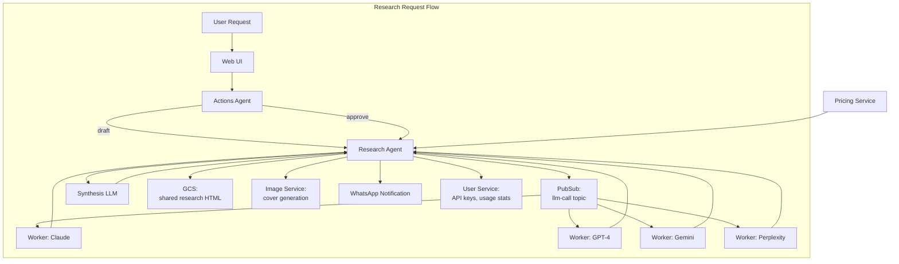
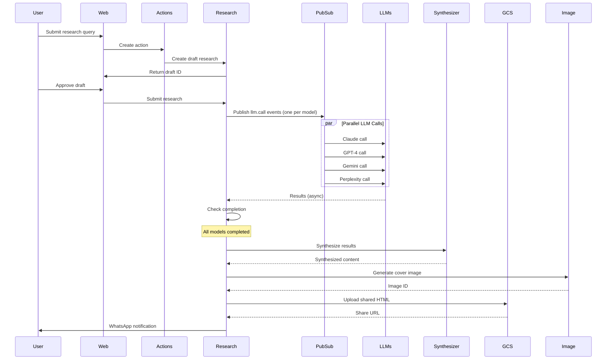

# Research Agent - Technical Reference

## Overview

Research-agent orchestrates AI research across multiple LLM providers (Claude, GPT-4, Gemini, Perplexity). It queries models in parallel via Pub/Sub, tracks costs and attribution, synthesizes results, and manages public sharing with generated cover images.

## Architecture



## Data Flow



## API Endpoints

### Public Endpoints

| Method | Path                         | Description                             | Auth                 |
| ------ | ---------------------------- | --------------------------------------- | -------------------- |
| POST   | `/research`                  | Create new research (starts processing) | Bearer token         |
| GET    | `/research`                  | List researches for user                | Bearer token         |
| GET    | `/research/:id`              | Get research by ID                      | Bearer token         |
| DELETE | `/research/:id`              | Delete research and unshare             | Bearer token         |
| POST   | `/research/:id/approve`      | Approve draft research                  | Bearer token         |
| POST   | `/research/:id/enhance`      | Enhance with more models/context        | Bearer token         |
| POST   | `/research/:id/retry-failed` | Retry failed LLM calls                  | Bearer token         |
| DELETE | `/research/:id/share`        | Remove public sharing                   | Bearer token         |
| GET    | `/research/shared/:slug`     | Get shared research (public)            | None                 |
| GET    | `/pricing`                   | Get LLM pricing per provider/model      | Bearer token         |
| POST   | `/app-settings`              | Update app settings (admin)             | Bearer token (admin) |

### Internal Endpoints

| Method | Path                                    | Description                            | Auth            |
| ------ | --------------------------------------- | -------------------------------------- | --------------- |
| POST   | `/internal/research/draft`              | Create draft research                  | Internal header |
| POST   | `/internal/llm/pubsub/process-research` | Process research from Pub/Sub          | Pub/Sub OIDC    |
| POST   | `/internal/llm/pubsub/process-llm-call` | Process individual LLM call            | Pub/Sub OIDC    |
| POST   | `/internal/llm/pubsub/report-analytics` | Report LLM analytics                   | Pub/Sub OIDC    |
| DELETE | `/internal/images/:id`                  | Delete image (called by image-service) | Internal header |

## Domain Models

### Research

| Field               | Type              | Description                          |
| ------------------- | ----------------- | ------------------------------------ |
| `id`                | string (UUID)     | Unique research identifier           |
| `userId`            | string            | User who owns the research           |
| `title`             | string            | AI-generated title (empty initially) |
| `prompt`            | string            | Original user query                  |
| `selectedModels`    | ResearchModel[]   | Models to query                      |
| `synthesisModel`    | ResearchModel     | Model for synthesis                  |
| `status`            | ResearchStatus    | Current state                        |
| `llmResults`        | LlmResult[]       | Results from each model              |
| `inputContexts`     | InputContext[]    | User-provided context                |
| `synthesizedResult` | string            | Final synthesized content            |
| `synthesisError`    | string            | Synthesis failure message            |
| `partialFailure`    | PartialFailure    | Partial failure metadata             |
| `startedAt`         | string (ISO 8601) | Start timestamp                      |
| `completedAt`       | string            | Completion timestamp                 |
| `totalDurationMs`   | number            | Total processing time                |
| `totalInputTokens`  | number            | Sum of input tokens                  |
| `totalOutputTokens` | number            | Sum of output tokens                 |
| `totalCostUsd`      | number            | Total cost                           |
| `sourceActionId`    | string            | Originating action ID                |
| `skipSynthesis`     | boolean           | Don't synthesize (raw results only)  |
| `researchContext`   | ResearchContext   | Context metadata                     |
| `shareInfo`         | ShareInfo         | Public sharing details               |
| `sourceResearchId`  | string            | Enhanced from this ID                |
| `attributionStatus` | AttributionStatus | Source attribution state             |
| `auxiliaryCostUsd`  | number            | Non-LLM costs (images, etc)          |
| `sourceLlmCostUsd`  | number            | Cost from source research            |
| `favourite`         | boolean           | User favorited                       |

### ResearchStatus Enum

| Value                   | Description                             |
| ----------------------- | --------------------------------------- |
| `draft`                 | Awaiting user approval                  |
| `pending`               | Approved, awaiting processing           |
| `processing`            | LLMs are being queried                  |
| `awaiting_confirmation` | Partial failure, awaiting user decision |
| `retrying`              | Retrying failed LLMs                    |
| `synthesizing`          | Combining results                       |
| `completed`             | Successfully completed                  |
| `failed`                | All LLMs failed                         |

### LlmResult

| Field          | Type            | Description                            |
| -------------- | --------------- | -------------------------------------- |
| `provider`     | LlmProvider     | claude, openai, google, perplexity     |
| `model`        | string          | Model name                             |
| `status`       | LlmResultStatus | pending, processing, completed, failed |
| `result`       | string          | LLM response content                   |
| `error`        | string          | Error message if failed                |
| `sources`      | string[]        | Source citations (if provided)         |
| `startedAt`    | string          | Start timestamp                        |
| `completedAt`  | string          | End timestamp                          |
| `durationMs`   | number          | Processing duration                    |
| `inputTokens`  | number          | Tokens consumed                        |
| `outputTokens` | number          | Tokens generated                       |
| `costUsd`      | number          | Cost of this call                      |

### InputContext

| Field     | Type   | Description                  |
| --------- | ------ | ---------------------------- |
| `id`      | string | Context ID                   |
| `content` | string | Context text (max 60k chars) |
| `label`   | string | Optional label               |
| `addedAt` | string | When added                   |

### ShareInfo

| Field          | Type   | Description              |
| -------------- | ------ | ------------------------ |
| `shareToken`   | string | Random token for URL     |
| `slug`         | string | URL-friendly identifier  |
| `shareUrl`     | string | Full public URL          |
| `sharedAt`     | string | When shared              |
| `gcsPath`      | string | GCS path to HTML         |
| `coverImageId` | string | Generated cover image ID |

## Pub/Sub Events

### Published

| Event Type          | Topic               | Purpose                          |
| ------------------- | ------------------- | -------------------------------- |
| `research.process`  | `llm-process-queue` | Trigger research processing      |
| `llm.call`          | `llm-call-queue`    | Execute individual LLM call      |
| `llm.report`        | `llm-analytics`     | Report LLM success for analytics |
| `research.shared`   | `research-events`   | Notify on research share         |
| `research.unshared` | `research-events`   | Notify on research unshare       |

### Subscribed

| Subscription        | Handler                                 |
| ------------------- | --------------------------------------- |
| `llm-process-queue` | `/internal/llm/pubsub/process-research` |
| `llm-call-queue`    | `/internal/llm/pubsub/process-llm-call` |
| `llm-analytics`     | `/internal/llm/pubsub/report-analytics` |

## Dependencies

### Internal Services

| Service         | Purpose                       |
| --------------- | ----------------------------- |
| `user-service`  | API keys, LLM usage reporting |
| `image-service` | Cover image generation        |

### Infrastructure

| Component                             | Purpose                      |
| ------------------------------------- | ---------------------------- |
| Firestore (`researches` collection)   | Research persistence         |
| Firestore (`app_settings` collection) | LLM pricing configuration    |
| Firestore (`llm_api_logs` collection) | API call audit               |
| Pub/Sub (`llm-call-queue`)            | LLM call distribution        |
| Pub/Sub (`llm-process-queue`)         | Research processing trigger  |
| Pub/Sub (`whatsapp-send`)             | Notification delivery        |
| GCS                                   | Shared research HTML storage |

### LLM Providers

| Provider   | Models                               |
| ---------- | ------------------------------------ |
| Claude     | `claude-3-5-sonnet-20241022`         |
| OpenAI     | `gpt-4o`, `gpt-4o-mini`              |
| Google     | `gemini-2.5-pro`, `gemini-2.5-flash` |
| Perplexity | `llama-3.1-sonar-small-128k-online`  |
| Zai        | `glm-4.7`                            |

## Configuration

| Environment Variable                  | Required | Description                          |
| ------------------------------------- | -------- | ------------------------------------ |
| `INTEXURAOS_USER_SERVICE_URL`         | Yes      | User-service base URL                |
| `INTEXURAOS_IMAGE_SERVICE_URL`        | Yes      | Image-service base URL               |
| `INTEXURAOS_INTERNAL_AUTH_TOKEN`      | Yes      | Shared secret for service-to-service |
| `INTEXURAOS_GCP_PROJECT_ID`           | Yes      | Google Cloud project ID              |
| `INTEXURAOS_PUBSUB_LLM_CALL_QUEUE`    | Yes      | LLM call queue topic                 |
| `INTEXURAOS_PUBSUB_LLM_PROCESS_QUEUE` | Yes      | Research process queue topic         |
| `INTEXURAOS_PUBSUB_LLM_ANALYTICS`     | Yes      | LLM analytics topic                  |
| `INTEXURAOS_PUBSUB_WHATSAPP_SEND`     | Yes      | WhatsApp send topic                  |
| `INTEXURAOS_PUBSUB_RESEARCH_EVENTS`   | Yes      | Research events topic                |
| `INTEXURAOS_WEB_APP_URL`              | Yes      | Web app URL for notifications        |
| `INTEXURAOS_GCS_BUCKET_NAME`          | Yes      | GCS bucket for shared research       |
| `INTEXURAOS_SHARE_URL_BASE`           | Yes      | Base URL for shared research         |
| `INTEXURAOS_SHARE_TOKEN_SECRET`       | Yes      | Secret for share token generation    |

## Gotchas

**Idempotent LLM calls**: The `process-llm-call` endpoint checks if an LLM result is already `completed` or `failed` and skips processing if so. This enables safe retry without duplication.

**Partial failure handling**: When some LLMs fail, research enters `awaiting_confirmation` status. User can choose to proceed with completed results, retry failed models, or cancel.

**Context window limits**: Input contexts are max 60k characters each, max 5 contexts. This prevents exceeding model context windows.

**Perplexity online search**: The Perplexity model (`sonar-small-online`) performs actual web search during inference, making it slower but more current.

**Share token generation**: Uses HMAC-based token generation for secure, unguessable share URLs.

**Attribution repair**: Synthesized content may have incomplete attribution. A repair process attempts to fix missing attribution lines before marking complete.

**Cost calculation**: Costs are calculated from pricing data in `app_settings` collection. If pricing is missing, cost is not calculated but result is still saved.

**Image cleanup**: When research is unshared, the cover image is deleted via call to image-service's internal endpoint.

**Draft research flow**: Low-confidence actions create draft research that requires explicit approval before processing.

## File Structure

```
apps/research-agent/src/
  domain/research/
    models/
      Research.ts            # Core research entity and factories
    config/
      synthesisPrompt.ts     # Synthesis prompt template
    ports/
      repository.ts          # Research storage interface
      llmProvider.ts         # LLM adapter interface
      pricingRepository.ts   # Pricing data interface
      shareStorage.ts        # Shared HTML storage interface
    services/
      contextLabels.ts       # Context labeling utilities
    usecases/
      processResearch.ts     # Main orchestration
      submitResearch.ts      # Submit for processing
      enhanceResearch.ts     # Add models/context
      unshareResearch.ts     # Remove public share
      runSynthesis.ts        # Combine results
      retryFromFailed.ts     # Retry failed LLMs
      retryFailedLlms.ts     # Retry specific models
      repairAttribution.ts   # Fix attribution issues
    utils/
      costCalculator.ts      # Cost computation
      htmlGenerator.ts       # Shared HTML generation
      slugify.ts             # URL-friendly IDs
  infra/
    llm/
      ClaudeAdapter.ts       # Claude API integration
      GptAdapter.ts          # OpenAI API integration
      GeminiAdapter.ts       # Google API integration
      PerplexityAdapter.ts   # Perplexity API integration
      ContextInferenceAdapter.ts  # Context-aware generation
      LlmAdapterFactory.ts   # Factory pattern
    firestore/
      researchRepository.ts  # Research persistence
    pricing/
      FirestorePricingRepository.ts
      PricingClient.ts       # Fetch pricing from settings
    pubsub/
      researchEventPublisher.ts
      llmCallPublisher.ts
      analyticsEventPublisher.ts
    gcs/
      shareStorageAdapter.ts # Upload shared HTML
    image/
      imageServiceClient.ts  # Generate cover images
    notification/
      WhatsAppNotificationSender.ts
    user/
      userServiceClient.ts   # API keys, usage reporting
  routes/
    internalRoutes.ts        # Service-to-service + Pub/Sub
    researchRoutes.ts        # User-facing endpoints
    helpers/
      completionHandlers.ts  # Post-LLM completion logic
      synthesisHelper.ts     # Synthesis setup
```
