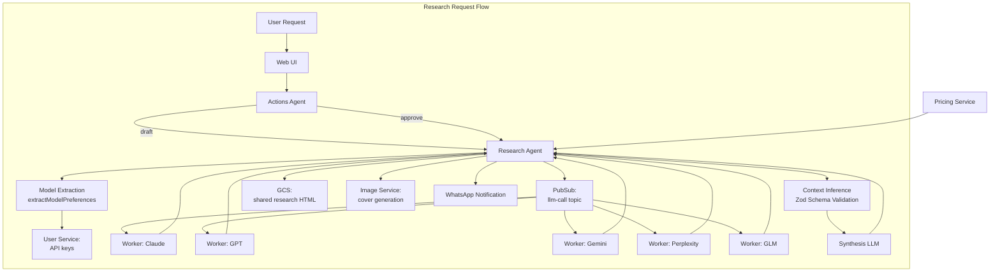
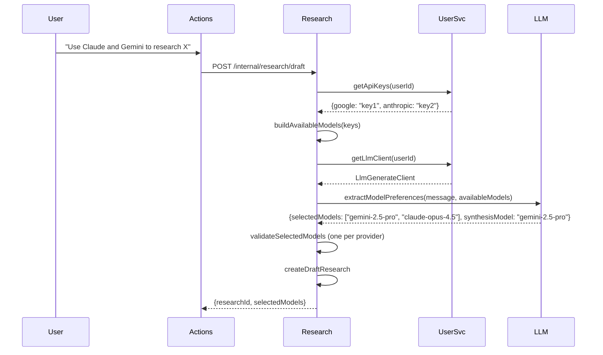
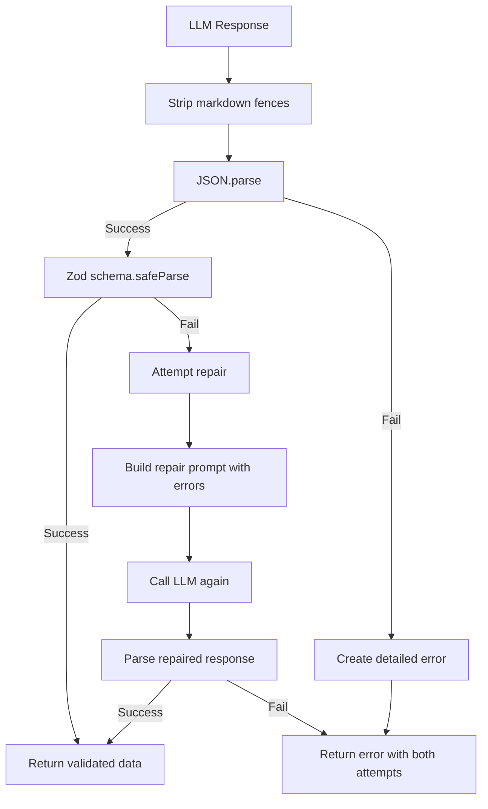
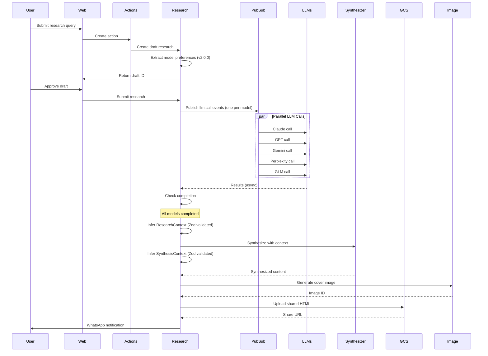

# Research Agent - Technical Reference

## Overview

Research-agent orchestrates AI research across multiple LLM providers (Claude, GPT, Gemini, Perplexity, GLM). It queries models in parallel via Pub/Sub, tracks costs and attribution, synthesizes results, and manages public sharing with generated cover images. Version 2.0.0 introduces intelligent model selection from natural language and Zod-based schema validation for LLM responses.

## Architecture



## Model Extraction Flow (v2.0.0)



## Zod Schema Validation (v2.0.0)

### Parser + Repair Pattern

The `ContextInferenceAdapter` implements a resilient parsing strategy:



### ResearchContext Schema

```typescript
const ResearchContextSchema = z.object({
  language: z.string(),
  domain: DomainSchema, // 'technical' | 'legal' | 'medical' | ...
  mode: ModeSchema, // 'compact' | 'standard' | 'audit'
  intent_summary: z.string(),
  defaults_applied: z.array(DefaultAppliedSchema),
  assumptions: z.array(z.string()),
  answer_style: z.array(AnswerStyleSchema), // 'practical' | 'evidence_first' | ...
  time_scope: TimeScopeSchema,
  locale_scope: LocaleScopeSchema,
  research_plan: ResearchPlanSchema,
  output_format: OutputFormatSchema,
  safety: SafetyInfoSchema,
  red_flags: z.array(z.string()),
});
```

### SynthesisContext Schema

```typescript
const SynthesisContextSchema = z.object({
  language: z.string(),
  domain: DomainSchema,
  mode: ModeSchema,
  synthesis_goals: z.array(SynthesisGoalSchema), // 'merge' | 'dedupe' | 'conflict_audit' | ...
  missing_sections: z.array(z.string()),
  detected_conflicts: z.array(DetectedConflictSchema),
  source_preference: SourcePreferenceSchema,
  defaults_applied: z.array(DefaultAppliedSchema),
  assumptions: z.array(z.string()),
  output_format: SynthesisOutputFormatSchema,
  safety: SafetyInfoSchema,
  red_flags: z.array(z.string()),
});
```

## Data Flow



## API Endpoints

### Public Endpoints

| Method | Path                         | Description                             | Auth         |
| ------ | ---------------------------- | --------------------------------------- | ------------ |
| POST   | `/research`                  | Create new research (starts processing) | Bearer token |
| POST   | `/research/draft`            | Save as draft (v2.0.0)                  | Bearer token |
| GET    | `/research`                  | List researches for user                | Bearer token |
| GET    | `/research/:id`              | Get research by ID                      | Bearer token |
| DELETE | `/research/:id`              | Delete research and unshare             | Bearer token |
| POST   | `/research/:id/approve`      | Approve draft research                  | Bearer token |
| POST   | `/research/:id/enhance`      | Enhance with more models/context        | Bearer token |
| POST   | `/research/:id/retry-failed` | Retry failed LLM calls                  | Bearer token |
| POST   | `/research/:id/confirm`      | Confirm partial failure decision        | Bearer token |
| DELETE | `/research/:id/share`        | Remove public sharing                   | Bearer token |
| PATCH  | `/research/:id/favourite`    | Toggle favourite status                 | Bearer token |
| GET    | `/research/shared/:slug`     | Get shared research (public)            | None         |
| GET    | `/pricing`                   | Get LLM pricing per provider/model      | Bearer token |
| POST   | `/research/validate-input`   | Validate input quality                  | Bearer token |
| POST   | `/research/improve-input`    | Improve research prompt                 | Bearer token |

### Internal Endpoints

| Method | Path                                    | Description                           | Auth            |
| ------ | --------------------------------------- | ------------------------------------- | --------------- |
| POST   | `/internal/research/draft`              | Create draft research with extraction | Internal header |
| POST   | `/internal/llm/pubsub/process-research` | Process research from Pub/Sub         | Pub/Sub OIDC    |
| POST   | `/internal/llm/pubsub/process-llm-call` | Process individual LLM call           | Pub/Sub OIDC    |
| POST   | `/internal/llm/pubsub/report-analytics` | Report LLM analytics                  | Pub/Sub OIDC    |

## Domain Models

### Research

| Field               | Type              | Description                          |
| ------------------- | ----------------- | ------------------------------------ |
| `id`                | string (UUID)     | Unique research identifier           |
| `userId`            | string            | User who owns the research           |
| `title`             | string            | AI-generated title (empty initially) |
| `prompt`            | string            | Original user query                  |
| `originalPrompt`    | string            | Pre-improvement prompt (if improved) |
| `selectedModels`    | ResearchModel[]   | Models to query                      |
| `synthesisModel`    | ResearchModel     | Model for synthesis                  |
| `status`            | ResearchStatus    | Current state                        |
| `llmResults`        | LlmResult[]       | Results from each model              |
| `inputContexts`     | InputContext[]    | User-provided context                |
| `synthesizedResult` | string            | Final synthesized content            |
| `synthesisError`    | string            | Synthesis failure message            |
| `partialFailure`    | PartialFailure    | Partial failure metadata             |
| `startedAt`         | string (ISO 8601) | Start timestamp                      |
| `completedAt`       | string            | Completion timestamp                 |
| `totalDurationMs`   | number            | Total processing time                |
| `totalInputTokens`  | number            | Sum of input tokens                  |
| `totalOutputTokens` | number            | Sum of output tokens                 |
| `totalCostUsd`      | number            | Total cost                           |
| `sourceActionId`    | string            | Originating action ID                |
| `skipSynthesis`     | boolean           | Skip synthesis (raw results only)    |
| `researchContext`   | ResearchContext   | Inferred context metadata            |
| `shareInfo`         | ShareInfo         | Public sharing details               |
| `sourceResearchId`  | string            | Enhanced from this ID                |
| `attributionStatus` | AttributionStatus | Source attribution state             |
| `auxiliaryCostUsd`  | number            | Non-LLM costs (images, etc)          |
| `sourceLlmCostUsd`  | number            | Cost from source research            |
| `favourite`         | boolean           | User favorited                       |

### ResearchStatus Enum

| Value                   | Description                             |
| ----------------------- | --------------------------------------- |
| `draft`                 | Awaiting user approval                  |
| `pending`               | Approved, awaiting processing           |
| `processing`            | LLMs are being queried                  |
| `awaiting_confirmation` | Partial failure, awaiting user decision |
| `retrying`              | Retrying failed LLMs                    |
| `synthesizing`          | Combining results                       |
| `completed`             | Successfully completed                  |
| `failed`                | All LLMs failed                         |

### LlmResult

| Field              | Type            | Description                            |
| ------------------ | --------------- | -------------------------------------- |
| `provider`         | LlmProvider     | claude, openai, google, perplexity,zai |
| `model`            | string          | Model name                             |
| `status`           | LlmResultStatus | pending, processing, completed, failed |
| `result`           | string          | LLM response content                   |
| `error`            | string          | Error message if failed                |
| `sources`          | string[]        | Source citations (if provided)         |
| `startedAt`        | string          | Start timestamp                        |
| `completedAt`      | string          | End timestamp                          |
| `durationMs`       | number          | Processing duration                    |
| `inputTokens`      | number          | Tokens consumed                        |
| `outputTokens`     | number          | Tokens generated                       |
| `costUsd`          | number          | Cost of this call                      |
| `copiedFromSource` | boolean         | Copied from enhanced source research   |

### ExtractModelPreferencesResult (v2.0.0)

| Field            | Type                       | Description                             |
| ---------------- | -------------------------- | --------------------------------------- |
| `selectedModels` | ResearchModel[]            | Models extracted from natural language  |
| `synthesisModel` | ResearchModel \| undefined | Synthesis model if explicitly mentioned |

## Model Filtering Logic (v2.0.0)

The `extractModelPreferences` use case filters models based on:

1. **API Key Availability** - Only models for which the user has configured API keys
2. **One Per Provider** - Maximum one model from each provider (first match wins)
3. **Synthesis Eligibility** - Synthesis model must be in `SYNTHESIS_MODELS` list

```typescript
// Available research models
const RESEARCH_MODELS: ResearchModel[] = [
  'gemini-2.5-pro',
  'gemini-2.5-flash',
  'claude-opus-4.5',
  'claude-sonnet-4.5',
  'o4-mini-deep-research',
  'gpt-5.2',
  'sonar',
  'sonar-pro',
  'sonar-deep-research',
  'glm-4.7',
  'glm-4.7-flash',
];

// Provider to API key field mapping
function providerToKeyField(provider: string): keyof ApiKeyStore {
  switch (provider) {
    case 'google':
      return 'google';
    case 'openai':
      return 'openai';
    case 'anthropic':
      return 'anthropic';
    case 'perplexity':
      return 'perplexity';
    case 'zai':
      return 'zai';
    default:
      return 'google';
  }
}
```

## Pub/Sub Events

### Published

| Event Type          | Topic               | Purpose                          |
| ------------------- | ------------------- | -------------------------------- |
| `research.process`  | `llm-process-queue` | Trigger research processing      |
| `llm.call`          | `llm-call-queue`    | Execute individual LLM call      |
| `llm.report`        | `llm-analytics`     | Report LLM success for analytics |
| `research.shared`   | `research-events`   | Notify on research share         |
| `research.unshared` | `research-events`   | Notify on research unshare       |

### Subscribed

| Subscription        | Handler                                 |
| ------------------- | --------------------------------------- |
| `llm-process-queue` | `/internal/llm/pubsub/process-research` |
| `llm-call-queue`    | `/internal/llm/pubsub/process-llm-call` |
| `llm-analytics`     | `/internal/llm/pubsub/report-analytics` |

## Dependencies

### Internal Services

| Service         | Purpose                         |
| --------------- | ------------------------------- |
| `user-service`  | API keys, LLM usage, LLM client |
| `image-service` | Cover image generation          |

### Infrastructure

| Component                             | Purpose                      |
| ------------------------------------- | ---------------------------- |
| Firestore (`researches` collection)   | Research persistence         |
| Firestore (`app_settings` collection) | LLM pricing configuration    |
| Firestore (`llm_api_logs` collection) | API call audit               |
| Pub/Sub (`llm-call-queue`)            | LLM call distribution        |
| Pub/Sub (`llm-process-queue`)         | Research processing trigger  |
| Pub/Sub (`whatsapp-send`)             | Notification delivery        |
| GCS                                   | Shared research HTML storage |

### LLM Providers

| Provider   | Models                                      |
| ---------- | ------------------------------------------- |
| Anthropic  | `claude-opus-4.5`, `claude-sonnet-4.5`      |
| OpenAI     | `gpt-5.2`, `o4-mini-deep-research`          |
| Google     | `gemini-2.5-pro`, `gemini-2.5-flash`        |
| Perplexity | `sonar`, `sonar-pro`, `sonar-deep-research` |
| Zai        | `glm-4.7`, `glm-4.7-flash`                  |

## Configuration

| Environment Variable                       | Required | Description                          |
| ------------------------------------------ | -------- | ------------------------------------ |
| `INTEXURAOS_USER_SERVICE_URL`              | Yes      | User-service base URL                |
| `INTEXURAOS_IMAGE_SERVICE_URL`             | Yes      | Image-service base URL               |
| `INTEXURAOS_INTERNAL_AUTH_TOKEN`           | Yes      | Shared secret for service-to-service |
| `INTEXURAOS_GCP_PROJECT_ID`                | Yes      | Google Cloud project ID              |
| `INTEXURAOS_PUBSUB_LLM_CALL_TOPIC`         | Yes      | LLM call queue topic                 |
| `INTEXURAOS_PUBSUB_RESEARCH_PROCESS_TOPIC` | Yes      | Research process queue topic         |
| `INTEXURAOS_PUBSUB_WHATSAPP_SEND_TOPIC`    | Yes      | WhatsApp send topic                  |
| `INTEXURAOS_WEB_APP_URL`                   | Yes      | Web app URL for notifications        |
| `INTEXURAOS_SHARED_CONTENT_BUCKET`         | Yes      | GCS bucket for shared research       |
| `INTEXURAOS_SHARE_BASE_URL`                | Yes      | Base URL for shared research         |

## Gotchas

**Idempotent LLM calls**: The `process-llm-call` endpoint checks if an LLM result is already `completed` or `failed` and skips processing if so. This enables safe retry without duplication.

**Partial failure handling**: When some LLMs fail, research enters `awaiting_confirmation` status. User can choose to proceed with completed results, retry failed models, or cancel.

**Context window limits**: Input contexts are max 60k characters each, max 5 contexts. This prevents exceeding model context windows.

**Perplexity online search**: The Perplexity models (`sonar-*`) perform actual web search during inference, making them slower but more current.

**Share token generation**: Uses HMAC-based token generation for secure, unguessable share URLs.

**Attribution repair**: Synthesized content may have incomplete attribution. A repair process attempts to fix missing attribution lines before marking complete.

**Cost calculation**: Costs are calculated from pricing data in `app_settings` collection. If pricing is missing, cost is not calculated but result is still saved.

**Image cleanup**: When research is unshared, the cover image is deleted via call to image-service's internal endpoint.

**Draft research flow**: Low-confidence actions create draft research that requires explicit approval before processing.

**Model extraction graceful degradation**: If model extraction fails (LLM error, no API keys), the draft is created with empty `selectedModels` array. User selects models manually in UI.

**Zod repair pattern**: When initial Zod validation fails, a repair prompt is sent to the LLM with the specific validation errors. If repair also fails, both error messages are combined for debugging.

**One model per provider**: The `validateSelectedModels` function enforces maximum one model per provider to prevent duplicate costs and conflicting results.

## File Structure

```
apps/research-agent/src/
  domain/research/
    models/
      Research.ts                   # Core research entity and factories
    config/
      synthesisPrompt.ts            # Synthesis prompt template
    ports/
      repository.ts                 # Research storage interface
      llmProvider.ts                # LLM adapter interface
      contextInference.ts           # Context inference interface
      modelExtraction.ts            # Model extraction types
      shareStorage.ts               # Shared HTML storage interface
    services/
      contextLabels.ts              # Context labeling utilities
    usecases/
      extractModelPreferences.ts    # Model extraction from NL (v2.0.0)
      processResearch.ts            # Main orchestration
      submitResearch.ts             # Submit for processing
      enhanceResearch.ts            # Add models/context
      unshareResearch.ts            # Remove public share
      runSynthesis.ts               # Combine results
      retryFromFailed.ts            # Retry failed LLMs
      retryFailedLlms.ts            # Retry specific models
      checkLlmCompletion.ts         # Completion status check
      repairAttribution.ts          # Fix attribution issues
    utils/
      htmlGenerator.ts              # Shared HTML generation
      slugify.ts                    # URL-friendly IDs
    formatLlmError.ts               # Error message formatting
  infra/
    llm/
      ClaudeAdapter.ts              # Claude API integration
      GptAdapter.ts                 # OpenAI API integration
      GeminiAdapter.ts              # Google API integration (deprecated name)
      PerplexityAdapter.ts          # Perplexity API integration
      GlmAdapter.ts                 # GLM (Zai) API integration
      ContextInferenceAdapter.ts    # Zod-validated context inference (v2.0.0)
      InputValidationAdapter.ts     # Input quality validation
      LlmAdapterFactory.ts          # Factory pattern
    research/
      FirestoreResearchRepository.ts  # Research persistence
    pricing/
      PricingClient.ts              # Fetch pricing from settings
    pubsub/
      researchEventPublisher.ts
      llmCallPublisher.ts
    gcs/
      shareStorageAdapter.ts        # Upload shared HTML
    image/
      imageServiceClient.ts         # Generate cover images
    notification/
      WhatsAppNotificationSender.ts
      NoopNotificationSender.ts
    user/
      userServiceClient.ts          # API keys, LLM client, usage reporting
  routes/
    internalRoutes.ts               # Service-to-service + Pub/Sub
    researchRoutes.ts               # User-facing endpoints
    helpers/
      completionHandlers.ts         # Post-LLM completion logic
      synthesisHelper.ts            # Synthesis setup
    schemas/
      researchSchemas.ts            # Request/response schemas
      validationSchemas.ts          # Input validation
  services.ts                       # DI container with factories
  server.ts                         # Fastify server setup
  index.ts                          # Entry point
```

## Key Packages

| Package                    | Purpose                       |
| -------------------------- | ----------------------------- |
| `@intexuraos/llm-contract` | Model types, provider mapping |
| `@intexuraos/llm-prompts`  | Zod schemas, prompt builders  |
| `@intexuraos/llm-pricing`  | Pricing context interface     |
| `@intexuraos/llm-utils`    | Parse error formatting        |
| `@intexuraos/infra-gemini` | Gemini client wrapper         |
