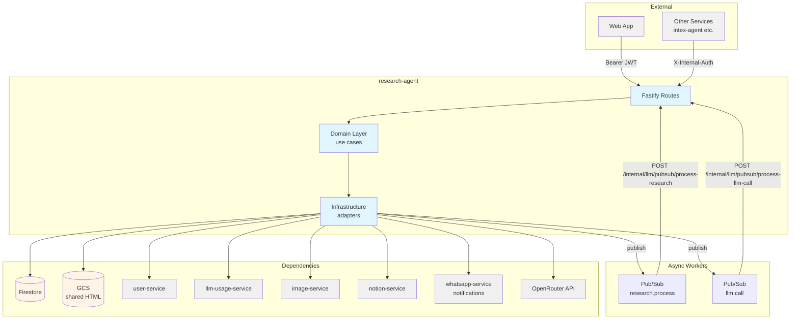
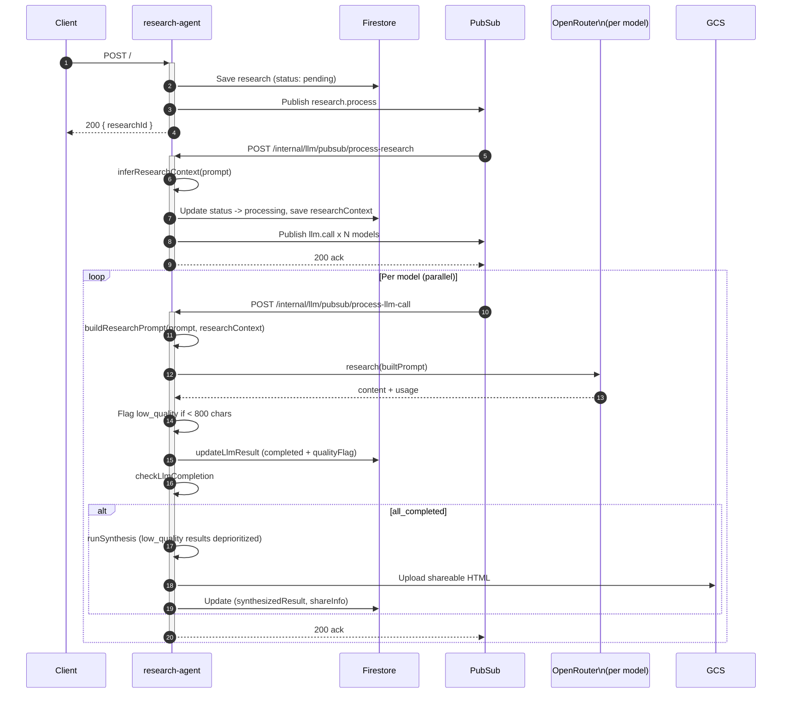

# Research Agent — Technical Reference

## Overview

Research-agent orchestrates parallel AI research across a curated OpenRouter model catalog. It infers structured research context from user prompts, fans out research via Pub/Sub so each model call runs in its own Cloud Run instance, flags low-quality responses, tracks token usage and cost per call via centralized LLM usage reporting, synthesizes results with source attribution, and auto-publishes shareable HTML to GCS. Google/Gemini execution is OpenRouter-only: executable IDs use `or:google/...`, raw `gemini-*` IDs are rejected, and no Google LLM API key is loaded. Runs on Cloud Run with auto-scaling.

## Architecture


```mermaid
graph TB
    subgraph "External"
        WebApp[Web App]
        OtherSvc[Other Services\nintex-agent etc.]
    end

    subgraph "research-agent"
        API[Fastify Routes]
        Domain[Domain Layer\nuse cases]
        Infra[Infrastructure\nadapters]
    end

    subgraph "Async Workers"
        PubSubProcess[Pub/Sub\nresearch.process]
        PubSubLlm[Pub/Sub\nllm.call]
    end

    subgraph "Dependencies"
        Firestore[(Firestore)]
        GCS[(GCS\nshared HTML)]
        UserSvc[user-service]
        LlmUsageSvc[llm-usage-service]
        ImageSvc[image-service]
        NotionSvc[notion-service]
        WASvc[whatsapp-service\nnotifications]
        OpenRouter[OpenRouter API]
    end

    WebApp -->|Bearer JWT| API
    OtherSvc -->|X-Internal-Auth| API
    API --> Domain
    Domain --> Infra
    Infra --> Firestore
    Infra -->|publish| PubSubProcess
    Infra -->|publish| PubSubLlm
    PubSubProcess -->|POST /internal/llm/pubsub/process-research| API
    PubSubLlm -->|POST /internal/llm/pubsub/process-llm-call| API
    Infra --> GCS
    Infra --> UserSvc
    Infra --> LlmUsageSvc
    Infra --> ImageSvc
    Infra --> NotionSvc
    Infra --> WASvc
    Infra --> OpenRouter

    classDef service fill:#e1f5ff
    classDef storage fill:#fff4e6
    classDef external fill:#f0f0f0

    class API,Domain,Infra service
    class Firestore,GCS storage
    class WebApp,OtherSvc,UserSvc,LlmUsageSvc,ImageSvc,NotionSvc,WASvc,OpenRouter external
```

## Data Flow


```mermaid
sequenceDiagram
    autonumber
    participant Client
    participant ResearchAgent as research-agent
    participant Firestore
    participant PubSub
    participant OpenRouter as OpenRouter\n(per model)
    participant GCS

    Client->>+ResearchAgent: POST /
    ResearchAgent->>Firestore: Save research (status: pending)
    ResearchAgent->>PubSub: Publish research.process
    ResearchAgent-->>-Client: 200 { researchId }

    PubSub->>+ResearchAgent: POST /internal/llm/pubsub/process-research
    ResearchAgent->>ResearchAgent: inferResearchContext(prompt)
    ResearchAgent->>Firestore: Update status -> processing, save researchContext
    ResearchAgent->>PubSub: Publish llm.call x N models
    ResearchAgent-->>-PubSub: 200 ack

    loop Per model (parallel)
        PubSub->>+ResearchAgent: POST /internal/llm/pubsub/process-llm-call
        ResearchAgent->>ResearchAgent: buildResearchPrompt(prompt, researchContext)
        ResearchAgent->>OpenRouter: research(builtPrompt)
        OpenRouter-->>ResearchAgent: content + usage
        ResearchAgent->>ResearchAgent: Flag low_quality if < 800 chars
        ResearchAgent->>Firestore: updateLlmResult (completed + qualityFlag)
        ResearchAgent->>ResearchAgent: checkLlmCompletion
        alt all_completed
            ResearchAgent->>ResearchAgent: runSynthesis (low_quality results deprioritized)
            ResearchAgent->>GCS: Upload shareable HTML
            ResearchAgent->>Firestore: Update (synthesizedResult, shareInfo)
        end
        ResearchAgent-->>-PubSub: 200 ack
    end
```

## Recent Changes

### Changes since v3.8.0

- Research, synthesis, titles, context inference, and validation use OpenRouter with a user key or platform fallback. New runs and retries enforce the curated research allowlist; synthesis accepts only MiniMax M3 or GPT-5.4 through their `or:` IDs. Historical direct-provider records remain readable but cannot execute.
- Internal creation returns an absolute `resourceUrl` built from `INTEXURAOS_WEB_APP_URL`, allowing assistants to send a usable research link (INT-1708).
- Handled model failures and missing cover images retain their recovery behavior without duplicate actionable error alerts. Recovered parser diagnostics are debug-level; cover failure still permits publishing the report without an image (INT-2064, INT-2065, INT-2066).

The entries below are historical release records. They describe the behavior introduced at each release, not the current runtime contract; the current contract is OpenRouter-only as documented above.

### v3.6.0 Changes (since v3.5.0)

**Centralized LLM Pricing Removal (INT-1387):** The service no longer maintains its own `PricingClient` or depends on `app-settings-service` for pricing data. All LLM usage reporting is now handled via `HttpInternalAuthUsageSink` from the `llm-pricing` package, which sends usage data directly to `llm-usage-service`. The `infra/pricing/` directory and associated startup pricing fetch were removed entirely.

**Model Migration:** All call sites migrated from `gpt-5.2` / `claude-sonnet-4-5` / `claude-opus-4-5` to `gpt-5.4` / `claude-sonnet-4-6` / `claude-opus-4-6`. The stale model identifiers were removed from the LLM contract.

**Required promptType in LLM Calls (INT-1392):** The `promptType` parameter is now required in all `LlmGenerateClient` calls. All research-agent call sites were updated with semantic prompt type labels (e.g., `research`, `synthesis`, `title-generation`, `context-inference`, `input-validation`).

**OpenRouter Allowlist Expansion:** Added `google/gemini-3-flash-preview` to the curated OpenRouter allowlist, bringing the total to 15 models from 10 providers. The allowlist length assertion in the route test is now computed dynamically rather than hardcoded.

**Important WhatsApp Notifications:** Research completion and LLM failure notifications are now published with `important: true`, ensuring priority delivery through the WhatsApp notification pipeline.

**Export Branding Fix:** The exported HTML header now uses the web app URL for branding, and the "Generated by" section no longer includes the user's email address.

| Commit      | Description                                                            | Date       |
| ----------- | ---------------------------------------------------------------------- | ---------- |
| `004e0ad6d` | feat: mark important WhatsApp notifications                            | 2026-04-22 |
| `dedd0e3d9` | Strengthen test assertions to verify semantic promptType labels        | 2026-04-18 |
| `4041a9d7c` | Fix incorrect promptType labels and stale JSDoc examples               | 2026-04-18 |
| `8aae64e4b` | Make promptType required in LlmGenerateClient and all call sites       | 2026-04-18 |
| `434d6657b` | feat: add google/gemini-3-flash-preview to OpenRouter allowlist        | 2026-04-16 |
| `6d050f342` | refactor: remove pricing from service container and startup            | 2026-04-13 |
| `63b19d504` | refactor: remove dead PricingClient code                               | 2026-04-11 |
| `8767c5e22` | feat: migrate all consumers from app-settings-service to llm-pricing   | 2026-04-11 |
| `8b1211dc0` | refactor: wire HttpInternalAuthUsageSink in all LLM call sites         | 2026-04-11 |
| `bae665c77` | fix: update export header and remove email from generated-by           | 2026-04-09 |
| `ccc5a3e64` | fix: use web app URL for branding in exported HTML                     | 2026-04-09 |

### v3.5.0 Changes (since v3.4.0)

**OpenRouter Integration (INT-1011, INT-1012, INT-1102, INT-1106, INT-1253):** Full backend infrastructure for routing research tasks through OpenRouter models.

- **OpenRouterAdapter:** New LLM adapter implementing both `LlmResearchProvider` and `LlmSynthesisProvider` via the `infra-openrouter` package. Strips the `or:` prefix from model IDs before passing to the OpenRouter API. Supports research, synthesis, and title generation.
- **Allowlist enforcement:** Execution-time validation ensures only the curated models from 10 providers can be dispatched through OpenRouter. Unauthorized model IDs are rejected.
- **Live pricing endpoint:** `GET /openrouter/models` returns the curated allowlist enriched with live pricing from the OpenRouter catalog API. Results are cached in-memory for 5 minutes. Falls back to hardcoded pricing when the catalog is unavailable.
- **Key validation:** OpenRouter API keys are validated using the lightweight `/api/v1/key` endpoint rather than making a full model call.
- **Pricing correlation:** OpenRouter models use `useProviderCost: true` pricing when live catalog data is available, falling back to allowlist-defined per-token pricing otherwise.

**Cover Image Provider Failover (INT-1310):** The `generateCoverImage` function now tries multiple image generation pipelines in order of preference. If the preferred provider fails (prompt generation or image generation), the service falls back to the next available provider. Provider preference is determined by the synthesis model: GPT-based synthesis prefers the OpenAI pipeline; all others prefer Google. All failures across providers are logged with structured error details.

**ResearchSummary Projection:** The `GET /` list endpoint now returns lightweight `ResearchSummary` projections instead of full `Research` documents. Summaries exclude large text fields (`synthesizedResult`, `llmResults[].result`, `inputContexts[].content`) to reduce payload size on list views. Uses single-query Firestore pagination via `.select()`.

**Other Changes:**

- Added `construction_building` domain to context inference (INT-1100)
- Fixed model count discrepancy in research request validation (INT-1107)

### v3.4.0 Changes (since v3.3.0)

**Research Pipeline Quality Fixes (INT-981):** Accuracy and completeness improvements across research stages T0 through T6:

- **Context-aware research prompts (T0-T2):** The `LlmResearchProvider.research()` method now accepts an optional `ResearchContext` parameter. All four LLM adapters (Claude, Gemini, GPT, Perplexity) pass the inferred research context through `buildResearchPrompt()` to produce domain-tailored prompts — including language, answer style, source preferences, and safety constraints.
- **Low-quality response detection (T3):** LLM results below 800 characters are automatically flagged with `qualityFlag: 'low_quality'` on the `LlmResult` model. Flagged results receive a quality warning prefix during synthesis, deprioritizing them as evidence sources.
- **Language-aware synthesis (T5):** When the research context includes a `language` field, it is passed as `languageOverride` to the synthesis context inferrer, ensuring the final output matches the user's language.
- **Context inference improvements (T6):** The context inference adapter now recognizes broader domain categories (e.g., `outdoor_recreation`, `fishing`, `construction_building`) and supports `user_exclusions` in safety constraints.

## API Endpoints

### Public Endpoints (Bearer JWT required)

| Method   | Path                                   | Purpose                                                    |
| -------- | -------------------------------------- | ---------------------------------------------------------- |
| `POST`   | `/`                            | Submit new research for immediate processing               |
| `POST`   | `/draft`                      | Save research as draft (requires approval)                 |
| `GET`    | `/`                            | List authenticated user's researches (summary projections) |
| `GET`    | `/:id`                        | Get single research by ID                                  |
| `PATCH`  | `/:id`                        | Update research fields                                     |
| `POST`   | `/validate-input`             | Validate research input quality                            |
| `POST`   | `/improve-input`              | Force-improve research input                               |
| `POST`   | `/:id/approve`                | Approve draft research and trigger processing              |
| `POST`   | `/:id/confirm`                | Confirm partial failure decision                           |
| `POST`   | `/:id/retry`                  | Retry research from failed status                          |
| `POST`   | `/:id/enhance`                | Create enhanced research from a completed one              |
| `POST`   | `/:id/export-notion`          | Manually trigger Notion export                             |
| `DELETE` | `/:id`                        | Delete research                                            |
| `DELETE` | `/:id/share`                  | Remove public share access (unshare)                       |
| `PATCH`  | `/:id/favourite`              | Toggle favourite status                                    |
| `GET`    | `/openrouter/models`          | Get curated OpenRouter allowlist with live pricing         |
| `GET`    | `/settings/notion`            | Get Notion export page configuration                       |
| `POST`   | `/settings/notion`            | Save Notion export page configuration                      |
| `POST`   | `/settings/notion/validate`   | Validate a Notion page ID before saving                    |

### Internal Endpoints (X-Internal-Auth or Pub/Sub OIDC)

| Method | Path                                         | Purpose                                       | Caller               |
| ------ | -------------------------------------------- | --------------------------------------------- | -------------------- |
| `POST` | `/internal/research/draft`                   | Create draft research from another service    | intex-agent          |
| `POST` | `/internal/llm/pubsub/process-research`      | Receive `research.process` event from Pub/Sub | Cloud Pub/Sub        |
| `POST` | `/internal/llm/pubsub/process-llm-call`      | Receive `llm.call` event — execute one model  | Cloud Pub/Sub        |
| `POST` | `/internal/llm/pubsub/report-analytics`      | Receive `llm.report` analytics event          | Cloud Pub/Sub        |

## Domain Model

### Research

| Field                | Type                    | Description                                                    |
| -------------------- | ----------------------- | -------------------------------------------------------------- |
| `id`                 | `string`                | Unique identifier                                              |
| `userId`             | `string`                | Owning user                                                    |
| `title`              | `string`                | Auto-generated title (platform OpenRouter model)               |
| `prompt`             | `string`                | Research question submitted by user                            |
| `originalPrompt`     | `string?`               | User's raw prompt before improvement (if accepted)             |
| `selectedModels`     | `ResearchModel[]`       | Models dispatched for research                                 |
| `synthesisModel`     | `ResearchModel`         | Model used for synthesis step                                  |
| `status`             | `ResearchStatus`        | Current lifecycle state                                        |
| `llmResults`         | `LlmResult[]`           | Per-model result records                                       |
| `inputContexts`      | `InputContext[]?`       | User-provided context documents (max 5, max 60k chars each)    |
| `researchContext`    | `ResearchContext?`      | Inferred research context (domain, style, sources, safety)     |
| `synthesizedResult`  | `string?`               | Final synthesized markdown output                              |
| `synthesisError`     | `string?`               | Error message if synthesis failed                              |
| `partialFailure`     | `PartialFailure?`       | Partial failure state awaiting user decision                   |
| `shareInfo`          | `ShareInfo?`            | Public share URL and GCS metadata                              |
| `notionExportInfo`   | `NotionExportInfo?`     | Notion page IDs after export                                   |
| `attributionStatus`  | `AttributionStatus?`    | Source attribution validation result                           |
| `totalCostUsd`       | `number?`               | Aggregate cost across all LLM calls                            |
| `auxiliaryCostUsd`   | `number?`               | Cost of auxiliary calls (title gen, context inference, repair) |
| `sourceLlmCostUsd`   | `number?`               | Cost of copied results (enhanced research only)                |
| `sourceResearchId`   | `string?`               | ID of source research (enhanced research only)                 |
| `favourite`          | `boolean`               | User-starred flag                                              |
| `userName`           | `string?`               | User's Auth0 name (for "Generated by" in shared HTML)          |
| `userEmail`          | `string?`               | User's Auth0 email (for "Generated by" in shared HTML)         |

**ResearchStatus values:**

| Status                  | Meaning                                                 |
| ----------------------- | ------------------------------------------------------- |
| `draft`                 | Created by another service, awaiting user approval      |
| `pending`               | Submitted, awaiting Pub/Sub processing                  |
| `processing`            | LLM calls being dispatched                              |
| `awaiting_confirmation` | Partial failure detected, waiting for user decision     |
| `retrying`              | User-triggered retry of failed LLM calls                |
| `synthesizing`          | All LLMs done, synthesis model running                  |
| `completed`             | Synthesis done, result available                        |
| `failed`                | Terminal failure (all models failed or synthesis error) |

### LlmResult

| Field              | Type              | Description                                                     |
| ------------------ | ----------------- | --------------------------------------------------------------- |
| `provider`         | `LlmProvider`     | Execution provider; `or:*` calls use `openrouter`               |
| `model`            | `string`          | Model name from llm-contract                                    |
| `status`           | `LlmResultStatus` | `pending`, `processing`, `completed`, `failed`                  |
| `result`           | `string?`         | Raw markdown from the model                                     |
| `sources`          | `string[]?`       | URLs cited by the model                                         |
| `inputTokens`      | `number?`         | Input token count                                               |
| `outputTokens`     | `number?`         | Output token count                                              |
| `costUsd`          | `number?`         | Cost in USD                                                     |
| `durationMs`       | `number?`         | Wall-clock time for this call                                   |
| `copiedFromSource` | `boolean?`        | True when result reused from source research                    |
| `qualityFlag`      | `QualityFlag?`    | `'normal'` or `'low_quality'` based on content length threshold |

### InputContext

| Field     | Type      | Description                              |
| --------- | --------- | ---------------------------------------- |
| `id`      | `string`  | `{researchId}-ctx-{index}`               |
| `content` | `string`  | Document text (max 60,000 chars)         |
| `label`   | `string?` | Human-readable label                     |
| `addedAt` | `string`  | ISO 8601 timestamp                       |

### ResearchSummary (list view projection)

| Field               | Type                     | Description                                    |
| ------------------- | ------------------------ | ---------------------------------------------- |
| `id`                | `string`                 | Unique identifier                              |
| `userId`            | `string`                 | Owning user                                    |
| `title`             | `string`                 | Auto-generated title                           |
| `status`            | `ResearchStatus`         | Current lifecycle state                        |
| `selectedModels`    | `ResearchModel[]`        | Models dispatched                              |
| `synthesisModel`    | `ResearchModel`          | Model used for synthesis                       |
| `startedAt`         | `string`                 | ISO 8601 timestamp                             |
| `completedAt`       | `string?`                | ISO 8601 timestamp                             |
| `favourite`         | `boolean?`               | User-starred flag                              |
| `llmResultStatuses` | `LlmResultStatusInfo[]`  | Per-model status (no result text)              |
| `totalCostUsd`      | `number?`                | Aggregate cost                                 |
| `partialFailure`    | `PartialFailure?`        | Partial failure state                          |

## Pub/Sub

### Published Topics

| Topic env var                              | Event type         | Payload fields                              | Trigger                               |
| ------------------------------------------ | ------------------ | ------------------------------------------- | ------------------------------------- |
| `INTEXURAOS_PUBSUB_RESEARCH_PROCESS_TOPIC` | `research.process` | `researchId`, `userId`, `triggeredBy`       | Research submitted or draft approved  |
| `INTEXURAOS_PUBSUB_LLM_CALL_TOPIC`         | `llm.call`         | `researchId`, `userId`, `model`, `prompt`   | One per model during process-research |
| `INTEXURAOS_PUBSUB_WHATSAPP_SEND_TOPIC`    | WhatsApp send      | (notification payload, `important: true`)   | LLM failure or research completion    |

### Subscribed Topics (HTTP Push)

| Endpoint                                       | Event type         | Action                                                                            |
| ---------------------------------------------- | ------------------ | --------------------------------------------------------------------------------- |
| `POST /internal/llm/pubsub/process-research`   | `research.process` | Infer research context, dispatch LLM calls                                        |
| `POST /internal/llm/pubsub/process-llm-call`   | `llm.call`         | Execute single LLM call with context-aware prompt, flag quality, check completion |
| `POST /internal/llm/pubsub/report-analytics`   | `llm.report`       | Report LLM usage to user-service                                                  |

## Dependencies

### Internal Services

| Service              | Endpoint pattern                       | Purpose                                          |
| -------------------- | -------------------------------------- | ------------------------------------------------ |
| user-service         | `/internal/user/api-keys`              | Fetch decrypted API keys per provider            |
| user-service         | `/internal/user/llm-client`            | Get LLM client for model preference extraction   |
| user-service         | `/internal/user/report-llm-success`    | Report successful LLM call for analytics         |
| user-service         | `/internal/user/timezone`              | Get user timezone                                |
| llm-usage-service    | `/internal/usage`                      | Report LLM token usage and cost per call         |
| image-service        | `/internal/images/prompts/generate`    | Generate cover image prompt from synthesis       |
| image-service        | `/internal/images/generate`            | Generate cover image                             |
| notion-service       | via notionServiceClient                | Validate Notion page ID and export research      |
| whatsapp-service     | via Pub/Sub                            | Send LLM failure and completion notifications    |

### External Services

| Service        | Purpose                                             | Failure Mode                                |
| -------------- | --------------------------------------------------- | ------------------------------------------- |
| OpenRouter API | Fetch live model pricing catalog; route LLM calls   | Falls back to allowlist pricing; call fails |

### Firestore Collections (owned)

| Collection                   | Description                                          |
| ---------------------------- | ---------------------------------------------------- |
| `researches`                 | LLM research queries, responses, synthesized results |
| `research_export_settings`   | Notion target page configuration per user            |

## Configuration

| Variable                                   | Purpose                                             | Required |
| ------------------------------------------ | --------------------------------------------------- | -------- |
| `INTEXURAOS_GCP_PROJECT_ID`                | GCP project for Firestore and Pub/Sub               | Yes      |
| `INTEXURAOS_AUTH_JWKS_URL`                 | Auth0 JWKS URL for JWT verification                 | Yes      |
| `INTEXURAOS_AUTH_ISSUER`                   | Auth0 issuer for JWT verification                   | Yes      |
| `INTEXURAOS_AUTH_AUDIENCE`                 | Auth0 audience for JWT verification                 | Yes      |
| `INTEXURAOS_USER_SERVICE_URL`              | Base URL of user-service                            | Yes      |
| `INTEXURAOS_INTERNAL_AUTH_TOKEN`           | Shared secret for X-Internal-Auth header            | Yes      |
| `INTEXURAOS_WEB_APP_URL`                   | Base URL of web app (used in share links)           | Yes      |
| `INTEXURAOS_LLM_USAGE_SERVICE_URL`         | Base URL of llm-usage-service for usage reporting   | Yes      |
| `INTEXURAOS_NOTION_SERVICE_URL`            | Base URL of notion-service                          | Yes      |
| `INTEXURAOS_IMAGE_PUBLIC_BASE_URL`         | Public CDN base URL for generated images            | Yes      |
| `INTEXURAOS_IMAGE_SERVICE_URL`             | Base URL of image-service                           | Yes      |
| `INTEXURAOS_SHARE_BASE_URL`                | Base URL for public shareable HTML pages            | Yes      |
| `INTEXURAOS_SHARED_CONTENT_BUCKET`         | GCS bucket name for shareable HTML uploads          | Yes      |
| `INTEXURAOS_PUBSUB_WHATSAPP_SEND_TOPIC`    | Pub/Sub topic for WhatsApp notifications            | Yes      |
| `INTEXURAOS_PUBSUB_RESEARCH_PROCESS_TOPIC` | Pub/Sub topic for research process events           | Yes      |
| `INTEXURAOS_PUBSUB_LLM_CALL_TOPIC`         | Pub/Sub topic for individual LLM call events        | Yes      |
| `INTEXURAOS_OPENROUTER_APP_API_KEY`         | Platform OpenRouter credential and fallback         | Yes      |
| `INTEXURAOS_SENTRY_DSN`                    | Sentry DSN (optional, monitoring)                   | No       |
| `INTEXURAOS_ENVIRONMENT`                   | Environment name for Sentry tagging                 | No       |

## LLM Models

Research Agent reports usage to `llm-usage-service` for every model it invokes. The current routed catalog is the 16-model OpenRouter allowlist:

**Research models** (`or:` prefix required in API payloads):
- DeepSeek V4 Flash (DeepSeek)
- Qwen 3.5 Plus, Qwen 3.5 Flash (Qwen)
- MiniMax M3 (MiniMax)
- Grok 4.20 Beta, Grok 4.3 (xAI)
- Kimi K2.5 (Moonshot)
- Claude Sonnet 4.6, Claude Opus 4.6 (Anthropic via OpenRouter)
- Gemini 3.1 Pro, Gemini 2.5 Flash, Gemini 3.6 Flash (Google via OpenRouter)
- GPT-5.4, GPT-5.4 Mini (OpenAI via OpenRouter)
- MiMo V2.5 Pro (Xiaomi)
- GLM 5 Turbo (Z.ai)

**Synthesis models:** `or:minimax/minimax-m3` (default) and `or:openai/gpt-5.4`. The research allowlist is broader than this synthesis subset.

**Fast model** (title generation, context inference, input validation):
- `or:minimax/minimax-m3` (platform OpenRouter default)

**Image model** (optional cover image generation):
- `gpt-image-1` public alias, executed as `openai/gpt-image-1` through OpenRouter

Stored direct-provider model names remain readable for historical data compatibility. New execution and retries require allowlisted `or:` IDs; historical direct Google, OpenAI, Anthropic, and Perplexity IDs cannot be executed. Synthesis also checks its narrower supported subset.

## Gotchas

- **Pub/Sub ack pattern:** All internal Pub/Sub endpoints always return `200 OK`. Errors are logged but never cause a 4xx/5xx response — otherwise Cloud Pub/Sub would redeliver indefinitely.
- **LLM call idempotency:** `process-llm-call` checks if the model result is already `completed` or `failed` before re-executing. Safe to redeliver.
- **Synthesis race guard:** `runSynthesis` checks for `synthesizing` or `completed` status before proceeding, preventing duplicate synthesis from concurrent Pub/Sub deliveries.
- **Enhanced research cost tracking:** When enhancing a completed research, completed LLM results are copied with `copiedFromSource: true`. Their costs are aggregated into `sourceLlmCostUsd` so `totalCostUsd` reflects only new work.
- **Notion export is fire-and-forget:** The export runs asynchronously after the database is saved. Failure does not affect the research's `completed` status.
- **Notion export timing:** The export must happen after the database save so it reads the updated `shareInfo.coverImageUrl`. An earlier race condition (export before save) was fixed.
- **Attribution repair:** If synthesis output fails attribution validation, the service automatically calls the synthesizer again to repair it. The repair's cost is tracked in `auxiliaryCostUsd`.
- **Context labels:** If no label is supplied for an input context, `generateContextLabels` assigns one via LLM inference during synthesis.
- **Low-quality threshold:** LLM results under 800 characters are flagged `low_quality`. The threshold was chosen empirically — useful research responses are typically 1000+ characters; shorter outputs usually indicate refusals, error messages, or extremely shallow answers.
- **Research context propagation:** The inferred `ResearchContext` is saved to Firestore during `process-research` and passed to each LLM adapter's `research()` call via `buildResearchPrompt()`. This means the context is inferred once and reused for all models in the research.
- **OpenRouter `or:` prefix:** OpenRouter model IDs are prefixed with `or:` in the llm-contract registry (e.g., `or:qwen/qwen3.5-plus-02-15`). The `OpenRouterAdapter` strips this prefix before calling the OpenRouter API using `getOpenRouterRawId()`.
- **No direct Google route:** Raw `gemini-*` IDs are not executable. Google model families must use an allowlisted `or:google/...` identifier and the OpenRouter credential.
- **OpenRouter allowlist enforcement:** At execution time (not just at selection), the `process-llm-call` handler validates that OpenRouter models are on the curated allowlist. Unauthorized model IDs are rejected.
- **OpenRouter model cache:** The `GET /openrouter/models` endpoint caches responses in-memory for 5 minutes. The cache is per-process, not shared across Cloud Run instances.
- **OpenRouter cover images:** `generateCoverImage` uses OpenRouter while preserving the `gpt-4.1` and `gpt-image-1` public aliases. If access is unavailable or either step fails, sharing continues without a cover image.
- **ResearchSummary projection:** The `GET /` list endpoint uses `findSummariesByUserId` which returns `ResearchSummary` objects (no `synthesizedResult`, no `llmResults[].result`, no `inputContexts[].content`). The `toResearchSummary` mapper strips these fields server-side.
- **Important WhatsApp notifications:** Both research completion and LLM failure notifications are published with `important: true`, bypassing quiet-hours suppression in the WhatsApp notification pipeline.
- **Usage reporting via HttpInternalAuthUsageSink:** Each LLM adapter receives a `UsageSink` scoped to its component name (e.g., `research:or:google/gemini-3.6-flash`, `synthesis:or:anthropic/claude-sonnet-4.6`, `title-generator`). Usage is reported asynchronously to `llm-usage-service` after each call completes.

## File Structure

```
apps/research-agent/src/
├── domain/
│   └── research/
│       ├── config/          # Synthesis prompts, title prompt
│       ├── models/          # Research, LlmResult, InputContext, ResearchSummary types
│       ├── ports/           # Repository, LLM provider, notification, context inference interfaces
│       ├── services/        # contextLabels helper
│       └── usecases/        # checkLlmCompletion, deleteResearch, enhanceResearch,
│                            # extractModelPreferences, getResearch, listResearches,
│                            # processResearch, repairAttribution, retryFailedLlms,
│                            # retryFromFailed, runSynthesis, submitResearch,
│                            # toggleResearchFavourite, unshareResearch
├── infra/
│   ├── firestore/           # researchExportSettingsRepository
│   ├── gcs/                 # shareStorageAdapter (GCS HTML upload)
│   ├── image/               # imageServiceClient
│   ├── llm/                 # OpenRouterAdapter plus retained historical adapters,
│   │                        # ContextInferenceAdapter, InputValidationAdapter,
│   │                        # LlmAdapterFactory
│   ├── notification/        # WhatsAppNotificationSender, NoopNotificationSender
│   ├── notion/              # notionResearchExporter, notionServiceClient,
│   │                        # exportResearchToNotionUseCase
│   ├── pubsub/              # analyticsEventPublisher, llmCallPublisher,
│   │                        # researchEventPublisher
│   └── research/            # FirestoreResearchRepository
├── routes/
│   ├── helpers/             # synthesisHelper, completionHandlers, storedResearchModels
│   ├── schemas/             # Fastify JSON schemas
│   ├── internalRoutes.ts    # /internal/* endpoints
│   ├── openRouterRoutes.ts  # /openrouter/* endpoints
│   ├── researchExportRoutes.ts  # /settings/notion endpoints
│   └── researchRoutes.ts    # All /* public endpoints
├── index.ts                 # Entry point, env validation
├── server.ts                # Fastify server setup
└── services.ts              # Dependency injection container
```
