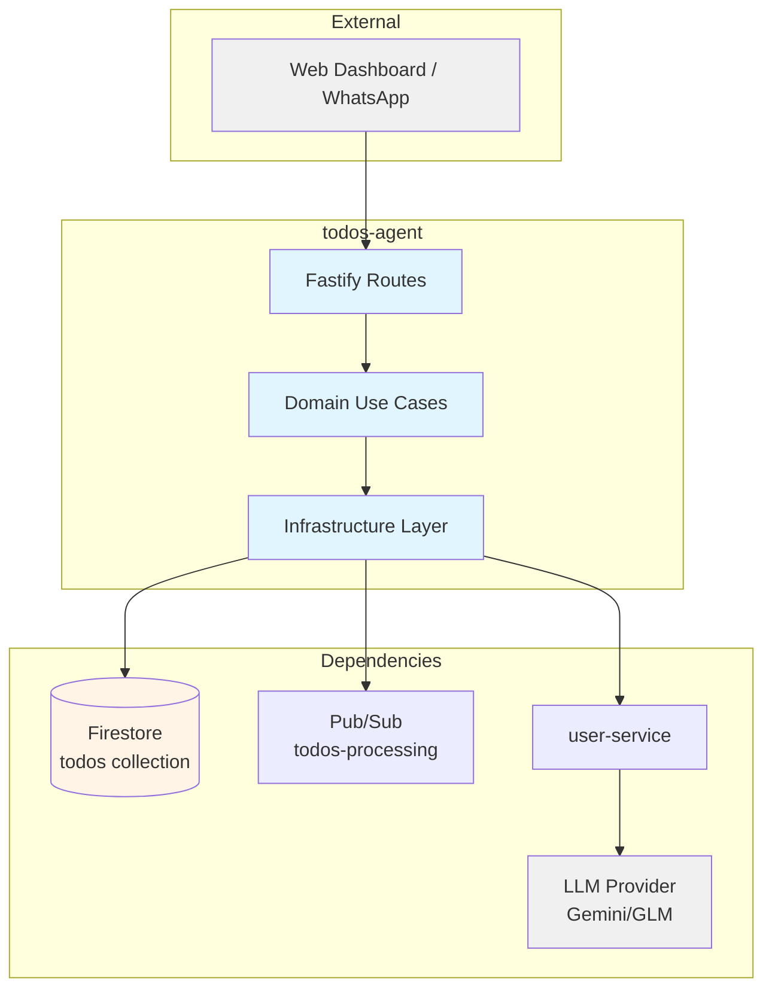
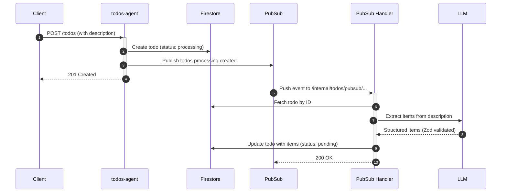

# Todos Agent — Technical Reference

## Overview

Todos-agent manages tasks with support for todo items, priorities, due dates, and AI-powered item extraction. Runs on Cloud Run with auto-scaling, uses Firestore for persistence, and integrates with user-service for LLM access.

## Architecture



## Data Flow



## Recent Changes

| Commit    | Description                               | Date       |
| --------- | ----------------------------------------- | ---------- |
| `35f4c6`  | INT-218: Migrate to Zod schema validation | 2026-01-24 |
| `b1c7a4b` | INT-269: Use @intexuraos/internal-clients | 2026-01-24 |
| `6fa3bc5` | INT-155: Improve test coverage            | 2026-01-20 |
| `9f1f8dc` | INT-126: Standardize ServiceFeedback      | 2026-01-18 |

## API Endpoints

### Public Endpoints

| Method | Path                       | Description             | Auth         |
| ------ | -------------------------- | ----------------------- | ------------ |
| GET    | `/todos`                   | List todos (filterable) | Bearer token |
| POST   | `/todos`                   | Create todo             | Bearer token |
| GET    | `/todos/:id`               | Get specific todo       | Bearer token |
| PATCH  | `/todos/:id`               | Update todo             | Bearer token |
| DELETE | `/todos/:id`               | Delete todo             | Bearer token |
| POST   | `/todos/:id/items`         | Add item to todo        | Bearer token |
| PATCH  | `/todos/:id/items/:itemId` | Update todo item        | Bearer token |
| DELETE | `/todos/:id/items/:itemId` | Delete todo item        | Bearer token |
| POST   | `/todos/:id/items/reorder` | Reorder todo items      | Bearer token |
| POST   | `/todos/:id/archive`       | Archive todo            | Bearer token |
| POST   | `/todos/:id/unarchive`     | Unarchive todo          | Bearer token |
| POST   | `/todos/:id/cancel`        | Cancel todo             | Bearer token |

### Internal Endpoints

| Method | Path                                      | Description                | Auth         |
| ------ | ----------------------------------------- | -------------------------- | ------------ |
| POST   | `/internal/todos`                         | Create todo (internal)     | Internal key |
| POST   | `/internal/todos/pubsub/todos-processing` | Process Pub/Sub push event | Pub/Sub OIDC |

## Domain Model

### Todo

| Field         | Type             | Description                              |
| ------------- | ---------------- | ---------------------------------------- |
| `id`          | `string`         | Unique todo identifier                   |
| `userId`      | `string`         | Owner user ID                            |
| `title`       | `string`         | Todo title                               |
| `description` | `string \| null` | Optional description (for AI extraction) |
| `tags`        | `string[]`       | User-defined tags                        |
| `priority`    | `TodoPriority`   | low \| medium \| high \| urgent          |
| `dueDate`     | `Date \| null`   | Deadline                                 |
| `source`      | `string`         | Source system (whatsapp, manual, etc.)   |
| `sourceId`    | `string`         | ID in source system                      |
| `status`      | `TodoStatus`     | Current state                            |
| `archived`    | `boolean`        | Soft delete flag                         |
| `items`       | `TodoItem[]`     | Sub-items                                |
| `completedAt` | `Date \| null`   | When marked completed                    |
| `createdAt`   | `Date`           | Creation timestamp                       |
| `updatedAt`   | `Date`           | Last update timestamp                    |

### TodoItem

| Field         | Type                   | Description            |
| ------------- | ---------------------- | ---------------------- |
| `id`          | `string`               | Unique item identifier |
| `title`       | `string`               | Item title             |
| `status`      | `TodoItemStatus`       | pending \| completed   |
| `priority`    | `TodoPriority \| null` | Item priority          |
| `dueDate`     | `Date \| null`         | Item deadline          |
| `position`    | `number`               | Display order          |
| `completedAt` | `Date \| null`         | Completion time        |
| `createdAt`   | `Date`                 | Creation timestamp     |
| `updatedAt`   | `Date`                 | Last update timestamp  |

### Status Values

#### TodoStatus

| Status        | Meaning                                     |
| ------------- | ------------------------------------------- |
| `draft`       | Initial state, not yet visible in lists     |
| `processing`  | AI extraction in progress                   |
| `pending`     | Ready to work on                            |
| `in_progress` | Currently being worked on                   |
| `completed`   | All items completed or manually marked done |
| `cancelled`   | Cancelled before completion                 |

#### TodoItemStatus

| Status      | Meaning         |
| ----------- | --------------- |
| `pending`   | Not yet started |
| `completed` | Done            |

#### TodoPriority

| Priority | Meaning                     |
| -------- | --------------------------- |
| `low`    | Nice to have, can wait      |
| `medium` | Standard priority (default) |
| `high`   | Important, do soon          |
| `urgent` | Critical, do immediately    |

## Pub/Sub

### Published Events

| Topic              | Event Type                 | Payload                     | Trigger          |
| ------------------ | -------------------------- | --------------------------- | ---------------- |
| `todos-processing` | `todos.processing.created` | `{ todoId, userId, title }` | On todo creation |

### Subscribed Events

| Topic              | Handler                                   | Action                                   |
| ------------------ | ----------------------------------------- | ---------------------------------------- |
| `todos-processing` | `/internal/todos/pubsub/todos-processing` | Extract items via LLM, update to pending |

## Dependencies

### External Services

| Service      | Purpose                        | Failure Mode               |
| ------------ | ------------------------------ | -------------------------- |
| Gemini / GLM | Extract items from description | Add warning item, continue |

### Internal Services

| Service      | Endpoint                             | Purpose               |
| ------------ | ------------------------------------ | --------------------- |
| user-service | `/internal/users/:userId/llm-client` | Get user's LLM client |

### Infrastructure

| Component                      | Purpose                |
| ------------------------------ | ---------------------- |
| Firestore (`todos` collection) | Todo persistence       |
| Pub/Sub (`todos-processing`)   | Async processing queue |

## Configuration

| Variable                              | Purpose                      | Required |
| ------------------------------------- | ---------------------------- | -------- |
| `INTEXURAOS_GCP_PROJECT_ID`           | GCP project ID               | Yes      |
| `INTEXURAOS_AUTH_JWKS_URL`            | Auth0 JWKS endpoint          | Yes      |
| `INTEXURAOS_AUTH_ISSUER`              | Auth0 issuer                 | Yes      |
| `INTEXURAOS_AUTH_AUDIENCE`            | Auth0 audience               | Yes      |
| `INTEXURAOS_INTERNAL_AUTH_TOKEN`      | Internal service auth key    | Yes      |
| `INTEXURAOS_TODOS_PROCESSING_TOPIC`   | Pub/Sub topic for processing | Yes      |
| `INTEXURAOS_USER_SERVICE_URL`         | User-service base URL        | Yes      |
| `INTEXURAOS_APP_SETTINGS_SERVICE_URL` | App-settings base URL        | Yes      |
| `INTEXURAOS_SENTRY_DSN`               | Sentry error tracking        | No       |
| `INTEXURAOS_ENVIRONMENT`              | Environment name             | No       |

## Gotchas

- **Processing status**: Todos with `processing` status are handled asynchronously by the Pub/Sub handler. They become `pending` after AI extraction completes.
- **Description truncation**: Descriptions over 10,000 characters are truncated before LLM extraction (hard limit in `processTodoCreated`).
- **Item extraction requires user API key**: If user has no configured LLM API key, extraction fails and a warning item is added.
- **Archive restriction**: Only completed or cancelled todos can be archived.
- **Cancel restriction**: Cannot cancel already completed todos (invalid operation).
- **Item ordering**: Reorder requires all item IDs to match existing items exactly — partial reorders are rejected.

## AI Item Extraction

The service uses your configured LLM (via user-service) to extract structured items from todo descriptions:

1. Todo created with `status: processing`
2. Pub/Sub event triggers `/internal/todos/pubsub/todos-processing`
3. `processTodoCreated` use case calls `todoItemExtractionService`
4. LLM parses description, returns items validated by Zod schema
5. Items added to todo, status changed to `pending`

**Zod Schema:** `TodoExtractionResponseSchema` from `@intexuraos/llm-prompts`

**Fallback behaviors:**

- No items found: Adds informational item "No actionable items found"
- Extraction fails: Adds warning item "Item extraction failed (error code)"
- No API key: Adds warning item "No API key configured"

## File Structure

```
apps/todos-agent/src/
  domain/
    models/
      todo.ts                    # Todo and TodoItem entities
    ports/
      todoRepository.ts          # Repository interface
      todoItemExtractionService.ts  # LLM extraction interface
    usecases/
      createTodo.ts
      getTodo.ts
      listTodos.ts
      updateTodo.ts
      deleteTodo.ts
      archiveTodo.ts
      unarchiveTodo.ts
      cancelTodo.ts
      processTodoCreated.ts      # AI extraction handler
      addTodoItem.ts
      updateTodoItem.ts
      deleteTodoItem.ts
      reorderTodoItems.ts
  infra/
    firestore/
      firestoreTodoRepository.ts
    gemini/
      todoItemExtractionService.ts  # LLM extraction implementation
    user/
      index.ts                    # Re-exports from internal-clients
  routes/
    todoRoutes.ts                # Public endpoints
    internalRoutes.ts            # Internal create endpoint
    pubsubRoutes.ts              # Pub/Sub push handler
  services.ts                    # DI container
  config.ts
  index.ts
```
