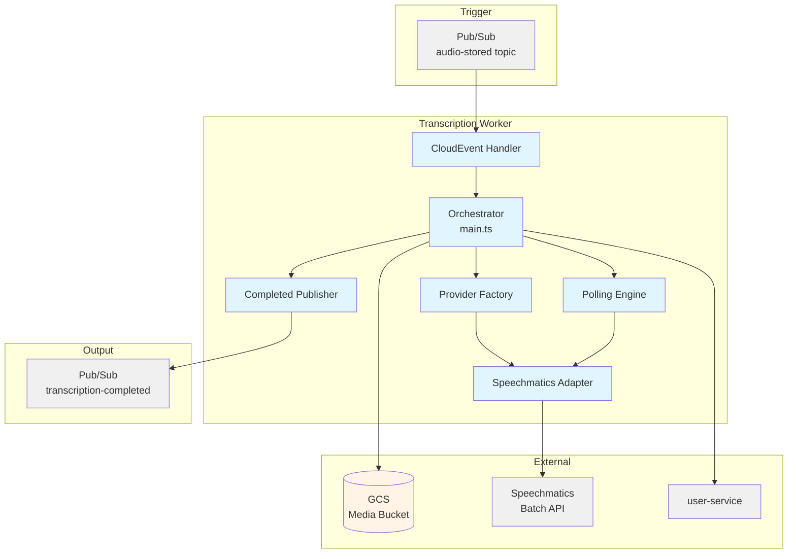
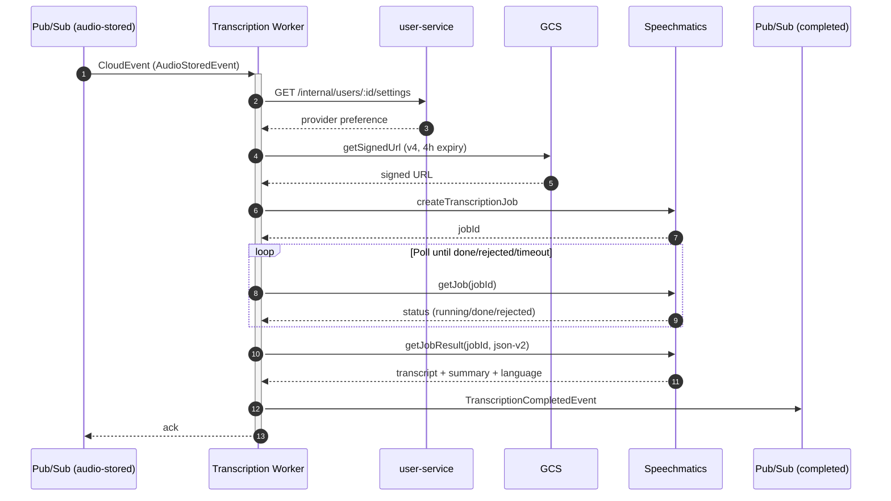

# Transcription Worker — Technical Reference

## Overview

The transcription worker is a Google Cloud Function that converts WhatsApp voice notes and video speech into text using Speechmatics Batch API. It subscribes to the `audio-stored` Pub/Sub topic, processes audio files stored in GCS, and publishes transcription results (success or failure) to the `transcription-completed` topic. Built with `@google-cloud/functions-framework` and deployed as a CloudEvent handler.

> **History:** Prior to v3.2.0, transcription was handled inline by whatsapp-service. The extraction to a standalone worker (INT-684) introduced event-driven processing, user-level provider preferences, and cleaner separation of concerns.

## Architecture



## Data Flow



## Changes Since v3.8.0

The worker accepts both the legacy `whatsapp.audio.stored` event and `whatsapp.media.transcription.requested`. The latter requires `mediaKind: audio | video`; all other required identifiers, GCS path, MIME type, and timestamp match the legacy request. Both support optional `messageSource: public_whatsapp | private_whatsapp`. Completion events preserve `messageSource` and, when supplied, `mediaKind` on success and failure.

Invalid event types or schemas are dead-lettered. Handled Speechmatics rejections and transient poll warnings are logged with error-report suppression. With the production user-service base `https://intexuraos.cloud/api/user`, provider lookup uses the internal edge route and a Google identity token; other bases use `X-Internal-Auth`.

## Recent Changes

| Commit     | Description                                                    | Date       |
| ---------- | -------------------------------------------------------------- | ---------- |
| `c12cb8de` | Remove data-insights-agent vocabulary entry (service retired)  | 2026-04-13 |
| `1d89a24a` | Address review feedback for v8-ignore test coverage            | 2026-03-09 |
| `5a4f7131` | Add coverage for v8-ignore blocks in speechmatics adapter      | 2026-03-09 |
| `44ea683a` | Release v3.2.0                                                 | 2026-03-07 |
| `60610a9d` | Clarify two-step event validation with inline comments         | 2026-03-06 |
| `cead3f44` | Add type literal to event guard, clarify publisher/mediaId     | 2026-03-06 |
| `ca4f530a` | Inject logger into adapter and factory, add event schema guard | 2026-03-06 |
| `07c3b5ec` | Address code review feedback                                   | 2026-03-06 |
| `08e0f703` | Initial transcription worker service (INT-682)                 | 2026-03-06 |

**Focus:** The v3.5.0 to v3.6.0 delta is a single vocabulary cleanup — the retired data-insights-agent was removed from the custom vocabulary list. The core transcription pipeline is unchanged.

## Event Schemas

### Input: AudioStoredEvent

Received from `whatsapp-service` via Pub/Sub when audio is stored in GCS.

| Field       | Type     | Description                        |
| ----------- | -------- | ---------------------------------- |
| `type`      | `string` | Always `whatsapp.audio.stored`     |
| `userId`    | `string` | IntexuraOS user ID                 |
| `messageId` | `string` | WhatsApp message ID                |
| `mediaId`   | `string` | WhatsApp media ID (audit trail)    |
| `gcsPath`   | `string` | GCS path to the audio file         |
| `mimeType`  | `string` | MIME type of the audio file        |
| `timestamp` | `string` | Event timestamp (ISO 8601)         |

### Output: TranscriptionCompletedEvent

Published to `transcription-completed` topic. Consumed by whatsapp-service.

| Field              | Type                     | Description                            |
| ------------------ | ------------------------ | -------------------------------------- |
| `type`             | `string`                 | Always `srt.transcription.completed`   |
| `userId`           | `string`                 | IntexuraOS user ID                     |
| `messageId`        | `string`                 | WhatsApp message ID                    |
| `jobId`            | `string`                 | Provider job ID                        |
| `status`           | `completed` or `failed`  | Result status                          |
| `transcript`       | `string?`                | Transcribed text (on success)          |
| `summary`          | `string?`                | AI-generated summary (when available)  |
| `detectedLanguage` | `string?`                | Language code, e.g., `pl`, `en`        |
| `error`            | `string?`                | Error message (on failure)             |
| `timestamp`        | `string`                 | Event timestamp (ISO 8601)             |

## Provider Architecture

### Port Interface (SpeechTranscriptionPort)

All transcription providers implement this interface:

| Method          | Input                               | Output                                                 |
| --------------- | ----------------------------------- | ------------------------------------------------------ |
| `submitJob`     | `{ audioUrl, mimeType, language? }` | `Result<{ jobId }, Error>`                             |
| `pollJob`       | `jobId`                             | `Result<{ status, error? }, Error>`                    |
| `getTranscript` | `jobId`                             | `Result<{ text, summary?, detectedLanguage? }, Error>` |

### Speechmatics Configuration

| Setting                      | Value                                      |
| ---------------------------- | ------------------------------------------ |
| API URL                      | `https://asr.api.speechmatics.com/v2` (EU) |
| Language                     | `auto` (auto-detected)                     |
| Operating Point              | `enhanced`                                 |
| Punctuation Sensitivity      | `0.35`                                     |
| Disfluency Removal           | Enabled                                    |
| Summarization                | `paragraphs`, `brief`                      |
| Custom Vocabulary            | 100+ terms                                 |
| Output Format                | `json-v2`                                  |

### Provider Factory

The factory maps provider names to adapter implementations. Currently only `speechmatics` is implemented. Unknown provider names log a warning and fall back to Speechmatics.

## Polling Configuration

| Parameter           | Default | Description                           |
| ------------------- | ------- | ------------------------------------- |
| `initialDelayMs`    | 2000    | First delay between polls             |
| `maxDelayMs`        | 30000   | Maximum delay cap                     |
| `backoffMultiplier` | 1.5     | Exponential backoff factor            |
| `maxAttempts`       | 60      | Maximum polls before timeout          |

Transient poll errors do not abort — the worker continues polling with increased backoff. The total polling window is approximately 5 minutes.

## Pub/Sub

### Subscribed Events

| Topic          | Event Type               | Handler             | Action                          |
| -------------- | ------------------------ | ------------------- | ------------------------------- |
| `audio-stored` | `whatsapp.audio.stored`  | `handleAudioStored` | Triggers transcription pipeline |

### Published Events

| Topic                      | Event Type                      | Payload                        | Trigger               |
| -------------------------- | ------------------------------- | ------------------------------ | --------------------- |
| `transcription-completed`  | `srt.transcription.completed`   | `TranscriptionCompletedEvent`  | Job done or failed    |

## Dependencies

### External Services

| Service       | Purpose                     | Failure Mode                             |
| ------------- | --------------------------- | ---------------------------------------- |
| Speechmatics  | Audio-to-text transcription | Publish failed event with error message  |
| GCS           | Audio file storage          | Publish failed event                     |

### Internal Services

| Service       | Endpoint                             | Purpose                        |
| ------------- | ------------------------------------ | ------------------------------ |
| user-service  | `GET /internal/users/:id/settings`   | Fetch provider preference      |

**User-service failure mode:** Defaults to `speechmatics` on error or network failure. Never blocks transcription.

## Configuration

| Variable                                          | Purpose                        | Required |
| ------------------------------------------------- | ------------------------------ | -------- |
| `INTEXURAOS_SPEECHMATICS_APP_API_KEY`             | Speechmatics API key           | Yes      |
| `INTEXURAOS_INTERNAL_AUTH_TOKEN`                  | Internal service auth token    | Yes      |
| `INTEXURAOS_USER_SERVICE_URL`                     | Base URL of user-service       | Yes      |
| `INTEXURAOS_PUBSUB_TRANSCRIPTION_COMPLETED_TOPIC` | Pub/Sub topic name             | Yes      |
| `INTEXURAOS_PUBSUB_TRANSCRIPTION_DLQ_TOPIC` | Dead-letter topic for invalid requests | Yes |
| `INTEXURAOS_GCP_PROJECT_ID`                       | GCP project ID                 | Yes      |
| `INTEXURAOS_WHATSAPP_MEDIA_BUCKET`                | GCS bucket for WhatsApp media  | Yes      |
| `LOG_LEVEL`                                       | Pino log level                 | No       |

## Error Handling

The worker uses a user-friendly error formatter (`formatSpeechmaticsError`) that translates raw Speechmatics API errors into readable messages:

| Raw Error Pattern           | Formatted Message                                          |
| --------------------------- | ---------------------------------------------------------- |
| JSON with `message` field   | Extracted message                                          |
| JSON with `detail` field    | Extracted detail                                           |
| `Language identification`   | Extracted language identification message                  |
| `insufficient audio`        | "Audio file is too short for transcription"                |
| `unsupported format`        | "Audio format is not supported"                            |
| `rate limit`                | "Transcription service rate limit exceeded..."             |
| `quota exceeded`            | "Transcription quota exceeded"                             |
| `timeout`                   | "Transcription service request timed out"                  |
| `network`/`connection`      | "Could not connect to transcription service"               |
| Messages > 100 chars        | Truncated to 97 chars + `...`                              |

**Result delivery:** Each valid request attempts to publish a success or failure event. Publication can fail, so consumers must not assume an event is guaranteed; malformed requests follow the dead-letter path.

## Gotchas

- **Two-step event validation:** The handler first checks the `type` field explicitly (for a specific log message with the wrong type value), then runs the full `isTranscriptionRequestEvent` guard for remaining required fields. Both checks are intentional and serve different debugging purposes.
- **mediaId is unused:** The `AudioStoredEvent` includes `mediaId` for audit traceability in consuming services, but the transcription workflow itself only needs `gcsPath` to identify the file.
- **Signed URL expiry:** GCS signed URLs are generated with a 4-hour expiry window. If Speechmatics takes longer to start processing, the URL will expire.
- **Logger type mismatch:** The `Logger` interface in `logger.ts` is a simplified subset for dependency injection in tests, while `BasePubSubPublisher` requires the full `pino.Logger` type. The module-level singleton satisfies both.
- **Provider fallback is silent-ish:** Unknown provider names from user settings produce a warning log but silently fall back to Speechmatics. There is no error returned to the user.

## File Structure

```
workers/transcription/src/
+-- index.ts                         # CloudEvent handler, cold-start init
+-- main.ts                          # Orchestration logic (7-step pipeline)
+-- types.ts                         # Event schemas and config loader
+-- polling.ts                       # Exponential backoff polling engine
+-- format-error.ts                  # User-friendly error message formatter
+-- logger.ts                        # Pino logger with simplified DI interface
+-- providers/
|   +-- transcription-provider.ts    # Port interface (SpeechTranscriptionPort)
|   +-- provider-factory.ts          # Provider name -> adapter mapping
|   +-- speechmatics/
|       +-- adapter.ts               # Speechmatics Batch API adapter
|       +-- vocabulary.ts            # 100+ custom vocabulary terms
+-- publishers/
|   +-- transcription-completed-publisher.ts  # BasePubSubPublisher extension
+-- __tests__/
    +-- main.test.ts                 # Orchestration tests
    +-- polling.test.ts              # Polling engine tests
    +-- format-error.test.ts         # Error formatter tests
    +-- types.test.ts                # Config loader tests
    +-- providers/
        +-- provider-factory.test.ts # Factory tests
        +-- speechmatics-adapter.test.ts # Adapter tests
```
